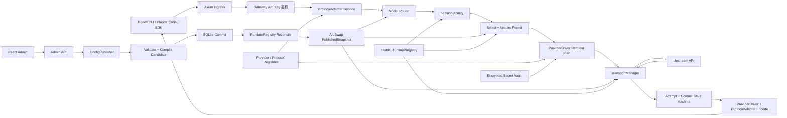
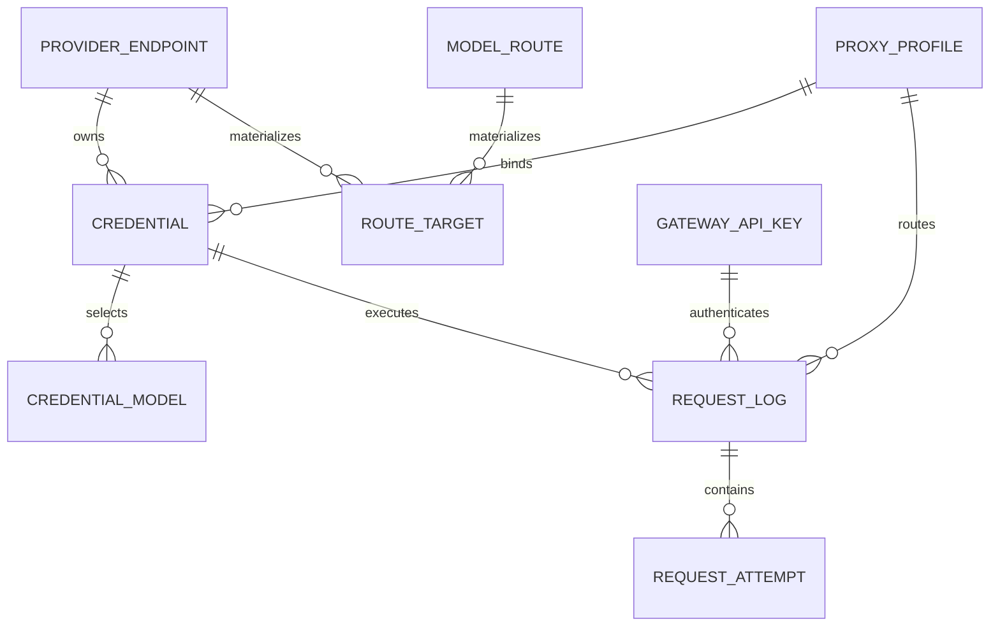
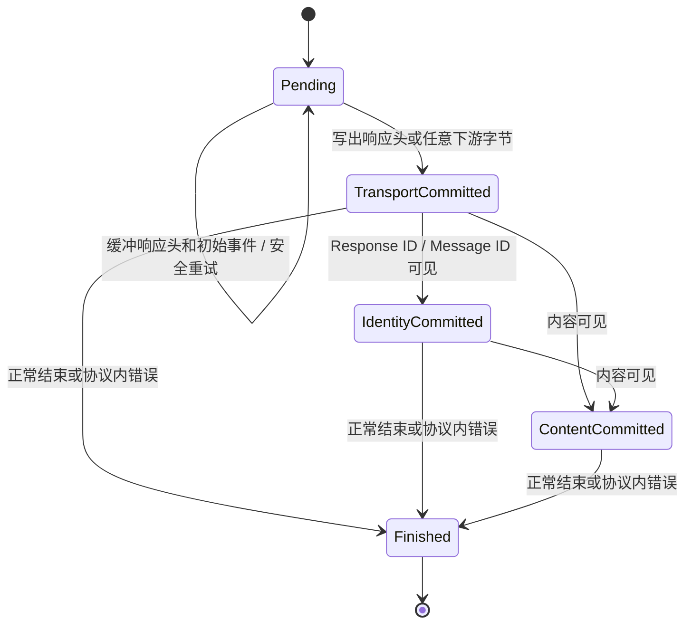

# any2api 架构设计草案

> 状态：Draft<br>
> 版本：1.0<br>
> 最后更新：2026-07-23<br>
> 用途：记录当前已经确认的需求、架构约束与后续待完善事项。<br>
> 实施进度：见 `docs/IMPLEMENTATION_STATUS.md`。

## 1. 项目定位

any2api 是一个面向个人使用、自托管、单节点运行的 AI API 聚合代理。

项目目标是把多个 Codex、Claude 凭据聚合为统一入口，提供：

- Codex、Claude 原生协议接入，并为后续协议转换保留扩展边界；
- 多 Provider Credential 管理；
- 多个网关 API Key 管理；
- 按最大并发进行的负载均衡；
- 会话粘性路由；
- HTTP、SOCKS5 与 DIRECT 出口管理；
- 故障切换、冷却、重试和流式响应保护；
- React Web 管理界面。

项目不是面向公众分发 API 的中转平台，不提供充值、计费、套餐、兑换码或多租户运营能力。

## 2. 已确认需求

当前已经确认的需求如下：

1. 后端使用 Rust，前端使用 React Web。
2. 首批只支持 Codex 和 Claude，其他 Provider 暂不实现。
3. 一个 Provider URL 可以配置多个独立 `ProviderCredential`；当前支持 API Key，以及 Codex/Claude 的交互式 OAuth2 登录。
4. 每个 `ProviderCredential` 可以分别启用、禁用、绑定代理和设置最大并发。
5. 代理类型仅支持：
   - `DIRECT`
   - `HTTP`
   - `SOCKS5`
6. 系统内置一个不可删除、不可禁用的 `DIRECT` 代理。
7. 系统可以选择一个全局代理。
8. `ProviderCredential` 绑定 `DIRECT` 时表示使用全局代理；只有其绑定和全局代理均为 `DIRECT` 时才从本机直连。
9. 每个 `ProviderCredential` 可以设置最大并发数。
10. 系统根据当前并发占用率进行负载均衡。
11. 系统支持会话粘性路由。
12. 客户端访问 any2api 使用的 `GatewayApiKey` 支持创建多个，并且可以分别禁用或物理删除。
13. 多个 `GatewayApiKey` 仅用于不同设备、客户端和密钥轮换，权限等价，不具备用户、租户、套餐、余额或额度语义。
14. 项目按个人单节点场景设计，不引入 Redis、PostgreSQL、支付和用户分发体系。
15. Provider Endpoint 必须选择客户端接受协议，并可选选择内部转换协议；未选择时上游协议等于接受协议并走直通。首个协议桥只实现 OpenAI Responses → Chat Completions，不启用 Codex/OpenAI ↔ Claude 双向转换。
16. Codex WebSocket 不进入首个正式版本，首版 TransportMode 只有 JSON 和 SSE。
17. Provider Credential 创建后使用实际 Endpoint、认证材料与代理读取上游 `/models`；用户勾选的模型按 Credential 持久化，公开模型名首版固定等于上游模型名。`ModelRoute`/`RouteTarget` 只作为内部调度物化结果，不要求用户手工配置。
18. TTL、排队、冷却、熔断、重试和日志保留参数提供内置默认值，并允许在 Web 中覆盖或恢复默认。
19. 不提供通用配置或 Secret 导入导出；未来唯一预留的导入能力是 Provider 专用 OAuth2 JSON 文件导入。
20. 支持通过 HTTP 或 HTTPS 远程访问管理面；远程监听必须显式启用并使用独立管理员认证，TLS 推荐但不强制。
21. `E:\clashx` 仅用于核对 React/Vite/Tailwind 等前端技术栈，不复制其 Tauri 桌面布局、窗口交互或视觉结构；any2api 管理面必须是现代、克制、响应式的浏览器 Web，整体偏 macOS 质感但不花哨。

### 2.1 两类凭据的术语边界

本文严格区分以下两个完全独立的概念：

| 概念 | 方向 | 用途 |
|---|---|---|
| `GatewayApiKey` | 客户端 → any2api | 验证客户端是否允许访问当前 any2api 实例 |
| `ProviderCredential`（下文可简称 `Credential`） | any2api → Codex/Claude | 注入 Provider API Key 或 Provider 专用 OAuth2 Secret |

```text
Client ── GatewayApiKey ──> any2api ── ProviderCredential ──> Provider
```

两者没有绑定、映射、所有权或派生关系：

- 一个 `GatewayApiKey` 不绑定任何 `ProviderCredential`；
- 请求不能根据 `GatewayApiKey` 选择、过滤或固定上游凭据；
- 上游凭据始终由模型路由、会话粘性、健康状态和负载均衡选择；
- 禁用或删除 `GatewayApiKey` 不影响任何 `ProviderCredential`；
- 禁用、冷却或删除 `ProviderCredential` 不影响 `GatewayApiKey`；
- 两者可以同时记录在一条请求日志中，但该日志关联仅用于本地观测。

## 3. 范围边界与非目标

### 3.1 永久非目标

以下能力属于项目定位层面的永久非目标，不作为后续版本的扩展方向：

- 用户注册与多租户隔离；
- 套餐、余额、充值、计费、支付；
- `GatewayApiKey` 对外销售或额度分发；
- 多节点分布式调度；
- 通用配置、数据库或 Secret 的应用级导入导出功能。

支持多个 `GatewayApiKey` 不改变上述定位。它们只是同一个个人实例下的多个本地访问凭据，不代表多个用户或租户，也不分别计算额度、余额和账单。

### 3.2 当前首批范围外

首批版本暂不实现：

- Gemini 或其他 Provider；
- Provider 专用 OAuth2 JSON 导入；
- `/backend-api/codex/responses` 兼容入口；
- Codex WebSocket；
- Codex/OpenAI 与 Claude Messages 双向跨协议路由；
- 动态本地插件 ABI；
- Redis 缓存和消息队列；
- 将 Nginx 作为核心调度器。

Nginx 可以作为部署时可选的 TLS 或反向代理入口，但 any2api 的 `ProviderCredential` 调度、OAuth 刷新和协议处理必须由 Rust 服务自身完成。

## 4. 架构原则

### 4.1 模块化单体

首批采用单进程、单二进制、SQLite 的模块化单体架构，不拆微服务。

### 4.2 控制面与数据面分离

- 控制面负责 React 管理页面、管理 API、配置校验和 SQLite 持久化。
- 数据面负责客户端请求、模型路由、`ProviderCredential` 选择、上游执行和响应转换。
- 管理配置写入成功后，数据面通过不可变快照原子切换配置。

### 4.3 协议与 Provider 分离

协议模块只负责请求和响应的格式处理，Provider Driver 只负责：

- 上游 URL；
- 凭据注入；
- OAuth 授权 URL、Token/刷新请求的构建与响应解析（网络执行和调度由 Runtime 负责）；
- 请求头和供应商特殊行为；
- 上游错误分类。

同一协议可以被不同 Provider 使用，Provider 不能和协议转换代码永久耦合。

### 4.4 一个上游凭据一个实体

多个上游 API Key/OAuth 账号不保存为换行字符串或 JSON 数组。每个上游账号必须是独立的 `ProviderCredential`，拥有独立的：

- 代理绑定；
- 最大并发；
- 当前并发；
- 健康状态；
- 模型冷却状态；
- OAuth 生命周期；
- 请求统计。

### 4.5 错误必须分类

请求错误、认证错误、额度错误、代理错误、网络错误和上游服务错误必须分别处理，不能统一按“失败”冷却 `ProviderCredential`。

### 4.6 流式响应不可拼接

一旦 any2api 已向客户端写出 HTTP 响应头或任何响应字节，就不能再切换 `ProviderCredential` 或上游。身份事件和内容事件都属于不可逆输出，防止两条流或两个 Response ID 被拼接成损坏响应。

### 4.7 可扩展性是核心约束

可扩展性不是“以后再重构”的事项，而是首批代码必须遵守的架构约束。新增 Provider、协议方言、代理能力、管理页面或调度策略时，应优先增加独立模块和实现既有接口，而不是修改一个不断增长的中央文件。

扩展目标：

- 新增 Provider 时，不修改负载均衡、会话粘性、排队和重试内核；
- 新增协议方言时，不修改 TransportManager 和 Secret Vault；
- 新增代理类型时，不修改 Provider Driver；
- 新增管理页面时，不把业务逻辑写进 Axum Handler 或 React 页面组件；
- 新增功能可以通过模块级单元测试、契约测试和集成测试独立验证；
- 首批采用编译期静态注册，不引入动态插件 ABI，但内部接口必须具备可扩展边界。

核心调度代码不得出现随着 Provider 数量增长而持续扩张的中央 `match provider_kind`。Provider 差异必须由 `ProviderDriver`、`ProtocolAdapter`、`CredentialCodec` 和 `ErrorClassifier` 等明确接口封装。

### 4.8 强类型边界

- 核心模块之间使用领域类型和显式枚举，不使用无约束的 `HashMap<String, Value>` 传递关键状态；
- Provider Secret 使用版本化、Provider 自有的类型化载荷，不把 OAuth/API Key 字段塞入通用字符串 Map；
- 原始 JSON 仅允许停留在线协议边界，以及未来一次性的 Provider OAuth2 凭据导入边界；导入内容必须立即通过 Provider 专用 Schema 转为版本化类型，原始 JSON 不持久化、不记录日志；
- ID、时间、并发数、配置版本和错误类型使用 newtype，避免互相误传；
- 所有跨模块接口必须明确取消、超时、错误分类和所有权语义。

### 4.9 依赖方向不可反转

- `domain` 不依赖 Web、数据库、HTTP Client 或具体 Provider；
- `protocol` 不依赖存储、代理、调度和管理 API；
- `provider` 不依赖 Axum、React、SQLite 实现或调度器内部状态；
- `transport` 不知道 Codex/Claude 的认证字段和业务错误；
- `storage` 不包含负载均衡、协议转换或 HTTP Handler；
- `server` 只负责入口适配、鉴权、中间件和 DTO，不承载核心业务规则；
- `app` 是唯一依赖装配根，负责把具体实现注册到运行时。

依赖方向通过 Workspace crate 边界和 CI 中的 `cargo metadata` 检查强制执行，禁止循环依赖和跨层偷用内部模块。

### 4.10 拒绝巨型文件

生产代码必须按功能和职责拆分：

- 一个文件只承载一个清晰职责；
- `main.rs`、`lib.rs`、`mod.rs` 只做声明、导出和依赖装配，不实现大段业务逻辑；
- 禁止形成通用垃圾桶式 `utils.rs`、`common.rs`、`manager.rs` 或 `service.rs`；确有公共逻辑时必须按具体领域命名；
- 单个生产源文件目标不超过 300 行代码；401–600 行必须进入机器可读 Allowlist；超过 600 行由 CI 拒绝；
- 行数由固定版本 `tokei` 的 code line 口径计算，并固定扫描 glob；
- Allowlist 必须包含 `path`、`reason`、`adr`、`owner` 和 `expires_at`，过期自动失败；
- 例外仅允许自动生成代码、静态协议表、测试夹具和数据库迁移；
- 单个函数建议不超过 80 行，复杂状态机拆为具名状态、转换函数和可独立测试的子模块；
- 禁止仅为规避行数限制而机械拆成无语义的文件，拆分必须对应领域职责或执行阶段。

所有例外和重要边界调整通过 `docs/adr/` 中的 Architecture Decision Record 记录，不能只存在于提交信息或聊天记录中。

### 4.11 Web 设计与技术边界

管理界面是浏览器 Web，不是桌面程序的 WebView。参考项目只用于确认成熟技术选型和工程组织，不作为布局或视觉模板。

首版前端基线：

- React + TypeScript + Vite；
- Tailwind CSS v4 与语义化设计 Token；
- 使用严格 TypeScript、ESLint、单元测试和生产构建门禁；
- 基础图标使用 Lucide；复杂交互只按真实需求逐个引入可访问性 Primitive；
- 服务端数据进入真实页面后由统一查询层管理，禁止在多个页面重复手写请求生命周期；
- URL 是可导航页面的状态来源，存在多个页面后必须使用真实 Router 和 deep link，禁止只靠内存状态模拟导航。

视觉与交互原则：

- 简洁、大气、现代、克制，偏 macOS 的系统字体、中性色、细边框、柔和阴影和适度圆角；
- 毛玻璃或半透明只能作为轻量层次，不依赖 Tauri vibrancy，不以高饱和渐变、粒子、持续动画或拟物装饰制造“科技感”；
- 宽屏可以使用轻量侧栏，窄屏必须折叠为移动导航；禁止固定桌面窗口尺寸和固定 `200px` 壳层假设；
- 页面使用自然文档滚动或显式数据工作区，不允许全局强制 `overflow: hidden`；
- 保留文本选择、复制、浏览器缩放、键盘焦点、语义标题、链接行为和可访问名称；
- 默认控件尺寸兼顾远程浏览器与触控，不复制桌面端 22–32px 的极小密度；
- 主题至少支持 light/dark/system，并在 React 启动前完成轻量主题初始化，避免闪烁。

首版明确不引入或不复制：

- Tauri API、原生窗口按钮、标题栏拖拽区、vibrancy 和桌面平台探测；
- ClashX 的固定侧栏、窗口级页面切换和布局结构；
- CodeMirror、虚拟列表、拖拽、复杂图表和全套组件库等尚无真实需求的依赖；
- 巨型全局 CSS、巨型 Page、全局禁止选中文本和桌面化鼠标语义。

样式按 `tokens.css`、`globals.css` 和局部组件职责拆分。React 页面只组合 feature，业务请求、状态和 Schema 分别进入 feature 的 `api`、`model` 与私有 UI 模块。

## 5. 总体架构



## 6. 工程结构与模块边界

```text
any2api/
├─ Cargo.toml
├─ ARCHITECTURE.md
├─ deny.toml
├─ docs/
│  └─ adr/                       # 架构决策记录
├─ crates/
│  ├─ domain/                    # ID、路由、错误、状态和领域不变量
│  ├─ protocol/
│  │  └─ src/
│  │     ├─ api.rs              # ProtocolAdapter 与中立载荷
│  │     ├─ openai_responses/   # request/response/sse/error/headers
│  │     └─ anthropic_messages/ # request/response/sse/error/headers
│  ├─ provider/
│  │  └─ src/
│  │     ├─ api.rs              # ProviderDriver 与 CapabilitySet
│  │     ├─ codex/              # driver/auth/oauth/errors/capabilities
│  │     └─ claude/             # driver/auth/oauth/errors/capabilities
│  ├─ transport/
│  │  └─ src/                   # api/direct/http_proxy/socks5/client_pool/error
│  ├─ runtime/
│  │  └─ src/
│  │     ├─ request/            # RequestContext、Attempt、取消和 deadline
│  │     ├─ scheduler/          # filter/select/permit/queue/fallback
│  │     ├─ affinity/           # hard/soft binding、锁和 CAS
│  │     ├─ retry/              # RetrySafety、预算和退避
│  │     ├─ health/             # Credential/Model/Endpoint/Proxy 状态
│  │     ├─ config/             # PublishedSnapshot、Publisher、Registry
│  │     └─ shutdown/           # drain、TaskTracker、后台任务生命周期
│  ├─ storage/
│  │  └─ src/                   # api/sqlite/repository/migration/vault
│  └─ server/
│     └─ src/
│        ├─ public/             # Codex/Claude 公开入口
│        ├─ admin/              # 管理 API
│        ├─ middleware/         # 鉴权、限制、Request ID
│        └─ error/              # 协议兼容错误输出
├─ app/
│  └─ any2api/                   # 二进制入口与唯一 Composition Root
├─ web/
│  └─ src/
│     ├─ app/                    # Router、Layout、全局 Provider
│     ├─ features/               # proxies/providers/keys/logs/settings
│     ├─ shared/                 # 纯展示组件、API client、通用类型
│     └─ test/
├─ migrations/
├─ tests/
│  ├─ contract/                 # Driver、Protocol、Storage 契约测试
│  ├─ integration/              # HTTP/SOCKS、SQLite、热更新、停机
│  └─ fixtures/                 # 脱敏协议和流式样本
└─ xtask/                       # 架构检查、生成、发布辅助命令
```

`A -> B` 表示 A 可以依赖 B。允许的主要方向：

```text
protocol  -> domain
provider  -> domain
transport -> domain
storage   -> domain
runtime   -> domain + protocol + provider + transport + storage 的公开接口
server    -> domain + runtime
app       -> server + runtime + 所有具体 Adapter
```

额外约束：

- Provider Driver 负责构建请求计划、注入规则、响应解析和错误分类，不直接创建 HTTP Client；
- Runtime 负责调度、重试、刷新编排和调用 Transport；
- `provider`、`protocol`、`transport`、`storage` 各自提供稳定的 `api` 模块；Runtime 只能导入这些公开端口，具体实现和构造器保持私有并由 `app` 装配；
- SQLite 类型、Axum 类型、`reqwest` 类型不得穿透到 `domain`；
- 每个功能模块公开最小 API，内部实现默认 `pub(crate)` 或私有；
- 新 Provider 只允许在 `provider/<name>`、必要的协议模块、注册表和契约测试中产生局部变更；
- React 按 feature 拆分，页面组件不直接拼 URL、不直接保存 Secret、不实现调度规则。

### 6.1 工程质量门禁

CI 至少执行：

```text
cargo fmt --all --check
cargo clippy --locked --workspace --all-targets --all-features -- -D warnings
cargo nextest run --locked --workspace --all-features
cargo test --locked --doc --workspace
cargo build --locked --release --workspace
cargo deny check
cargo xtask architecture-check
web: typecheck + lint + unit test + production build
e2e: Chromium 中的真实服务登录、deep link 与桌面/390px 响应式壳层契约
```

`xtask architecture-check` 负责：

- 检查 crate 依赖方向和循环依赖；
- 使用固定 `tokei` 口径检查生产源文件体积、Allowlist 字段和过期时间；
- 对 `main.rs/lib.rs/mod.rs` 应用更低的行数阈值；“是否存在大段业务实现”保留为评审规则；
- 检查迁移文件编号和 checksum；
- 检查前端 feature 不能直接跨层导入其他 feature 的内部实现。

契约测试不是按文件名猜测是否存在，而是枚举实际 Registry 中注册的每个 Provider/Protocol 实现并运行统一测试套件。

必须具备的测试层级：

- Domain 单元测试：代理解析、错误分类、路由和状态转换；
- Provider/Protocol 契约测试：请求头、Secret 注入、未知字段、错误 envelope 和 SSE 事件；
- 调度并发测试：绝不超过最大并发、动态升降限、无丢失唤醒、Permit 只释放一次；
- 使用 `loom` 或等价模型测试验证关键原子状态；
- Tokio 虚拟时间测试：排队超时、冷却、Retry-After、取消和停机；
- Transport 集成测试：DIRECT、HTTP CONNECT、SOCKS5h、代理认证和 Client 代际；
- 流式切分/模糊测试：任意字节切分、CRLF、多行 `data:`、无尾空行和畸形帧；
- 热更新测试：编译失败不提交、revision 不倒退、Runtime 句柄跨快照复用；
- 端到端测试：Codex/Claude JSON、SSE、GatewayApiKey 隔离、粘性和重试。

浏览器 E2E 使用独立临时数据目录、固定测试管理员密码和真实 Rust HTTP 服务；不得复用开发者本地数据库、主密钥或登录 Cookie。首个浏览器套件只覆盖跨页面共享且单元测试无法证明的契约：登录后保留目标 deep link、服务端 SPA fallback、核心管理页面刷新、移动导航、桌面/390px 视口无水平溢出和控制台无未处理错误。业务 CRUD、字段校验和错误分支继续由更快的 Domain、HTTP 契约与 React 单元测试覆盖，禁止在浏览器层重复堆叠全量矩阵。

浏览器 E2E 默认启动不设置 `ANY2API_WEB_DIR` 的正式二进制，验证内嵌 React 资源而不是工作区 `web/dist`。测试从 Cargo 本轮构建消息取得真实可执行文件路径，不能假定固定 `target/debug`、误跑旧二进制或绕过自定义 Target 目录；启动服务时清除宿主继承的全部 `ANY2API_*` 配置，只注入测试明确拥有的隔离值。外部目录模式只由 Server 契约覆盖其显式覆盖语义，避免浏览器主链绕过正式部署路径。

每个 PR 回放固定 fuzz corpus；长时间 fuzz 作为定时 CI 任务运行，不阻塞普通本地开发循环。

### 6.2 Feature 模块模板

Rust 功能模块按职责拆分，示例：

```text
runtime/scheduler/
├─ mod.rs              # 仅公开 Scheduler API
├─ candidate.rs        # 候选与过滤原因
├─ selector.rs         # load ratio 与 tie-break
├─ permit.rs           # ConcurrencyPermit
├─ queue.rs            # QueueTicket 与 scheduler epoch
├─ fallback.rs         # tier 策略
└─ tests.rs            # 模块级并发不变量
```

React feature 示例：

```text
web/src/features/providers/
├─ api.ts              # 仅 Provider 管理 API
├─ schema.ts           # DTO 校验与类型
├─ hooks.ts            # 查询、Mutation 和缓存失效
├─ components/         # feature 私有组件
├─ pages/              # 路由页面，仅做组合
└─ index.ts            # feature 唯一公开出口
```

模块之间只能通过公开出口依赖，禁止深层导入其他 feature 的内部文件。后端 Handler 和前端 Page 都只负责编排，不直接实现加密、调度、代理解析、错误分类或复杂状态机。

## 7. Nginx 架构借鉴

any2api 借鉴 Nginx 的阶段流水线、Upstream Peer、连接池、故障切换和配置代际切换，但不复制其 Master/Worker 多进程模型。

| Nginx 概念 | any2api 对应概念 |
|---|---|
| upstream group | 一个逻辑模型的候选路由集合 |
| upstream peer | Provider URL + Credential + 实际代理 |
| `max_conns` | Credential 最大并发 |
| active connections | Credential 当前 `in_flight` |
| `least_conn` | 最低并发占用率调度 |
| `max_fails` / `fail_timeout` | 失败阈值与冷却时间 |
| backup peer | 后备 Route Target |
| keepalive | 按代理配置复用的连接池 |
| `proxy_next_upstream` | 响应提交前切换 `ProviderCredential` |
| filter chain | Codex/Claude 请求与响应转换 |
| graceful reload | ArcSwap 配置代际切换 |

## 8. 请求阶段流水线

一次请求依次经过以下阶段：

```text
1. PostRead
   - 生成 Request ID
   - 请求体大小限制
   - 建立取消信号

2. Access
   - 按入口协议提取并验证 Gateway API Key
   - 多个认证头冲突时拒绝请求
   - 剥离所有客户端认证头、Cookie 和 Proxy-Authorization

3. Decode
   - 识别具体 ProtocolDialect，而不是只识别 Provider 名称
   - 解析模型、流式模式和会话标识

4. Route
   - 将公开模型解析为 Route Plan
   - 按能力矩阵生成候选 Route Target
   - 接受协议与有效上游协议相同时走直通
   - 两者不同时要求存在已注册 ProtocolBridge，否则拒绝发布

5. Affinity
   - 检查 Codex 硬粘性
   - 检查普通软粘性

6. SelectAndAcquire
   - 过滤禁用、冷却、代理不可用的 Credential
   - 按最低并发占用率排序候选
   - 原子选择 Credential 并取得 ConcurrencyPermit

7. Attempt
   - 解析实际代理
   - Provider Driver 构建请求计划并注入 ProviderCredential
   - TransportManager 执行请求
   - 根据 RetrySafety、预算和 CommitState 决定是否重试

8. HeaderFilter
   - 在 Pending 阶段缓冲初始响应头
   - 过滤敏感和 hop-by-hop 响应头
   - 保留必要 Request ID 和限流信息

9. BodyFilter
   - 非流式响应转换
   - SSE 分帧与流式转换
   - 恢复客户端可见模型名
   - 在身份事件可见前建立硬粘性绑定
   - 首次写出响应头或任意字节后禁止切换上游

10. Log
    - 记录每次 Attempt、最终结果、耗时、首 Token、Token Usage 和错误分类
```

建议为每个请求建立显式上下文：

```rust
struct RequestContext {
    request_id: RequestId,
    config_revision: ConfigRevision,
    ingress_protocol: ProtocolDialect,
    public_model: PublicModel,
    route_plan: RoutePlan,
    session: Option<SessionIdentity>,
    deadline: Deadline,
    retry_budget: RetryBudget,
    attempt_no: u32,
    commit_state: CommitState,
}
```

不得通过无类型字符串 Map 在核心模块之间传递关键状态。

## 9. 核心领域模型

### 9.1 ProxyProfile

```text
proxy_profiles
├─ id
├─ name
├─ kind                  # direct | http | socks5
├─ host
├─ port
├─ authentication_version
├─ enabled
├─ built_in
├─ config_version
├─ created_at
└─ updated_at

proxy_passwords
├─ proxy_profile_id
├─ username
├─ authentication_version
├─ envelope_version
├─ key_id
├─ algorithm
├─ nonce
├─ ciphertext
└─ aad_version
```

约束：

- 系统内置固定 ID 的 `DIRECT`；
- `DIRECT` 不允许删除或禁用；
- HTTP/SOCKS5 代理认证要么完全关闭，要么用户名和密码成对存在；用户名是可见配置元数据，但不能为空、不能超过 255 字节、不能包含控制字符或 HTTP Basic 分隔符 `:`；密码只保存在独立的 Vault 密文记录中；
- `authentication_version` 在认证状态实际发生设置、替换或清除时单调增加，并进入密码 AAD；同一次实际认证变更也必须增加 `ProxyProfile.config_version`，使 Transport Client 切换到新代际；对已经关闭认证状态的重复清除是 no-op，不增加版本；
- 禁止在普通日志和管理 DTO 中返回代理密码；
- `SOCKS5` 默认使用远程 DNS 解析语义，避免本地 DNS 泄漏。

认证设置、替换和实际清除增加 `authentication_version` 与 `config_version`；进程重启只从 SQLite 和 Vault 重新装配认证材料，不恢复连接、健康或请求状态。

### 9.2 ProviderEndpoint

```text
provider_endpoints
├─ id
├─ name
├─ provider_kind         # codex | claude
├─ base_url
├─ protocol_dialect      # 客户端接受协议，必填
├─ upstream_protocol_dialect  # 内部转换协议，可空；空值表示与接受协议相同
├─ enabled
├─ config_version
├─ created_at
└─ updated_at
```

每把 Credential 独立保存已确认的模型集合：

```text
provider_credential_models
├─ credential_id
├─ upstream_model
└─ created_at
```

一个 Provider Endpoint 表示一个上游 URL，可以拥有多个 Credential。

`protocol_dialect` 是公开入口接受的协议；`upstream_protocol_dialect` 是实际上游线协议。后者为 `NULL` 时不转换，有效上游协议固定为 `protocol_dialect`。非空值必须与接受协议不同，并且 `(protocol_dialect, upstream_protocol_dialect)` 必须存在已注册的 `ProtocolBridge`。数据库不重复保存“同协议”值。

`base_url` 是管理员明确配置的受信任目标，只要通过结构化 HTTP(S) URL 校验就可以访问；普通 HTTP、loopback、局域网和其他私有地址不需要额外授权字段。

### 9.3 Credential

```text
credentials
├─ id
├─ provider_endpoint_id
├─ label
├─ credential_kind       # 首版仅 api_key；后续 oauth2
├─ secret_schema_version
├─ secret_version
├─ credential_generation
├─ config_version
├─ encrypted_secret
├─ fingerprint_version
├─ secret_fingerprint
├─ secret_tail
├─ proxy_profile_id
├─ max_concurrency
├─ enabled
├─ created_at
└─ updated_at
```

运行时状态不直接保存在 Credential 主表：

```text
CredentialRuntimeHandle
├─ in_flight
├─ auxiliary_in_flight
├─ max_concurrency
├─ current_generation    # ArcSwap<CredentialGenerationRuntime>
├─ retired
├─ latency_ewma
├─ success_count
├─ failure_count
└─ scheduler_epoch
```

认证材料和健康状态位于 generation-scoped 对象中，详见第 12.5 节。这样热更新可以保留容量硬限制，同时隔离旧 Secret/URL 的迟到错误。

当前约束：

- 配置编译器接受 `credential_kind=api_key|oauth2`；OAuth2 只能由专用登录/刷新流程创建或更新，普通 API Key 创建与轮换端点不能伪造 OAuth2 Secret；
- `max_concurrency` 的首版硬上限为 `10_000`，取值范围固定为 `1..=10_000`；禁用必须使用 `enabled=false`；
- `secret_schema_version` 当前按 CredentialKind 分别固定为 `1`；API Key 是可见 ASCII，OAuth2 是 Provider 专用类型化 JSON 载荷，两者使用不同 AAD Kind；
- `secret_version` 是认证材料 CAS 版本，任何 Secret 替换或未来重封装都增加；
- `credential_generation` 隔离认证和模型健康代际，Secret 轮换、重新启用或 Endpoint URL 身份变化时增加；
- `config_version` 是管理资源乐观锁版本，元数据修改和 Secret 轮换时增加，无变化更新不增加；
- 模型集合变化增加 `config_version`，不增加 `secret_version` 或 `credential_generation`；API Key 轮换会清空旧模型集合，OAuth Token 的例行刷新保留已确认模型；
- 新建 Credential 初始没有公开模型。管理面使用该 Credential 的实际代理请求 `/models`，用户勾选并保存后才进入公开模型目录和调度候选；
- 同一 Endpoint 下的多把 Credential 可以拥有不同模型集合，调度器必须按 `Credential + upstream_model` 过滤，禁止因为 URL 相同就假定权限相同；
- Endpoint 已有 Credential 时禁止修改 `provider_kind`、`protocol_dialect` 和 `upstream_protocol_dialect`；修改 Base URL 时所有子 Credential 增加 `credential_generation`；
- Web 与管理 API 通过独立 OAuth start/exchange 端点接受 OAuth2 Credential；列表只显示 `oauth2` 类型、指纹和脱敏账号摘要，不显示 Token 或 Secret 尾号；
- OAuth `expires_at` 位于加密的类型化 Secret 内，不作为可查询明文字段持久化；OAuth session、state、PKCE verifier 和刷新调度状态只保存在内存；
- 未来导入 OAuth2 JSON 时仍创建普通 Credential 实体，不引入另一套账号模型。

管理面提供 `POST /api/admin/provider-credentials/{id}/test`。测试固定使用当前
`PublishedSnapshot` 中该 Credential 的认证材料、Provider Endpoint 与解析后的实际代理，
由 Provider Driver 构造无生成副作用的凭据探测请求；首版 Codex 与 Claude 都使用各自
Base URL 下的 `GET /models`。测试不经过模型路由、不切换 Credential、不回退代理，也不更新
Endpoint/Proxy 冷却或熔断状态。只有收到 2xx 响应时，才清除本次捕获
`CredentialGenerationRuntime` 的 `auth_error` 并推进统一 scheduler epoch；配置在测试期间发生
轮换时，旧测试结果不得修改新 generation。2xx 响应体在严格大小与读取超时内交给 Provider
Driver 解析，只向管理面返回排序去重后的模型 ID，不返回原始响应正文、URL、地址或 Secret。
用户通过 `PUT /api/admin/provider-credentials/{id}/models` 提交勾选结果；写入与内部模型映射、
全局配置 revision 和 PublishedSnapshot 切换属于同一个串行配置发布。

### 9.4 内部 ModelRoute

```text
model_routes
├─ id
├─ public_model
├─ ingress_protocol
├─ fallback_on_saturation  # null=继承全局；0=不溢出；1=进入下一 tier
├─ enabled
├─ config_version          # Route 聚合版本，覆盖全部 Target 变化
└─ created_at

route_targets
├─ id
├─ model_route_id
├─ provider_endpoint_id
├─ upstream_model
├─ upstream_protocol_dialect  # 已解析的有效上游协议，非空
├─ fallback_tier
├─ enabled
└─ created_at
```

`public_model` 是客户端看到的模型名，`upstream_model` 是实际发送给上游的模型名。首版两者固定相等，Route 与 Target 从 `provider_credential_models` 自动物化，不再提供普通管理面的独立 Route/Target/tier 编辑流程。

模型集合在配置发布时完成校验和物化，数据面只读取不可变 Route/Target 快照，不在每个请求中重新聚合 Credential 配置。

约束：

- `(ingress_protocol, public_model)` 唯一；
- `public_model` 与 `upstream_model` 均为首尾无空白、最长 255 个 Unicode 字符的精确名称；首版区分大小写，不支持 wildcard、前缀规则、别名链或 Route 到 Route 的引用；
- 每条 Route 至少包含一个 Target；启用的 Route 至少包含一个启用的 Target；
- 自动物化的全部 Target 固定为 `fallback_tier=0`；同一模型下所有已选择该模型的 Credential 按负载率调度；
- Route 的 `ingress_protocol` 来自 Endpoint 接受协议；Route Target 的有效上游 ProtocolDialect、CredentialKind 和 TransportMode 必须符合 Provider CapabilitySet；
- 自动物化 Route 继承全局满载策略；首版 UI 不暴露每模型 fallback tier；
- 接受协议与有效上游协议不同且没有已注册 ProtocolBridge 时拒绝发布；
- Route Target 的稳定 ID 用于硬粘性，禁止通过数组位置表达身份。
- `provider_credential_models` 是控制面真相来源；`model_routes` 与 `route_targets` 是同一事务内重建的内部物化表，稳定 ID 由协议、模型和 Endpoint 确定；
- Target 的 `provider_endpoint_id` 与 `upstream_model` 是稳定身份字段；模型或 Endpoint 变化时，下一次物化删除旧 Target 并按确定性规则生成新 ID；
- 重建 Route 时级联清理已失效 Target；Provider Endpoint 删除仍由其 Credential 引用约束保护。

### 9.5 CredentialModelRuntime

```text
CredentialModelRuntime
├─ credential_id
├─ upstream_model
├─ status
├─ cooldown_until
├─ last_error_class
├─ last_status_code
└─ state_version
```

429、模型不支持等状态按 Credential + Model 在内存中记录，不轻易停用整个 Credential。该状态不写入 SQLite，进程重启后清空。

### 9.6 SessionBindingRuntime

```text
SessionBindingRuntime
├─ scope_id
├─ session_hash
├─ credential_id
├─ route_target_id
├─ upstream_model
├─ protocol_dialect
├─ binding_kind          # soft | hard
├─ source
├─ binding_version
├─ created_at
├─ last_seen_at
└─ expires_at
```

原始 Session ID 不进入数据库，运行时 `session_hash` 使用进程级派生密钥 HMAC 生成。会话绑定只保存在内存中，进程重启后全部失效，不做恢复或回放。

因此：

- 软粘性会话在重启后重新参与普通负载均衡；
- 重启前生成的 Codex `previous_response_id` 不保证可继续使用；
- 如果请求携带旧 Response ID 但当前进程没有对应硬绑定，返回明确的 `session_binding_lost`，不得猜测原 Credential；
- `scope_id` 不包含 `GatewayApiKey`，网关密钥不会影响上游选择。

### 9.7 GatewayApiKey

```text
gateway_api_keys
├─ id
├─ name
├─ token
├─ token_prefix
├─ token_hash
├─ hash_version
├─ hash_key_id
├─ token_version
├─ config_version
├─ enabled
├─ revoked_at   # 遗留列；新删除走物理删除，不再写入
├─ created_at
└─ last_used_at
```

`GatewayApiKey` 约束：

- 支持创建多个网关 API Key；
- 每个网关 API Key 独立生成、禁用和物理删除；
- 本项目为个人自托管，网关密钥以明文持久化，管理列表/详情始终可查看完整 token；创建与轮换成功后立即生效，无需“仅展示一次”回执；
- 同时保存 HMAC-SHA256 `token_hash` 供公开面常量时间认证；摘要密钥由 Secret Vault 主密钥派生；
- Key 使用至少 256 位 CSPRNG 随机值和 `a2k_v1_` 版本化格式；
- `hash_key_id` 用于确认当前 Vault 主密钥派生代际，启动时不匹配必须拒绝加载；`token_version` 在轮换时递增，`config_version` 在元数据、启停或轮换变化时递增；
- `token_prefix` 仅作展示辅助，不能用于认证；
- 删除为物理删除（`DELETE FROM gateway_api_keys`），成功后立即从配置与 PublishedSnapshot 消失，旧 token 不可再认证；RequestLog 外键 `ON DELETE SET NULL`；
- 首批所有网关 API Key 权限等价，只做实例级访问控制；
- 不包含 `user_id`、`tenant_id`、套餐、额度、余额和计费字段；
- 请求统计可以按 `GatewayApiKey` 记录，但只用于本地观测，不参与收费、配额限制或上游路由。

网关 Key 管理列表可以展示保留 RequestLog 中按 Key 聚合的本地观测：最终状态码为 2xx 的请求计为成功，其余状态码计为失败；统计只覆盖当前 RequestLog 保留窗口，最多展示最近 24 次结果。统计查询失败不能阻塞 Key 配置读写，日志关闭或尚无记录时返回零值与空结果。

网关 Key 管理 API：

```text
GET  /api/admin/gateway-api-keys
POST /api/admin/gateway-api-keys
PATCH /api/admin/gateway-api-keys/{id}
POST /api/admin/gateway-api-keys/{id}/rotate
POST /api/admin/gateway-api-keys/{id}/revoke   # 语义：物理删除
```

列表、创建、更新、轮换与删除响应均在 item 中返回明文 `token`；创建/轮换响应可额外带顶层 `token` 字段方便客户端。日志与 Debug 仍不得打印完整 token。`GatewayApiKey` 不能访问管理 API，也不能选择 `ProviderCredential`。

### 9.8 RequestLog

```text
request_logs
├─ request_id
├─ started_at
├─ gateway_api_key_id
├─ ingress_protocol
├─ public_model
├─ provider_endpoint_id
├─ credential_id
├─ proxy_profile_id
├─ status_code
├─ error_class
├─ attempt_count
├─ latency_ms
├─ first_token_ms
├─ input_tokens
├─ output_tokens
├─ cache_read_tokens
├─ cache_write_tokens
└─ is_stream
```

默认不保存 Prompt、完整请求体、完整响应体、完整 `GatewayApiKey` 或上游凭据 Secret。

一次请求的多次上游尝试保存在 `request_attempts` 子表，结构见第 14.2 节。RequestLog 只保存最终汇总，避免用单个 Credential 字段伪装整个重试过程。

### 9.9 持久化实体关系



`CredentialRuntimeHandle`、`CredentialModelRuntime`、`EndpointRuntime`、`ProxyRuntime`、排队状态和 `SessionBindingRuntime` 都是进程内对象，不属于持久化实体关系。

## 10. 代理架构

### 10.1 支持类型

仅支持：

- `DIRECT`
- `HTTP`
- `SOCKS5`

### 10.2 代理解析规则

`ProviderCredential` 绑定 `DIRECT` 的语义是使用全局代理，而不是强制本机直连。

```text
ProviderCredential 绑定 HTTP/SOCKS5  → 使用该上游凭据的专属代理
ProviderCredential 绑定 DIRECT       → 使用全局代理
全局代理为 DIRECT                      → 最终从本机直连
```

示例：

| 全局代理 | ProviderCredential 绑定 | 实际出口 |
|---|---|---|
| 香港 HTTP | DIRECT | 香港 HTTP |
| 香港 HTTP | 美国 SOCKS5 | 美国 SOCKS5 |
| DIRECT | DIRECT | 本机直连 |
| DIRECT | 美国 SOCKS5 | 美国 SOCKS5 |

伪代码：

```rust
fn resolve_proxy(global: ProxyId, credential: ProxyId) -> ProxyId {
    if credential == DIRECT_ID {
        global
    } else {
        credential
    }
}
```

当前设计不提供“`ProviderCredential` 强制绕过全局代理”的额外语义。

### 10.3 Fail-Closed

如果 `ProviderCredential` 绑定的专属 HTTP/SOCKS5 代理不可用：

- 不允许回退全局代理；
- 不允许回退 DIRECT；
- 释放当前 `ProviderCredential` 并发槽位；
- 将代理或 Credential 标记为短暂不可用；
- 对未绑定或 `prefer` 请求重新选择其他满足条件的 `ProviderCredential`；
- 对硬绑定或 `strict` 请求不切换 Credential，只能等待原目标恢复、在 RetrySafety 允许时重试原目标，或返回绑定不可用错误。

### 10.4 代理认证与管理测试

代理认证使用独立 Secret 生命周期：

```text
ProxyProfile 可见元数据
+ StoredProxyPassword(Vault 密文)
→ PublishedSnapshot 中的脱敏 ProxyAuthMaterial
→ Transport Client 构建时配置 HTTP Basic / SOCKS5 用户名密码
```

规则：

- 普通代理列表和编辑响应中的认证字段只返回 `username`、`password_configured` 与 `authentication_version`，绝不返回密码、密文或可逆导出材料；
- 设置或替换认证使用专用管理写端点，清除认证使用独立删除端点；普通代理元数据 PATCH 不接受密码；
- 密码只在专用管理请求体、Vault 加密边界和对应 PublishedSnapshot 代际的内存 Secret 中短暂存在，不进入普通读取/响应 DTO、`TransportRequest.headers`、URL、日志、React Query Cache 或浏览器存储；Transport 仅在受控 Client 构建边界将其编码为代理认证头或 SOCKS5 握手材料；
- HTTP 与 SOCKS5 统一使用 reqwest 的逐 Client 代理认证配置，禁止把凭据拼进代理 URL；
- 认证失败继续遵守 Fail-Closed，不得回退全局代理或 DIRECT。

管理面提供 `POST /api/admin/proxies/{id}/test`。请求只能选择当前配置中已有的 `ProviderEndpoint` 作为探测目标，禁止提交任意 URL。探测不携带 ProviderCredential，只验证 DNS、代理连接/认证、TLS 与响应头可达性；普通上游 HTTP 状态（包括 401、403、404）表示网络链路可达，但 HTTP forward proxy 返回 `407 Proxy Authentication Required` 属于代理认证握手拒绝，必须作为失败归因 `ProxyHandshake + Proxy`，不能被当作上游响应交给 Provider 分类器。响应返回关联的 Proxy/Endpoint ID、捕获的配置 revision 与两项资源 config version、延迟、HTTP 状态或脱敏失败阶段/归因，不返回目标 IP、代理地址、响应正文或 Secret；Web 只展示与当前配置代际完全匹配的结果。管理探测不更新 Proxy/Endpoint 熔断状态，也不占用 Credential 并发槽位。

### 10.5 TransportManager

Provider Driver 不直接创建、获取或持有 HTTP Client。Runtime 根据 Driver 生成的 `UpstreamRequestPlan` 和实际代理，向 `TransportManager` 请求匹配的 Client 并执行网络调用。

```text
TransportKey
├─ proxy_profile_id
├─ proxy_config_version
├─ connect_timeout
├─ tls_policy
├─ http_version_policy
├─ pool_policy_version
└─ transport_kind
```

相同 TransportKey 的 Credential 共享连接池。代理配置修改后创建新一代 Client，旧请求继续持有旧 Client，直到请求结束后自动释放。

`connect_timeout` 属于 Client/连接池代际；`upstream.read_timeout` 属于请求快照，不进入 TransportKey。Transport 在固定请求体开始被连接层消费后启动等待响应头的请求级 timeout，不让较短的 read timeout 取代 DNS、连接、代理握手或 TLS 的阶段边界；Runtime 对需要完整收集的响应体按每次成功读取重置同一 timeout。成功 SSE 不叠加通用 body read timer：提交前继续使用 `stream.precommit.max_duration`，提交后切换为 `stream.postcommit.idle_timeout`，避免同一流同时存在两个含义不清的计时器。

约束：

- SOCKS5 默认使用远端 DNS 语义，例如 `socks5h`；开启 `upstream.strict_ssrf` 后改用本地解析并向代理发送已验证 IP；
- HTTP/SOCKS5 认证材料作为脱敏 sidecar 传入 Transport；`DIRECT` 必须没有代理认证；
- Provider Authorization 逐请求注入，禁止放进 HTTP Client 默认 Header；
- Client 禁用 Cookie Store；
- Client 缓存使用 Weak 引用、代际清理或有界 LRU，禁止永久保存所有历史配置版本；
- 等响应头超时归入 `AwaitHeaders`，完整收集响应体时的空闲超时归入 `ReadBody`；两者默认 `Ambiguous`。DIRECT 归因 Endpoint，无法证明代理或目标责任的代理路径使用 `Unattributed`；
- Transport 返回带失败阶段的类型化错误，例如 DNS、TCP、代理握手、TLS、写请求体、等响应头、读响应体；
- 只有明确发生在代理握手或代理连接阶段的错误才能惩罚 ProxyRuntime。

### 10.6 代理健康状态

只对明确的代理连接错误打开代理熔断，不能因为上游返回 429/500 就判断代理故障。

```text
ProxyRuntime
├─ status
├─ consecutive_connect_failures
├─ cooldown_until
├─ last_latency_ms
├─ last_error
└─ last_checked_at
```

## 11. 首批 Provider 与协议

首批 Provider：

- Codex
- Claude

首批协议模块：

```text
protocol/
├─ openai_responses/
└─ anthropic_messages/

provider/
├─ codex/
└─ claude/
```

### 11.1 Provider 与协议方言不是同一概念

Provider 表示上游供应方，ProtocolDialect 表示线协议。首批至少区分：

```text
ProviderKind
├─ codex
└─ claude

ProtocolDialect
├─ openai_responses
├─ openai_chat_completions
├─ codex_backend
└─ anthropic_messages

TransportMode
├─ json
└─ sse
```

不能把所有 Codex 路径都视为同一种协议。每个 Route Target 在配置发布时必须解析为：

```text
ProviderKind
+ ProtocolDialect
+ TransportMode
+ CredentialKind
+ CapabilitySet
```

### 11.2 首版支持矩阵

首个正式版本支持矩阵：

| 入口 | 用途 | 上游方言 | JSON | SSE | 首版状态 |
|---|---|---|---|---|---|
| `POST /v1/responses` | Codex/OpenAI Responses 推理 | openai_responses | 是 | 是 | JSON + SSE vertical slice |
| `POST /v1/responses` | Responses 兼容入口桥接 Chat 上游 | openai_chat_completions | 是 | 是 | 首个可选协议桥 |
| `POST /v1/responses/compact` | 长上下文压缩 | openai_responses compact | 是 | 否 | JSON vertical slice |
| `POST /v1/chat/completions` | OpenAI Chat Completions 推理 | openai_chat_completions | 是 | 是 | JSON + SSE 直通 |
| `POST /backend-api/codex/responses` | ChatGPT/Codex OAuth 兼容别名 | codex_backend | 是 | 是 | 当前不实现，另设兼容入口切片 |
| `POST /v1/messages` | Claude Messages 推理 | anthropic_messages | 是 | 是 | JSON + SSE vertical slice |
| `POST /v1/messages/count_tokens` | Claude 输入 Token 预计算 | anthropic count_tokens | 是 | 否 | JSON vertical slice |
| `GET /v1/models` | 返回 Credential 已选择的公开模型 | 本地 PublishedSnapshot | 是 | 否 | 实现 |

`/v1/models` 返回至少被一把 Credential 选中的模型，不根据瞬时冷却、并发、Credential 启停或代理可用性频繁增删模型。跨协议使用相同模型名时只返回一个标准模型对象，结果按模型名稳定排序；具体请求仍按入口协议精确解析内部 Route。无可用 Credential 时，请求模型接口返回运行时错误，而不是让模型列表抖动。

首版不实现 WebSocket，也不接受 WebSocket Upgrade。未来如果增加，必须作为独立 TransportMode 和独立契约设计，不能由 SSE 代码顺带兼容。

#### `/v1/responses/compact`

- 接收 OpenAI Responses Compact JSON，至少要求 `model` 和 `input`；
- 只支持非流式 JSON；请求包含 `stream=true` 时返回 400；
- 使用与 `/v1/responses` 相同的模型路由、Provider API Key、代理和普通并发槽位；
- 首版只转发到支持 compact 的同协议 Codex/OpenAI 上游；
- 保留上游 compaction 响应和 usage，不自行解析或改写不透明 compaction 内容；
- 不建立 Codex `previous_response_id` 硬绑定，但显式软会话头仍可使用软粘性。

参考实现中 CLIProxyAPI、sub2api 和 new-api 都支持该入口；公开语义参考 OpenAI Responses Compaction API。

#### `/v1/messages/count_tokens`

- 接收 Anthropic Messages 风格的 `model`、`messages`、`system`、`tools` 等输入；
- 请求配置的 Claude 上游 `/v1/messages/count_tokens`，返回 `{"input_tokens": N}`；
- 不生成模型内容、不建立会话粘性、不写 Token Usage；
- 使用相同模型路由和 Provider API Key，但不占用生成请求的 `max_concurrency`；
- 使用独立的轻量辅助请求并发限制，避免 Token 预检占满模型生成槽位；
- 上游明确返回 404 时向客户端返回兼容 404，由 Claude Code 自行回退本地估算，首版不自行实现 tokenizer。

CLIProxyAPI 和 sub2api 均实现该端点；sub2api 明确将其视为 Claude Code 的官方辅助请求，而不是基础推理硬依赖。

#### `/backend-api/codex/responses`

CLIProxyAPI 和 sub2api 会把它暴露为 `/v1/responses` 的兼容别名，但它的主要用途是连接 `chatgpt.com/backend-api/codex/responses` 的 ChatGPT/Codex OAuth 上游。any2api 当前由管理员把 Codex OAuth Endpoint Base URL 配为 `https://chatgpt.com/backend-api/codex`，客户端仍统一使用公开 `/v1/responses`；是否额外暴露该内部兼容路径属于独立后续切片，与 OAuth Credential 已可用无关。

### 11.3 可选内部协议转换

Provider Endpoint 配置分为两个协议字段：

```text
接受协议 protocol_dialect                 # 必填
内部转换协议 upstream_protocol_dialect    # 可选
effective_upstream = upstream_protocol_dialect ?? protocol_dialect
```

内部转换协议不是必选项。未选择时，Runtime 使用同一个 ProtocolAdapter 完成入口和上游编解码，不创建 ProtocolBridge，也不产生额外历史状态。显式转换协议与接受协议相同时归一化为未选择，避免持久化重复事实。

当前静态注册表提供的组合（不是 Runtime 硬编码分支）：

```text
openai_responses         -> openai_responses
openai_responses         -> openai_chat_completions
openai_chat_completions  -> openai_chat_completions
anthropic_messages       -> anthropic_messages
```

首个转换桥实现 Responses → Chat Completions。Runtime 只按协议对查询注册表，不对这个组合写专用 `match`；后续桥通过新增独立实现与 Composition Root 注册扩展。每座桥都必须覆盖 JSON 请求/响应、SSE、工具调用、usage、错误和多轮状态；无法无损表达的输入在请求提交上游前明确报错，禁止静默删除字段。Chat Completions → Responses、Codex/OpenAI ↔ Claude 和 `/v1/responses/compact` → Chat Completions 暂不注册。

Responses 的 `previous_response_id` 在 Chat Completions 上游没有等价字段。桥接路径返回本地合成的 Response ID，并在有界内存中保存该 ID 对应的规范化历史、Credential、Route Target、模型和协议对；重启或过期后继续返回现有 `session_binding_lost`，禁止猜测 Credential 或仅凭客户端内容重建旧绑定。

### 11.4 公开模型命名

`public_model` 是客户端在请求 `model` 字段中填写、并由 `/v1/models` 返回的本地名称；`upstream_model` 是实际发给 Provider 的名称。

规则：

- 不强制 `codex/` 或 `claude/` 前缀；
- 保存 Credential 模型选择时，`public_model` 固定复制 `upstream_model`；
- 首版不在普通管理面提供本地别名和手工 Target/tier；需要别名时应另行设计不暴露调度内部结构的交互；
- `codex/`、`claude/` 只作为可选命名习惯；
- `(ingress_protocol, public_model)` 必须唯一，发生冲突时拒绝发布；
- 模型所属协议由入口 Route 决定，不依赖名称前缀猜测；内部转换协议不改变客户端填写的模型名。

### 11.5 扩展接口

Provider Driver 不直接发网络请求，其职责边界示意：

```rust
trait ProviderDriver: Send + Sync {
    fn kind(&self) -> ProviderKind;
    fn capabilities(&self) -> CapabilitySet;
    fn validate_credential(&self, secret: &ProviderSecret) -> Result<()>;
    fn endpoint_plan(&self, target: &RouteTarget) -> Result<EndpointPlan>;
    fn credential_headers(&self, kind: CredentialKind, secret: &ProviderSecret) -> Result<CredentialHeaders>;
    fn credential_test_plan(&self, base_url: &ProviderBaseUrl, kind: CredentialKind) -> Result<EndpointPlan>;
    fn oauth_authorization_url(&self, state: &str, code_challenge: &str) -> Result<Url>;
    fn oauth_token_request(&self, grant: OAuthGrant, value: &str, state: Option<&str>, verifier: Option<&str>) -> Result<OAuthRequestPlan>;
    fn parse_oauth_token(&self, body: &[u8], previous: Option<&OAuthTokenMaterial>) -> Result<OAuthTokenMaterial>;
    fn classify_error(&self, meta: &UpstreamResponseMeta, bounded_body: &[u8]) -> ErrorClass;
}

trait ProtocolAdapter: Send + Sync {
    fn dialect(&self) -> ProtocolDialect;
    fn decode_ingress_request(&self, request: IngressRequest) -> Result<DecodedRequest>;
    fn encode_upstream_request(&self, payload: AdapterPayload) -> Result<UpstreamRequest>;
    fn decode_upstream_response(&self, response: UpstreamResponse) -> Result<AdapterPayload>;
    fn decode_upstream_event(&self, frame: SseFrame) -> Result<AdapterEvent>;
    fn encode_egress_response(&self, payload: AdapterPayload) -> Result<EgressResponse>;
    fn encode_egress_event(&self, event: AdapterEvent) -> Result<SseFrame>;
    fn error_response(&self, error: PublicError) -> EgressResponse;
}

trait ProtocolBridge: Send + Sync {
    fn ingress_dialect(&self) -> ProtocolDialect;
    fn upstream_dialect(&self) -> ProtocolDialect;
    fn supports_operation(&self, operation: ProtocolOperation) -> bool;
    fn start(&self, request: DecodedRequest, upstream_model: &str)
        -> Result<StartedProtocolBridge>;
}

trait ProtocolBridgeSession: Send {
    fn transform_response(&mut self, response: DecodedUpstreamResponse)
        -> Result<DecodedUpstreamResponse>;
    fn transform_event(&mut self, event: AdapterEvent) -> Result<Vec<AdapterEvent>>;
    fn finish_events(&mut self) -> Result<Vec<AdapterEvent>>;
}
```

同协议路径的 `AdapterPayload` 可以保留受限原始 JSON；只有显式选择不同内部协议时才进入 `ProtocolBridge` 和桥专用转换状态。Bridge 由 `ProtocolRegistry` 按 `(ingress_dialect, upstream_dialect)` 静态注册，配置发布前完整解析；错误正文只能在严格大小上限内交给 Driver 分类。

具体方法可以在实现阶段调整，但职责边界不可合并为一个万能 Driver。Provider 只处理供应商、Endpoint、认证和错误差异，ProtocolAdapter 负责线协议双向编解码，Runtime 负责网络与编排。`ProviderRegistry` 和 `ProtocolRegistry` 由 `app` 在编译期静态注册，Runtime 只依赖接口和 CapabilitySet。

### 11.6 Gateway 鉴权与上游认证隔离

- `GatewayApiKey` 只用于客户端访问 any2api；
- OpenAI/Codex 方言通常从 `Authorization: Bearer` 提取网关 Key；
- Anthropic 方言通常从 `x-api-key` 提取网关 Key；
- ProtocolAdapter 可以声明允许的入口认证头，但多个头携带不同 Key 时必须拒绝；
- 鉴权成功后，进入 Provider Driver 前必须移除客户端的 `Authorization`、`x-api-key`、`Proxy-Authorization`、Cookie 和已知 Provider 认证头；
- 只有选中的 `ProviderCredential` 可以重新注入上游认证字段；
- Gateway Key 永远不会被转发给 Provider，也不能影响 ProviderCredential 选择。

首版公开入口在进入协议 Adapter 前通过 `PublishedSnapshot` 验证 `Authorization: Bearer` 或 `x-api-key`，两者同时存在且值不一致时拒绝。认证成功后将 `Authorization`、`x-api-key`、`Proxy-Authorization` 和 Cookie 从请求头移除，并在扩展中携带脱敏的 `GatewayApiKeyId` 与配置 revision；公开执行 Handler 只能使用该扩展，不能重新读取客户端认证头。当前同协议 JSON 切片已接入 Responses、Responses Compact、Messages 和 Count Tokens。

协议适配器只向上游转发明确允许的协议能力头；当前首版保留 Claude `anthropic-beta`，Provider Driver 仍负责覆盖上游认证和固定版本头。

### 11.7 Provider URL 语义

- `base_url` 表示配置中固定的上游 Origin 与可选固定 API 前缀，不是任意完整请求 URL；
- Web 中 Codex 与 Claude 的官方默认 Base URL 分别为 `https://api.openai.com/v1` 和 `https://api.anthropic.com/v1`；自定义兼容服务必须把自身固定 API 前缀包含在 Base URL 中；
- 路径由 ProtocolDialect 使用结构化 URL API 安全拼接；
- 客户端的 Host、absolute-form URL 和转发头不得改变上游 authority；
- 默认禁用上游重定向；以后若允许，只允许显式策略并重新执行 SSRF 校验；
- 跨源重定向永远不转发 ProviderCredential；
- `http` 与 `https` 都可直接保存和访问；管理员填写的 loopback、局域网、容器网络或公网地址按原值使用，不提供额外授权开关。

简单示例：

| Provider URL | 结果 |
|---|---|
| `https://api.openai.com/v1` | 允许 |
| `http://api.example.com/v1` | 允许 |
| `https://192.168.1.10/v1` | 允许 |
| `http://127.0.0.1:8080/v1` | 允许 |

结构化 URL 仍禁止非 HTTP(S) scheme、userinfo、query、fragment、零端口和路径穿越片段。客户端请求头和 absolute-form URL 不能改变已发布 Endpoint 的 authority，Transport 继续禁用自动重定向。

### 11.8 兼容错误输出

内部错误统一为类型化 `PublicError`，再由入口 ProtocolAdapter 转换为 OpenAI/Codex 或 Anthropic 兼容格式。至少覆盖：

- Gateway 鉴权失败；
- 请求格式或版本头错误；
- 未知模型、无路由或能力不匹配；
- 无可用 Credential；
- 本地满载与排队超时；
- 硬绑定丢失或不可用；
- 上游认证、额度、限流和服务错误；
- 重试预算耗尽；
- 内部错误。

所有错误返回 Request ID；适用时返回 `Retry-After`。不得把上游原始错误正文、内部 IP、代理地址或 Secret 直接透传给客户端。

公开入口在请求体解码前发生的错误也遵守同一边界：`/v1/responses` 与 `/v1/responses/compact` 使用 OpenAI Responses 错误 envelope，`/v1/chat/completions` 使用 OpenAI Chat Completions 错误 envelope，`/v1/messages` 与 `/v1/messages/count_tokens` 使用 Anthropic Messages 错误 envelope。Gateway 鉴权失败、已知入口的方法不匹配以及能够按上述稳定前缀归属协议的子路径 404，都必须先构造 `PublicError`，再调用同一个已注册 `ProtocolAdapter::error_response`；不得在 Axum 中间件或 fallback 中维护第二套协议 JSON。`PublicErrorCode` 保留 `public_api_not_found` 与 `method_not_allowed` 两个入口代码，使 Adapter 可以在保持 404/405 状态的同时输出稳定协议字段。`PublicRequestService` 因此是公开 Router 的必填 Composition Root 依赖，不提供缺少协议注册表的兼容构造路径。`/v1/models` 以及无法由路径可靠判断协议的未知 `/v1` 路径使用 OpenAI 兼容错误作为公开目录默认格式。所有 `/v1` fallback 仍先经过 Gateway 鉴权，避免未认证请求借路由差异探测实例配置。

### 11.9 透传与 Secret 类型

有效上游协议等于接受协议时优先采用原始 JSON 透传加局部字段修改，保留未知字段。只有显式配置不同内部协议时才进入 Canonical IR。

Codex 与 Claude 的上游 `ProviderCredential` 都支持 API Key 和交互式 OAuth2。OAuth Token 在进入 Runtime generation 前已经转换为 Provider 专用、版本化的类型化 Secret；Provider Driver 根据 `CredentialKind` 注入不同认证头。普通 API Key 管理端点必须拒绝 OAuth2 Credential，不能把任意字符串保存为 OAuth Secret 后等到请求阶段才报错。

## 12. 负载均衡

### 12.1 最大并发是硬限制

每个 Credential 配置：

```text
max_concurrency
```

运行时维护：

```text
in_flight
```

负载率：

```text
load_ratio = in_flight / max_concurrency
```

`max_concurrency` 必须满足 `1..=MAX_CONCURRENCY`。禁用 Credential 使用 `enabled=false`，不使用 `max_concurrency=0` 表达。

首版 `MAX_CONCURRENCY = 10_000`。这是防止无意义或恶意超大配置进入运行时的 Schema 硬边界，不是负载均衡权重，也不通过 SettingRegistry 覆盖。

例如：

| Credential | 当前/最大并发 | 负载率 |
|---|---:|---:|
| A | 5/10 | 50% |
| B | 0/2 | 0% |
| C | 2/4 | 50% |

下一个请求选择 B。长期分配比例会自然接近各 Credential 的最大并发容量。

### 12.2 候选过滤顺序

```text
1. Credential 是否启用
2. Provider Endpoint 是否启用
3. Credential 是否已选择请求的上游模型
4. Credential + Model 是否冷却
5. 实际代理是否可用
6. 是否达到 max_concurrency
7. 比较 load_ratio
8. 负载率相同时轮询
```

首批不增加独立 `weight` 字段，避免权重和最大并发同时控制容量而产生歧义。

### 12.3 并发槽位

并发槽位使用原子计数、调度 epoch 和 RAII Guard，不使用不可动态缩容的固定 Semaphore。

```text
过滤并排序候选
→ select_and_try_acquire
→ 在唯一线性化点 CAS 增加 in_flight
→ 返回 ConcurrencyPermit
→ 请求完成/失败/取消
→ Permit Drop
→ 减少 in_flight
→ 增加 scheduler_epoch 并唤醒等待者
```

“选择 Credential”和“取得槽位”是一个不可分割的运行时操作。若候选在 CAS 时已经满载，必须重新执行完整选择，不能拿着一个没有 Permit 的选择结果继续请求上游。

动态修改最大并发时：

- 调高后立即允许更多请求；
- 调低时不取消已有请求；
- 当前并发高于新上限时停止分配新请求，直到降至上限以下。

流式请求从请求上游开始，一直到流结束或客户端断开，始终占用一个并发槽位。

负载率比较不使用浮点数，使用交叉相乘：

```text
in_flight_a * max_concurrency_b
    vs
in_flight_b * max_concurrency_a
```

相同比例使用按 Route + fallback tier 隔离的轮询序号打破平局。

### 12.4 全部满载

支持以下全局负载均衡设置：

```text
strategy                   # least_load_ratio
on_saturated               # wait | reject
queue_timeout_secs
max_waiting_requests
```

等待队列不固定等待某一个普通 Credential。任何候选 Credential 释放槽位后，等待请求重新执行完整选择流程。

等待者必须先订阅 `scheduler_epoch`，再复查候选状态，避免检查容量与进入等待之间发生丢失唤醒。

以下事件都必须增加 epoch 并唤醒等待者：

- Permit 释放；
- 最大并发调高；
- Credential、Endpoint 或 Proxy 重新启用；
- 冷却到期；
- 代理或 Endpoint 从熔断状态恢复；
- 配置快照切换导致候选集合变化。

所有等待请求，包括硬粘性和 `strict` 软粘性，都使用 RAII QueueTicket 计入 `max_waiting_requests`。固定 Credential 的硬粘性/strict 等待者在该 Credential 释放槽位时优先于普通未绑定请求，但所有等待都受超时、取消和队列上限控制。

如果队列超时或超过最大等待数量，返回本地并发限制错误，例如：

```json
{
  "error": {
    "code": "local_concurrency_limit",
    "message": "all eligible credentials are at capacity"
  }
}
```

首个 QueueTicket 可运行切片固定以下边界：生成请求在当前最低可执行 tier 全部满载时，按当前 `PublishedSnapshot` 捕获的 `QueuePolicy` 选择等待或立即拒绝；等待者通过跨快照复用的 `QueueCoordinator` 取得有界 RAII Ticket，先订阅统一 epoch，再重新执行完整选择。Permit 释放、配置发布、健康状态变化或冷却/熔断到期推进 epoch；超时边界执行最后一次完整选择，取消、超时、错误和成功都由 Drop 归还等待名额。Route 的 `fallback_on_saturation` 覆盖全局默认，允许主 tier 满载时进入下一 tier；`/v1/messages/count_tokens` 仍使用独立辅助并发并立即拒绝，不进入生成队列。固定会话优先级、健康到期唤醒和 scheduler SettingRegistry/Web 覆盖均已接入。

### 12.5 稳定 RuntimeRegistry

`PublishedSnapshot` 只保存不可变配置、网关鉴权快照和稳定运行时句柄，不直接拥有会在热更新时重建的计数器。

```text
RuntimeRegistry
├─ credentials: CredentialId -> Arc<CredentialRuntimeHandle>
├─ proxies: (ProxyId, ConfigVersion) -> Arc<ProxyRuntime>
├─ endpoints: (EndpointId, ConfigVersion) -> Arc<EndpointRuntime>
├─ scheduler_epoch
└─ waiting_count
```

规则：

- 同一个 Credential ID 在配置代际之间复用稳定的容量计数和刷新互斥对象；
- Credential 的认证材料、认证健康和模型健康属于 generation-scoped 状态，不跨身份配置代际复用；
- `CredentialRuntimeHandle` 内部通过 `ArcSwap<CredentialGenerationRuntime>` 指向当前代际；
- Endpoint、Proxy 健康状态按配置版本隔离；
- 热更新不得把共享 `in_flight` 重置为零，但修改 URL、Secret、ProviderKind 等身份字段时必须创建新的健康代际；
- `QueueCoordinator` 与 waiting count 跨 PublishedSnapshot 复用；`QueuePolicy` 按值进入具体快照，同一请求在整个等待期只使用其已持有 revision 的策略，禁止从共享可变对象读取新 revision 的队列参数；
- 删除的对象标记为 `retired`，立即从新快照候选中移除；
- 旧请求和 Permit 释放最后一个引用后再回收 retired 对象；
- 进程重启时创建全新的 Registry，所有运行态从空状态开始。

```text
CredentialGenerationRuntime
├─ credential_generation
├─ secret_version
├─ auth_material: ArcSwap<VersionedAuthMaterial>
├─ credential_health
└─ model_health
```

每次 Attempt 携带自己的 Credential、Endpoint 和 Proxy generation。旧代际请求的迟到成功或失败只能更新旧代际对象，不得污染新配置。

### 12.6 候选结果必须类型化

调度器不能只返回“没有候选”。内部至少区分：

```text
Eligible
AtCapacity
Cooling { retry_at }
ProxyUnavailable
EndpointUnavailable
HardBindingUnavailable
PermanentlyIneligible
NoRoute
```

这些结果决定是等待、进入下一 fallback tier、返回客户端错误还是触发重试，禁止依赖字符串判断。

### 12.7 健康状态作用域

| 故障类型 | 状态作用域 |
|---|---|
| API Key/OAuth 无效、账号停用 | Credential |
| 模型不支持、模型级 429 | Credential + Model |
| Provider 连接正常但上游整体 5xx/过载 | Provider Endpoint |
| HTTP/SOCKS5 握手、认证或代理连接失败 | ProxyProfile + ConfigVersion |
| DIRECT 网络错误 | Endpoint 或网络尝试，不开启 Proxy 熔断 |

一次 Attempt 的结束顺序固定为：

```text
分类错误并发布健康状态
→ 记录 Attempt
→ 释放 ConcurrencyPermit
→ 增加 scheduler_epoch
```

状态更新携带版本或发生时间，较早请求的成功不得清除较晚请求建立的冷却。熔断器使用 `Closed / Open / HalfOpen`，HalfOpen 探测并发必须有上限。

### 12.8 fallback tier

- 默认只在当前最低可用 tier 内执行负载均衡；
- 当前 tier 没有永久可用候选时才进入下一 tier；
- “主 tier 全部满载时等待还是溢出到下一 tier”是显式 Route 策略，不能隐式决定；
- 硬粘性命中时忽略 fallback tier，只允许原绑定目标；
- 每次升级 tier 都计入重试/切换预算并写入 Attempt 日志。

### 12.9 辅助请求并发

`/v1/messages/count_tokens` 不生成模型内容，不占用 Credential 的生成请求 `in_flight/max_concurrency`。它使用独立的双层辅助 Permit：

```text
GlobalAuxiliaryPermit
+ CredentialAuxiliaryPermit
```

候选 Credential 仍必须满足启用、认证健康、模型支持和代理可用条件。辅助请求不建立会话绑定、不影响生成负载率，也不触发 fallback tier 溢出；其全局和单 Credential 上限由 SettingRegistry 管理。

## 13. 会话粘性路由

会话粘性分为硬粘性和软粘性。

### 13.1 会话标识提取顺序

```text
1. Codex previous_response_id
2. X-Any2API-Session
3. X-Session-ID
4. Codex Session-Id / Session_id
5. Claude metadata.user_id 中的 session_id
6. conversation_id
7. 未找到时不启用粘性，直接负载均衡
```

不根据 Prompt、System Prompt 或消息内容计算会话 Hash。

### 13.2 Codex 硬粘性

Codex `previous_response_id` 可能引用上游账号保存的服务端状态；Responses → Chat Completions 桥接时则引用本机内存历史，因此两种情况都必须绑定到产生该 Response ID 的原 Credential。

```text
previous_response_id
  → credential_id
  → route_target_id
  → upstream_model
  → ingress_protocol + upstream_protocol
  → optional bridged conversation history
```

规则：

- 后续请求必须选择原 Credential；
- Credential 满载时等待原 Credential；
- 不允许因为负载、冷却或代理故障切换其他 Credential；
- 无法继续时返回明确的会话绑定错误；
- Response ID 映射使用较长的内存 TTL；
- Credential 删除时清理映射。

硬绑定必须在 Response ID 或等价上游状态标识对客户端可见之前写入内存。写入失败时不得暴露该 Response ID。

### 13.3 普通软粘性

第一次请求正常按负载率选择 Credential。上游成功接受请求后建立：

```text
scope_id + session_hash → credential_id + binding_version
```

后续请求优先选择绑定 Credential。

软粘性支持两种策略：

- `prefer`：绑定 Credential 可用时优先使用；满载等待一段时间，超时后可切换并重绑定。
- `strict`：只允许使用绑定 Credential；满载时等待，超时返回错误。

当前建议默认使用 `prefer`。

### 13.4 粘性与并发的组合顺序

```text
硬粘性命中
  → 等待并获取指定 Credential 槽位

软粘性命中
  → 尝试绑定 Credential
  → 根据 prefer/strict 处理满载和不可用

未命中
  → 普通最低负载率调度
  → 上游成功后提交绑定
```

### 13.5 并发创建保护

同一新会话可能同时发出多个请求。Session Lock 只保护短内存事务，禁止跨网络 I/O 持有：

```text
缓存未命中
→ 获取 Session Lock
→ 再次检查绑定
→ select_and_try_acquire
→ 写入 Creating { lease_id, credential_id, version, notify, expires_at }
→ 释放 Session Lock

→ 执行上游 Attempt

→ 使用 version CAS 将 Creating 提交为 Bound
  或在失败时删除/更新 Creating
→ 唤醒等待同一 Session 的请求
```

其他同 Session 请求命中 `Creating` 时等待其结果，不再启动第二个创建者。绑定只在协议定义的接受/身份提交点后变为 `Bound`；如果首次选择失败并安全切换，Creating 通过版本 CAS 更新为最终尝试的 Credential。

Session Lock 和 Creating Lease 必须支持 RAII、请求取消、超时清理和有界锁池。创建、重绑、管理员清理都通过同一版本化状态机，避免旧请求覆盖新绑定。

### 13.6 粘性绑定的是 Credential

会话粘性绑定 Credential，而不是实际代理。

如果 Credential 绑定 `DIRECT` 并继承全局代理，修改全局代理后，同一会话仍使用原 Credential，但出口会随全局代理变化。需要固定出口的 Credential 应明确绑定 HTTP/SOCKS5 代理。

### 13.7 绑定作用域与配置变化

- 软绑定 `scope_id` 至少包含入口协议和逻辑 Route，不包含 `GatewayApiKey`；
- 硬绑定使用 Response ID 自身的 HMAC 标识，并保存完整续接目标；
- 软绑定目标被禁用、删除或不再支持模型时，`prefer` 可以重新选择并重绑，`strict` 返回明确错误；
- 硬绑定目标被禁用、删除或代理不可用时返回错误，绝不悄然切换；
- 进程重启会清空全部软/硬绑定，旧 Response ID 返回 `session_binding_lost`。

首个会话粘性可运行切片采用稳定的进程内 `AffinityRegistry` 和快照级 `AffinityPolicy`。ProtocolAdapter 只提取显式会话标识；原始值进入 Runtime 后立即使用进程级随机 HMAC-SHA256 密钥和用途域分离转换为不可逆键。软会话通过短锁内版本化 `Creating` 租约避免并发首请求分裂，任何网络 I/O 都不持有 Session Lock。固定 Credential 等待继续使用全局 QueueTicket，并在对应 Credential 的容量线性化点获得高于普通未绑定请求的优先级，不建立第二套全局队列。

Codex JSON 成功响应的顶层 `id` 与 SSE `response.created.response.id` 必须在向客户端可见前完成硬绑定。`/v1/responses/compact` 只参与显式软粘性且不创建硬绑定；`/v1/messages/count_tokens` 不参与粘性。首个切片不同时加入健康、冷却或多 Attempt 重试：硬绑定和 `strict` 目标不可用时返回 `session_binding_lost`，`prefer` 只在目标不再有效或固定等待超时后重绑。完整决策见 `docs/adr/0012-in-memory-session-affinity.md`。

## 14. 重试、冷却与错误分类

| 错误类型 | 是否重试 | 状态影响 |
|---|---|---|
| 请求格式错误、普通 400 | 否 | 不惩罚 Credential |
| 401 | 当前 generation 进入 `auth_error`，不在已开始的请求内刷新重试 | OAuth 依赖到期前主动刷新；API Key 等待管理员轮换或测试恢复 |
| 402/403 | 由 Provider Driver 分类 | Credential 级冷却或停用 |
| 404 | 由 Driver 判断模型、路径或 Response ID | 仅确认模型不支持时冷却 Credential + Model |
| 408 | 仅在 RetrySafety 允许时重试 | 短暂错误计数 |
| 429 | 未绑定/`prefer` 可切换；硬绑定/`strict` 不切换 | Credential + Model 冷却并尊重 Retry-After |
| 500/502/503/504 | 仅在 RetrySafety 允许时重试 | Endpoint 短暂错误计数与退避 |
| 代理连接错误 | 未绑定/`prefer` 可切换；硬绑定/`strict` 不切换 | Proxy Runtime 短暂降级，不回退 DIRECT |
| 客户端取消 | 否 | 不惩罚 Credential |
| 流式响应提交后错误 | 否 | 发送协议内错误并结束 |

重试必须同时受以下预算限制：

- 最大总尝试次数；
- 最大 Credential 切换次数；
- 最大总耗时；
- 单 Credential 临时重试次数；
- 请求 Context 取消。

硬粘性请求不允许跨 Credential 重试。

首个可靠性切片固定以下实现边界：

- `ProviderDriver::classify_error` 返回强类型 `UpstreamErrorClassification`，其中分别包含上游错误种类、`RetrySafety` 与可选 `Retry-After`，禁止让 Provider Driver 返回代理、DNS、取消或 Runtime 内部错误；
- `TransportError` 的失败阶段与健康归因正交；`TransportFailureScope` 只允许 `Endpoint / Proxy / Unattributed`。只有可验证的 Endpoint 或 Proxy 故障才更新对应熔断器，reqwest 无法区分 CONNECT/SOCKS/目标 TLS 来源时使用 `Unattributed`，对两类健康状态均保持 neutral；
- `Retry-After` 同时支持 delta-seconds 与 HTTP-date。无效值忽略，不把原始 Header 或正文透传给客户端；最终错误适用时只返回规范化的秒数；
- 429 与确认的模型错误只更新当前 Credential generation 下的 Credential + upstream model 冷却；401 把当前 API Key generation 标记为 `auth_error`；402/权限类错误使用 Credential 级冷却；
- 上游 5xx/过载只更新 Endpoint config generation；代理连接/握手错误只更新 Proxy config generation；DIRECT 的 DNS/TCP 错误归入 Endpoint，禁止把 Provider 429/5xx 误判为代理故障；
- Endpoint 与 Proxy 使用独立的滑动失败窗口和 `Closed / Open / HalfOpen` 熔断器。HalfOpen 探测 Permit 与上游 Attempt 同生命周期，取消或 Drop 必须归还探测名额；
- 冷却或熔断到期由进程内定时唤醒推进统一 `scheduler_epoch`，等待请求仍使用同一个有界 QueueTicket，不创建健康模块私有队列；
- 健康预检查与 HalfOpen Permit 获取之间发生竞态时，必须释放已经取得的 Credential Permit、移除当前候选并继续选择同 tier 其他候选；只有该 tier 确实没有可执行候选时才等待或返回临时不可用；
- 每个请求在第一次上游 Attempt 前固定当前 PublishedSnapshot 的重试、冷却与熔断策略；热更新只影响之后开始的请求和之后记录的失败；
- 同一个失败路径在当前请求内会被排除，避免在全局熔断阈值尚未达到时立即重复选择同一坏 Endpoint 或 Proxy；
- 5xx 与“请求已写出但响应丢失”等不确定结果保持 `Ambiguous`，首版不会为了提高成功率而默认执行 at-least-once 重试；
- 外部 `Retry-After` 延迟按 30 天上限归一化；时间转换和 deadline 使用可失败加法，禁止溢出后退回当前时刻导致立即恢复；
- 上游成功后的本地响应编码、模型恢复或粘性提交错误仍按上游健康成功结算；必须先解析 HalfOpen 探测，再释放 Credential Permit，最后返回本地错误；
- 本切片已经把 RequestLog 与 Attempt 持久化到 SQLite，并继续用它们驱动本地查询；它们只属于历史遥测，不参与启动时的并发、队列、粘性或健康状态恢复。

### 14.1 RetrySafety

“尚未向客户端输出”不等于“上游尚未执行”。每次失败必须由 Transport 与 Provider Driver 共同给出重试安全性：

```text
DefinitelyNotSent          # DNS、连接、TLS 等请求体尚未发送
RejectedBeforeExecution    # 上游明确拒绝且确认未执行
Idempotent                 # 协议提供并复用了可靠幂等键
Ambiguous                  # 可能已经执行，只是响应丢失
```

默认只自动重试前三类。`Ambiguous` 默认不重试，除非用户以后显式开启 at-least-once 策略。

阶段参考：

| 失败阶段 | 默认安全性 |
|---|---|
| DNS、TCP、代理握手、TLS 失败 | DefinitelyNotSent |
| 请求体尚未开始写入 | DefinitelyNotSent |
| 请求体部分写入 | Ambiguous |
| 请求体完整写入但未收到响应头 | Ambiguous |
| 上游明确返回可分类的拒绝响应 | 由 Driver 判断 |
| 已向下游发送响应头或任意字节 | 禁止重试或切换 |

所有尝试共享同一个绝对 deadline。排队、Session Lock、OAuth 刷新、退避和请求上游都消耗该 deadline；开始下一次尝试前必须释放上一 Credential 的 Permit。

### 14.2 Attempt 记录

一次请求可能包含多个 Attempt，不能只记录最终 Credential：

```text
request_attempts
├─ request_id
├─ attempt_no
├─ route_target_id
├─ credential_id
├─ proxy_profile_id
├─ started_at
├─ duration_ms
├─ retry_safety
├─ error_class
├─ status_code
└─ outcome
```

RequestLog 保存请求最终结果，RequestAttempt 保存调度与切换过程。

管理面可从 RequestLog 按 `gateway_api_key_id` 聚合总请求数、成功数、失败数和最近结果序列。聚合只读取最终 RequestLog，不把每次 Attempt 重复计入，也不恢复任何运行态状态。

## 15. 流式响应状态机



规则：

- 只有 `Pending` 且 RetrySafety 允许时可以切换 Credential；
- HTTP 响应头或任何下游字节一旦写出就进入 `TransportCommitted`；
- Ping、注释和控制事件如果要在重试前接收，必须先缓冲；一旦转发给客户端同样视为提交；
- `response.created`、`message_start` 等携带身份或上游状态的事件属于 `IdentityCommitted`；
- 硬粘性映射必须在身份事件写给客户端之前完成；
- 任意 Committed 状态都禁止切换上游；
- 客户端断开时立即取消上游请求并释放并发槽位；
- 不为计费目的继续 Drain 上游，因为本项目不做计费；
- SSE 解析器必须支持 CRLF、多行 `data:` 和末尾没有空行的最终事件；
- 必须限制单帧和总缓冲大小。

预提交缓冲使用明确预算：

```text
PrecommitBudget
├─ max_bytes
└─ max_duration
```

预算耗尽时，如果已经获得一个协议有效且可接受的上游响应，则提交当前 Attempt、刷新缓冲并永久关闭重试；如果仍无法形成合法下游响应，则在尚未提交时失败。禁止为了保留重试机会无限缓冲。

每个 ProtocolAdapter 声明提交后失败策略：

```text
PostCommitFailureMode
├─ ErrorEvent
└─ AbortStream
```

只有协议和客户端明确支持时才发送 ErrorEvent，否则直接终止流。

Axum Handler 返回流式 Body 后，Permit 不能留在 Handler 局部变量中。自定义 `GuardedBody` 必须持有：

- 上游 Body；
- `ConcurrencyPermit`；
- 请求取消令牌；
- CommitState；
- Attempt 结束记录器。

正常 EOF、上游错误或客户端丢弃 Body 都通过 Drop/终止路径保证只释放一次 Permit，并取消仍在运行的上游任务。Drop 路径只执行同步释放、取消和有界日志入队；需要 await 的刷新由 TaskTracker best-effort 完成。

首个 SSE 可运行切片固定以下边界：协议层使用增量分帧器处理任意字节切分、CRLF、多行 `data:` 与无尾空行；Runtime 在返回下游响应头前至少取得并验证一个完整事件，避免空流或首帧损坏时提前提交。首帧读取失败属于上游执行结果不确定的 `Ambiguous`，默认不自动启动第二条流；提交后 Transport 或协议错误直接终止连接，不发送臆造事件，也不切换上游。模型别名只改写协议已知的顶层 `model`、`response.model` 与 `message.model` 字段，禁止递归改写工具参数或用户内容中的同名字段。

SSE 的 PrecommitBudget 按 PublishedSnapshot 捕获 `max_bytes` 与 `max_duration`。解码器按当前帧剩余容量增量消费 transport chunk，Runtime 每次只编码并排队一个完整事件；未消费的 `Bytes` 以零拷贝切片保留，禁止在响应头返回前把同一 chunk 的全部事件复制进待发送队列。`max_duration` 是首事件提交 deadline，覆盖上游等待、分帧、协议解码、模型恢复以及必要的硬/软粘性提交边界；同步临界区不能被强制抢占，但临界区返回后必须重新检查 deadline，超时后禁止写入绑定或接受首事件。

在首个可接受事件前耗尽预算则失败，一旦事件可提交就锁定当前 Attempt。同一上游 chunk 中后续帧损坏时，必须先交付已经锁定的合法事件，再以 Body 错误终止。编码后的公开事件超过字节预算时按公开上游错误返回，但按本地策略失败结算上游健康，禁止污染 Endpoint 或 Proxy 熔断。协议内错误事件仍留给后续流式增强切片。

提交后的成功 SSE 使用 `stream.postcommit.idle_timeout`：计时器在首个下游帧实际交付时启用，每次成功读取任意上游 chunk 后重置；已经缓冲的完整事件必须优先交付，不能被 idle timer 抢占。超时后只向 Body 返回错误并终止当前流，禁止重试、切换 Credential 或发送臆造协议事件。Attempt 记录为 `StreamError + Network + Ambiguous`；首事件已经把上游健康结算为成功，因此 post-commit idle timeout 不再推进 Endpoint 或 Proxy 熔断。该 timer 不等同于下游写超时，慢客户端和下游背压仍依赖取消/Drop 路径释放资源。

## 16. 配置发布与热更新

动态配置全部通过管理 API 写入 SQLite，不以巨型 YAML 文件作为运行时真相来源。

### 16.1 原子配置发布

发布顺序：

```text
React 提交配置
→ 获取 ConfigPublisher 串行发布锁
→ BEGIN IMMEDIATE Transaction
→ 在事务内应用候选修改
→ 从同一事务视图读取完整候选配置
→ 完成交叉引用、Secret、路由循环和能力校验
→ 编译候选 PublishedSnapshot 并完成当前实现所需的本地校验
→ 分配单调 config_revision
→ Commit
→ 执行已验证且不返回 Result 的 RuntimeRegistry reconcile
→ 单次 ArcSwap 原子替换 PublishedSnapshot
→ 新请求使用新快照
→ 旧请求继续持有旧 Arc
→ 返回管理 API 成功
```

任何当前已知的校验或编译失败都在 Commit 前终止。当前 Commit 后只执行无 I/O、无 `Result` 的 RuntimeRegistry reconcile 与一次 ArcSwap；辅助并发是 Runtime 作用域，连续快照共享其稳定句柄，epoch 只在新快照可见后推进。未来若引入真正可能失败的本地资源，必须先在 Commit 前准备，不能把空泛的 `PreparedPublish` 抽象提前引入。

```text
PublishedSnapshot
├─ revision
├─ compiled_config
└─ auth_snapshot
```

规则：

- 所有配置发布串行执行，禁止旧 revision 晚于新 revision 覆盖运行时；
- 发布流程脱离管理 HTTP 请求的取消令牌，客户端断开不能中断已经开始的提交；
- 管理 API 只有在数据库提交和快照切换都完成后才返回成功；
- 请求在 Access 前只 `load_full()` 一次 `PublishedSnapshot`，鉴权和路由必须来自同一 revision，并在整个请求期间持有同一 Arc；
- 实时容量、健康、冷却和 OAuth 锁从稳定 RuntimeRegistry 读取；
- `GatewayApiKey` 删除进入 PublishedSnapshot：删除 API 成功返回后，新请求不得再通过旧 Key；
- 进程重启时直接从 SQLite 当前配置编译新快照，不恢复旧 revision 对应的运行状态。

如果 Commit 后的无失败发布段发生非预期 panic，进程直接终止；下次启动读取 SQLite 当前配置重新构建 PublishedSnapshot，不设计内存回滚或运行态恢复。

### 16.2 版本化默认设置注册表

所有可调运行参数集中注册，禁止散落为各模块私有常量：

```text
SettingDefinition
├─ key
├─ value_type
├─ compiled_default
├─ min/max 或 allowed_values
├─ apply_mode: hot_reload | restart_required
├─ web_group
└─ description
```

SQLite 只保存用户覆盖值，生效值计算为：

```text
effective_value = user_override.unwrap_or(compiled_default)
```

设置值使用带类型的 JSON。Duration 在 SQLite 与管理 HTTP 契约中统一使用整数秒，不接受模糊字符串。未知 key、损坏 JSON、类型错误或越界的持久化覆盖值会使配置加载失败；禁止带着部分默认值继续启动。显式覆盖即使等于当前默认值也必须保留，以表达用户意图并隔离未来默认值变化。

Web 必须同时显示默认值、覆盖值和当前生效值，并提供“恢复默认”操作。恢复默认表示删除覆盖记录。版本升级不得覆盖用户已有覆盖值；未覆盖的设置自动采用新版本默认值。所有修改仍通过 ConfigPublisher 校验和热更新。

QueuePolicy 等快照级运行策略的更新必须作为候选配置发布的一部分：从同一事务候选配置编译生效值，提交后把该值显式传入新的 `PublishedSnapshot` 并原子切换；旧快照继续持有旧策略。禁止先修改共享 Registry 值再等待其他发布顺带生效，也禁止让一个已开始的请求在等待中途混用两个配置 revision。辅助并发属于稳定 Runtime 句柄的动态容量参数，通过无失败 Runtime reconcile 更新并由统一 epoch 唤醒。

#### 会话粘性默认值

| 设置 | 类型 | 默认值 | 允许范围 |
|---|---|---:|---:|
| `affinity.soft.enabled` | boolean | `true` | `true` / `false` |
| `affinity.soft.mode` | enum | `prefer` | `prefer` / `strict` |
| `affinity.soft.ttl` | duration_secs | `3_600` | `1..=2_592_000` |
| `affinity.hard.ttl` | duration_secs | `86_400` | `1..=2_592_000` |
| `affinity.soft.prefer_wait_timeout` | duration_secs | `2` | `1..=86_400` |
| `affinity.fixed_wait_timeout` | duration_secs | `30` | `1..=86_400` |

硬/软 TTL 都只作用于当前进程内存；进程重启后绑定立即清空，不根据 TTL 恢复。

#### 排队与辅助请求默认值

| 设置 | 类型 | 默认值 | 允许范围 |
|---|---|---:|---:|
| `scheduler.on_saturated` | enum | `wait` | `wait` / `reject` |
| `scheduler.queue_timeout` | duration_secs | `30` | `1..=86_400` |
| `scheduler.max_waiting_requests` | integer | `128` | `1..=100_000` |
| `scheduler.fallback_on_saturation` | boolean | `false` | `true` / `false` |
| `scheduler.auxiliary_global_concurrency` | integer | `32` | `1..=10_000` |
| `scheduler.auxiliary_per_credential_concurrency` | integer | `4` | `1..=10_000` |

默认情况下主 tier 满载时等待，不自动溢出到 fallback tier。`/v1/messages/count_tokens` 使用辅助请求槽位。

队列参数提供全局默认。首版自动物化的 Route 不提供单 Route 覆盖入口，统一继承 `scheduler.fallback_on_saturation`；若以后需要更细策略，必须设计为不暴露内部 Route/Target 的高级配置。

首个 SettingRegistry 可运行切片实现以上六个 `scheduler.*` key。其余 affinity、retry、cooldown、breaker 与日志设置沿用同一注册表和发布边界，按独立功能切片追加，不能在使用模块中先散落临时常量或另建第二套设置系统。

#### 重试、冷却与熔断默认值

| 设置 | 类型 | 默认值 |
|---|---|---:|
| `retry.max_total_attempts` | integer | `3` |
| `retry.max_credential_switches` | integer | `2` |
| `retry.max_same_credential_retries` | integer | `1` |
| `retry.precommit_total_budget` | duration_secs | `20` |
| `retry.base_delay` | duration_secs | `0` |
| `retry.max_delay` | duration_secs | `2` |
| `retry.jitter_ratio` | integer percentage | `20` |
| `cooldown.rate_limit_fallback` | duration_secs | `60`，优先服从 `Retry-After` |
| `cooldown.model_unsupported` | duration_secs | `3_600` |
| `cooldown.permission_denied` | duration_secs | `900` |
| `cooldown.transient_endpoint` | duration_secs | `15` |
| `breaker.endpoint.failure_threshold` | integer | `3` |
| `breaker.endpoint.failure_window` | duration_secs | `30` |
| `breaker.endpoint.open_duration` | duration_secs | `15` |
| `breaker.proxy.failure_threshold` | integer | `3` |
| `breaker.proxy.failure_window` | duration_secs | `30` |
| `breaker.proxy.open_duration` | duration_secs | `30` |
| `breaker.half_open_max_probes` | integer | `1` |

API Key 返回 401 时不使用定时冷却，而是进入 `auth_error`，直到管理员修改 Key、重新启用或手动测试成功。

`retry.jitter_ratio` 使用 `0..=100` 的整数百分比表达，不在 JSON 中使用浮点数。`retry.base_delay` 与 `retry.max_delay` 允许配置为 `0`；当 `max_delay < base_delay` 时配置编译失败。上述十八项设置全部进入统一 SettingRegistry，在 Web 中显示默认值、覆盖值和生效值，并支持恢复默认。

#### 流式响应默认值

| 设置 | 类型 | 默认值 | 允许范围 |
|---|---|---:|---:|
| `stream.precommit.max_bytes` | integer | `256 KiB` | `1..=16 MiB` |
| `stream.precommit.max_duration` | duration_secs | `5` | `1..=86_400` |
| `stream.postcommit.idle_timeout` | duration_secs | `60` | `1..=86_400` |

#### 上游读取默认值

| 设置 | 类型 | 默认值 | 允许范围 |
|---|---|---:|---:|
| `upstream.read_timeout` | duration_secs | `15` | `1..=86_400` |
| `upstream.strict_ssrf` | boolean | `false` | `true` / `false` |

`upstream.read_timeout` 是每次等待响应头或 buffered body 下一 chunk 的空闲时长，成功读取后重置，不是整个请求的总时长。`retry.precommit_total_budget` 仍是 Attempt 外层绝对 deadline；哪个先到期就先结束当前 Attempt。成功 SSE 分别使用 precommit 和 postcommit 设置，非 2xx SSE 错误正文仍按 buffered body 读取，因此使用通用 read timeout。

`upstream.strict_ssrf=false` 时，DIRECT 仍执行本地解析与目标固定，HTTP/SOCKS5 则把远端 DNS 视为用户配置的代理信任边界。开启后，HTTP forward、HTTPS CONNECT 与 SOCKS5 都使用本地解析结果并固定到解析所得 IP，同时保留原始 Host、HTTP/2 authority 与 TLS SNI。Endpoint URL 是管理员受信任配置，因此两种模式都不按公网/私网地址类别拒绝解析结果。完整决策见 `docs/adr/0019-strict-ssrf-local-dns.md` 与 `docs/adr/0029-provider-base-url-authority.md`。

#### 日志默认值

| 设置 | 默认值 |
|---|---:|
| `logs.request.enabled` | `true` |
| `logs.request.retention` | `30d` |
| `logs.request.max_rows` | `200000` |
| `logs.file.level` | `info` |
| `logs.file.retention` | `7d` |
| `logs.file.max_total_size` | `256 MiB` |
| `logs.telemetry_queue_capacity` | `4096` |

RequestLog 与 Attempt 共用保留策略；达到期限或容量任一上限就分批清理。上述参数均可在 Web“设置”页面修改、覆盖或恢复默认。

RequestLog 切片接入 `logs.request.enabled`、`logs.request.retention`、`logs.request.max_rows` 与 `logs.telemetry_queue_capacity`；本地文件日志切片随后把 `logs.file.*` 接入同一 SettingRegistry 和发布链，没有建立独立配置文件或第二套默认值来源。

本地日志写入 `<data-dir>/logs` 下的 JSONL 分段文件，使用有界丢弃式队列和独立写线程，按 UTC 日期与大小轮转。关闭分段先按保留期限清理，再从最旧文件开始按总容量清理；配置发布后的无失败 reconcile 只更新内存级别与清理策略，不执行文件 I/O。日志级别立即影响新事件，保留与容量策略在写线程下一次合格写入或轮转时应用。完整决策见 `docs/adr/0021-bounded-local-file-logging.md`。

#### 优雅停机默认值

| 设置 | 类型 | 默认值 | 允许范围 |
|---|---|---:|---:|
| `shutdown.request_grace_period` | duration_secs | `30` | `1..=300` |
| `shutdown.finalize_timeout` | duration_secs | `5` | `1..=60` |

`request_grace_period` 从收到 Ctrl-C 或 Unix SIGTERM 时捕获的 PublishedSnapshot 读取，只限制停止接收新请求后的自然 HTTP drain。超时后进入强制取消阶段。`finalize_timeout` 分别限制强制 HTTP 收敛、后台任务/遥测/SQLite 收尾以及 Tokio runtime 的最终关闭；旧进程不会因为 Writer、Argon2 blocking task 或静默 SSE 无限期占有实例锁。两项设置均热更新，但一次已经开始的停机固定使用信号时捕获的值。任一最终收尾失败都进入持锁致命退出，不得记录正常完成后释放锁。

### 16.3 Provider OAuth2 登录与刷新

当前实现 Codex 与 Claude 的交互式 OAuth2 登录，不实现 OAuth2 JSON 导入。

登录流程：

```text
已认证管理面选择 Endpoint、代理和 Credential 元数据
→ Runtime 生成内存 session/state/PKCE verifier
→ Web 打开 Provider authorization URL
→ 管理员粘贴固定 localhost Redirect URI 的完整 callback URL
→ 校验 session、state、Provider、Endpoint/代理版本和单次使用
→ Provider Driver 构建 TokenRequestPlan
→ Runtime 通过所选实际代理执行 Token exchange
→ Provider Driver 转换为版本化 OAuthTokenMaterial
→ Vault 加密写入普通 ProviderCredential
→ 发布新 Snapshot
→ 使用现有 Credential 测试流程拉取并选择模型
```

OAuth session 最多同时 64 个，10 分钟过期，只在内存存在。Codex 与 Claude 的 authorize/token Endpoint、Client ID 和 localhost Redirect URI 由各自 Driver 固定；模型发现和推理数据面仍使用管理员填写的 Base URL，OAuth 流程不得改写该 URL。

刷新流程：

```text
单进程刷新 Worker 每 60 秒扫描已启用 OAuth Credential
→ expires_at 距离过期不超过 5 分钟时读取当前 generation Secret
→ Provider Driver 构建 RefreshToken RequestPlan
→ Runtime 通过 Credential 实际代理执行刷新
→ Provider Driver 解析并继承响应中缺失的账号/refresh 字段
→ ConfigPublisher 串行取得当前 revision
→ UPDATE ... WHERE id=? AND secret_version=? AND credential_kind='oauth2'
→ 持久化成功后增加 secret_version、credential_generation 和 config_version
→ 原子发布新 generation，保留已选择模型
```

单节点 Composition Root 只启动一个刷新 Worker，因此不再叠加每 Credential 的第二层刷新锁；串行配置发布和 `secret_version` CAS 防止旧刷新结果覆盖管理员重新登录后的新 Secret。CAS 冲突、Credential 删除或 Kind 变化时丢弃旧结果。

Provider 已返回新 Token 但持久化失败时，当前 generation 立即进入 fail-closed 的 `auth_error` 并推进 scheduler epoch，停止接收新请求；只记录脱敏告警，不记录 Token。管理员恢复存储后需要重新登录。刷新状态、OAuth session 和失败结果不跨重启恢复。

原始 callback URL、authorization code、access token、refresh token、ID token 和原始 OAuth JSON 不进入请求日志、管理响应、URL 或浏览器缓存。不提供 Secret 导出。未来若实现 Provider 专用 OAuth2 JSON 导入，仍必须在协议边界立即转换为同一版本化 Secret，不能建立第二套账号模型。

## 17. 存储与密钥安全

### 17.1 SQLite

建议：

- WAL 模式；
- 外键约束开启；
- Schema Migration；
- 请求日志设置保留期限和最大容量；
- 配置写操作使用事务；
- 运行时快照不直接引用数据库连接。

数据库约束至少包括：

- `max_concurrency > 0`；
- `GatewayApiKey.token_hash` 唯一；
- `(ingress_protocol, public_model)` 唯一；
- Proxy 类型与 host/port/认证字段之间的 `CHECK` 约束；
- Route、Credential、Proxy 的外键和明确的 `ON DELETE` 行为；
- 被 RequestLog 引用的配置实体采用软删除或 `ON DELETE SET NULL`；
- TTL、冷却和时间索引只用于日志/配置查询，不用于恢复运行态。

写入分级：

- 配置、Secret 和 OAuth Token 是关键写，使用串行写入与 `BEGIN IMMEDIATE`；
- RequestLog、Attempt 和 `last_used_at` 是可降级遥测写，通过有界队列批量落盘；
- 遥测队列满时丢弃并计数告警，不能阻塞数据面；
- `last_used_at` 节流更新，不允许每个请求都争抢 SQLite 写锁。

SQLite 只持久化：

- Proxy、Provider、Credential、Credential 模型选择、内部物化模型路由和系统设置；
- `GatewayApiKey` 摘要；
- 必须跨重启保留的上游 OAuth/API Key Secret；
- 可选的请求日志与管理审计日志。

SQLite 不持久化：

- `in_flight` 和等待队列；
- Credential/Model/Endpoint/Proxy 健康与冷却状态；
- 熔断器状态；
- 会话粘性和 Codex Response ID 映射；
- 正在执行的请求、重试进度和后台任务状态。

RequestLog、Attempt、审计日志和 `last_used_at` 属于历史遥测，不属于需要恢复的运行状态。启动时不会读取它们来重建路由、粘性、并发或健康状态；可以单独关闭、清理或设置容量上限。同一请求日志中记录 GatewayApiKey ID 与 Credential ID 只表示该次请求的观测结果，不构成两类凭据之间的配置绑定或路由关系。

### 17.2 Secret Vault

Credential Secret、OAuth Token 和代理密码使用版本化 AEAD 加密保存。

建议密文信封：

```text
SecretEnvelope
├─ version
├─ key_id
├─ algorithm
├─ nonce
├─ ciphertext
└─ aad_version
```

约束：

- 主密钥必须稳定保存；
- 禁止在检测到已有密文时临时生成新主密钥；
- 首批固定使用 XChaCha20-Poly1305，密钥为 256 位随机值，每次加密使用独立的 192 位随机 nonce；
- 默认主密钥文件为数据目录中的 `master-key.json`，可通过 `ANY2API_MASTER_KEY_FILE` 指向数据库外的受保护文件或容器 Secret 挂载；
- 首次初始化且数据库尚无 Vault 元数据时：优先读取已有主密钥文件；文件不存在时使用 CSPRNG 创建版本化主密钥文件，并以 create-new 语义防止覆盖；
- 首次初始化成功后，SQLite 保存一个版本化 AEAD 加密校验哨兵，用于后续启动验证主密钥文件与数据库是否匹配；
- 一旦数据库存在 Vault 元数据，主密钥文件缺失、格式错误、权限不安全、Key ID 不匹配或校验哨兵无法解密都必须直接启动失败，禁止自动生成替代密钥；
- Unix 主密钥文件创建为 `0600`，读取时拒绝 group/other 权限；Windows 使用数据目录或容器挂载继承的用户 DACL，部署者必须确保其他账户不可读；
- 首批不实现在线主密钥轮换、密钥托管服务或灾难恢复流程；
- AAD 至少包含记录 ID、Secret 类型和 Provider 类型；
- Provider Credential AAD 还必须包含 `secret_schema_version` 和 `secret_version`，使旧密文不能在同一记录内回放为新版本；
- Secret 指纹首版使用从主密钥经域分离 HMAC-SHA256 派生的独立指纹键，再对 ProviderKind、CredentialKind 和 Secret 字节计算 HMAC-SHA256；数据库保存完整 32 字节 MAC 和 `fingerprint_version=1`，管理 DTO 只显示 64 位截断值；
- API Key 长度至少 8 个可见 ASCII 字符时可以额外保存并显示末 4 位；短 Key 只显示指纹；指纹不设唯一约束；
- 管理 API 默认只返回 Secret 指纹和尾号；
- Provider API Key 创建和轮换响应不回显明文；Web 只在写入成功后把本次提交值作为组件内一次性回执，关闭、离开页面或卸载后立即清除，不进入 URL、Query/Mutation Cache 或浏览器存储；
- Secret 类型使用 `secrecy`/`zeroize` 一类内存保护封装；
- 日志格式化不得实现 Secret 的明文 `Debug`。

### 17.3 管理面安全

- 默认只监听本机管理地址；
- 支持远程访问管理 UI 和管理 API，但必须显式开启；
- 管理面采用单管理员模型，不引入用户注册或多租户；
- 管理员凭据与 `GatewayApiKey` 完全独立，禁止使用 Gateway Key 登录管理面；
- 管理员密码使用 Argon2id 摘要保存，首次初始化通过本机 Setup 流程或启动环境变量设置；
- 登录成功后使用服务端会话 Cookie，Cookie 必须为 HttpOnly、SameSite=Strict，并提供 CSRF 防护；仅 HTTPS 连接设置 `Secure`；
- 远程管理同时支持明文 HTTP、内建 HTTPS 和可信 Nginx/Caddy TLS 反代；
- TLS 是强烈推荐项，但不是启用远程管理的前置条件；
- 使用明文 HTTP 时，Web 必须持续显示安全警告，明确管理员密码、会话 Cookie 和 OAuth2 JSON 可能被同网络中的攻击者截获；
- 只有实际使用反向代理且其 CIDR 在可信列表中时，才接受 Forwarded/X-Forwarded-* 管理来源信息；
- 未来 OAuth2 JSON 允许从已认证的 HTTP 或 HTTPS 管理面上传；使用 HTTP 时不额外阻止，但必须显示明文传输警告；
- `GatewayApiKey` 只允许从 Header 获取；
- 默认拒绝 Query String 中携带 `GatewayApiKey`；
- 请求体和解压后大小均有限制；
- Provider 自定义 URL 必须结构化解析，且只有管理员配置能够决定目标 authority；
- Provider Base URL 是受信任配置，可直接指向 HTTP(S) 公网、loopback、局域网或容器网络地址；
- Provider 和代理错误输出必须移除内部 IP、端口和凭据。

管理面默认设置：

| 设置 | 默认值 |
|---|---:|
| `admin.remote_enabled` | `false` |
| `admin.tls.enabled` | `false` |
| `admin.session.idle_timeout` | `12h` |
| `admin.session.absolute_timeout` | `7d` |
| `admin.login.max_failures` | `15m` 内 `5` 次 |
| `admin.oauth2_import.max_file_size` | `1 MiB` |

这些设置进入同一 SettingRegistry，可在本机管理面修改并按需热更新；改变监听地址或 TLS 绑定等必须重启的设置需明确标记 `apply_mode=restart_required`。启用远程监听而未启用 TLS 是受支持配置，不视为配置错误。

首个管理员认证可运行切片固定以下边界：

- SQLite 只保存 singleton 管理员的 Argon2id PHC 摘要和更新时间，不保存明文密码；
- 首次初始化只允许实际客户端来源为 loopback 的 Setup 请求，且请求必须同时提交启动终端显示的 256 位一次性 Setup Token；Token 只在当前进程内存中存在，不通过管理 API 返回、不持久化，初始化成功后立即失效。也可在启动时通过一次性的 `ANY2API_ADMIN_PASSWORD` 环境变量完成；已有摘要时环境变量不会在线轮换密码；
- 登录成功后生成 256 位随机服务端会话 Token 与独立 CSRF Token；会话、失败计数和 Token 均只保存在当前进程内存，进程重启后全部失效；
- Setup 与登录的 Argon2id 计算使用独立有界 Permit，Permit 随不可取消的 blocking 任务存活；blocking closure 同时注册到进程 TaskTracker，请求取消不能制造额外并行哈希、让停机误判任务已经结束或跳过登录失败记账；
- 会话 Cookie 名固定为 `any2api_admin`，Path 固定为 `/api/admin`，并设置 `HttpOnly`、`SameSite=Strict`；只有已确认的 HTTPS 管理连接设置 `Secure`；
- 所有管理写请求必须同时携带有效会话 Cookie 和 `X-CSRF-Token`，Token 必须匹配服务端会话；登录、Setup 与只读会话检查不要求 CSRF；
- 整个 `/api/admin` 响应统一设置 `Cache-Control: no-store` 和 `Vary: Cookie`，禁止浏览器或共享反代缓存 Cookie 认证后的配置内容；
- `admin.remote_enabled=false` 时，解析后的非 loopback 客户端来源不能访问登录、会话检查或受保护管理 API；loopback 仍可完成 Setup、登录和配置；
- 直接监听首切片继续使用 HTTP；HTTPS 通过显式可信的 Nginx/Caddy 反代接入。只有 TCP 对端命中 `ANY2API_TRUSTED_PROXY_CIDRS` 时才读取 `X-Forwarded-For` 与 `X-Forwarded-Proto`；可信代理请求缺少、重复或含无效值时 Fail-Closed，客户端来源从 TCP 对端开始按 XFF 右到左剥离连续可信代理，禁止直接相信客户端可控的最左值；未命中可信 CIDR 时完全忽略这些头；
- 明文远程 HTTP 会话响应必须标记风险状态，React 管理壳在整个已登录会话持续显示密码、Cookie 和未来 OAuth2 JSON 可能被截获的警告；该警告不阻止操作；
- 内建 Rustls HTTPS listener、会话跨重启恢复和通用身份体系不进入本切片；在线管理员密码轮换由后续独立切片定义。

Provider URL 最低规则：

- 只接受 `http` 与 `https`，拒绝 URL userinfo、query、fragment、异常端口和路径穿越片段；
- 管理员填写的 URL 是受信任目标，不按 loopback、link-local、私网或公网地址类别拒绝；
- 默认禁用重定向，避免 DNS rebinding 和跨源认证头泄漏；
- 客户端请求中的 Host、Forwarded、X-Forwarded-* 不参与上游地址构造。

DNS 信任边界：

- DIRECT 或本地解析模式由 any2api 解析并固定本次连接目标；
- SOCKS5h 和由远端 HTTP 代理解析域名的模式把 DNS 解析交给用户配置的代理；
- 如果用户启用严格 SSRF 模式，则禁止远端 DNS，必须使用受控本地解析并把连接固定到解析所得地址，同时保留正确 Host/SNI；该模式不覆盖管理员配置的地址类别。
- 严格模式已由 `upstream.strict_ssrf` 与 ADR-0019 实现；配置热更新只影响新请求，旧请求继续持有原 PublishedSnapshot 与连接池代际。

### 17.4 管理员密码在线轮换

管理员密码轮换是单管理员认证的维护操作，不进入 `PublishedSnapshot` 或数据面配置 revision。受保护的 `POST /api/admin/auth/password/rotate` 请求必须同时满足有效会话和 CSRF 校验，并提交：

```json
{
  "current_password": "...",
  "new_password": "..."
}
```

轮换语义固定为：

- 新密码先按与 Setup 相同的 12–1024 字节边界校验；当前密码使用现有 Argon2id 验证，并受有界密码检查 Permit 限制；
- 服务端在同一凭据写锁内生成新摘要、使用 `WHERE password_hash = <expected>` 的 SQLite CAS 更新并替换内存摘要；CAS 未更新时拒绝本次轮换，不覆盖未知的新摘要；
- 数据库更新前完成新摘要和替代会话随机值的生成，避免请求取消或随机源失败留下“数据库已变但内存未变”的状态；轮换操作由独立任务完成，客户端断开不能中断已开始的凭据变更；
- CAS 成功后立即撤销当前进程中的全部旧会话、清理登录失败窗口，并只为发起本次请求的浏览器签发一组新的 Session Cookie 与 CSRF Token；其他浏览器必须重新登录；
- 登录在验证摘要到签发会话之间持有摘要读锁，轮换持有写锁，因此旧密码登录不会跨越轮换提交点创建新会话；
- 当前密码错误返回独立的 `403 admin_current_password_invalid`，不使用受保护请求的 `401 admin_session_required`，前端不得因此清除当前会话；新密码边界错误返回 `400 admin_invalid_password`；
- 密码明文只存在于当前请求和 Argon2 blocking 任务的短生命周期内，不进入日志、响应、查询缓存、URL 或浏览器存储；
- `ANY2API_ADMIN_PASSWORD` 仍只在数据库没有摘要时执行首次初始化，不能覆盖在线轮换结果。

数据目录必须由单个 any2api 进程持有实例锁。锁在打开 SQLite 之前取得，在进程退出或优雅停机时释放；获取失败直接启动失败。这样 SQLite CAS 与进程内密码摘要、会话撤销始终属于同一个单节点运行时，不引入跨进程同步协议。

## 18. 可观测性

使用 Rust `tracing` 记录结构化事件。

每个请求至少记录：

- Request ID；
- Config Revision；
- 入口协议；
- 公开模型；
- Provider Endpoint；
- Credential ID 与掩码标签；
- 实际 ProxyProfile；
- 粘性命中层级；
- Route Target 与 fallback tier；
- 选择前负载率；
- Attempt 序号与 RetrySafety；
- 排队、Session Lock、退避耗时；
- 状态码；
- 错误分类；
- 总耗时；
- 首 Token 耗时；
- Token Usage。

关键调度事件：

```text
credential_selected
credential_capacity_full
request_queued
request_queue_timeout
credential_cooldown
endpoint_circuit_open
proxy_degraded
sticky_hit
sticky_miss
sticky_rebind
hard_affinity_hit
retry_same_credential
retry_next_credential
stream_transport_committed
stream_identity_committed
stream_failed_after_commit
config_publish_started
config_publish_rejected
config_revision_swapped
runtime_retired
```

日志中不得包含完整 `GatewayApiKey`、上游 Provider API Key、OAuth Token、代理密码、原始 Session ID 或 Prompt。

运行指标至少暴露当前配置 revision、总/分 Credential 并发、等待者数量、retired Runtime 数量、Transport Client 代数、各熔断状态、日志丢弃数和 shutdown phase。

负载均衡管理面使用当前 PublishedSnapshot 与稳定 RuntimeRegistry 的只读内存快照，不建立第二套采集服务：

- 每个 Credential 暴露 `in_flight/max_concurrency`、固定会话等待者、辅助请求占用、进程内成功选中次数与候选过滤次数；
- 选中次数在 Credential Permit 与全部健康 Permit 均取得后递增，每次上游 Attempt 选择计一次；普通生成与辅助请求分别计数；
- 满载、Credential/模型健康、Endpoint 健康和 Proxy 健康过滤分别计数。它们表示调度器实际执行的候选过滤事件，等待重选或 CAS 竞争可能使同一客户端请求产生多次过滤，禁止把它们解释为请求量、配额或计费数据；
- 健康状态按真实作用域展示：Credential + upstream model、Provider Endpoint 和实际 Proxy 分别报告可用、冷却剩余时间或永久认证不可用，禁止把模型级 429 合并成整把 Credential 故障；
- 所有计数与健康快照只存在于当前进程，配置热更新复用同一 Credential 句柄时保留，Credential 删除或进程重启后清空，不持久化、不恢复。

首个请求遥测切片采用以下边界：

- `/v1` 外层生成本地 Request ID，并在所有公开响应中覆盖 `x-request-id`；
- 已通过 GatewayApiKey 鉴权并进入模型执行链的请求创建 RequestLog，解码、规划、排队和上游错误均可形成最终记录；
- 每次上游 Attempt 在健康结算后、Permit 释放前完成内存记录；整个请求结束时把 RequestLog 与全部 Attempt 聚合成一条有界队列消息；
- 入队只允许同步 `try_send`，队列满或 Writer 不可用时丢弃并计数，禁止等待 SQLite；
- SSE 只有在首帧验证与软绑定提交成功后才把最终记录责任交给 GuardedBody；EOF、提交后错误与客户端 Drop 都只完成一次；
- SQLite Writer 小批量事务写入父子记录，并按 retention/max_rows 任一上限分批清理；历史记录不参与启动恢复；
- ProtocolAdapter 在已知 Codex/Claude 响应字段上生成无协议知识的 `TokenUsage` 旁路元数据；Runtime 只合并已解析元数据，禁止在调度器中按 Provider 分支搜索 JSON；
- Codex JSON 只从顶层 `usage` 读取 `input_tokens`、`output_tokens`、`input_tokens_details.cached_tokens` 与 `input_tokens_details.cache_write_tokens`；SSE 只从 `response.completed`/`response.incomplete` 的 `response.usage` 读取相同字段；
- Claude JSON 只从顶层 `usage` 读取 `input_tokens`、`output_tokens`、`cache_read_input_tokens` 与 `cache_creation_input_tokens`；SSE 使用 `message_start.message.usage` 与 `message_delta.usage` 的累计快照，按字段覆盖而不相加；
- Token 字段只接受 `0..=9_007_199_254_740_991`（JavaScript `Number.MAX_SAFE_INTEGER`）的 JSON 整数，同时保证 SQLite INTEGER 与 Web 管理契约可无损表达；缺失、`null`、负数、浮点、字符串或超界值均保持未知，不得因遥测字段异常中断代理响应；
- `first_token_ms` 从请求进入 Runtime 时开始计时，只在第一个非空模型内容 delta 真正从 GuardedBody 向下游 yield 时 first-write-wins；`response.created`、`message_start`、ping、done 与其他控制帧不计入；
- 非流式 JSON 无法提供精确内容首 Token 时间，`first_token_ms` 保持 `NULL`；`/v1/messages/count_tokens` 是辅助操作，Runtime 必须按 `ProtocolOperation` 强制忽略根层 `input_tokens` 与兼容上游可能夹带的任何 `usage`，不写入生成请求 Token Usage；
- 日志关闭、字段缺失或客户端在终止 usage 事件前断开时允许对应字段保持 `NULL`；不为补齐日志继续 drain 上游。

有界写入决策见 `docs/adr/0015-bounded-request-telemetry.md`，精确 Token 遥测契约见 `docs/adr/0025-protocol-token-telemetry.md`。

## 19. React 管理界面

### 19.0 产品体验方向

管理面采用现代 Web 控制台，而不是传统“深色顶栏 + 密集表格 + 多级菜单”的老式后台模板，也不复刻任何桌面客户端。

- 应用壳在大屏保持安静、清晰的导航层次，在手机和平板转为抽屉或紧凑顶部导航；
- 首页优先呈现实例状态、Provider/代理健康、容量和最近错误，不用大面积装饰性图表填充空间；
- 配置页以分组表单、清晰说明、即时校验和危险操作确认作为主要交互；
- 数据密集页面可以使用表格，但需提供窄屏降级方案，不能把桌面固定列宽直接压缩到移动端；
- 安全警告、满载、冷却和代理故障使用克制的语义色与文字说明，不依赖颜色作为唯一信息；
- 动效只用于状态过渡、抽屉和反馈，遵循 `prefers-reduced-motion`。

`E:\clashx` 可参考的仅包括 React/Vite/Tailwind v4、语义 Token、Provider 组合、`cn()` 类名合并和按需 UI Primitive；其 Tauri 壳层、固定桌面布局、原生窗口元素与页面密度不进入 any2api。

一级菜单：

```text
总览
代理
Provider
负载均衡
会话粘性
网关密钥
请求日志
设置
```

### 19.1 代理

- 查看内置 DIRECT；
- 新建/编辑 HTTP、SOCKS5；
- 设置、替换或清除代理用户名/密码；
- 测试代理连接；
- 查看最近延迟与错误；
- 设置全局代理；
- 查看被哪些 Credential 引用；
- 被引用的代理禁止直接删除。

代理测试目标从已有 Provider Endpoint 中选择。测试结果在对应代理行内显示可达状态、延迟、HTTP 状态或失败阶段；密码输入只保存在认证表单的局部组件状态，提交完成、关闭或卸载后立即清空。

### 19.2 Provider

Provider 详情页包含 Credential 表格：

| Credential | 类型 | 绑定代理 | 实际代理 | 当前并发 | 最大并发 | 负载率 | 状态 |
|---|---|---|---|---:|---:|---:|---|
| Codex-A | Provider API Key | DIRECT | 香港 HTTP | 4 | 10 | 40% | 正常 |
| Codex-B | Provider API Key | 美国 SOCKS5 | 美国 SOCKS5 | 2 | 2 | 100% | 满载 |
| Claude-A | Provider OAuth2 | DIRECT | 香港 HTTP | 0 | 5 | 0% | 正常 |

Provider 行同时提供“新增 API Key”和“OAuth”入口。OAuth 抽屉只保存标签、代理、并发、启用状态和当前内存 session；打开授权页面后提示管理员粘贴完整 localhost callback URL。session ID、state、authorization code 和 callback URL 不进入地址栏、React Query、Mutation Cache 或浏览器存储。

API Key 保存后，Provider 页面立即使用该 Credential 的实际 Endpoint 与代理读取 `/models`，展示可搜索的模型多选列表。用户保存勾选结果后模型直接出现在公开 `/v1/models` 并参与调度；列表行显示已选择模型数量并提供重新拉取与修改入口。原始模型响应不进入浏览器缓存或 SQLite。

Credential 管理使用独立操作：元数据编辑绝不接受 Secret；API Key 轮换使用单独表单和端点，OAuth Token 只由登录/后台刷新流程更新。列表只显示标签、CredentialKind、绑定代理、实际代理、最大并发、启用状态、版本、指纹和 API Key 可选尾号，不显示或导出明文 Secret。

### 19.3 负载均衡

- Codex、Claude 当前总并发；
- 每个 Credential 的实时并发和容量；
- 排队请求数；
- Credential 选择次数与比例；
- 因满载、冷却、代理故障被跳过的次数；
- 满载行为、队列超时和队列上限设置。

### 19.4 会话粘性

- 启用/关闭软粘性；
- `prefer`/`strict` 模式；
- 软粘性 TTL；
- Codex Response ID TTL；
- 当前软绑定数和硬绑定数；
- 每个 Credential 绑定的会话数；
- 手动清除指定 Credential 或全部绑定；
- 仅显示截断后的 Session Hash。

### 19.5 网关密钥

- 创建多个 `GatewayApiKey`；
- 创建完成后仅显示一次完整密钥；
- 显示名称、密钥前缀、创建时间、最后使用时间和启用状态；
- 分别禁用、重新启用或物理删除网关密钥；
- 支持为客户端轮换密钥，不要求停用其他网关密钥；
- 网关密钥不提供选择或绑定上游 `ProviderCredential` 的配置项；
- 不提供用户归属、套餐、余额、额度和计费设置。

### 19.6 设置与远程管理

- 按功能分组显示 SettingRegistry；
- 每项同时显示默认值、用户覆盖值和当前生效值；
- 支持修改覆盖值和一键恢复默认；
- 清楚标记热更新设置与需要重启的设置；
- 管理远程监听、可选 TLS、可信反代、管理员会话和日志保留；
- 明文 HTTP 远程管理必须显示醒目的安全状态，但不阻止使用；
- Provider URL 表单只要求填写 Base URL；合法的 HTTP(S) 公网或内网地址直接保存，不提供额外网络授权开关；
- 不提供通用配置导入、配置导出或 Secret 导出入口。

## 20. 部署模型

首批部署形式：

```text
单 Rust 二进制
├─ Axum API
├─ 嵌入的 React dist
├─ SQLite 数据库
├─ 加密 Secret
└─ 本地日志
```

支持：

- 本机直接运行；
- Docker 单容器运行；
- 前置 Nginx/Caddy 提供 TLS；
- 数据目录挂载。

不依赖外部数据库或 Redis。

React 构建产物属于正式二进制输入，不是运行时旁车目录。前端源码仍以 `web/src` 为真相；仓库提交机器生成的 `app/any2api/web-assets`，Rust `build.rs` 只扫描该目录并生成 `include_bytes!` 清单，不调用 Node、pnpm 或 Vite。因此干净环境只安装 Rust 也能构建当前已同步的正式二进制。

前端变更必须通过固定脚本执行“Vite build → 同步内嵌产物”；CI 独立比较 `web/dist` 与已提交产物，二者不一致直接失败。禁止手工编辑内嵌 JS/CSS/HTML，也禁止在 Rust build script 中隐式修改工作树。

### 20.1 启动语义

每次启动只读取持久化配置并创建全新的运行时状态：

```text
获取数据目录单实例文件锁
→
打开 SQLite
→ 执行必要 Migration
→ 读取并校验配置与 Secret
→ 编译 PublishedSnapshot
→ 创建全新的 RuntimeRegistry
→ 所有并发、队列、健康、冷却、熔断和会话状态从空状态开始
→ 开始监听请求
```

项目不实现终止前运行状态恢复、请求回放、队列恢复、会话恢复或熔断状态恢复。若配置或 Secret 无法读取则启动失败，但不会尝试自动恢复到某个历史运行状态。

数据目录只允许一个 any2api 进程持有实例锁。获取失败时直接退出，避免两个进程分别维护 `in_flight`、OAuth 刷新 Worker 和内存会话状态。

### 20.2 不提供内建备份与容灾

首批不提供内建备份、灾难恢复、远程副本、增量快照或自动恢复系统。需要保留配置时，由使用者在程序停止后自行复制数据目录和主密钥文件；这属于部署操作，不进入 any2api 的运行时架构。

### 20.3 优雅停机

优雅停机只负责结束当前进程，不保存或恢复运行态：

```text
停止接收新请求
→ 标记 shutting_down
→ 在有限宽限期内等待活动请求结束
→ 超时后取消剩余请求和上游连接
→ 等待后台任务退出并刷新遥测队列
→ 释放实例锁并退出
```

流式 Body、OAuth 刷新、健康检查和日志写入任务统一交给进程级 TaskTracker 管理。停机完成后，所有并发、队列、冷却和会话状态直接丢弃。

进程生命周期固定为 `Running → Draining → Forced`：

- 跨平台监听 Ctrl-C；Unix 同时监听 SIGTERM。任一信号只触发一次 `Draining`，并立即让 Axum 停止 accept；信号监听安装失败不能被误当成停机信号。
- Server 最外层为每个已经进入的请求取得活动 Guard。Handler 返回流式或普通响应后，Guard 必须转移到响应 Body，直到 EOF、Body error、客户端断连或 Drop 才释放；不能把“Handler 已返回”误当成请求结束。
- `Draining` 期间允许已经进入的请求自然完成。超过 `shutdown.request_grace_period` 后进入 `Forced`，进程级取消令牌使仍在等待的 Handler 和响应 Body 被 Drop，从而沿现有 RAII 链取消上游、归还 QueueTicket/Permit 并完成一次取消遥测。
- 配置发布、管理员密码轮换、Argon2 blocking closure、健康唤醒定时器与 RequestTelemetry Writer 使用同一个进程级 TaskTracker。健康定时器在 `Draining` 时直接退出；必须脱离客户端继续的配置事务和密码轮换允许在宽限期内完成，`Forced` 后取消异步 future 并依赖事务 Drop 回滚未提交写入。已经开始的 Argon2 closure 不可取消，必须继续保持 Tracker 计数直到返回。
- HTTP 不再产生新记录后才关闭 RequestTelemetry sender。Writer 先排空有界队列；超过 `shutdown.finalize_timeout` 必须 abort 并 join，禁止丢弃 JoinHandle 让 SQLite Writer 脱管。
- 后台 Tokio 任务结束后显式关闭 SQLite Pool，确认 Composition Root 持有最后一个文件日志根 `Arc`，再 Drop `WorkerGuard` 完成其有界 best-effort flush。文件日志线程不是 Tokio TaskTracker 的替代品。
- 同步二进制入口在 Tokio Runtime 外持有实例锁。正常收尾完成后调用 `Runtime::shutdown_timeout`，随后才释放实例锁；后台任务、SQLite、文件日志所有权或 runtime 收尾失败时，在仍持有实例锁的情况下直接终止进程，由操作系统释放锁。
- 所有停机等待都有上限；只有完整收尾后才记录 `shutdown complete`。首版不保存请求、队列、会话、健康或重试进度，也不在下次启动恢复。

完整决策见 `docs/adr/0026-bounded-graceful-shutdown.md`。

### 20.4 内嵌管理 Web

管理 Web 的资源来源固定为：

```text
默认启动
→ 使用编译进二进制的 React dist

显式 ANY2API_WEB_DIR=<path>
→ 使用外部目录，供前端开发、定向测试或部署诊断
```

`ANY2API_WEB_DIR` 未设置或为空时不能再隐式读取当前工作目录的 `web/dist`。正式发布包只需要单个 any2api 二进制和数据目录；移动二进制、改变工作目录或删除源码树都不影响管理页面。

Server 提供稳定 `WebAssets` 入口适配边界，负责选择外部目录或只读内嵌资源；App 只负责根据启动环境装配来源。两种资源来源共享以下路由语义：

- `/api`、`/api/`、`/api/*` 与 `/v1`、`/v1/`、`/v1/*` 始终由各自 Router 处理，未知 API 不能回落 React；
- React deep link 回落 `index.html`；不存在的 `/assets/*` 返回 404，不能以 HTML 冒充 JS/CSS；
- 非 `GET/HEAD` 静态资源请求返回 405。

内嵌资源实现额外遵守：

- 精确资源路径返回编译时字节和正确 `Content-Type`；`HEAD` 返回相同元数据但不返回 Body；
- `index.html` 与未带内容哈希的根资源使用 `Cache-Control: no-cache`；Vite `/assets/*` 使用一年 `immutable` 缓存；
- 不读取请求路径对应的文件系统。

提交的内嵌目录必须至少包含 `index.html`，构建时文件清单按稳定路径排序。源目录与提交目录只允许普通目录和普通文件，拒绝符号链接及其他特殊文件；Git 对整棵生成目录按原始字节追踪，避免跨平台换行转换改变同一哈希资源的内容。资源缺失、同步校验失败或重复规范路径直接使构建/CI 失败；不为旧文件名保留兼容别名。

完整决策见 `docs/adr/0027-embedded-web-assets.md`。

## 21. 分阶段实施建议

### 阶段 0：工程骨架

- Rust Workspace；
- React/Vite；
- SQLite Migration；
- Domain ID 和基础错误类型；
- `PublishedSnapshot`、`RuntimeRegistry` 与 ArcSwap；
- `ConfigPublisher` 串行 revision 发布骨架；
- ProviderRegistry、ProtocolRegistry 和空 Driver 契约；
- `xtask architecture-check`、文件体积规则和 ADR 模板；
- fmt、clippy、nextest、deny、前端 typecheck/lint/build；
- 并发、协议、Transport 契约测试脚手架。

### 阶段 1：配置与代理

- ProxyProfile；
- 内置 DIRECT；
- 全局代理；
- ProviderEndpoint；
- Credential 与 Secret Vault；
- 首版 Provider API Key 创建、测试和轮换；
- HTTP/SOCKS5 代理用户名密码认证与管理面代理探测；
- 多 `GatewayApiKey` 管理；
- HTTP/SOCKS5 TransportManager；
- 原子配置发布和运行时句柄 reconcile；
- SettingRegistry 的 scheduler 子集、默认值/覆盖值/恢复默认；
- 单管理员认证与可选远程管理；
- React 代理、Provider、网关密钥和设置页面。

### 阶段 2：Codex 原生链路

- OpenAI Responses 入站；
- `/v1/responses/compact` 非流式链路；
- Codex Provider Driver；
- SSE；
- 多 Credential；
- 原子 select-and-acquire、排队 epoch 和最低负载率调度；
- Codex 硬粘性。

### 阶段 3：Claude 原生链路

- Anthropic Messages 入站；
- `/v1/messages/count_tokens` 与辅助请求并发限制；
- Claude Provider Driver；
- Claude SSE；
- Claude Code 会话标识；
- 软粘性。

### 阶段 4：可靠性

- 错误分类；
- 冷却与 Retry-After；
- 重试预算；
- Proxy 熔断；
- RetrySafety 与多 Attempt 日志；
- 流式提交状态机和 GuardedBody；
- 请求日志和可观测性。

### 阶段 4.1：管理员凭据维护

- 数据目录单实例锁；
- 管理员密码在线轮换；
- 轮换后的全会话撤销与当前浏览器会话重签发；
- SQLite 摘要 CAS、取消安全和管理面契约测试。

### 阶段 5：OAuth2 扩展

- Codex 交互式 OAuth2 登录；
- Claude 交互式 OAuth2 登录；
- 内存 PKCE/session、Token Vault 持久化和到期前主动刷新；
- Provider 专用 OAuth2 JSON 导入（未实现）；
- `/backend-api/codex/responses` OAuth 兼容入口（未实现）；
- 远程管理下的 OAuth2 导入安全链路（未实现）。

### 阶段 6：OpenAI 协议桥

- Provider Endpoint 的必填接受协议与可选内部转换协议；
- `/v1/chat/completions` JSON/SSE 直通；
- Responses → Chat Completions 请求、JSON 与 SSE 双向转换；
- 有界内存 `previous_response_id` 历史和合成 Response ID；
- 工具调用、usage、错误与不支持字段的 fail-closed 契约；
- ProtocolBridgeRegistry 与组合枚举契约测试。

Codex/OpenAI 与 Claude Messages 的双向转换不属于本阶段，也不与 OAuth2 绑定；如果未来决定实现，单独建立阶段和 ADR。

## 22. 待决策事项

以下事项尚未最终确认，后续逐项讨论：

1. 未来 Codex、Claude OAuth2 JSON 文件的精确 Schema、兼容来源和字段版本。
2. OpenAI 协议桥稳定后，是否继续实现 Codex/OpenAI 与 Claude Messages 双向跨协议路由。
3. 首个正式版本完成后，是否另行实现 Codex WebSocket。

## 23. 当前核心约束摘要

```text
Provider URL 1 ── N Credential
Credential 1 ── 1 Proxy Binding
Credential DIRECT ──> Global Proxy
Global DIRECT ──> Local Network
HTTP/SOCKS5 Proxy Auth ──> Vault + Per-Client Sidecar
ProviderCredential ──> API Key | Codex OAuth2 | Claude OAuth2
OAuth Session/PKCE ──> Memory Only + 10 Minute TTL + One-Time Exchange
OAuth Data Plane ──> Configured Base URL Unchanged
OAuth Token ──> Provider Typed Secret + Vault + Proactive Refresh

any2api Instance 1 ── N GatewayApiKey
GatewayApiKey ──> Instance Access Only
GatewayApiKey ──X ProviderCredential
GatewayApiKey ──X User / Tenant / Balance / Billing

Data Directory = One Process Instance Lock
Admin Password Rotation = SQLite CAS + All Session Revocation + Current Session Reissue

Credential Capacity = max_concurrency
Load = in_flight / max_concurrency
Select Credential + Acquire Permit = One Atomic Operation
RuntimeRegistry = Stable Across Config Generations

Hard Session ──> Fixed Credential + Route Target + Model + Dialect
Soft Session ──> Preferred Credential
All Session State ──> Memory Only

Retry = Pending + RetrySafety Allows
Any Downstream Header/Byte ──> Must Not Switch Upstream

Provider Accepted Protocol = Required
Provider Internal Conversion Protocol = Optional
Effective Upstream Protocol = Internal Conversion ?? Accepted Protocol
Registered Bridge = Responses -> Chat Completions
Codex WebSocket = Disabled
/v1/responses = JSON + SSE enabled; /v1/responses/compact = JSON only
/v1/chat/completions = JSON + SSE enabled
/v1/messages = JSON + SSE enabled; /v1/messages/count_tokens = JSON only
/backend-api/codex/responses = Future OAuth2 Stage

Validate + Compile Candidate ──> Database Commit ──> Registry Reconcile ──> Atomic Swap

Process Restart ──> Read Config + Fresh Runtime State
No Runtime Recovery / Queue Recovery / Session Recovery

Effective Setting = Web Override If Present, Otherwise Versioned Default
Generic Config/Secret Import/Export = Disabled
Future OAuth2 JSON Import = Provider-Specific Exception

Gateway API Key = Server-Generated CSPRNG Token + Vault-Keyed HMAC Digest
Gateway Token Plaintext = Create/Rotate Response Once Only
Public Ingress Auth = Same PublishedSnapshot Revision + Header Strip Before Driver

New Feature ──> New Module + Stable Interface + Contract Test
No Giant Files / No Central Provider Match / No Cross-Layer Logic
```
