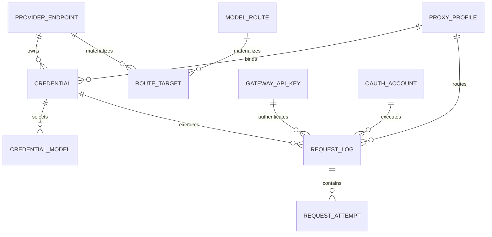
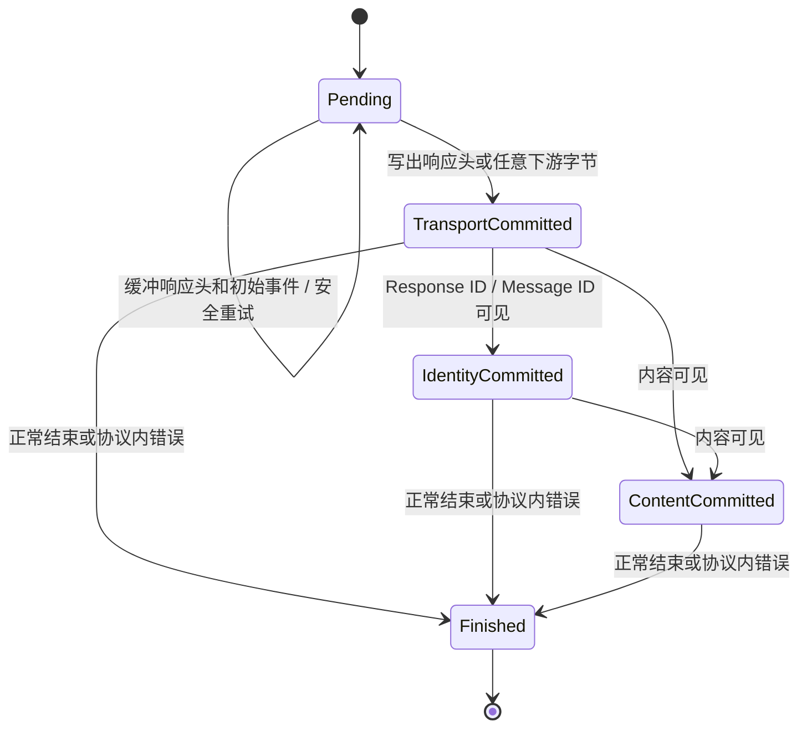

# any2api 架构基线

> 状态：Current<br>
> 版本：1.0<br>
> 最后更新：2026-08-11<br>
> 用途：记录当前有效的需求、架构约束与实现边界。

## 1. 项目定位

any2api 是一个面向个人使用、自托管、单节点运行的 AI API 聚合代理。

项目目标是把多个 Codex、Claude、Grok、Kimi 凭据聚合为统一入口，提供：

- Codex、Claude 原生协议、OpenAI Images API，以及 Grok/Kimi 的 OpenAI 兼容协议接入；
- 多 Provider Credential 管理；
- 多个网关 API Key 管理；
- 可选的账号级 RPM 限速与轮询负载均衡；
- 会话粘性路由；
- HTTP、SOCKS5 与 DIRECT 出口管理；
- 故障切换、冷却、重试和流式响应保护；
- React Web 管理界面。

项目不是面向公众分发 API 的中转平台，不提供充值、计费、套餐、兑换码或多租户运营能力。

## 2. 已确认需求

当前已经确认的需求如下：

1. 后端使用 Rust，前端使用 React Web。
2. 首批支持 Codex、Claude、Grok 和 Kimi；四者的上游 `ProviderCredential` 都只使用 API Key。Codex、Claude 和 Grok 还可以通过独立 `OAuthAccount` 接入订阅账号；Kimi 首版不支持 OAuthAccount。
3. 一个 Provider URL 可以配置多个独立 `ProviderCredential`；当前只支持 API Key。
4. 每个 `ProviderCredential` 可以分别启用、禁用、绑定代理和设置可选 RPM；未设置时不做本地限速。
5. 代理类型仅支持：
   - `DIRECT`
   - `HTTP`
   - `SOCKS5`
6. 系统内置一个不可删除、不可禁用的 `DIRECT` 代理。
7. 系统可以选择一个全局代理。
8. `ProviderCredential` 绑定 `DIRECT` 时表示使用全局代理；只有其绑定和全局代理均为 `DIRECT` 时才从本机直连。
9. `ProviderCredential` 与 `OAuthAccount` 只使用一套可选的每分钟请求数（RPM）限制，不再提供并发或 TPM 配置。
10. 系统在当前 Route tier 内按稳定轮询选择尚有 RPM 名额的凭据；`in_flight` 仅作运行态观测。
11. 系统支持会话粘性路由。
12. 客户端访问 any2api 使用的 `GatewayApiKey` 支持创建多个，并且可以分别禁用或物理删除。
13. 多个 `GatewayApiKey` 仅用于不同设备、客户端和密钥轮换，权限等价，不具备用户、租户、套餐、余额或额度语义。
14. 项目按个人单节点场景设计，不引入 Redis、PostgreSQL、支付和用户分发体系。
15. Provider Endpoint 必须选择客户端接受协议，并可选选择内部转换协议；未选择时上游协议等于接受协议并走直通。首个协议桥只实现 OpenAI Responses → Chat Completions，不启用 Codex/OpenAI ↔ Claude 双向转换。
16. Codex WebSocket 不进入首个正式版本，首版 TransportMode 只有 JSON 和 SSE。
17. Provider API Key 保存后使用实际 Endpoint、Provider 定义的模型目录路径、认证材料与代理读取候选目录；Codex/Grok/Kimi 使用 Base URL 下的 `/models`，Claude 使用根 Base URL 下的 `/v1/models`。管理员最终确认的目录选择与手工模型名按 Credential 持久化，公开模型名首版固定等于上游模型名。`ModelRoute`/`RouteTarget` 只作为内部调度物化结果，不要求用户手工配置。
18. TTL、排队、冷却、熔断、重试和日志保留参数提供内置默认值，并允许在 Web 中写入覆盖值；Web 不提供恢复默认入口。
19. 不提供通用配置或 Secret 导入导出；交互式 OAuth2 登录和 Provider 专用 OAuth JSON 导入都只写入独立的 SQLite `OAuthAccount`。交互式重新登录唯一匹配同一 Provider 稳定账号身份时原子更新原账号，不创建重复路由凭据；若登录 Token 缺少稳定身份但与现有账号的同 Provider、同 Token 类型材料完全相同，也不得新建第二条凭据，无法安全唯一复用时在发布锁内 fail-closed。导入器把已审计的 CLIProxyAPI 与 Sub2API OAuth 结构当作当前外部输入协议，在边界规范化为唯一的 any2api OAuthAccount JSON 后整批原子发布。外部 wrapper 和字段变体不得进入 SQLite 或运行时读取路径。明文 JSON 只保存在账号记录中，不创建或修改 API-key-only `ProviderCredential`。
20. 支持通过 HTTP 或 HTTPS 远程访问管理面；远程管理访问默认启用并使用独立管理员认证，监听范围仍由启动参数决定，TLS 推荐但不强制。
21. `E:\clashx` 仅用于核对 React/Vite/Tailwind 等前端技术栈，不复制其 Tauri 桌面布局、窗口交互或视觉结构；any2api 管理面必须是现代、克制、响应式的浏览器 Web，整体偏 macOS 质感但不花哨。
22. 系统设置提供全局公开模型访问策略；显式 `"all"` 模式表示允许全部已发布模型，数组表示只允许精确匹配的公开模型，其中空数组表示不开放任何模型。该策略同时过滤 `/v1/models` 并在任何路由、RPM 预留或上游请求之前拒绝未放行模型。
23. 系统提供独立 HTTP 系统日志：公开 `/v1` 代理请求、非本机或未知客户端访问、HTTP 4xx/5xx、Body 错误与取消必须保留；本机成功完成的管理 API、健康检查和 Web 资源等正常内部访问不写入，并在查询时过滤升级前已有的同类记录。日志同时保存两个不同字段：`path` 是客户端实际请求的 `request.uri().path()`，不含 query，且不使用路由模板、通配归一化或重写后的路径；`uri` 是 Axum 收到的完整 URI，包含 query。请求日志与系统日志管理列表均使用带头部锚点的服务端 Keyset Cursor，只展示最近 3 天；禁止以会在持续写入时移动边界的 OFFSET 翻页。日志 Writer 在 SQLite 批次提交、清理或保留删除成功后通过已认证管理 SSE 发送不含日志正文的失效通知，Web 只在未固定历史 Cursor 的最新页重新读取；固定定时轮询和客户端自报的日志排除 Header 均不存在。系统日志列表自身的 `GET /api/admin/system-logs` 仍按统一规则审计，但其记录不推进 `system_logs_changed`，避免事件驱动读取形成自激刷新闭环。
24. 系统总览使用扁平分区而不是卡片嵌套，并从 RequestLog 展示日志保留窗口内的真实 Token 累计与可切换时间范围、时间/公开模型维度的调用图表；该历史观测不形成计费、余额或新的持久化计数器。Chart.js 必须位于 Overview 页面内部再次按需加载的图表子分块，页面状态和指标先行渲染，加载期间保持与最终图表等高的可访问骨架。图表定时数据刷新必须复用现有 Chart.js 实例并以无动画方式更新数据，只有主题配色变化或组件生命周期结束才重建或销毁实例。
25. 公开代理只按 Provider、协议方言与端点定义的显式白名单双向投影客户端和上游 Header；每个请求 Header 还必须声明可重放、Credential-owned 或已绑定 turn-state 语义。客户端认证、连接级 Header 与上游认证始终重建；客户端传入的设备、会话、请求关联和分布式追踪值不得在切换 Credential 后重放，最终响应只归属于实际提交的最后一次 Attempt。
26. OpenAI API Key Endpoint 可以选择独立的 `openai_images` 方言，公开 `POST /v1/images/generations` 与 `POST /v1/images/edits`；生成使用 JSON，编辑同时接受 OpenAI 官方的 JSON 引用与 `multipart/form-data` 文件上传。Codex OAuthAccount、Claude、Grok 与 Kimi 不声明原生 Images 方言能力。
27. 官方 GitHub Release 从 Actions 页面手动触发，并要求管理员输入不带 `v` 前缀的稳定 SemVer；`workflow_dispatch.inputs.version` 是该次 Release 唯一的产品版本真相来源，同时决定 Tag、资产名和编译进二进制的正式版本。Cargo package version 只属于 Rust 包元数据，不要求与该输入相等；工作流必须在打包前执行二进制 `--version` 并精确核对输入。首版只打包 Linux AMD64 GNU 二进制及其 SHA-256 文件。
28. Web“设置”增加“关于”页签，显示当前版本和 GitHub 仓库地址，并提供显式检查与安装官方 Release 的操作；安装只接受固定仓库、固定平台资产并校验 SHA-256。管理员确认安装后，服务端以单个进程内任务执行下载、校验、替换和重启，浏览器请求取消不得取消该任务；Web 在任务运行中进入不可关闭的全屏更新状态，展示下载进度和安装/重启阶段，通过新进程公开的构建版本确认目标版本启动成功后自动刷新。更新任务明确失败时允许重试或返回；连续 90 秒无法确认任务或目标健康时进入不宣称失败的有界恢复状态，允许继续等待或返回；仍不在后台静默检查或自动安装。
29. OAuth Token 刷新失败不得折叠成单一“认证失败”。Runtime 必须按当前 `token_version` 保留最近一次安全诊断，明确刷新触发来源、失败阶段、稳定原因、可选 HTTP 状态/网络归因、发生时间及是否必须重新授权；管理 API、Web 账号卡片和普通结构化日志使用同一分类，重新授权或成功 Token 换代后旧诊断自动失效。
30. 流式上游在任何语义输出可见前以协议声明的精确准入拒绝（包括已审计的过载与 Anthropic `rate_limit_error`）拒绝请求时，Runtime 可以在既有预提交预算内丢弃尚未下发的生命周期控制帧并重新选择凭据；未知错误、自然语言匹配、已经出现内容/工具调用等语义事件以及任何下游提交后的失败均不得进入该路径。`rate_limit_error` 只有在完整的 Anthropic SSE `error` envelope 中出现且仍处于 Pending 时才具有该语义；它按 Credential + upstream model 归因，不能扩展为固定并发限制或跨会话绑定切换。每个拒绝 Attempt 必须保留协议层确认的精确稳定码和最终拒绝帧；重试最终不能继续时返回最后一次真实 SSE 拒绝及其原 HTTP 状态，禁止改写为 any2api 自造的通用 502。请求日志和历史统计必须按最终流结果而不是只按初始 HTTP 状态判断成功，避免把 `HTTP 200 + stream_error` 伪装为成功。完整边界见 `docs/adr/0121-anthropic-precontent-rate-limit-retry.md` 与 `docs/adr/0136-precontent-rejection-fidelity-and-overload-backoff.md`。
31. Provider 固定应用身份必须在各 Driver 的版本化 identity profile 中按 data/quota/token surface 集中定义，不得散落版本或伪造与实际构建目标不符的平台。Transport 默认只有一个显式版本的 generic gateway wire profile；没有经审计的 Provider 必需契约时，禁止按 Provider 随机化或模仿 TLS/HTTP2/TCP 特征。
32. 上游响应的 HTTP Content-Encoding 由 Transport 在 Protocol 解码和 Provider 错误分类前统一拥有：线路 profile 只声明实际可增量解码的编码，普通与 pinned Client 必须共用同一实现，解码后同步删除失效的表示元数据。请求侧 `Accept-Encoding` 只有在入口与上游方言相同且全部编码均可由当前 Transport 解码时才按客户端原值、原顺序和多值结构透传；客户端未发送时保持缺失，跨协议转换不得透传，Transport 与 Provider 均不得强制补写固定值。未知、损坏或过深的响应编码链必须失败，禁止删除 Header 后把压缩字节交给 JSON/SSE decoder 或错误分类器。非成功响应继续透明返回解码后的原始内容字节与状态，不做 JSON 重序列化。完整决策见 `docs/adr/0135-same-dialect-accept-encoding-pass-through.md`。
33. 所有自动 reattempt 动作必须服从同一请求级语义退避：同路径、重新选择 Credential/Endpoint/Proxy 以及 OAuth 刷新后的数据面重试，都使用指数 fallback 与明确 Retry-After 的较大值。普通失败的 fallback 继续按当前失败 Credential 计算；协议明确声明的 precontent overload 改按本逻辑请求已注册的总 Attempt 数计算，切换 Credential 不得把它重置为第一次失败。Retry-After 不得被 jitter 或 Credential switch 缩短；等待无法放入剩余 precommit budget 时必须终止并返回当前真实失败。随机抖动只用于既有的并发去同步，不能作为隐藏账号切换或 Transport 特征的手段。
34. 每个可配置协议对必须公开 `Direct` 或 `Translated` fidelity。Direct 只表示没有创建 ProtocolBridge，不承诺请求逐字节不变；Translated 必须由 Bridge 的单一版本化 capability table 声明 operation、可接受请求字段、字段处理方式、工具类型和已知限制，Bridge 校验与管理 capability API 共用该表。Web 必须在保存前展示所选路径的 fidelity 与转换限制，禁止只给出方言名称而掩盖 canonical reconstruction、合成本地状态或字段降级。
35. 通用 Transport wire profile 必须由本地 loopback conformance fixture 固定 TLS ClientHello 的稳定字段集合与真实顺序策略、HTTP/2 初始控制帧和 HTTP/1.1 原始请求头；依赖升级造成 fixture 差异时必须人工审核并提升 wire profile policy version。fixture 只描述 any2api 实际行为，不得被表述为官方客户端基线，也不得由 any2api 另加随机化来隐藏差异。
36. 实际进入 Transport 的 RequestAttempt 必须保存不含 Secret 的结构化线路诊断；流式 Attempt 还必须以 Attempt 起点为单调时钟基准记录首个完整上游 SSE frame、预提交 commit、首个向下游 Body yield 和取消四个 first-write-wins 时间点。诊断只用于本地可观测与回归，不能改变 retry、flush、backpressure、连接复用或路由行为。
37. 官方客户端基线只能使用明确版本和哈希的发布物、合成凭据、临时客户端目录、清空后的进程环境与 loopback recorder 离线采集；每份基线必须记录 Provider、客户端入口、版本、平台、操作、日期、HTTP 条件和局限。仓库只保存脱敏后的 Header 顺序、Body 结构与 capture hash，不保存原始认证值、动态设备/会话/请求标识或完整提示正文。单一入口或平台的观测不能自动改写通用 Provider persona，更不能据此增加 TLS/HTTP2 随机化或伪装层。
38. 同一 Provider 的 OAuth 登录网络阶段、Token 刷新和额度操作必须共用进程内固定的最小请求起始间隔，避免批量导入、同时到期或批量额度刷新在同一全局出口同步起跑。该门闩只排列 Transport 调用的开始时刻，不持有响应生命周期、不限制数据面并发、不替代账号 singleflight/RPM/Retry-After，也不随机化身份或线路特征。Provider 专用 OAuth JSON 导入仍不覆盖或合并既有账号，但能够由 Provider account ID、无 account ID 时的规范化邮箱，或同一 Provider 下任一 access/refresh/ID Token 完全相同证明为重复的输入，必须在发布锁内整批拒绝，禁止把同一官方身份复制成多条路由凭据。交互式登录也必须在同一发布锁内检查精确 Token 重复：稳定身份与 Token 证据指向不同历史记录时返回冲突，缺少稳定身份但只命中一条精确 Token 记录时复用该记录，不能创建新候选。完整决策见 `docs/adr/0132-provider-scoped-oauth-control-plane-pacing.md`、`docs/adr/0133-reject-duplicate-oauth-import-identities.md` 与 `docs/adr/0134-interactive-oauth-token-duplicate-guard.md`。

### 2.1 两类凭据的术语边界

本文严格区分以下两个完全独立的概念：

| 概念 | 方向 | 用途 |
|---|---|---|
| `GatewayApiKey` | 客户端 → any2api | 验证客户端是否允许访问当前 any2api 实例 |
| `ProviderCredential`（下文可简称 `Credential`） | any2api → Provider | 注入 Provider API Key |

```text
Client ── GatewayApiKey ──> any2api ── ProviderCredential ──> Provider
```

两者没有绑定、映射、所有权或派生关系：

- 一个 `GatewayApiKey` 不绑定任何 `ProviderCredential`；
- 请求不能根据 `GatewayApiKey` 选择、过滤或固定上游凭据；
- 上游凭据始终由模型路由、会话粘性、健康状态和负载均衡选择；
- 禁用或删除 `GatewayApiKey` 不影响任何 `ProviderCredential`；
- 禁用、冷却或删除 `ProviderCredential` 不影响 `GatewayApiKey`；
- 两者可以同时记录在一条请求日志中，但该日志关联仅用于本地观测。
- Gateway API Key 调用统计与上游凭据调用统计是并列维度：前者回答“哪个客户端入口发起请求”，后者回答“最终由哪把 Provider API Key 或哪个 OAuthAccount 执行”；两者不得互相替代、绑定或参与路由。

## 3. 范围边界与非目标

### 3.1 永久非目标

以下能力属于项目定位层面的永久非目标，不作为后续版本的扩展方向：

- 用户注册与多租户隔离；
- 套餐、余额、充值、计费、支付；
- `GatewayApiKey` 对外销售或额度分发；
- 多节点分布式调度；
- 通用配置、数据库或 Secret 的应用级导入导出功能。

支持多个 `GatewayApiKey` 不改变上述定位。它们只是同一个个人实例下的多个本地访问凭据，不代表多个用户或租户，也不分别计算额度、余额和账单。

管理面可以为上游 OAuthAccount 展示 Provider 官方额度，并在独立 SQLite 表中保存最后一次成功的安全快照，使页面刷新、切换浏览器或进程重启后仍可读取带抓取时间的观测。这不是 GatewayApiKey 余额、客户端套餐、收费账单或持久化准入配置，因此不改变上述永久非目标。持久化快照不得恢复路由健康；只有当前进程内的权威刷新或真实数据面证据明确返回全局不可用、额度已耗尽或权威 Token 剩余量为零时，才临时影响同一 OAuthAccount 当前路由代际的资格。未知状态、单个模型窗口百分比、本地估算和启动时读取的快照不得据此排除账号。

### 3.2 当前首批范围外

首批版本暂不实现：

- Gemini 或其他 Provider；
- 通用或可导出的 Provider OAuth2 JSON 导入；Provider 专用、只写入 `OAuthAccount` 的批量导入属于当前范围；
- `/backend-api/codex/responses` 兼容入口；
- Codex WebSocket；
- Codex/OpenAI 与 Claude Messages 双向跨协议路由；
- 动态本地插件 ABI；
- Redis 缓存和消息队列；
- 将 Nginx 作为核心调度器。

Nginx 可以作为部署时可选的 TLS 或反向代理入口，但 any2api 的 `ProviderCredential` 调度和协议处理必须由 Rust 服务自身完成。

## 4. 架构原则

### 4.1 模块化单体

首批采用单进程、单二进制、SQLite 的模块化单体架构，不拆微服务。

### 4.2 控制面与数据面分离

- 控制面负责 React 管理页面、管理 API、配置校验和 SQLite 持久化。
- 数据面负责客户端请求、模型路由、`ProviderCredential` 选择、上游执行和响应转换。
- 管理配置写入成功后，数据面通过不可变快照原子切换配置。

### 4.3 协议与 Provider 分离

协议模块只负责请求和响应的格式处理，Provider Driver 只负责：

- 上游 URL；
- 凭据注入；
- OAuth 授权 URL、Token 请求的构建与响应解析（独立 OAuth 工具的网络执行由 Runtime 负责）；
- 请求头和供应商特殊行为；
- 上游错误分类。

同一协议可以被不同 Provider 使用，Provider 不能和协议转换代码永久耦合。

### 4.4 一个上游凭据一个实体

多个上游 API Key 不保存为换行字符串或 JSON 数组。每把上游 API Key 必须是独立的 `ProviderCredential`，拥有独立的：

- 代理绑定；
- 可选 RPM；
- 当前滚动窗口请求数与 `in_flight` 观测；
- 健康状态；
- 模型冷却状态；
- 请求统计。

### 4.5 内部错误分类不得改写上游响应

请求错误、认证错误、额度错误、代理错误、网络错误和上游服务错误必须在 Runtime 内部分别处理，不能统一按“失败”冷却 `ProviderCredential`。该分类只服务重试、健康、冷却和熔断，不是客户端或管理 Web 的错误协议；真正收到的最终上游 HTTP 响应必须保留上游状态码与错误正文，禁止根据内部分类重建 `type`、`code` 或 `message`。

### 4.6 流式响应不可拼接

一旦 any2api 已向客户端写出 HTTP 响应头或任何响应字节，就不能再切换 `ProviderCredential` 或上游。身份事件和内容事件都属于不可逆输出，防止两条流或两个 Response ID 被拼接成损坏响应。

### 4.7 可扩展性是核心约束

可扩展性不是“以后再重构”的事项，而是首批代码必须遵守的架构约束。新增 Provider、协议方言、代理能力、管理页面或调度策略时，应优先增加独立模块和实现既有接口，而不是修改一个不断增长的中央文件。

扩展目标：

- 新增 Provider 时，不修改负载均衡、会话粘性、排队和重试内核；
- 新增协议方言时，不修改 TransportManager 和 Storage Secret 持久化；
- 新增代理类型时，不修改 Provider Driver；
- 新增管理页面时，不把业务逻辑写进 Axum Handler 或 React 页面组件；
- 新增功能可以通过模块级单元测试、契约测试和集成测试独立验证；
- 首批采用编译期静态注册，不引入动态插件 ABI，但内部接口必须具备可扩展边界。

核心调度代码不得出现随着 Provider 数量增长而持续扩张的中央 `match provider_kind`。Provider 差异必须由 `ProviderDriver`、`ProtocolAdapter`、`CredentialCodec` 和 `ErrorClassifier` 等明确接口封装。

### 4.8 强类型边界

- 核心模块之间使用领域类型和显式枚举，不使用无约束的 `HashMap<String, Value>` 传递关键状态；
- Provider API Key 使用专用强类型 Secret 载荷，不把认证字段塞入通用字符串 Map；
- OAuth2 登录与外部导入产生的 Token 只允许按当前唯一 any2api OAuthAccount JSON Schema 明文持久化在独立 SQLite 记录中；HTTP 响应、浏览器状态、日志和 Debug 输出都不得包含 Token，也不提供读取或导出端点；
- ID、时间、RPM、配置版本和错误类型使用 newtype，避免互相误传；
- 所有跨模块接口必须明确取消、超时、错误分类和所有权语义。

### 4.9 依赖方向不可反转

- `domain` 不依赖 Web、数据库、HTTP Client 或具体 Provider；
- `protocol` 不依赖存储、代理、调度和管理 API；
- `provider` 不依赖 Axum、React、SQLite 实现或调度器内部状态；
- `transport` 不知道具体 Provider 的认证字段和业务错误；
- `storage` 不包含负载均衡、协议转换或 HTTP Handler；
- `server` 只负责入口适配、鉴权、中间件和 DTO，不承载核心业务规则；
- `app` 是唯一依赖装配根，负责把具体实现注册到运行时。

依赖方向通过 Workspace crate 边界和 CI 中的 `cargo metadata` 检查强制执行，禁止循环依赖和跨层偷用内部模块。

### 4.10 拒绝巨型文件

生产代码必须按功能和职责拆分：

- 一个文件只承载一个清晰职责；
- `main.rs`、`lib.rs`、`mod.rs` 只做声明、导出和依赖装配，不实现大段业务逻辑；
- 禁止形成通用垃圾桶式 `utils.rs`、`common.rs`、`manager.rs` 或 `service.rs`；确有公共逻辑时必须按具体领域命名；
- 单个生产源文件目标不超过 300 行代码；401–600 行必须进入机器可读 Allowlist；超过 600 行由 CI 拒绝；
- 行数由固定版本 `tokei` 的 code line 口径计算，并固定扫描 glob；
- Allowlist 必须包含 `path`、`reason`、`adr`、`owner` 和 `expires_at`，过期自动失败；
- Allowlist 是当前例外债务清单：每个条目必须命中扫描范围内真实存在且仍有 401–600 行代码的生产文件；文件删除、移动或降到阈值以下后，遗留条目自动失败；
- 例外仅允许自动生成代码、静态协议表、测试夹具和数据库迁移；
- 单个函数建议不超过 80 行，复杂状态机拆为具名状态、转换函数和可独立测试的子模块；
- 禁止仅为规避行数限制而机械拆成无语义的文件，拆分必须对应领域职责或执行阶段。

所有例外和重要边界调整通过 `docs/adr/` 中的 Architecture Decision Record 记录，不能只存在于提交信息或聊天记录中。

### 4.11 Web 设计与技术边界

管理界面是浏览器 Web，不是桌面程序的 WebView。参考项目只用于确认成熟技术选型和工程组织，不作为布局或视觉模板。

首版前端基线：

- React + TypeScript + Vite；
- Tailwind CSS v4 与语义化设计 Token；
- 使用严格 TypeScript、ESLint、单元测试和生产构建门禁；
- 基础图标使用 Lucide；复杂交互只按真实需求逐个引入可访问性 Primitive；
- 服务端数据进入真实页面后由统一查询层管理，禁止在多个页面重复手写请求生命周期；
- URL 是可导航页面的状态来源，存在多个页面后必须使用真实 Router 和 deep link，禁止只靠内存状态模拟导航。
- React 根组件在 `AppProviders` 外必须有最后一道错误边界，覆盖 Query Provider、更新流程、认证门和全局通知宿主；Router 根路由另设中文 `errorElement`，覆盖 Shell、页面渲染和懒加载 chunk 失败。两层恢复页都不得展示原始异常正文，并提供保留当前 deep link 的显式重新加载入口；禁止自动刷新循环。
- 懒加载页面的 `Suspense` 必须使用可见、可访问的加载状态，禁止 `fallback=null` 形成无法区分加载、错误和空白页的内容区。完整决策见 `docs/adr/0085-web-error-recovery-boundaries.md`。

视觉与交互原则：

- 简洁、大气、现代、克制，偏 macOS 的系统字体、中性色、细边框、柔和阴影和适度圆角；
- 毛玻璃或半透明只能作为轻量层次，不依赖 Tauri vibrancy，不以高饱和渐变、粒子、持续动画或拟物装饰制造“科技感”；
- 宽屏可以使用轻量侧栏，窄屏必须折叠为移动导航；禁止固定桌面窗口尺寸和固定 `200px` 壳层假设；
- 页面使用自然文档滚动或显式数据工作区，不允许常驻全局强制 `overflow: hidden`；移动导航、Drawer、Dialog 与全屏任务遮罩仅在自身挂载期间通过同一个引用计数锁临时锁定 `body`。首个持有者保存原始 overflow/padding，最后一个持有者释放时才恢复，交错关闭不得提前解锁或把 `hidden` 误当原值恢复；
- Drawer 与 Dialog 的退出动画只缓存标题、按钮文案、宽度和可保留的纯文本说明等必要标量；表单 children 与结构化 ReactNode 说明在关闭时立即卸载，不得为每次父组件渲染排入新的动画帧或把已关闭的组件树长期保存在状态中；
- 保留文本选择、复制、浏览器缩放、键盘焦点、语义标题、链接行为和可访问名称；
- 默认控件尺寸兼顾远程浏览器与触控，不复制桌面端 22–32px 的极小密度；
- 主题只支持当前 `light` / `dark` 两种持久化值，并在 React 启动前完成轻量主题初始化，避免闪烁；未知或旧值直接使用当前默认值，不在浏览器代码中迁移或重写历史格式。
- 用户主动触发的刷新、创建、保存、删除、启停、轮换和连通性测试等短操作，只在完整成功后通过根级通知宿主给出一次上下文明确的瞬时反馈；多阶段操作不得在中间步骤提前报告成功。初始读取、查询失效、SSE、轮询和自动刷新禁止弹出成功通知；已经使用持续结果区或锁定流程展示结果的操作不得重复通知。失败继续保留可操作的就地错误状态，不能用成功通知掩盖部分失败。

配置 revision/config version 只用于服务端快照一致性，以及前端数据层的缓存排序、乐观锁和冲突处理。管理 Web 不得在页面、卡片、表格、悬浮提示或可访问名称中向用户展示该内部字段；受认证管理 DTO 和系统日志仍可携带它，前端仅按内部协议消费。公共健康检查不得暴露配置 revision、调度 epoch、活动请求、后台任务或停机阶段。

首版明确不引入或不复制：

- CodeMirror、拖拽、复杂图表和全套组件库等尚无真实需求的依赖；
- 巨型全局 CSS、巨型 Page、全局禁止选中文本和桌面化鼠标语义。

OAuthAccount 管理页的长集合是首个已确认的虚拟化场景。前端使用共享虚拟网格组件按“响应式网格行”渲染完整 Provider 账号集合，支持动态行高、1–3 列布局、键盘可聚焦滚动区和语义化 list/listitem；页面不得再为该集合维护客户端分页。浏览器首次提交必须在 paint 前同步读取滚动区宽度并确定列数，禁止先显示默认单列再闪变；无浏览器环境回退普通 effect，不在 SSR/测试导入时访问 DOM。虚拟行允许随滚动卸载，因此额度缓存、批量操作进度和不可逆 reset 的 pending 状态不能只保存在行组件本地生命周期中。完整决策见 `docs/adr/0036-virtualized-oauth-quota-management.md`。

OAuth 虚拟网格位于管理壳显式分配的有界内容行时，必须占满该内容行并作为账号集合的唯一实际滚动区；不得再叠加相对 viewport 或根字体的 `max-height`，否则高视口下会在列表外留下不可用空白并把末行裁切在内部滚动边界。虚拟化仍只渲染可见行和少量 overscan，不因占满工作区而改为全量挂载。

负载均衡和会话粘性是路由策略，不作为一级管理对象或独立页面。固定规模的全局/Provider 调度汇总、进程活动请求/后台任务计数与当前策略下的活动显式会话数进入总览；前两者共用受认证的 `/api/admin/balancing` 查询与前端 Query cache，不再轮询公共健康端点。`scheduler.*` 与 `affinity.*` 统一进入“设置 → 路由策略”。总览不得请求或展示逐账号调度、逐 Credential 会话分布、Continuation 索引数或绑定样本。完整决策见 `docs/adr/0038-aggregate-only-balancing-dashboard.md`、`docs/adr/0039-overview-and-simplified-settings.md`、`docs/adr/0062-unified-session-affinity.md`、`docs/adr/0064-optional-session-affinity-toggle.md`、`docs/adr/0066-active-session-overview.md` 与 `docs/adr/0108-minimal-public-health-response.md`。

设置页只保留“基础、路由策略、运行保护、日志、关于”五个一级页签。每个配置页签默认只展开少量高频设置，其余设置保留在同页的“高级设置”折叠区；这只是渐进披露，不改变 SettingRegistry、默认值/覆盖值/生效值语义。Web 只提供覆盖值编辑，不提供恢复默认入口。代理只在代理页管理，不在系统设置中复制第二个全局代理入口。

样式按 `tokens.css`、`globals.css` 和局部组件职责拆分。React 页面只组合 feature，业务请求、状态和 Schema 分别进入 feature 的 `api`、`model` 与私有 UI 模块。

### 4.12 跨平台临时内存生命周期

长期运行进程的 RSS 高水位不等于仍有同等数量的业务对象存活。公开请求、buffered 上游响应和 HTTP
系统日志前缀会产生大块短命字节；这些对象即使已经 Drop，Linux glibc、macOS malloc zone 与 Windows
进程堆仍可能因为 arena、size class 和碎片保留已释放页。数据面因此必须同时控制对象所有权和底层页的
归还路径，不能只以 Rust 值已经 Drop 推断 RSS 会回到冷启动值。

- 公共请求多块聚合、zstd 解压与重压缩、Provider Endpoint Profile 正文规范化、multipart 重编码、
  buffered 成功响应和 HTTP Body 捕获等短命连续字节产物统一使用可增长的 `payload-buffer`；实际分配达到
  `256 KiB` 前使用普通堆，达到阈值后迁移到匿名私有映射。映射由最终不可变 `Bytes` 直接拥有，最后一个
  所有者 Drop 时由 Linux、macOS、Windows 的虚拟内存实现解除映射，不等待通用堆决定是否清理 arena。
  已经由网络栈提供的单块共享 `Bytes` 仍直接复用，不为采用该原语而额外复制。
- `Content-Length`/`size_hint` 只能作为不超过现有单对象硬上限的初始容量提示；实际累计长度仍逐块使用
  checked arithmetic 验证。不得按端点理论最大值预留，不新增进程总量、并发 Semaphore、429 或机器规格
  配置。
- HTTP 系统日志捕获把同一份最终字节所有权移动进遥测队列，不再为 SQLite 写入复制完整 Body；队列字节
  准入必须同时携带堆 capacity 或映射长度，继续满足 ADR-0114 的真实 owned bytes 计量。原始交换记录是
  move-only；Writer 把整个批次按值交给 Storage，SQLite 参数绑定只借用批次中的字节，禁止为了跨异步边界
  恢复通用 `Clone` 或深拷贝 Body。
- 同协议 buffered JSON 响应必须保留原始 wire bytes，使用无完整对象树分配的 JSON 校验和借用字段扫描
  提取 token usage、Continuation ID 与待改写的顶层 model；只有跨协议 Bridge 确实需要结构转换时才允许
  materialize 完整 `serde_json::Value`。不得为直通转发复制大字符串、图片 base64 或未来未知字段。
- Composition Root 在发生过请求活动且当前活动请求为零时，低频调用平台原生的进程堆压力释放：Linux
  GNU 使用 `malloc_trim(0)`，macOS 使用 `malloc_zone_pressure_relief(NULL, 0)`，Windows 使用
  `HeapSetInformation(NULL, HeapOptimizeResources, ...)` 并传入当前版本的初始化参数结构；不提供该能力的
  平台保持安全 no-op。原生 FFI 只允许存在于独立、可审计的 `memory-reclaimer` crate，其他 Workspace
  继续禁止 unsafe；macOS/Windows 原生 CI 必须实际运行映射与回收基础测试后再链接 release 二进制。
- SQLite 写连接保持单连接串行语义并由周期遥测维护复用；最多 8 条读连接中的闲置连接统一在 60 秒后
  回收。Tokio 与 HTTP Transport 继续使用各自已有的空闲线程/连接池生命周期，不按请求创建永久线程。

该策略不替换系统分配器，也不承诺空闲 RSS 精确等于冷启动 RSS；连接池、运行时栈、代码页和仍被复用的
小对象会形成稳定基线。目标是在 Linux、macOS、Windows 上让大块短命工作集具有确定的页归还路径，并在
请求突发结束后回收通用堆能够安全释放的空页。完整决策见
`docs/adr/0119-cross-platform-transient-memory-reclamation.md`。

## 5. 总体架构


```mermaid
flowchart LR
    CLIENT["Codex CLI / Claude Code / SDK"] --> INGRESS["Axum Ingress"]
    INGRESS --> ACCESS["Gateway API Key 鉴权"]
    ACCESS --> DECODE["ProtocolAdapter Decode"]
    DECODE --> ROUTER["Model Router"]
    ROUTER --> AFFINITY["Session Affinity"]
    AFFINITY --> SELECTOR["Select + Reserve RPM"]
    SELECTOR --> DRIVER["ProviderDriver Request Plan"]
    DRIVER --> TRANSPORT["TransportManager"]
    TRANSPORT --> UPSTREAM["Upstream API"]

    UPSTREAM --> TRANSPORT
    TRANSPORT --> STREAM["Attempt + Commit State Machine"]
    STREAM --> ENCODE["ProviderDriver + ProtocolAdapter Encode"]
    ENCODE --> CLIENT

    WEB["React Admin"] --> ADMIN["Admin API"]
    WEB --> OAUTH["OAuth Account Management"]
    OAUTH --> OAUTH_PROVIDER["Provider Authorization / Token Endpoint"]
    OAUTH_PROVIDER --> PUBLISHER
    ADMIN --> PUBLISHER["ConfigPublisher"]
    PUBLISHER --> COMPILE["Validate + Compile Candidate"]
    COMPILE --> DB["SQLite Commit"]
    DB --> RECONCILE["RuntimeRegistry Reconcile"]
    RECONCILE --> SNAPSHOT["ArcSwap PublishedSnapshot"]
    SNAPSHOT --> ROUTER
    SNAPSHOT --> SELECTOR
    SNAPSHOT --> TRANSPORT

    REGISTRY["Stable RuntimeRegistry"] --> AFFINITY
    REGISTRY --> SELECTOR
    REGISTRY --> TRANSPORT
    STATIC["Provider / Protocol Registries"] --> DECODE
    STATIC --> DRIVER
    STORED_SECRETS["SQLite Secret Material"] --> DRIVER
```

## 6. 工程结构与模块边界

```text
any2api/
├─ Cargo.toml
├─ ARCHITECTURE.md
├─ deny.toml
├─ docs/
│  └─ adr/                       # 架构决策记录
├─ crates/
│  ├─ domain/                    # ID、路由、错误、状态和领域不变量
│  ├─ payload-buffer/            # 小堆/大匿名映射聚合与精确所有权计量
│  ├─ memory-reclaimer/          # Linux/macOS/Windows 进程堆压力释放 FFI 边界
│  ├─ protocol/
│  │  └─ src/
│  │     ├─ api/                # ProtocolAdapter、中立载荷与 Exchange 契约
│  │     ├─ openai_responses/   # request/response/sse/error/headers
│  │     ├─ openai_chat_completions/ # Chat Completions request/response/sse/error/headers
│  │     ├─ openai_images/      # Images JSON/multipart/response/sse/telemetry
│  │     ├─ openai_responses_chat/ # Responses → Chat request/input/options/tools bridge
│  │     └─ anthropic_messages/ # request/response/sse/error/headers
│  ├─ provider/
│  │  └─ src/
│  │     ├─ api.rs              # ProviderDriver 与 CapabilitySet
│  │     ├─ credential/         # Provider API Key 与 Secret 输入
│  │     ├─ oauth/              # OAuth 通用契约、导入与路由材料
│  │     ├─ upstream_error/     # HTTP 错误、OpenAI 错误与 Retry-After
│  │     ├─ codex/              # driver/auth/oauth/errors/capabilities
│  │     ├─ claude/             # driver/auth/oauth/errors/capabilities
│  │     └─ grok/               # driver/auth/oauth/errors/capabilities
│  ├─ transport/
│  │  └─ src/
│  │     ├─ api.rs              # 稳定 Transport 端口
│  │     ├─ client/             # Client 缓存、构造、请求执行、错误分类与 Body 生命周期
│  │     ├─ connection/         # 固定目标连接、TLS 与代理 TCP 连接器
│  │     ├─ proxy/              # 代理 URL、认证与握手实现
│  │     └─ resolution/         # Origin 解析与严格 SSRF 地址固定
│  ├─ runtime/
│  │  └─ src/
│  │     ├─ affinity/           # 统一会话绑定、锁和 CAS
│  │     ├─ configuration/      # PublishedSnapshot、Publisher 与发布任务
│  │     ├─ credential/         # API Key 材料、模型探测与稳定运行态
│  │     ├─ gateway_api_key/    # Gateway Key 生成与发布
│  │     ├─ health/             # Credential/Model/Endpoint/Proxy 状态
│  │     ├─ lifecycle/          # drain、TaskTracker、后台任务生命周期
│  │     ├─ oauth/              # login/import/quota/refresh 与共享账号发布协调
│  │     ├─ proxy/              # 代理认证材料与连接探测
│  │     ├─ public_request/     # 规划、选择、重试、上游执行与流式生命周期
│  │     ├─ request_telemetry/  # 请求/Attempt 遥测与异步写入
│  │     └─ routing/            # 候选、RPM、队列、轮询与聚合观测
│  ├─ storage/
│  │  └─ src/
│  │     ├─ api.rs              # 稳定 Storage 端口
│  │     ├─ configuration/      # 完整配置装配、模型与 Repository 入口
│  │     ├─ gateway_api_key/    # 该聚合根的 row/repository/write/usage
│  │     ├─ oauth_account/      # OAuth 文档、material、row/repository/write
│  │     ├─ provider/           # Endpoint、Credential、模型与 Secret 持久化
│  │     ├─ proxy/              # Proxy 与认证 Secret 持久化
│  │     ├─ request_log/        # repository/write/row 与上游凭据历史聚合
│  │     ├─ http_access_log/    # 完整 HTTP 访问日志 row/repository/write/clear
│  │     ├─ settings/           # Setting override 持久化
│  │     ├─ migration/          # 当前规范 Schema 与数据库不变量检查
│  │     └─ secret/             # 明文 Secret 类型、指纹与读取边界
│  ├─ updater/
│  │  └─ src/
│  │     ├─ api.rs              # 版本信息、检查/安装端口与重启请求契约
│  │     ├─ github/             # 固定官方 Release 元数据与有界下载
│  │     ├─ install.rs          # checksum、受限解包与候选提交编排
│  │     ├─ smoke.rs            # staged --version 有界进程冒烟
│  │     ├─ recovery.rs         # pending/previous 提交、确认与原子恢复
│  │     └─ temporary.rs        # 同目录更新工作区创建与严格残留清理
│  └─ server/
│     └─ src/
│        ├─ public/             # OpenAI/Anthropic 兼容公开入口
│        ├─ admin/              # 按管理功能归档；OAuth 再分 account/login/import/quota
│        ├─ admin_auth/         # 单管理员密码、Session、网络策略与轮换
│        ├─ http_access_log/    # 全局请求生命周期记录与管理端点
│        └─ embedded_web.rs     # 内嵌/外部 Web 资源入口适配
├─ app/
│  └─ any2api/                   # 二进制入口与唯一 Composition Root
│     └─ src/
│        ├─ bootstrap/           # 环境配置、实例锁、Adapter 注册与应用装配
│        ├─ logging/             # 启动期 console、可挂载文件层与配置发布后的整快照 reconcile
│        ├─ shutdown/            # HTTP drain、信号、收尾与退出结果
│        ├─ lib.rs               # 最小公开装配/契约测试出口
│        └─ main.rs              # 同步二进制入口
├─ web/
│  └─ src/
│     ├─ app/                    # Router、Layout、全局 Provider
│     ├─ features/               # proxies/providers/keys/logs/settings
│     ├─ shared/                 # 纯展示组件、API client、通用类型
│     └─ test/
├─ migrations/
├─ tests/
│  └─ contract/                 # Driver、Protocol、Storage 契约测试；HTTP/SOCKS、SQLite、热更新与停机集成场景当前也收敛于此，独立 integration/ 与 fixtures/ 目录在需要时再拆分
└─ xtask/                       # 架构检查、生成、发布辅助命令
   └─ src/
      ├─ main.rs               # 命令分派
      └─ architecture/         # architecture-check 协调与各独立门禁
         ├─ crate_dependencies.rs
         ├─ migration_history.rs
         └─ source_size/       # tokei 体积检查与其专属 Allowlist
```

`A -> B` 表示 A 可以依赖 B。允许的主要方向：

```text
protocol  -> domain + payload-buffer
provider  -> domain + payload-buffer
transport -> domain
storage   -> domain
payload-buffer -> 独立的跨平台临时字节所有权原语；不依赖业务 crate
memory-reclaimer -> 独立的跨平台进程堆压力释放端口
runtime   -> domain + payload-buffer + protocol + provider + transport + storage 的公开接口
updater   -> 独立的 GitHub Release、文件替换与进程重启请求端口
server    -> domain + payload-buffer + runtime + updater 的公开接口
app       -> memory-reclaimer + server + runtime + updater + 所有具体 Adapter
```

额外约束：

- Provider Driver 负责构建请求计划、注入规则、响应解析和错误分类，不直接创建 HTTP Client；
- Runtime 负责调度、重试、刷新编排和调用 Transport；
- `provider`、`protocol`、`transport`、`storage` 各自提供稳定的 `api` 模块；Runtime 只能导入这些公开端口。Adapter 契约类型只允许从对应 `api` 模块公开一次，crate 根不得再提供平行路径；`provider` 根只公开 `app` 静态注册所需的 Codex、Claude、Grok、Kimi 四个具体 Driver，Registry、trait、错误、Secret、OAuth 类型与辅助函数均只属于 `provider::api`；
- SQLite 类型、Axum 类型、`reqwest` 类型不得穿透到 `domain`；
- 每个功能模块公开最小 API，内部实现默认 `pub(crate)` 或私有；
- 新 Provider 只允许在 `provider/<name>`、必要的协议模块、注册表和契约测试中产生局部变更；
- React 按 feature 拆分，页面组件不直接拼 URL、不直接保存 Secret、不实现调度规则。

### 6.1 工程质量门禁

CI 至少执行：

```text
cargo fmt --all --check
cargo clippy --locked --workspace --all-targets --all-features -- -D warnings
cargo nextest run --locked --workspace --all-features
cargo test --locked --doc --workspace
cargo build --locked --release --workspace
cargo build --locked --release（macOS 与 Windows 原生 runner）
cargo deny check
cargo xtask architecture-check
web: typecheck + lint + unit test + production build
e2e: Chromium 中的真实服务登录、deep link 与桌面/390px 响应式壳层契约
```

`xtask architecture-check` 负责：

- 检查 crate 依赖方向和循环依赖；
- 使用固定 `tokei` 口径检查生产源文件体积、Allowlist 字段和过期时间；
- 拒绝指向不存在、未被生产源码扫描覆盖或已经不再达到例外阈值的 Allowlist 条目；
- 对 `main.rs/lib.rs/mod.rs` 应用更低的行数阈值；“是否存在大段业务实现”保留为评审规则；
- 检查迁移文件编号和 checksum；
- 检查前端 feature 不能直接跨层导入其他 feature 的内部实现。
- 检查 Runtime 生产代码只能导入 Adapter 的稳定 `api`，并固定 Provider crate 根只公开 Composition Root 所需的三个具体 Driver，禁止恢复 Adapter 类型的重复根导出。

契约测试不是按文件名猜测是否存在，而是枚举实际 Registry 中注册的每个 Provider/Protocol 实现并运行统一测试套件。

`tests/contract` 的 HTTP 契约共享一个测试专用应用装配 fixture：它只负责创建临时 SQLite、真实
`RuntimeRegistry`、初始 `PublishedSnapshot`、`ConfigPublisher`、当前 Composition Root 注册的
Provider/Protocol 组件、测试管理员会话和最小 Web 根，并允许从测试已准备好的 `SqliteStore` 构造。
具体测试仍显式拥有配置发布顺序、Telemetry 生命周期、OAuth/Transport mock、`AppState` 扩展、自定义
管理员认证与断言；禁止把 feature 行为、期望 revision 或请求步骤塞进参数不断增长的万能 fixture。

测试采用“最低充分层级”原则：纯函数、解析器和状态转换优先在模块层验证；只有行为跨越 crate、公开 HTTP 协议或真实 I/O 时才上升到契约/集成层。禁止仅为满足清单在多个层级机械复制同一输入分支，也不把一次性审查取证 benchmark 长期保留为默认忽略的测试代码。以下高风险边界仍必须具备对应覆盖：

- Domain 单元测试：代理解析、错误分类、路由和状态转换；
- Provider/Protocol 契约测试：请求头、Secret 注入、未知字段、错误 envelope 和 SSE 事件；
- 调度 RPM 测试：滚动窗口绝不超限、60 秒到期、动态升降限、无丢失唤醒、运行态 Guard 只结算一次；
- 关键原子状态使用多线程 Tokio 契约测试覆盖并发路径；
- Tokio 虚拟时间测试：排队超时、冷却、Retry-After、取消和停机；
- Transport 集成测试：DIRECT、HTTP CONNECT、SOCKS5h、代理认证和 Client 代际；
- 流式切分测试：任意字节切分、LF/CRLF/裸 CR（含 `\r\r` 与混合行尾）、多行 `data:`、无尾空行和畸形帧；另有 proptest 属性测试验证任意字节流下切分不变性、重组无损性与 payload 解析全域性；
- 热更新测试：编译失败不提交、revision 不倒退、Runtime 句柄跨快照复用；
- 端到端测试：跨模块公开行为（GatewayApiKey 隔离、模型策略、粘性、重试、JSON/SSE 生命周期）；Provider/Protocol 的每实现请求与错误矩阵由 `registered_adapters` 和各模块契约枚举覆盖，禁止再为每个 Provider 复制整套 HTTP JSON 矩阵。

浏览器 E2E 使用独立临时数据目录、固定测试管理员密码和真实 Rust HTTP 服务；不得复用开发者本地数据库或登录 Cookie。首个浏览器套件只覆盖跨页面共享且单元测试无法证明的契约：登录后保留目标 deep link、服务端 SPA fallback、核心管理页面刷新、移动导航、桌面/390px 视口无水平溢出和控制台无未处理错误。业务 CRUD、字段校验和错误分支继续由更快的 Domain、HTTP 契约与 React 单元测试覆盖，禁止在浏览器层重复堆叠全量矩阵。

浏览器 E2E 默认启动不设置 `ANY2API_WEB_DIR` 的正式二进制，验证内嵌 React 资源而不是工作区 `web/dist`。测试从 Cargo 本轮构建消息取得真实可执行文件路径，不能假定固定 `target/debug`、误跑此前构建的二进制或绕过自定义 Target 目录；启动服务时清除宿主继承的全部 `ANY2API_*` 配置，只注入测试明确拥有的隔离值。外部目录模式只由 Server 契约覆盖其显式覆盖语义，避免浏览器主链绕过正式部署路径。

fuzz 目标建立后：每个 PR 回放固定 fuzz corpus，长时间 fuzz 作为定时 CI 任务运行，不阻塞普通本地开发循环。在此之前，SSE 解析由确定性切分矩阵测试与 proptest 属性测试共同覆盖。

### 6.2 Feature 模块模板

Rust 功能模块按职责拆分，示例：

```text
runtime/scheduler/
├─ mod.rs              # 仅公开 Scheduler API
├─ candidate.rs        # 候选与过滤原因
├─ selector.rs         # 轮询选择与 tie-break
├─ rate_window.rs      # 滚动 60 秒 RPM 预留
├─ guard.rs            # in_flight 与请求生命周期 Guard
├─ queue.rs            # QueueTicket 与 scheduler epoch
├─ fallback.rs         # tier 策略
└─ tests.rs            # 模块级 RPM 与并发安全不变量
```

React feature 示例：

```text
web/src/features/providers/
├─ api.ts              # 仅 Provider 管理 API
├─ schema.ts           # DTO 校验与类型
├─ hooks.ts            # 查询、Mutation 和缓存失效
├─ components/         # feature 私有组件
├─ pages/              # 路由页面，仅做组合
└─ index.ts            # feature 唯一公开出口
```

模块之间只能通过公开出口依赖，禁止深层导入其他 feature 的内部文件。后端 Handler 和前端 Page 都只负责编排，不直接实现 Secret 持久化、调度、代理解析、错误分类或复杂状态机。

Web 配置 feature 共同使用的 mutation 生命周期只抽取已经一致的 revision 单调缓存发布、可选查询失效和失败后 active refetch；具体 API 输入、mutation 集合、通知、删除后的附属缓存清理仍归各 feature。Provider/OAuth 等管理工作区必须各自只渲染一份稳定导航/工具栏外壳，在同一内容槽切换首次加载、无数据错误、陈旧数据警告与正常列表；禁止用假输入框复制外壳，也禁止以万能 Query Boundary 抹平不同 feature 的恢复动作。完整决策见 `docs/adr/0104-bounded-web-configuration-lifecycle.md`。

### 6.3 Rust 源码目录与公开出口

Rust crate 内采用 feature-first 目录，而不是把 entity、row、repository、DTO、handler、error 和测试按技术后缀平铺在 `src/` 根目录：

- `src/` 根目录只保留 `lib.rs`、稳定 `api.rs`、少量真正跨 feature 的基础类型，以及一级 feature 入口；
- 同一业务对象的领域实体、配置校验、SQLite row/repository/write、管理 DTO/handler/error 和模块级测试分别收进该对象所属 feature 目录；
- 已经包含多个协作文件的模块使用目录 `mod.rs` 作为声明和最小重导出入口；只有单一职责且没有协作文件的模块继续保留单文件，禁止为了减少根目录计数机械套空目录；
- 测试紧邻被验证的 feature，crate 级能力矩阵测试统一收进 `tests/`，不得继续以大量 `*_tests.rs` 平铺根目录；
- crate 之间只依赖对方稳定 `api` 模块；crate 内 feature 默认通过所属模块入口协作，不提供内部路径兼容别名或转发层；
- 只有被两个以上真实 feature 共同使用且语义稳定的逻辑才能提升为共享抽象；禁止创建无领域含义的 `common.rs`、`utils.rs`、万能 repository 或万能 handler。
- 已形成多条工作流的 feature 必须继续按职责分区：Runtime OAuth 使用 `login`、`import`、`quota`、`refresh`，Server OAuth 使用 `account`、`login`、`import`、`quota`；Reqwest Client、请求日志仓储和跨协议请求转换分别按构造/执行/失败、Row/写入/编排和输入/选项/工具阶段拆分；OAuth 刷新分离扫描调度与单账号刷新，请求遥测分离生命周期与最终记录组装，管理 DTO 分离读响应与写请求。
- Storage 完整配置装配归属 `configuration`，各聚合根只暴露自己的加载与写入能力；功能专属的 Runtime-to-HTTP 错误映射留在对应 Server feature，不堆入全局管理错误 envelope。
- 内部实现文件使用可辨识的职责名称，不使用泛化 `service.rs`；测试通过正常 Rust 模块目录与实现相邻，不使用 `#[path = "...tests.rs"]` 掩盖文件系统与模块图差异。

同一规则也适用于 Workspace 中的可执行与工具 crate：

- `app/any2api` 仍是唯一 Composition Root；`bootstrap/` 只拥有启动环境、实例锁、具体 Adapter 注册和依赖装配，不能吸收 Runtime、Storage 或 Server 的业务规则；
- 应用级本地日志实现与日志设置 reconcile 统一放入 `logging/`，HTTP drain、进程信号和有界收尾统一放入 `shutdown/`；`main.rs`、`lib.rs` 和各 `mod.rs` 只声明、重导出或调用装配入口；
- `xtask` 按命令域组织；`architecture-check` 的依赖方向、Migration 历史和源文件体积检查保持独立，只有源文件体积检查使用的 Allowlist 归属于该检查；
- `build.rs` 等工具链约定入口可以保留单文件，但仍只承担对应构建职责，不成为应用逻辑入口。

本轮目录收敛只调整代码所有权与可发现性，不改变 crate 依赖方向、SQLite Schema、HTTP 契约或运行时行为。完整决策见 `docs/adr/0047-feature-first-crate-layout.md`。

## 7. Nginx 架构借鉴

any2api 借鉴 Nginx 的阶段流水线、Upstream Peer、连接池、故障切换和配置代际切换，但不复制其 Master/Worker 多进程模型。

| Nginx 概念 | any2api 对应概念 |
|---|---|
| upstream group | 一个逻辑模型的候选路由集合 |
| upstream peer | Provider URL + Credential + 实际代理 |
| `limit_req` 风格速率约束 | Credential 可选 RPM |
| active connections | Credential 当前 `in_flight` 观测 |
| round robin | 当前 tier 内稳定轮询 |
| `max_fails` / `fail_timeout` | 失败阈值与冷却时间 |
| backup peer | 后备 Route Target |
| keepalive | 按代理配置复用的连接池 |
| `proxy_next_upstream` | 响应提交前切换 `ProviderCredential` |
| filter chain | Provider 请求与响应转换 |
| graceful reload | ArcSwap 配置代际切换 |

## 8. 请求阶段流水线

一次请求依次经过以下阶段：

```text
1. PostRead
   - 生成 Request ID
   - 捕获客户端实际请求的 method、原始 URI path、HTTP version、客户端地址、开始时间与当前 Config Revision
   - 请求体大小限制
   - 建立取消信号

2. Access
   - 按入口协议提取并验证 Gateway API Key
   - 多个认证头冲突时拒绝请求
   - 剥离所有客户端认证头、Cookie 和 Proxy-Authorization
   - 保留有界、未记录日志的客户端 Header 视图，供选中 Provider 后执行白名单投影

3. Decode
   - 识别具体 ProtocolDialect，而不是只识别 Provider 名称
   - 解析模型、流式模式和会话标识

4. Route
   - 按同一 PublishedSnapshot revision 的全局公开模型允许列表检查模型
   - 将公开模型解析为 Route Plan
   - 按能力矩阵生成候选 Route Target
   - 接受协议与有效上游协议相同时走直通
   - 两者不同时要求存在已注册 ProtocolBridge，否则拒绝发布

5. Affinity
   - 解析显式会话或续接标识
   - 检查统一会话绑定

6. SelectAndReserve
   - 过滤禁用、冷却、代理不可用的 Credential
   - 按 Route + tier 的稳定轮询顺序尝试候选
   - 原子选择 Credential 并预留滚动 60 秒 RPM 名额
   - 健康预检查后的 Guard 竞争失败时，在上游 Attempt 前按唯一令牌精确回滚本次预留
   - 取得只负责 `in_flight` 观测和资源生命周期的运行态 Guard

7. Attempt
   - 解析实际代理
   - Provider Driver 只按最终选中的上游凭据与操作准备 attempt-owned 请求体；当前仅 Codex OAuth 普通 Responses 应用已登记的后端兼容 Profile
   - Provider Driver 按 Provider + 协议 + 端点投影真实客户端 Header，缺失时补官方默认身份
   - ProtocolAdapter 覆盖与最终 Body 一致的 Content-Type、Accept 等协议 Header
   - 最后只注入选中 ProviderCredential 或 OAuthAccount 的认证与账号 Header
   - TransportManager 执行请求
   - 根据 RetrySafety、预算和 CommitState 决定是否重试

8. HeaderFilter
   - 在 Pending 阶段缓冲初始响应头
   - 按最终 Attempt 的 Provider + 协议 + 端点白名单过滤敏感和 hop-by-hop 响应头
   - 保留上游 Request ID、重试、限流、模型能力与 CLI 功能 Header
   - 被重试或切换掉的 Attempt Header 永不进入客户端响应

9. BodyFilter
   - 非流式响应转换
   - SSE 分帧与流式转换
   - 恢复客户端可见模型名
   - 在身份事件可见前建立会话续接绑定
   - 首次写出响应头或任意字节后禁止切换上游

10. Log
    - 记录每次 Attempt、最终结果、耗时、首 Token、Token Usage 和错误分类

11. HttpAccessLog
    - 在响应 Body EOF、错误或 Drop 时只结算一次
    - 在 Axum 边界旁路捕获完整 URI、请求/响应 Header 与两侧 Body 前缀，不改变流式传输和业务解析
    - 记录可用的最终状态码、总耗时、实际写出的响应字节数和 completed/body_error/cancelled 结果
    - 通过有界遥测队列异步写入独立系统日志表
```

建议为每个请求建立显式上下文：

```rust
struct RequestContext {
    request_id: RequestId,
    config_revision: ConfigRevision,
    ingress_protocol: ProtocolDialect,
    public_model: PublicModel,
    route_plan: RoutePlan,
    session: Option<SessionIdentity>,
    deadline: Deadline,
    retry_budget: RetryBudget,
    attempt_no: u32,
    commit_state: CommitState,
}
```

不得通过无类型字符串 Map 在核心模块之间传递关键状态。

## 9. 核心领域模型

### 9.1 ProxyProfile

```text
proxy_profiles
├─ id
├─ name
├─ kind                  # direct | http | socks5
├─ host
├─ port
├─ authentication_version
├─ enabled
├─ built_in
├─ config_version
├─ created_at
└─ updated_at

proxy_passwords
├─ proxy_profile_id
├─ username
├─ authentication_version
└─ password
```

约束：

- 系统内置固定 ID 的 `DIRECT`；
- `DIRECT` 不允许删除或禁用；
- HTTP/SOCKS5 代理认证要么完全关闭，要么用户名和密码成对存在；用户名是可见配置元数据，但不能为空、不能超过 255 字节、不能包含控制字符或 HTTP Basic 分隔符 `:`；密码只保存在独立的 SQLite 明文 Secret 记录中；
- `authentication_version` 在认证状态实际发生设置、替换或清除时单调增加；同一次实际认证变更也必须增加 `ProxyProfile.config_version`，使 Transport Client 切换到新代际；对已经关闭认证状态的重复清除是 no-op，不增加版本；
- 禁止在普通日志和管理 DTO 中返回代理密码；
- `SOCKS5` 默认使用远程 DNS 解析语义，避免本地 DNS 泄漏。

认证设置、替换和实际清除增加 `authentication_version` 与 `config_version`；进程重启只从 SQLite 重新装配认证材料，不恢复连接、健康或请求状态。

### 9.2 ProviderEndpoint

```text
provider_endpoints
├─ id
├─ name
├─ provider_kind         # codex | claude | grok
├─ base_url
├─ protocol_dialect      # 客户端接受协议，必填
├─ upstream_protocol_dialect  # 内部转换协议，可空；空值表示与接受协议相同
├─ enabled
├─ config_version
├─ created_at
└─ updated_at
```

每把 Credential 独立保存已确认的模型集合：

```text
provider_credential_models
├─ credential_id
├─ upstream_model
└─ created_at
```

一个 Provider Endpoint 表示一个上游 URL，可以拥有多个 Credential。

`protocol_dialect` 是公开入口接受的协议；`upstream_protocol_dialect` 是实际上游线协议。后者为 `NULL` 时不转换，有效上游协议固定为 `protocol_dialect`。非空值必须与接受协议不同，并且 `(protocol_dialect, upstream_protocol_dialect)` 必须存在已注册的 `ProtocolBridge`。数据库不重复保存“同协议”值。

`base_url` 是管理员明确配置的受信任目标，只要通过结构化 HTTP(S) URL 校验就可以访问；普通 HTTP、loopback、局域网和其他私有地址不需要额外授权字段。

### 9.3 Credential

```text
provider_credentials
├─ id
├─ provider_endpoint_id
├─ label
├─ credential_kind       # api_key
├─ secret_version
├─ credential_generation
├─ config_version
├─ api_key
├─ fingerprint_version
├─ secret_fingerprint
├─ secret_tail
├─ proxy_profile_id
├─ requests_per_minute          # nullable; NULL = no local rate limit
├─ enabled
├─ created_at
└─ updated_at
```

运行时状态不直接保存在 Credential 主表：

```text
CredentialRuntimeHandle
├─ in_flight
├─ rolling_request_timestamps
├─ balancing             # selected 与按请求去重的各类 filtered 计数
├─ fixed_waiters
└─ scheduler_epoch

CredentialRuntimeBinding (per PublishedSnapshot)
├─ Arc<CredentialRuntimeHandle>
├─ requests_per_minute
└─ Arc<CredentialGenerationRuntime>
```

认证材料和健康状态位于显式分层的 generation-scoped 对象中，详见第 12.5 节。这样热更新可以保留 RPM 窗口和观测状态；仅 OAuth Token 轮换时隔离认证错误并保留同一账号的路由健康，Secret/URL 或账号路由身份变化时则完整隔离退役代际的迟到错误。

首版约束：

- 配置编译器只接受 `credential_kind=api_key`；OAuth2 登录结果不进入 ProviderCredential 或 Provider Endpoint；
- `requests_per_minute` 可空；非空值范围固定为 `1..=100_000`。空值表示不做本地限速，禁用必须使用 `enabled=false`；
- API Key 是有界可见 ASCII，明文只存在于专用 SQLite 字段和当前 routing generation 的受控内存材料；
- `secret_version` 是认证材料 CAS 版本，任何 Secret 替换都增加；
- `credential_generation` 隔离认证和模型健康代际，Secret 轮换、重新启用或 Endpoint URL 身份变化时增加；
- `config_version` 是管理资源乐观锁版本，元数据修改和 Secret 轮换时增加，无变化更新不增加；
- 模型集合变化增加 `config_version`，不增加 `secret_version` 或 `credential_generation`；API Key 轮换会清空轮换前模型集合；
- 新建 Credential 初始没有公开模型。管理面可使用该 Credential 的实际代理请求
  Provider 定义的模型目录作为候选目录，也必须允许管理员手工输入其已确认的上游模型名。
  模型发现超时、失败、无法解析或返回空列表均不得禁用手工输入与保存；
- 同一 Endpoint 下的多把 Credential 可以拥有不同模型集合，调度器必须按 `Credential + upstream_model` 过滤，禁止因为 URL 相同就假定权限相同；
- Endpoint 的 `provider_kind` 创建后不可修改；`protocol_dialect` 和 `upstream_protocol_dialect` 即使已有 Credential 也允许修改。修改 Base URL 或任一协议字段时，所有子 Credential 增加 `credential_generation`；协议变化还必须在同一配置事务中差异同步 Route/Target，并裁剪已经没有公开 Route 的模型允许列表项；
- Provider 列表和 Credential DTO 不展示 OAuth 类型或 OAuth 入口；OAuth 独立页面和 API 管理 `OAuthAccount`；
- OAuth session、state、PKCE verifier 和 Device Code 只保存在内存；Token 只存在于兑换栈、OAuthAccount SQLite JSON 和当前 routing generation，管理 HTTP 响应不返回 Token；
- 普通 Provider API Key 管理端点不接受 OAuth JSON；Provider 专用导入只通过 OAuth 管理 API 创建 `OAuthAccount`，不提供 OAuth JSON 读取或导出。

管理面提供 `POST /api/admin/provider-credentials/{id}/test`。测试固定使用当前
`PublishedSnapshot` 中该 Credential 的认证材料、Provider Endpoint 与解析后的实际代理，
由 Provider Driver 构造无生成副作用的凭据探测请求；Codex 与 Grok 使用各自 Base URL 下的
`GET /models`，Claude 使用根 Base URL 下的 `GET /v1/models` 并发送固定 `anthropic-version`。
测试计划同时携带 Provider 所需的非敏感固定 Header，当前 Credential 的认证 Header 仍由同一
Driver 独立生成并最后合并。测试不经过模型路由、不切换 Credential、不回退代理，也不更新
Endpoint/Proxy 冷却或熔断状态。`ProviderCredential.enabled` 与 `ProviderEndpoint.enabled` 只控制
数据面路由资格，测试不要求两者启用；停用的 Endpoint 或 Credential 仍使用当前明确配置的 URL、
认证材料和实际代理读取模型目录。只有收到 2xx 响应时，才清除本次捕获
`CredentialGenerationRuntime` 的 `auth_error` 并推进统一 scheduler epoch；配置在测试期间发生
轮换时，退役 generation 的测试结果不得修改当前 generation。2xx 响应体在严格大小与读取超时内交给 Provider
Driver 解析，只向管理面返回排序去重后的模型 ID，不返回原始响应正文、URL、地址或 Secret。
用户通过 `PUT /api/admin/provider-credentials/{id}/models` 提交最终确认集合；写入与内部模型映射、
全局配置 revision 和 PublishedSnapshot 切换属于同一个串行配置发布。
该端点接收的 `models` 是管理员最终确认集合，可同时包含发现目录中的模型和手工输入模型；
后端仅执行 `UpstreamModelName` 精确名称校验、排序和去重约束，不要求名称必须出现在本次
模型目录结果中。保存手工名称只表示管理员声明该 Key 可调用它，不伪造模型探测成功。

Web 中尚未持久化的 Credential 模型探测状态必须绑定到本次实际依赖的资源版本：当前
Provider Endpoint、当前 ProviderCredential，以及按 DIRECT 继承规则解析出的实际代理。
scope 不得使用全局配置 revision，也不得因其他 Endpoint、Credential 或无关代理变化而清空；
相关 Endpoint、Credential、Secret/generation 或实际代理版本变化时则必须隐藏旧结果。每次
探测使用单调请求序号，只有 scope 与序号都仍匹配的最新请求可以写入结果、错误和 loading
状态，迟到的旧请求不得覆盖新结果。

### 9.4 OAuthAccount

```text
oauth_accounts
├─ id
├─ provider_kind                # codex | claude | grok
├─ label
├─ oauth_json                   # plaintext Provider JSON, never returned by DTO
├─ token_version                # OAuth material CAS version
├─ account_generation           # account routing-health identity generation
├─ config_version
├─ proxy_profile_id             # fixed DIRECT for the first slice
├─ requests_per_minute          # nullable; NULL = no local rate limit
├─ enabled
├─ safe_account_email           # optional, never a token
├─ expires_at
├─ created_at
└─ updated_at

oauth_account_models
├─ oauth_account_id
├─ upstream_model
└─ created_at
```

OAuthAccount is deliberately separate from `provider_credentials`: it has no configurable Provider Endpoint and no API Key field. SQLite JSON uses one any2api token-document schema shared by all Providers; `provider_kind` and `expires_at` remain in their existing typed columns instead of being duplicated inside JSON. Storage enforces bounded object JSON and a non-empty access token; the Provider current-document decoder owns the exact field schema and rejects unknown external fields before publication. OAuth JSON is plaintext in SQLite by explicit product decision, but must never appear in logs, DTOs, Debug, browser storage, or an export API. External import formats are normalized before this boundary and are never accepted by the runtime document decoder.

Codex、Claude 和 Grok 账号都编译为 Provider 自有的固定路由 Profile。它们的已选模型、DIRECT/全局代理解析、可选 `requests_per_minute`、启用状态、代际和健康状态与 API Key Credential 一起进入同一个 `RoutingCredential` 投影。调度器不根据投影来自 `ProviderCredential` 还是 `OAuthAccount` 增加分支。

`token_version` 是 OAuth 认证材料 CAS 与认证健康代际；`account_generation` 是账号级路由健康身份代际。定时刷新和已确认同一 Provider 身份的重新授权只增加 `token_version`，创建全新的 `auth_error` 状态，同时复用同一 `account_generation` 的额度、权限和模型冷却；从 disabled 重新 enabled 时增加 `account_generation` 并整体重置健康。完整决策见 `docs/adr/0095-split-authentication-and-routing-health-generations.md`。

Codex 固定路由基址为 `https://chatgpt.com/backend-api/codex`，有效上游方言为 OpenAI Responses；Driver 从 ID Token 的 `chatgpt_plan_type` 选择 free、team/business/go、plus 或 pro 紧凑模型目录，缺失或未知 plan 只能降到最小 free 目录，禁止猜测更高权限。选中 Codex OAuthAccount 的普通 Responses Attempt 在协议编码后、zstd 与上游 I/O 前应用固定出站 Profile：强制 `store=false`，删除 ChatGPT Codex 后端不支持的已登记字段，把字符串 input 与 `system` role 规范成该后端接受的等价形状，并补齐 reasoning include；该 Profile 不按 User-Agent 识别客户端、不修改 `stream`，也绝不应用于 Codex API Key 或 Responses Compact。Claude 固定路由基址为 `https://api.anthropic.com`，由 Driver 统一追加 `/v1` API 路径，有效上游方言为 Anthropic Messages，并使用 Driver 注册的 OAuth 模型目录。Grok 固定路由基址为 `https://cli-chat-proxy.grok.com/v1`，首版只提供 OpenAI Responses OAuth 候选，并使用 Driver 注册的文本模型目录。固定基址、方言、目录和 Provider Endpoint Profile 只存在于 Provider Driver/内部路由投影，不进入 Provider Endpoint 表或管理 DTO。完整决策见 `docs/adr/0115-codex-oauth-responses-request-profile.md`。

### 9.5 内部 ModelRoute

```text
model_routes
├─ id
├─ public_model
├─ ingress_protocol
├─ fallback_on_rate_limit  # null=继承全局；0=不溢出；1=进入下一 tier
├─ enabled
├─ config_version          # Route 聚合版本，覆盖全部 Target 变化
└─ created_at

route_targets
├─ id
├─ model_route_id
├─ provider_endpoint_id
├─ upstream_model
├─ upstream_protocol_dialect  # 已解析的有效上游协议，非空
├─ fallback_tier
├─ enabled
└─ created_at
```

`public_model` 是客户端看到的模型名，`upstream_model` 是实际发送给上游的模型名。首版两者固定相等，Route 与 Target 从 `provider_credential_models` 自动物化，不再提供普通管理面的独立 Route/Target/tier 编辑流程。

模型集合在配置发布时完成校验和物化，数据面只读取不可变 Route/Target 快照，不在每个请求中重新聚合 Credential 配置。

约束：

- `(ingress_protocol, public_model)` 唯一；
- `public_model` 与 `upstream_model` 均为首尾无空白、最长 255 个 Unicode 字符的精确名称；首版区分大小写，不支持 wildcard、前缀规则、别名链或 Route 到 Route 的引用；
- 每条 Route 至少包含一个 Target；启用的 Route 至少包含一个启用的 Target；
- 自动物化的全部 Target 固定为 `fallback_tier=0`；同一模型下所有已选择该模型的 Credential 按稳定轮询调度；
- Route 的 `ingress_protocol` 来自 Endpoint 接受协议；Route Target 的有效上游 ProtocolDialect、CredentialKind 和 TransportMode 必须符合 Provider CapabilitySet；
- 自动物化 Route 继承全局 RPM 用尽策略；首版 UI 不暴露每模型 fallback tier；
- 接受协议与有效上游协议不同且没有已注册 ProtocolBridge 时拒绝发布；
- Route Target 的稳定 ID 用于会话绑定，禁止通过数组位置表达身份。
- `provider_credential_models` 是控制面真相来源；`model_routes` 与 `route_targets` 是同一事务内差异同步的内部物化表，稳定 ID 由协议、模型和 Endpoint 确定；未变化的 Route/Target 行不得删除重建；
- Target 的 `provider_endpoint_id` 与 `upstream_model` 是稳定身份字段；模型或 Endpoint 变化时，下一次物化删除被替换 Target 并按确定性规则生成新 ID；
- 差异同步先插入或更新新状态，再只删除已经不在候选配置中的 Target/Route。`request_attempts.route_target_id` 因此保留对未变化 Target 的历史关联；真正失效的 Target 删除后仍通过 `ON DELETE SET NULL` 与历史遥测解耦；
- API Key 轮换仍原子清空该 Credential 的旧模型集合，因为新 Key 的模型权限未知；这会触发同一差异同步，但其他 Credential 仍提供的 Route/Target 必须保留。管理员确认删除 Provider Endpoint 后，Endpoint、其全部 ProviderCredential/API Key、`provider_credential_models` 选择、失效的 Route/Target 以及不再可用的 `models.allowed` 项必须在同一配置事务中级联清理；仍由其他 Credential 提供的 Route/Target 保留，历史遥测通过既有 `ON DELETE SET NULL` 解耦。

### 9.5 CredentialModelRuntime

```text
CredentialModelRuntime
├─ credential_id
├─ upstream_model
├─ status
├─ cooldown_until
├─ last_error_class
├─ last_status_code
└─ state_version
```

429、模型不支持等状态按 Credential + Model 在内存中记录，不轻易停用整个 Credential。该状态不写入 SQLite，进程重启后清空。

### 9.6 SessionBindingRuntime

```text
SessionBindingRuntime
├─ session_hash
├─ binding_source              # session | continuation，仅用于聚合观测
├─ credential_id
├─ route_target_id
├─ upstream_model
├─ ingress_protocol_dialect
├─ upstream_protocol_dialect
├─ continuation_lifecycle      # pending | ready，仅 continuation
├─ optional_protocol_state     # 强类型不透明 Bridge 状态，仅 ready 时存在
└─ last_seen_at
```

原始 Session ID 不进入数据库，运行时 `session_hash` 使用进程级派生密钥 HMAC 生成。会话绑定只保存在内存中，进程重启后全部失效，不做恢复或回放。

统一绑定表同时包含普通显式 Session 绑定和 Response ID Continuation 索引；两者共享目标、TTL 和清理实现，但必须保留最小的内部来源标记以支持正确的聚合观测。Continuation 的固定路由目标、协议对与可选 Bridge 状态属于同一条原子记录，Protocol 不维护第二张 History 表。总览的“活动会话”只统计当前 PublishedSnapshot 会实际命中的、TTL 内的普通显式 Session；Continuation 索引不等于会话数，不进入该指标。

因此：

- 普通显式会话在重启后重新参与普通负载均衡；
- 重启前生成的 Codex `previous_response_id` 不保证可继续使用；
- 如果请求携带当前进程没有对应绑定的 Response ID，返回明确的 `session_binding_lost`，不得猜测原 Credential；
- `scope_id` 不包含 `GatewayApiKey`，网关密钥不会影响上游选择。

### 9.7 GatewayApiKey

```text
gateway_api_keys
├─ id
├─ name
├─ token
├─ token_prefix
├─ token_hash
├─ hash_version
├─ token_version
├─ config_version
├─ enabled
├─ created_at
└─ last_used_at
```

`GatewayApiKey` 约束：

- 支持创建多个网关 API Key；
- 每个网关 API Key 独立生成、禁用和物理删除；
- 本项目为个人自托管，网关密钥以明文持久化，管理列表/详情始终可查看完整 token；创建与轮换成功后立即生效，无需“仅展示一次”回执；
- 同时保存带 Gateway 专用域前缀的 SHA-256 `token_hash`，供公开面索引和常量时间认证；
- Key 只能由服务端使用 CSPRNG 生成，使用 32 个随机字节的 URL-safe Base64 无填充编码和
  `sk-` 前缀；创建与轮换请求不得接收客户端自选 Secret。Migration 0020 在任何 DDL
  前拒绝包含旧 `a2k_v1_` token 的非空数据库，再重建当前 CHECK 约束；当前运行时不接受
  旧前缀，完整决策见 `docs/adr/0135-standard-sk-gateway-key-prefix.md`；
- `hash_version` 标识无密钥摘要格式；`token_version` 在轮换时递增，`config_version` 在元数据、启停或轮换变化时递增；
- `token_prefix` 仅作展示辅助，不能用于认证；
- 删除为物理删除（`DELETE FROM gateway_api_keys`），成功后立即从配置与 PublishedSnapshot 消失，被删除 token 不可再认证；RequestLog 外键 `ON DELETE SET NULL`；
- 首批所有网关 API Key 权限等价，只做实例级访问控制；
- 不包含 `user_id`、`tenant_id`、套餐、额度、余额和计费字段；
- 请求统计可以按 `GatewayApiKey` 记录，但只用于本地观测，不参与收费、配额限制或上游路由。

网关 Key 管理列表可以展示保留 RequestLog 中按 Key 聚合的本地观测：只有最终状态码为 2xx 且 `error_class IS NULL` 的请求计为成功，流式 Body 后续失败、取消或其他带最终错误分类的记录均计为失败。累计总数覆盖当前 RequestLog 保留窗口；趋势固定展示最近 1 小时、30 个按时间升序排列的 2 分钟时间桶，空桶也必须返回。统计查询失败不能阻塞 Key 配置读写，日志关闭或尚无记录时返回零值与完整空时间条带。

网关 Key 管理 API：

```text
GET  /api/admin/gateway-api-keys
POST /api/admin/gateway-api-keys
PATCH /api/admin/gateway-api-keys/{id}
POST /api/admin/gateway-api-keys/{id}/rotate
DELETE /api/admin/gateway-api-keys/{id}
```

列表、创建、更新、轮换与删除统一返回 `GatewayApiKeyCollectionResponse`，并在 item 中返回明文 `token`；不保留“仅展示一次”语义衍生的专用回执 DTO、Publisher 结果或前端旁路状态。日志与 Debug 仍不得打印完整 token。`GatewayApiKey` 不能访问管理 API，也不能选择 `ProviderCredential`。

### 9.8 RequestLog

```text
request_logs
├─ request_id
├─ started_at
├─ client_ip             # required canonical IPv4/IPv6 text
├─ gateway_api_key_id
├─ ingress_protocol
├─ public_model
├─ provider_endpoint_id
├─ credential_id
├─ oauth_account_id
├─ proxy_profile_id
├─ status_code
├─ error_class
├─ error_message          # 本地错误消息，或最终 Provider 已声明 envelope 中的原始 message
├─ attempt_count
├─ latency_ms
├─ first_token_ms
├─ input_tokens
├─ output_tokens
├─ cache_read_tokens
└─ is_stream
```

默认不保存 Prompt、完整请求体、完整响应体、完整 `GatewayApiKey` 或上游凭据 Secret。

`RequestLog.client_ip` 是必填字段，保存 Server 在公开请求入口按可信代理策略解析后的规范 IPv4/IPv6 字符串，不保存原始 `Forwarded`、`X-Forwarded-For` 或 `CF-Connecting-IP` 文本。TCP 对端和 XFF 中每个地址进入信任匹配、loopback 判断或持久化前都先使用 Rust `IpAddr::to_canonical()` 规范化，使 `::ffff:a.b.c.d` 与原生 IPv4 具有同一语义。直连请求使用规范化 TCP 对端地址；只有该地址命中当前 PublishedSnapshot 的 `network.trusted_proxy_cidrs` 时才使用受校验的转发链，并从右向左剥离连续可信代理。无法取得规范地址的请求不能进入模型执行链。该字段只通过已认证管理面的请求日志接口展示，不参与鉴权、调度、限速或路由。

一次请求的多次上游尝试保存在 `request_attempts` 子表，结构见第 14.2 节。RequestLog 只保存最终汇总，避免用单个 Credential 字段伪装整个重试过程。

管理读取必须从最终 RequestLog 派生不暴露内部分类细节的粗粒度 `outcome`：2xx 且 `error_class IS NULL` 为 `success`，`error_class = cancelled` 为 `cancelled`，其余为 `failed`。HTTP 状态仍作为独立事实展示；流式响应已经返回 200 后收到协议失败事件、Body 错误或被取消时，不能再仅凭 200 显示“成功”。内部 `error_class`、Attempt 原始 `outcome` 与 `retry_safety` 仍不进入管理 DTO。

管理 Web 的请求日志展开区按“是否存在需要解释的 Attempt 流转”决定是否展示时间线，而不是只看最终结果。最终失败或取消必须展示 Attempt；最终成功但 `attempt_count > 1` 时也必须按 `attempt_no` 升序展示全部失败、中间与最终成功 Attempt，使换账号或同账号重试过程可见。只有最终成功且没有发生重试流转的单次 Attempt 请求才省略时间线，只保留请求汇总字段。

最终上游来源使用互斥的 `credential_id` / `oauth_account_id`：Provider API Key 只填写前者，OAuthAccount 只填写后者；尚未开始任何上游 Attempt 的本地失败允许两者均为空。管理统计分别按这两列聚合，不能把相同 UUID 的两种来源合并。

请求日志管理列表固定查询最近 3 天，使用有界 `page_size` 与版本化不透明 `cursor` 做服务端 Keyset 分页，并返回头部锚点范围内的精确 `total`、当前 `cursor` 和可选 `next_cursor`；分页不得把总历史截断为固定 100/200 条，也不得使用会在持续写入时位移的 OFFSET。Cursor 同时携带首次读取的头部 `(started_at_ms, request_id)` 锚点和后续页的排他末行边界；Storage 只查询不大于锚点且小于末行边界的行。Web 页码只属于当前标签页内存中的 Cursor 栈，首次页保持实时，进入历史页后固定锚点，上一页复用已有 Cursor；手动刷新或改变页大小清空 Cursor 并回到最新页。页面只在未固定 Cursor 时响应 `request_logs_changed`，历史页不因事件漂移或重复查询。`total` 因 retention 收缩使本地页码越界时，Web 必须回写最后一个合法页和对应 Cursor，下一页资格只由 `next_cursor` 决定。SSE 只发送提交后递增的内存 epoch，不发送 RequestLog、Attempt 或其他日志正文。RequestLog 的 SQLite 保留期限仍由 `logs.request.retention` 决定，3 天只是管理列表窗口，不改变总览和凭据历史统计的保留窗口。完整决策见 `docs/adr/0107-anchored-keyset-log-pagination.md`。

### 9.9 HttpAccessLog

```text
http_access_logs
├─ request_id
├─ started_at
├─ config_revision
├─ client_ip           # nullable when the outer middleware cannot resolve an address
├─ method
├─ path
├─ uri                  # Axum 收到的完整 URI，包含 query
├─ http_version
├─ status_code         # Handler 已返回 Response 时存在；此前取消时为空
├─ duration_ms
├─ response_bytes
├─ outcome             # completed | body_error | cancelled
├─ exchange_captured   # 旧迁移记录为 false
├─ request_headers
├─ request_body / request_body_bytes / request_body_complete / request_body_truncated
├─ response_headers
└─ response_body / response_body_complete / response_body_truncated  # 总字节数使用 response_bytes
```

`HttpAccessLog` 与模型 `RequestLog` 相互独立。前者用于异常与访问审计：公开 `/v1` 请求无论结果都保留；客户端地址未知或不是 loopback 的访问无论结果都保留；任意 HTTP 4xx/5xx、Body 错误或取消也保留。本机 loopback 发起、非 `/v1`、状态低于 400 且 Body 正常完成的管理 API、健康检查、Web 资源和 deep link 属于正常内部流量，不写入。管理查询必须应用同一规则，立即隐藏规则发布前已经写入的内部噪音。RequestLog 只表达进入模型执行链后的调度与上游结果。两者共用全局 Request ID，以便在需要时关联，但不建立数据库外键或相互替代。

`path` 必须直接保存 Server 收到的 `request.uri().path()`：保留客户端访问的实际路径，不替换为 Axum `MatchedPath`，不按 `/api/*`、`/v1/*` 等形式归一化，也不保存重写后的路由模板；它只服务列表摘要和保留谓词。`uri` 保存 Axum 解析后收到的完整 URI，包括 query。请求 Header 在任何鉴权剥离前捕获，响应 Header 在本地 Request ID 注入后捕获；同名多值 Header 必须逐值保留，值按原始字节保存。该记录描述 any2api 的客户端侧 HTTP 交换，不包含 Runtime 发送给 Provider 的上游请求或 Provider 的原始上游响应。

请求与响应 Body 使用不改变背压的旁路流包装器捕获，每个方向最多保留前 1 MiB，同时保存实际观察到的总字节数、`complete` 与 `truncated`。未被 Handler 读取完的请求体、Body error、客户端取消和无限流不能被伪装成完整正文。正文和 Header 不做字段过滤、关键字替换或 Secret 脱敏；UTF-8 值通过管理 DTO 原样返回，非 UTF-8 值使用 Base64 并携带编码标记。这个明确例外只适用于已认证系统日志详情，普通 tracing/file log、模型 RequestLog、错误正文和 SSE 事件仍不得携带这些原始值。列表查询只读取摘要列；过滤与精确 `COUNT(*)` 必须通过包含时间、排序键和全部保留谓词字段的覆盖索引完成，不得为了判断摘要行而读取 Header/Body BLOB；`GET /api/admin/system-logs/{request_id}` 才读取单条交换详情，避免分页把多条大正文同时载入内存和浏览器。

`method` 保存任意非空、去除首尾空白后的 HTTP method token，不设置人为 32 字符上限；当前约束由不可改写的完整 Migration 链演进得到，不能通过重写既有 Migration 消除历史结构。

客户端地址使用与 RequestLog 相同的可信代理解析器和规范 IPv4/IPv6 表达。系统日志中间件位于全部应用路由之外，从本次捕获的 PublishedSnapshot 只解析一次客户端连接，并把“同一快照 + 成功或失败的完整解析结果 + 可选规范 TCP peer”作为不可变请求扩展交给公开鉴权、管理鉴权与登录/Setup；内层禁止重新读取转发头或加载另一 revision。解析成功时 HttpAccessLog 与鉴权使用同一逻辑客户端，解析失败时 HttpAccessLog 仅以规范 TCP peer（若存在）审计本地拒绝，而公开/管理鉴权复用同一错误 Fail-Closed；peer 也缺失时 `HttpAccessLog.client_ip` 可以为 `NULL`。无论后续认证、路由或 Handler 是否成功，响应 Body 都负责在 EOF、错误或 Drop 时只结算一次。

系统日志管理列表与请求日志使用相同的最近 3 天、带头部锚点的 Keyset Cursor、精确锚定窗口总数和本地页码/Cursor 栈收敛语义。清理仍删除 SQLite 中全部保留的 HttpAccessLog，不只删除当前 Cursor 页或 3 天窗口；因此确认文案不得把当前页条数伪装为清理总数。

两类日志共用已认证管理端点 `GET /api/admin/log-events`。该 SSE 仅发送 `request_logs_changed` 与 `system_logs_changed` 两种失效事件及对应的进程内递增 epoch：RequestLog 批次必须在 SQLite 成功提交后才推进对应 epoch；HttpAccessLog 批次只有包含至少一条非系统日志列表自读记录时才推进系统日志 epoch，精确的 `GET /api/admin/system-logs` 在命中统一审计规则时仍写入 SQLite，但不能由自身触发下一次列表读取。系统日志有序清理和两类保留删除仅在确实删除记录后推进。epoch 不持久化、不用于恢复，也不提供事件历史回放；新连接先收到当前 epoch，断线由浏览器原生重连，只有未固定历史 Cursor 的最新页重新查询。SSE keepalive 不代表数据变化；进程进入 draining 时主动结束通知流，避免空闲管理连接延长更新或停机。成功建立的通知流由服务端响应扩展排除 HttpAccessLog，并明确禁用反向代理响应缓冲；认证失败、未知路径和普通列表请求仍按统一审计规则处理，客户端 Header 无权跳过日志或改变通知语义。

### 9.10 持久化实体关系


```mermaid
erDiagram
    PROVIDER_ENDPOINT ||--o{ CREDENTIAL : owns
    PROXY_PROFILE ||--o{ CREDENTIAL : binds
    CREDENTIAL ||--o{ CREDENTIAL_MODEL : selects
    MODEL_ROUTE ||--o{ ROUTE_TARGET : materializes
    PROVIDER_ENDPOINT ||--o{ ROUTE_TARGET : materializes
    GATEWAY_API_KEY ||--o{ REQUEST_LOG : authenticates
    CREDENTIAL ||--o{ REQUEST_LOG : executes
    OAUTH_ACCOUNT ||--o{ REQUEST_LOG : executes
    REQUEST_LOG ||--o{ REQUEST_ATTEMPT : contains
    PROXY_PROFILE ||--o{ REQUEST_LOG : routes
```

`CredentialRuntimeHandle`、`CredentialModelRuntime`、`EndpointRuntime`、`ProxyRuntime`、排队状态和 `SessionBindingRuntime` 都是进程内对象，不属于持久化实体关系。

## 10. 代理架构

### 10.1 支持类型

仅支持：

- `DIRECT`
- `HTTP`
- `SOCKS5`

### 10.2 代理解析规则

`ProviderCredential` 绑定 `DIRECT` 的语义是使用全局代理，而不是强制本机直连。

```text
ProviderCredential 绑定 HTTP/SOCKS5  → 使用该上游凭据的专属代理
ProviderCredential 绑定 DIRECT       → 使用全局代理
全局代理为 DIRECT                      → 最终从本机直连
```

示例：

| 全局代理 | ProviderCredential 绑定 | 实际出口 |
|---|---|---|
| 香港 HTTP | DIRECT | 香港 HTTP |
| 香港 HTTP | 美国 SOCKS5 | 美国 SOCKS5 |
| DIRECT | DIRECT | 本机直连 |
| DIRECT | 美国 SOCKS5 | 美国 SOCKS5 |

伪代码：

```rust
fn resolve_proxy(global: ProxyId, credential: ProxyId) -> ProxyId {
    if credential == DIRECT_ID {
        global
    } else {
        credential
    }
}
```

当前设计不提供“`ProviderCredential` 强制绕过全局代理”的额外语义。

### 10.3 Fail-Closed

如果 `ProviderCredential` 绑定的专属 HTTP/SOCKS5 代理不可用：

- 不允许回退全局代理；
- 不允许回退 DIRECT；
- 结束当前 `ProviderCredential` 的 `in_flight` 生命周期 Guard；已预留 RPM 名额不归还；
- 将代理或 Credential 标记为短暂不可用；
- 对未建立会话绑定的请求重新选择其他满足条件的 `ProviderCredential`；
- 对已建立会话绑定的请求不切换 Credential，只能等待原目标恢复、在 RetrySafety 允许时重试原目标，或返回绑定不可用错误。

### 10.4 代理认证与管理测试

代理认证使用独立 Secret 生命周期：

```text
ProxyProfile 可见元数据
+ StoredProxyPassword(SQLite 明文 Secret)
→ PublishedSnapshot 中的脱敏 ProxyAuthMaterial
→ Transport Client 构建时配置 HTTP Basic / SOCKS5 用户名密码
```

规则：

- 普通代理列表和编辑响应中的认证字段只返回 `username`、`password_configured` 与 `authentication_version`，绝不返回密码或可逆导出材料；
- 设置或替换认证使用专用管理写端点，清除认证使用独立删除端点；普通代理元数据 PATCH 不接受密码；
- 密码只在专用管理请求体、SQLite Secret 字段和对应 PublishedSnapshot 代际的内存 Secret 中存在，不进入普通读取/响应 DTO、`TransportRequest.headers`、URL、日志、React Query Cache 或浏览器存储；Transport 仅在受控 Client 构建边界将其编码为代理认证头或 SOCKS5 握手材料；
- HTTP 与 SOCKS5 统一使用 reqwest 的逐 Client 代理认证配置，禁止把凭据拼进代理 URL；
- 认证失败继续遵守 Fail-Closed，不得回退全局代理或 DIRECT。

管理面提供 `POST /api/admin/proxies/{id}/test`。该端点不接受 Provider Endpoint 或 URL，Runtime 统一对代码内集中定义的中立 HTTPS 目标 `https://example.com/` 发送空 GET，并以有界响应头等待时间验证 DNS、代理连接/认证、TLS 与响应头可达性。这是通用公网连通性探测，不表示任何 Provider 可用，也不得被额度或账号诊断复用为“支持 OpenAI/Claude/Grok”的证据；Provider 出口兼容性只能由真实 Provider 响应中的结构化声明或经过审计的明确边缘阻断证据确认，禁止为此重放去除认证的受保护端点。通用探测不携带 ProviderCredential，也不依赖 Provider Endpoint 是否存在、启用或可达。普通目标 HTTP 响应头（包括非 2xx）表示网络链路可达，但 HTTP forward proxy 返回 `407 Proxy Authentication Required` 属于代理认证握手拒绝，必须作为失败归因 `ProxyHandshake + Proxy`。响应只关联 Proxy ID、捕获的配置 revision 与 Proxy config version，并返回延迟、HTTP 状态或脱敏失败阶段/归因；不返回目标 IP、代理地址、响应正文或 Secret。Web 只展示与当前 Proxy 配置代际完全匹配的结果。管理探测不更新熔断或冷却状态，也不占用 Credential RPM 名额。

### 10.5 TransportManager

Provider Driver 不直接创建、获取或持有 HTTP Client。Runtime 根据 Driver 生成的 `UpstreamRequestPlan` 和实际代理，向 `TransportManager` 请求匹配的 Client 并执行网络调用。

```text
TransportKey
├─ transport_isolation
│  ├─ routing_credential_id
│  ├─ routing_generation
│  ├─ authentication_version
│  └─ traffic_class
├─ proxy_profile_id
├─ proxy_config_version
├─ connect_timeout
├─ tls_policy
├─ http_version_policy
├─ pool_policy_version
└─ transport_kind
```

`transport_isolation` 是 Runtime 生成、Transport 只做相等性比较的强类型隔离身份。`traffic_class` 固定分为 `DataPlane`、`OAuthToken`、`OAuthQuota` 和 `Diagnostic`：公开推理请求、OAuth Token 交换、额度请求与管理诊断不得因为 Proxy 和 origin 相同而共享 Client、TCP/TLS 连接或 HTTP/2 stream namespace。持久化 Credential 使用 `RoutingCredentialId + routing_generation + authentication_version` 形成代际；尚未产生 OAuthAccount 的登录交换与不绑定 Credential 的代理测试使用单次临时隔离身份。禁止把 API Key、OAuth Token、代理密码或客户端 Session ID 编入该身份。

只有完整 TransportKey 相同的请求才共享连接池。不同 Credential、不同认证代际或不同 traffic class 必须得到不同 Client。每个 Client 从共享只读 trust roots 构造独立 Rustls `ClientConfig`，TLS session ticket/resumption store 不得跨 TransportKey clone 或复用；因此仅让 HTTP pool key 分离而继续共享 TLS resumption 不满足隔离要求。代理配置修改、Credential secret/token 轮换或账号重新启用后创建新一代 Client；Manager 首次观察到同一 Credential 的更高路由/认证代际时立即移除其较旧缓存引用，旧快照与已开始请求仍继续持有捕获的 Client，不强行中断。删除/禁用后没有新请求触发代际清理的 Client 仍由有界 LRU 与 idle timeout 排出，不允许旧代际 Client 被新代际请求重新命中。

Transport 线路行为由单一 `generic-rustls-hyper-v3` profile 集中声明：宿主根证书、Rustls 默认 TLS 1.3/1.2 crypto policy、无 client certificate、ALPN `h2` 后 `http/1.1`、HTTP/1+2、TCP keepalive 30 秒、H2 keepalive 30 秒/超时 10 秒、禁重定向与禁请求级自动重试，以及响应 `gzip, br, zstd` Content-Encoding 的解码能力。请求侧不再声明固定压缩偏好；同方言客户端的受支持 `Accept-Encoding` 原样透传，缺失时保持缺失。该 profile 是诚实的通用 gateway transport 契约，不声称复制 Codex、Claude、Grok 或 Kimi 官方客户端的 ClientHello、HTTP/2 SETTINGS、HPACK、压缩偏好或 TCP 行为。任何字段或依赖升级都必须提升 profile policy version 并更新 capture 契约；不得为“降低特征”添加每请求随机化。身份与 v1 基线见 `docs/adr/0126-versioned-provider-and-transport-identity.md`，response coding 基线与请求协商修订见 `docs/adr/0127-transport-response-content-coding.md`、`docs/adr/0135-same-dialect-accept-encoding-pass-through.md`。

仓库为该 profile 保存三类 loopback conformance fixture：TLS 规范化记录稳定的 ClientHello cipher、extension 集合、group、signature algorithm、ALPN 与 supported version，不保存随机数、key share 公钥或 session material；Rustls 0.23 使用 `order_seed` 随机排列无顺序要求的 extension，因此 fixture 明确记录该顺序策略并另以多次真实握手验证顺序不是固定常量，禁止冻结某一次随机排列。HTTP/2 记录明文 preface 与首个请求前的 SETTINGS/WINDOW_UPDATE，并在同一隔离域验证顺序请求复用一条连接且 stream ID 递增、首个响应返回前的并发请求形成独立活跃 stream、收到 GOAWAY 后只在新连接从 stream 1 重新开始；HTTP/1.1 记录实际 raw request head，并只规范化动态 authority。测试必须从真实 `ReqwestTransportManager` 发起请求并与提交的文本 fixture 精确比较，禁止经 `HeaderMap` 或 h2 高层对象重建后冒充 wire capture。fixture 变化是需要审核的线路契约变化，不证明也不追求与任何官方客户端相同。

官方客户端基线与上述 any2api fixture 分目录保存并使用独立证据语义。采集进程必须清空宿主的认证、代理和 originator override 环境，只显式恢复运行所需的 `PATH`、临时 client home、合成 Token 与有记录的终端变量；目标 Base URL 固定为本机 loopback HTTP recorder，不访问真实 Provider。提交物保存发布物 SHA-256、capture-specific request/body SHA-256、原始 Header 顺序的脱敏投影和 JSON Body 的顶层字段顺序/关键语义/输入形状，不提交可能包含内置系统提示、动态 ID 或本机路径的 raw Body。当前 Codex 0.147.0 基线只证明 macOS arm64 上 `codex exec` 与交互 TUI 的 HTTP/1 Responses surface；它不证明 ChatGPT OAuth Endpoint、TLS、HTTP/2、其他平台或其他 Provider。完整决策见 `docs/adr/0131-official-client-baseline-evidence.md`。

Transport 在网络 I/O 前可从最终 Request、Proxy 与 Manager 配置生成结构化 `TransportRequestDiagnostics`：wire profile ID/version、timeout policy version、最终 upstream resolver mode、proxy kind、connect/read/pool idle timeout，以及不含 owner ID 的 isolation routing/authentication generation 与 traffic class。RequestAttempt 只在真正构造出 TransportRequest 后记录该快照；请求在解码、规划或 Header/Body 构建阶段失败时保持为空。该诊断不把 Client cache 命中等同于物理 TCP/H2 reuse，也不在底层没有证据时声称 TLS resumed。

`connect_timeout` 属于 Client/连接池代际，并在每次 `TransportManager::execute` 开始时捕获为绝对连接阶段 deadline；手工本地 DNS、Client 获取或构造、TCP、HTTP CONNECT/SOCKS5 握手与 TLS 都消耗同一个 deadline，任何子阶段都不得重置或延长它。同步 Client 构造不能被 Tokio timer 抢占，但其耗时仍计入该 deadline；构造返回后必须先检查 deadline，已经到期就返回连接前失败且禁止启动网络 I/O。连接池命中不会改变边界：直到固定请求 Body 首次被连接层消费前都受该 deadline 约束，超时返回连接前失败；Body 首次被消费后连接阶段结束并停止该 timer。

`upstream.read_timeout` 属于请求快照，不进入 TransportKey。Transport 只在上述 Body 首次消费信号之后启动等待响应头的请求级 timeout，因此它不覆盖也不替代 DNS、TCP、代理握手或 TLS；Runtime 对需要完整收集的响应体按每次成功读取重置同一 timeout。成功 SSE 不叠加通用 body read timer：提交前继续使用 `stream.precommit.max_duration`，提交后切换为 `stream.postcommit.idle_timeout`，避免同一流同时存在两个含义不清的计时器。

约束：

- SOCKS5 默认使用远端 DNS 语义，例如 `socks5h`；开启 `upstream.strict_ssrf` 后改用本地解析并向代理发送已验证 IP；
- DIRECT 与严格 SSRF 的本地 DNS 解析，以及严格 HTTP CONNECT/SOCKS5 固定目标连接器，都必须受本次 `execute` 捕获的同一个绝对 `connect_timeout` deadline 约束，禁止代理握手或 TLS 在 TCP 成功后无限等待；
- HTTP/SOCKS5 认证材料作为脱敏 sidecar 传入 Transport；`DIRECT` 必须没有代理认证；
- Provider Authorization 逐请求注入，禁止放进 HTTP Client 默认 Header；
- `TransportRequest` 必须显式携带 `transport_isolation`，不得提供会把不同调用者落入进程级共享池的默认值；
- 同一个 `RoutingCredentialId + routing_generation + authentication_version` 在同一 traffic class 内允许复用；Credential、认证代际或 traffic class 任一不同都必须隔离 Client、连接池与 TLS resumption；
- Client 禁用 Cookie Store；
- Client 缓存使用 Weak 引用、代际清理或有界 LRU，禁止永久保存所有历史配置版本；
- 等响应头超时归入 `AwaitHeaders`，完整收集响应体时的空闲超时归入 `ReadBody`；两者默认 `Ambiguous`。DIRECT 归因 Endpoint，无法证明代理或目标责任的代理路径使用 `Unattributed`；
- Transport 返回带失败阶段的类型化错误，例如 DNS、TCP、代理握手、TLS、写请求体、等响应头、读响应体；
- 只有明确发生在代理握手或代理连接阶段的错误才能惩罚 ProxyRuntime。

### 10.6 代理健康状态

只对明确的代理连接错误打开代理熔断，不能因为上游返回 429/500 就判断代理故障。

```text
ProxyRuntime
├─ status
├─ consecutive_connect_failures
├─ cooldown_until
├─ last_latency_ms
├─ last_error
└─ last_checked_at
```

## 11. 首批 Provider 与协议

首批 Provider：

- Codex
- Claude
- Grok（xAI，API Key + 独立 OAuthAccount）
- Kimi（Moonshot AI，API Key only）

首批协议模块：

```text
protocol/
├─ openai_responses/
├─ openai_chat_completions/
├─ openai_images/
└─ anthropic_messages/

provider/
├─ codex/
│  ├─ mod.rs
│  ├─ driver.rs
│  ├─ oauth.rs
│  ├─ quota.rs
│  └─ tests.rs
├─ claude/
│  ├─ mod.rs
│  ├─ driver.rs
│  ├─ oauth.rs
│  ├─ error.rs
│  └─ tests.rs
├─ grok/
│  ├─ mod.rs
│  ├─ driver.rs
│  ├─ oauth.rs
│  └─ tests.rs
├─ kimi/
│  ├─ mod.rs
│  ├─ driver.rs
│  ├─ headers.rs
│  ├─ upstream_error.rs
│  └─ tests.rs
└─ <shared provider infrastructure>
```

每个具体 Provider 的 Driver、OAuth、额度、错误差异和测试必须收拢在自己的 feature 目录下；`provider/src` 根目录只保留 Registry、稳定 API、共享 API Key/HTTP 错误工具等跨 Provider 基础设施。新增 Provider 不得继续增加 `provider_name_*.rs` 平铺文件，也不保留平铺模块的兼容转发层。

### 11.1 Provider 与协议方言不是同一概念

Provider 表示上游供应方，ProtocolDialect 表示线协议。首批至少区分：

```text
ProviderKind
├─ codex
├─ claude
├─ grok
└─ kimi

ProtocolDialect
├─ openai_responses
├─ openai_chat_completions
├─ openai_images
└─ anthropic_messages

TransportMode
├─ json
└─ sse
```

不能把所有 Codex 路径都视为同一种协议。每个 Route Target 在配置发布时必须解析为：

```text
ProviderKind
+ ProtocolDialect
+ TransportMode
+ CredentialKind
+ CapabilitySet
```

### 11.2 首版支持矩阵

首个正式版本支持矩阵：

| 入口 | 用途 | 上游方言 | 模式 |
|---|---|---|---|
| `GET /v1/models` | 返回已发布并放行的公开模型 | 本地 PublishedSnapshot | JSON |
| `POST /v1/responses` | Codex/Grok 原生 Responses、Kimi 等显式 Chat Bridge 推理与 Codex v2 远程压缩 | openai_responses 或 openai_chat_completions | JSON + SSE |
| `POST /v1/responses/compact` | 长上下文压缩 | openai_responses compact | JSON |
| `POST /v1/chat/completions` | OpenAI Chat Completions 推理 | openai_chat_completions | JSON + SSE |
| `POST /v1/images/generations` | OpenAI 图片生成 | openai_images，或经显式 Bridge 转为 openai_chat_completions | JSON + SSE；Chat Bridge 首版仅 JSON |
| `POST /v1/images/edits` | OpenAI 图片编辑 | openai_images | JSON/multipart + SSE |
| `POST /v1/messages` | Claude Messages 推理 | anthropic_messages | JSON + SSE |
| `POST /v1/messages/count_tokens` | Claude 输入 Token 预计算 | anthropic count_tokens | JSON |

`/v1/models` 先取得至少被一把 Credential 选中的公开模型，再按全局 `models.allowed` 过滤；显式
`"all"` 模式允许全部已发布模型，数组只允许其中精确列出的模型，空数组返回空目录。目录不根据瞬时冷却、
RPM 窗口、Credential 启停或代理可用性频繁增删模型。跨协议使用相同模型名时只返回一个标准模型对象，
结果按模型名稳定排序；具体请求仍按入口协议精确解析内部 Route。无可用 Credential 时，请求模型接口返回
运行时错误，而不是让模型列表抖动。

首版不实现 WebSocket，也不接受 WebSocket Upgrade。

#### `/v1/images/generations` 与 `/v1/images/edits`

- Images 使用独立 `openai_images` 入口方言和 `images_generations`、`images_edits` 操作；原生上游继续使用 Images 方言，只有管理员显式选择 `openai_chat_completions` 内部转换时，生成操作才进入独立 Bridge。两个入口继续复用 Gateway Key 鉴权、公开模型允许列表、Route、RPM、代理、健康、重试、流式 Guard 和请求遥测。Images 协议没有会话或续接语义，显式 Session Header、`conversation_id` 和其他未知字段都不得为 Images 建立粘性绑定，每次请求都按普通候选调度。
- `images/generations` 接受 OpenAI JSON；`images/edits` 同时接受 JSON 的 `images`/`mask` 引用和 `multipart/form-data` 的 `image`/`image[]`、可选 `mask` 及其他字段。ProtocolAdapter 只提取并校验路由必需的 `model`、`stream`，保留未知 JSON 字段、multipart 字段顺序、文件字节和安全 Part Header；替换上游模型时重新编码结构化 multipart，禁止用字符串搜索修改二进制 Body。multipart `model` 必须恰好出现一次并是 UTF-8；结构化解析时使用 Unicode whitespace `trim` 一次，空值拒绝，得到的精确规范名称同时用于 `DecodedRequest.model`、允许列表/Route 查找和请求日志，禁止校验 trim 值却使用原始带空白值。重复字段即使规范值相同也拒绝。
- OpenAI API Key 的 Codex Driver 声明 `openai_images` JSON/SSE 能力并追加固定 `images/generations`、`images/edits` 路径。Codex OAuth 固定 ChatGPT 数据面不支持 Images；Claude、Grok 与 Kimi 不声明原生 Images 方言能力。
- Images → Chat Completions Bridge 只声明 `images_generations`，把标准 `prompt` 投影为单条 user message，并把经过登记的图片生成选项作为 Chat 图片上游扩展字段原值携带；`images_edits` 不进入该 Bridge。首版只接受非流式请求和 URL 结果：要求 partial image、`b64_json` 或 `stream=true` 的请求在 RPM 预留和上游 I/O 前失败。Chat 成功响应必须为每个 choice 提供唯一的 HTTP(S) Markdown 图片或裸 URL，Bridge 将其转换为标准 Images `data[].url`，并把 Chat prompt/completion usage 投影为 Images input/output usage。Bridge 不下载 URL、不伪造 base64，也不把文本内容冒充图片。
- Provider Endpoint 只有一组接受/上游方言；同一 API Key 同时承接文本和图片时，管理员为相同 Base URL 建立独立 Images Endpoint 与 Credential。公开模型名仍固定等于上游模型名，不增加图片模型别名编辑。
- 首版不公开 `/v1/images/variations`，不代理 Files API，也不在管理 Web 中制作图片生成器；客户端直接使用标准 OpenAI SDK 或 HTTP API。
- Images 普通成功响应保留上游 JSON 原始字段，只在已知 `model` 字段恢复公开模型名，并把 usage 投影到通用 TokenUsage；SSE 保留已知事件与图片数据，只改写已知模型字段，并从 `image_generation.completed`、`image_edit.completed` 的 usage 提取遥测。图片事件没有文本 content delta，不伪造首 Token。
- Images 使用专用硬安全边界：编辑请求聚合 Body 最大 `64 MiB`，buffered 成功 JSON 最大 `64 MiB`，单个 SSE 帧与预提交编码后帧最大 `64 MiB`。普通公开请求继续使用 `32 MiB`，普通 buffered JSON 继续使用 `16 MiB`，普通 SSE 继续使用 SettingRegistry 的流式预算。
- 公开请求不设置进程级总内存预算、加权内存 Semaphore、Permit 或基于预计工作集的本地 `429`。并发请求不得因端点理论最大 Body、buffered/SSE 硬上限或 Continuation 最大状态而预占尚未实际分配的内存；机器可承载的并发量由实际工作集、分配器与操作系统资源决定，不在应用层另设总量阈值。
- HTTP Body 必须由公共 `PublicBody` 提取器按操作取得 Runtime 的 `request_body_limit`，并交给 `collect_body` 逐块读取；这是公共路由请求体大小的唯一执行点，不再叠加不会被该自定义提取器读取的 Axum `DefaultBodyLimit` 扩展。每个数据块写入聚合缓冲区前以 checked arithmetic 检查对应操作的 `32 MiB`/`64 MiB` 单请求硬上限，不按理论最大值预分配，也不信任 `Content-Length` 代替实际累计；不超过当前单对象上限的 `Content-Length`/`size_hint` 只可作为初始容量提示。多块聚合跨过 `256 KiB` 后转入匿名映射，最终共享 `Bytes` 持有实际堆 capacity 或映射长度；最后一个所有者 Drop 直接解除大映射。zstd 在 blocking 任务中以固定小块增量解压，通过 `max + 1` 哨兵检测解压上限，并把实际解压产物写入同一映射缓冲；Server 只允许同时执行 2 个 zstd 解压作业，等待许可不产生本地拒绝、不预留 Body 字节，也不参与 Route、RPM 或 Credential 准入。取得许可后，压缩输入和许可必须一起移入进程级 TaskTracker 管理的 blocking closure，客户端取消只能丢弃等待结果，不能让仍在运行的不可取消 closure 丢失输入、提前归还许可或越过停机收尾。最终 Body 需要重新执行 zstd 压缩、Provider Profile 规范化或 multipart 重编码时，同样按实际写入增长并让大产物由映射所有；不得在映射输入之外再建立一个同量级普通 `Vec` 高水位。协议和 Transport 继续复用共享 `Bytes` 并执行既有 buffered/SSE 单响应硬上限；EOF、错误、断连、取消和 Drop 按所有权自然释放真实分配，不附加估算容量 Guard。匿名映射和空闲堆压力释放只是实际分配的存储/归还策略，不构成 ADR-0082 已删除的全局内存准入。
- Images 的等待响应头、buffered body 空闲、首个 SSE 事件、提交后 SSE 空闲和提交前总预算使用当前设置与 `180s` 的较大值。最终上游非 2xx 仍按第 11.8 节原样返回状态、允许 Header 和有界正文，不由 Images Adapter 重建错误。

完整决策见 `docs/adr/0054-openai-images-api.md` 与 `docs/adr/0117-openai-images-chat-completions-bridge.md`。

#### Codex `/v1/responses` 远程压缩 v2

- 当前 Codex CLI 默认使用 `remote_compaction_v2`：它把完整历史作为 Responses `input`，并在数组末尾追加唯一的 `{"type":"compaction_trigger"}`，继续通过流式 `POST /v1/responses` 执行，而不是调用 `/v1/responses/compact`；
- OpenAI Responses Adapter 只在 `Responses` 请求的最后一个 `input` 项精确为 `type=compaction_trigger` 时，把本次请求标记为远程压缩执行类别。该标记是协议旁路元数据，不改写、删除或递归搜索客户端 JSON；
- 远程压缩必须使用同方言 Responses Target。Responses → Chat Completions Bridge 不宣称能够表达 `compaction_trigger`，候选构造在 RPM 预留和上游 I/O 前排除跨协议 Target；
- 请求路径、SSE 分帧、Header、zstd 和响应事件仍走普通 Responses 直通链。`response.output_item.done` 中的远程压缩项、加密内容及未知字段保持不透明，不按 `compaction`、`compaction_summary` 或其他类型名在 Runtime 中解释或转换；
- Responses Adapter 把 `response.completed` 和 `response.incomplete` 识别为成功终止，把 `response.failed` 和顶层 `error` 识别为失败终止。终止帧必须先原样交付客户端，随后立即结束下游 Body 并停止读取上游，不得继续等待 HTTP EOF；成功终止记为成功，失败终止记为上游流错误；上游若在任何终止事件前 EOF，则该 Attempt 是不完整上游流，不能记为成功；
- 同一终止规则适用于全部已注册生成流：Anthropic Messages 以 `message_stop` 成功、`error` 失败；Chat Completions 以精确的 `data: [DONE]` 成功、流内 error payload 失败；Images 以 `image_generation.completed` / `image_edit.completed` 成功、流内 error payload 失败。SSE 解析必须区分 `[DONE]` 与无 `data` 的注释/心跳帧，后者不结束流。上述协议在成功或失败终止标记前 EOF 都是不完整上游流，不能记为成功；流式 Attempt、Request 与健康状态只能在成功终止后结算成功，首个普通事件只建立下游提交边界，不能提前清除 Credential 的既有失败状态。失败事件、截断、取消和提交后错误保持失败或中性健康结算，不能反向伪装成健康成功；
- 终止判定由 Protocol Adapter 通过稳定 API 提供，Runtime 的通用 GuardedBody 只消费终止元数据，禁止在中央流管线按 Provider 或压缩类型分支。Codex 远程压缩内容仍只来自上游 `response.output_item.done`，any2api 不重建 `response.output`、不解密内容，也不在本地执行压缩；
- 流式远程压缩的等待响应头、首个 SSE 事件、提交后 SSE 空闲和提交前总预算使用当前设置与 `300s` 的较大值；SSE 单帧与提交前字节上限使用当前设置与 `64 MiB` 的较大值，以容纳单个 `response.output_item.done` 中的不透明加密压缩项。`/v1/responses/compact` 是完整收集的 unary 请求，其等待响应头、buffered body 空闲和提交前总预算使用当前设置与 `1200s` 的较大值；
- 上述下限集中在请求执行限制模块，由解码结果随同一请求快照传递；普通 Responses、Chat、Messages 和 Count Tokens 不因此放宽。

完整决策见 `docs/adr/0059-codex-remote-compaction.md`。

#### `/v1/responses/compact`

- 接收 OpenAI Responses Compact JSON，至少要求 `model` 和 `input`；
- 只支持非流式 JSON；请求包含 `stream=true` 时返回 400；
- 使用与 `/v1/responses` 相同的模型路由、Provider API Key、代理和账号 RPM；
- 首版只转发到支持 compact 的同协议 Codex/Grok/OpenAI 上游；
- 保留上游 compaction 响应和 usage，不自行解析或改写不透明 compaction 内容；
- 不建立 Codex `previous_response_id` 续接绑定，但显式会话标识仍可使用统一会话粘性。

参考实现中 CLIProxyAPI、sub2api 和 new-api 都支持该入口；公开语义参考 OpenAI Responses Compaction API。

#### `/v1/messages/count_tokens`

- 接收 Anthropic Messages 风格的 `model`、`messages`、`system`、`tools` 等输入；
- 请求配置的 Claude 上游 `/v1/messages/count_tokens`，返回 `{"input_tokens": N}`；
- 不生成模型内容、不建立会话粘性、不写 Token Usage；
- 使用相同模型路由、Provider API Key、代理和账号 RPM；每次 Count Tokens 上游 Attempt 与生成请求一样消耗一个 RPM 名额；
- 不建立独立辅助并发或第二套等待队列；
- 上游明确返回 404 时向客户端返回兼容 404，由 Claude Code 自行回退本地估算，首版不自行实现 tokenizer。

CLIProxyAPI 和 sub2api 均实现该端点；sub2api 明确将其视为 Claude Code 的官方辅助请求，而不是基础推理硬依赖。

### 11.3 可选内部协议转换

Provider Endpoint 配置分为两个协议字段：

```text
接受协议 protocol_dialect                 # 必填
内部转换协议 upstream_protocol_dialect    # 可选
effective_upstream = upstream_protocol_dialect ?? protocol_dialect
```

内部转换协议不是必选项。未选择时，Runtime 使用同一个 ProtocolAdapter 完成入口和上游编解码，不创建 ProtocolBridge，也不产生额外历史状态。显式转换协议与接受协议相同时归一化为未选择，避免持久化重复事实。

当前静态注册表提供的组合（不是 Runtime 硬编码分支）：

```text
openai_responses         -> openai_responses
openai_responses         -> openai_chat_completions
openai_chat_completions  -> openai_chat_completions
openai_images            -> openai_images
openai_images            -> openai_chat_completions
anthropic_messages       -> anthropic_messages
```

当前注册 Responses → Chat Completions 与 Images → Chat Completions 两座转换桥。Runtime 只按协议对查询注册表，不对这些组合写专用 `match`；新增桥只能通过独立实现与 Composition Root 注册扩展。每座桥必须按 `supports_operation` 精确声明可表达的操作，并在自身已声明的请求模式内覆盖请求、响应、usage 和适用的流式/多轮状态；未声明的操作、模式或无法无损表达的输入必须在请求提交上游前明确报错，禁止静默删除字段。最终上游非 2xx 仍透明返回。Chat Completions → Responses、Codex/OpenAI ↔ Claude 和 `/v1/responses/compact` → Chat Completions 不注册。

`ProtocolRegistry` 还必须为每个实际可选协议对导出可查询的 fidelity capability。Direct 路径的 operation 从入口方言静态派生，且没有 Bridge contract；Translated 路径必须引用 Bridge 自身的版本化 contract ID，并从同一静态表导出 operation、顶层请求字段及其 `Forwarded` / `Translated` / `ValidatedOnly` / `LocalState` 处理方式、允许的工具类型和静态 limitation code/说明。`supports_operation`、未知顶层字段校验和工具类型校验都读取该表，禁止维护一份用于执行、另一份用于管理展示的平行清单。管理 Endpoint API 只返回实际注册且 Provider Driver 支持的 upstream option，每项都携带上述 fidelity；静态 contract 不得包含配置值、客户端字段内容或 Secret。Direct 只说明不经过 Bridge：模型替换、stream 裁剪、重复 key 消歧、Responses replay ID 归一化和 Provider profile 仍可能触发局部 materialization，不能在 UI 或 API 中宣称 byte-transparent。

跨协议请求在上游 I/O 前因 `ProtocolError::InvalidPayload` 被拒绝时，公开
`invalid_request` 必须保留协议对与 Bridge 返回的定位信息，格式固定为
`cannot bridge <ingress> to <upstream>: <diagnostic>`。请求校验器在能安全定位时必须给出具体字段路径或
tool type，不得只返回“无法表达”。动态结构判别值只能在长度有界且由安全 ASCII token 组成时回显，禁止回显字段内容、凭据或 Session ID。该规则仅用于请求侧 Bridge 拒绝；同协议解码错误、上游响应转换错误、内部错误与上游非 2xx 不使用该前缀。

Images → Chat Completions Bridge 首版只支持非流式 `images_generations`。它面向把图片模型挂在 `/chat/completions` 的兼容上游，不把 Chat Completions 本身误当作 OpenAI 官方图片协议：请求投影、允许的图片扩展字段、唯一 URL 结果和 usage 映射由 ADR-0117 固定；`images_edits`、Images SSE、partial image 与 URL 下载/base64 重编码均不属于该桥。该能力按协议对生效，任何声明 Chat Completions 能力的 Provider Driver 都可由静态注册表导出管理选项，Provider、Runtime 和 Web 不增加按 Provider 类型的图片转换分支。

Responses → Chat Completions Bridge 合成的每个 Responses SSE JSON 事件都必须包含
`sequence_number`。序号由单个 Bridge 流状态统一持有，`response.created` 从 `0` 开始，随后按实际
发送顺序连续递增，包括 reasoning、文本、工具调用、usage 和终止事件；禁止由各事件分支自行编号，
也禁止按 Provider 类型维护第二套序号规则。合成事件在统一注入序号前必须保持结构化状态，
注入后只执行一次 JSON/SSE 序列化，禁止为编号丢弃已生成的字节并重新编码。原生 Responses →
Responses 直通流不改写上游序号。
合成 reasoning summary 的单个 part 必须依次发送 `response.reasoning_summary_part.added`、零或多个
`response.reasoning_summary_text.delta`、`response.reasoning_summary_text.done`、携带完整
`summary_text` part 的 `response.reasoning_summary_part.done`，最后才发送 `response.output_item.done`；
禁止只关闭 text 和 item 而留下未关闭的 part。

Bridge 本地合成的 Response 身份与 output item 身份必须分域：Response 使用 `resp_*`，message、
reasoning 和 function call item 分别使用非空的 `msg_*`、`rs_*`、`fc_*`。同一个 item 从
`response.output_item.added`、各类 delta/done 到最终 `response.output_item.done.item.id` 必须使用
完全相同的 ID；不得把 `resp_*` 直接当作 item 前缀。这样生成的完整 output 回传为下一轮 input 时，
必须通过 Responses item 身份归一化而不被删除。

Chat Completions → Responses 的 buffered 与 SSE 终止状态必须复用同一映射：`finish_reason=length`
生成 `status=incomplete` 与 `incomplete_details.reason=max_output_tokens`；`finish_reason=content_filter`
生成 `status=incomplete` 与 `incomplete_details.reason=content_filter`。流式终止事件均为
`response.incomplete` 且仍是成功送达的协议终止，不得把内容过滤伪装成 `response.completed`，也不得
把它改写为上游失败事件；其他正常 finish reason 继续生成 `completed`。

Responses 的 `previous_response_id` 在 Chat Completions 上游没有等价字段。桥接路径返回本地合成的 Response ID，并在 `AffinityRegistry` 的同一条原子记录中保存该 ID 对应的规范化历史、Credential、Route Target、模型和协议对；Protocol 不保留独立 ID 索引。桥状态使用强类型不透明 continuation 能力对象，Runtime 只保存并交还，不使用 `Any` 或具体 Bridge 分支。重启或过期后继续返回现有 `session_binding_lost`，禁止猜测 Credential 或仅凭客户端内容重建已经丢失的绑定。完整决策见 `docs/adr/0076-atomic-bridge-continuation-state.md`。

桥接 continuation 保存的规范化历史只包含 Responses 的 `input` 与已完成的 assistant 输出，不保存顶层
`instructions`。`instructions` 是当前请求的单轮 system/developer 指令：每轮仅在发送给 Chat
Completions 的消息首部注入一次；续接时不得继承上一轮指令，也不得把本轮指令追加到历史中段。显式放在
`input` 中的 system/developer message 属于对话历史，继续按普通输入项保存。该行为必须覆盖重复发送、
替换和省略 `instructions` 的三轮以上续接测试。

ADR-0032 明确登记该 Bridge 的等价请求投影与窄降级边界：Responses 与 Chat Completions 共有的
`text.verbosity` 只接受 `low`、`medium`、`high` 并等价投影为 Chat 顶层 `verbosity`，且允许在没有
`text.format` 时单独出现；`prompt_cache_key` 必须原值转发；`input_image.detail` 只接受并原值转发
`auto`、`low`、`high`、`original`。Codex 发送的 `client_metadata` 只接受字符串值对象，并作为没有
Chat Completions 线协议等价字段、且不参与模型输入/工具/采样/续接的客户端传输元数据，在验证后丢弃；
该例外不得扩张成未知顶层字段过滤。连续 Responses `function_call` 必须合并为同一条 Chat assistant
`tool_calls` 消息，已有
对应输出的调用还必须保持 `assistant(tool_calls) -> tool` 邻接，不能让插入的普通消息破坏上游
历史约束。当前 input 中出现的每个 `function_call` 都必须在同一 input 中具有唯一匹配
`function_call_output.call_id`；中断历史中的孤立 call 无法无损投影为 Chat 消息序列，必须在编码上游
请求和执行上游 I/O 前 fail-closed，禁止生成虚假 tool output。仅有 output 的当前项仍可合法响应
continuation 中上一轮已保存的 assistant call，不要求在当前 input 重复 call。Chat Completions 流式
`delta.tool_calls[]` 必须携带非负整数 `index`，Bridge 只用该字段
关联同一调用的跨事件片段；缺失、负数或类型错误必须立即 fail-closed，禁止默认成 `0`、按出现顺序
猜测或把多个调用拼接。流结束时每个已观察到的工具调用还必须具有完整的非空 `id` 与 `name`，
终止 chunk 已给出 `finish_reason` 时必须在返回该 chunk 的任何合成事件前统一校验；否则在 `[DONE]`
或流结束结算前校验。任一残缺调用都使整个 Bridge fail-closed，禁止跳过、伪造身份、生成部分成功
output 或把残缺状态提交为 Ready continuation；下游尚未提交时返回本地上游错误，已经提交后由 Body
错误终止且永久禁止切换上游。Chat 兼容上游可以发送不含
`choices` 的流内 `error` 对象或纯 usage 尾包：前者必须投影为官方 Responses 顶层 `error` 事件，保留
可验证的 `code`、`message`、`param` 并标记失败终止；后者仅在携带非空 usage 对象时更新遥测，不生成
内容。其他缺少 `choices` 的事件仍 fail-closed。失败终止允许直接 Abort 已有 Pending continuation，只有
成功终止才要求先转为 Ready。`reasoning.summary` 与
`include=["reasoning.encrypted_content"]` 属于能够可靠处理的输出
投影降级：前者由 Chat 返回的 reasoning 内容构造 Responses summary，后者由本地 continuation
承担续接且不伪造上游不透明内容。这些规则只按协议对实现，适用于所有配置为 Responses → Chat
Completions 的 Provider Endpoint；Provider Driver、Runtime 和管理面禁止按 `provider_kind` 增加
专用转换分支。buffered Chat 响应在验证唯一 choice、assistant role 及已知可投影内容后忽略 message
中的未知扩展字段，避免 `annotations`、`reasoning_details` 等响应侧演进中断整次请求；已知但无法表达的
非空 legacy `function_call`、`refusal` 和 `audio` 仍 fail-closed。该向前兼容规则只适用于上游响应，
客户端请求的其他 reasoning 子字段、include 值和未知字段仍 fail-closed。

### 11.4 公开模型命名

`public_model` 是客户端在请求 `model` 字段中填写、并由 `/v1/models` 返回的本地名称；`upstream_model` 是实际发给 Provider 的名称。

规则：

- 不强制 `codex/`、`claude/`、`grok/` 或 `kimi/` 前缀；
- 保存 Credential 模型选择时，`public_model` 固定复制 `upstream_model`；
- Credential 模型可来自上游目录勾选或管理员手工输入；来源不进入持久化模型，
  两者使用同一 `provider_credential_models` 集合、同一校验和同一 Route 物化路径；
- 首版不在普通管理面提供本地别名和手工 Target/tier；需要别名时应另行设计不暴露调度内部结构的交互；
- `codex/`、`claude/`、`grok/`、`kimi/` 只作为可选命名习惯；
- `(ingress_protocol, public_model)` 必须唯一，发生冲突时拒绝发布；
- 模型所属协议由入口 Route 决定，不依赖名称前缀猜测；内部转换协议不改变客户端填写的模型名。
- `models.allowed` 使用显式模型访问策略；`"all"` 表示允许当前 PublishedSnapshot 中的全部公开模型，
  数组表示只允许其中精确列出的模型，空数组表示不开放任何模型；
- 数组保存精确公开模型名，不支持 wildcard、前缀或 Provider 推断；保存时排序去重并按
  `PublicModelName` 校验。每次配置发布都与事务内新物化的公开 Route 名称取交集；删除最后一把可提供
  某模型的 API Key/OAuth 账号或移除其模型后，该名称必须在同一事务中自动删除；
- 允许策略对所有公开推理与辅助入口统一执行。未知模型和未放行模型共享兼容的模型不存在错误边界，且
  拒绝必须发生在候选选择、RPM 预留、会话创建和上游 I/O 前。该拒绝是对客户端 `model`
  参数的终局校验失败：HTTP 状态固定为 400，OpenAI 方言使用
  `type=invalid_request_error`、`code=model_not_found`、`param=model`；Anthropic 方言使用
  `invalid_request_error`。错误消息可回显经 `PublicModelName` 验证的请求模型，但不得暴露
  已配置模型集合、凭据或候选差异。
- 全局允许列表不修改 ProviderCredential/OAuthAccount 的已选模型，也不接受 GatewayApiKey 级覆盖。

### 11.5 扩展接口

Provider Driver 不直接发网络请求，其职责边界示意：

```rust
trait ProviderDriver: Send + Sync {
    fn kind(&self) -> ProviderKind;
    fn capabilities(&self) -> &CapabilitySet;
    fn validate_credential(&self, secret: &ProviderSecret) -> Result<()>;
    fn endpoint_plan(&self, base_url: &ProviderBaseUrl, operation: ProtocolOperation) -> Result<EndpointPlan>;
    fn credential_test_plan(&self, base_url: &ProviderBaseUrl) -> Result<CredentialTestPlan>;
    fn parse_model_catalog(&self, bounded_body: &[u8]) -> Result<Vec<String>>;
    fn credential_headers(&self, base_url: &ProviderBaseUrl, secret: &ProviderSecret) -> Result<CredentialHeaders>;
    fn prepare_request_body(&self, context: ProviderRequestContext<'_>, body: Bytes) -> Result<Bytes>;
    fn prepare_request_headers(&self, context: ProviderRequestContext<'_>) -> Result<HeaderMap>;
    fn response_headers(&self, operation: ProtocolOperation, upstream: &HeaderMap) -> HeaderMap;
    fn oauth_redirect_uri(&self) -> Option<&'static str>;
    fn oauth_authorization_url(&self, state: &str, code_challenge: &str) -> Result<Url>;
    fn oauth_token_request(&self, grant: OAuthGrant, code_or_refresh_token: &str, state: Option<&str>, code_verifier: Option<&str>) -> Result<OAuthRequestPlan>;
    fn parse_oauth_token_response(&self, body: &[u8]) -> Result<OAuthTokenMaterial>;
    fn parse_oauth_refresh_response(&self, body: &[u8], previous: &OAuthTokenMaterial) -> Result<OAuthTokenMaterial>;
    fn classify_oauth_refresh_rejection(&self, status: StatusCode, bounded_body: &[u8]) -> OAuthRefreshRejection;
    fn oauth_routing_profile(&self, token: &OAuthTokenMaterial) -> Result<OAuthRoutingProfile>;
    fn oauth_credential_headers(&self, token: &OAuthTokenMaterial) -> Result<CredentialHeaders>;
    fn classify_error(&self, operation: ProtocolOperation, meta: &UpstreamResponseMeta, bounded_body: &[u8]) -> UpstreamError;
}

trait ProtocolAdapter: Send + Sync {
    fn dialect(&self) -> ProtocolDialect;
    async fn decode_ingress_request(&self, request: IngressRequest) -> Result<DecodedRequest>;
    fn encode_upstream_request(&self, payload: &AdapterPayload) -> Result<UpstreamRequest>;
    fn decode_upstream_response(&self, response: UpstreamResponse) -> Result<AdapterPayload>;
    fn decode_upstream_event(&self, frame: SseFrame) -> Result<AdapterEvent>;
    fn encode_egress_response(&self, payload: AdapterPayload) -> Result<EgressResponse>;
    fn encode_egress_event(&self, event: AdapterEvent) -> Result<SseFrame>;
    fn error_response(&self, error: PublicError) -> EgressResponse;
}

trait ProtocolBridge: Send + Sync {
    fn ingress_dialect(&self) -> ProtocolDialect;
    fn upstream_dialect(&self) -> ProtocolDialect;
    fn capabilities(&self) -> &'static ProtocolBridgeCapabilities;
    fn start(&self, request: &DecodedRequest, upstream_model: &str)
        -> Result<StartedProtocolBridge>;
}

trait ProtocolBridgeSession: Send {
    fn transform_response(&mut self, response: DecodedUpstreamResponse)
        -> Result<DecodedUpstreamResponse>;
    fn transform_event(&mut self, event: AdapterEvent) -> Result<Vec<AdapterEvent>>;
    fn finish_events(&mut self) -> Result<Vec<AdapterEvent>>;
    fn continuation_state(&self) -> BridgeContinuationState;
}
```

同协议路径的 `AdapterPayload` 使用共享 Raw JSON Body 与顶层字段范围索引；入口只按需解析模型、stream、
会话、思考级别、远程压缩标记和 Responses item 身份，不为未知嵌套内容构造完整 `serde_json::Value`。
最终上游模型和字段集合不变且顶层字段名唯一时，Transport Body 直接克隆同一 `Bytes` 句柄；确需模型
替换、非流式字段裁剪、顶层重复字段消歧或 Responses item ID 归一化时才从原始字段片段生成一份新 wire
Body。Protocol 编码完成后，最终选中的 Provider Driver 可以按独立 ADR 登记的 Endpoint Profile 借用扫描
attempt-owned Body；合规正文继续复用原分配，确需兼容改写才生成本 Attempt 的新 Body，禁止修改共享
`DecodedRequest`。当前唯一实现是 ADR-0115 的 Codex OAuth 普通 Responses Profile。只有显式选择不同内部协议时，
`ProtocolBridge` 才按需物化结构化 JSON 并进入桥专用转换状态。入口完成规范化后，`DecodedRequest` 作为
`Arc` 持有的不可变请求计划在重试与 OAuth replan 间共享；Attempt、ProtocolAdapter 和 ProtocolBridge
只借用它。multipart 重编码同样必须在序列化边界从借用 payload 生成新的 wire bytes，不得为每个 Attempt
深拷贝整棵 JSON 或完整 multipart 结构。Bridge 可以构造本次转换专用结构，但不得修改共享入口 payload；
转换后不再需要的会话 Vec 应移动到 continuation，而不是为保留临时副本再次深拷贝。完整决策见
`docs/adr/0101-shared-immutable-decoded-request.md` 与 `docs/adr/0113-shared-raw-json-ingress.md`。

Bridge 由 `ProtocolRegistry` 按 `(ingress_dialect, upstream_dialect)` 静态注册，配置发布前完整解析；有状态 Bridge 通过 `ProtocolContinuationState` 封装可恢复下一次 Session 的强类型能力，Runtime 不解释其内部消息。错误正文只能在严格大小上限内交给 Driver。Driver 返回的 `UpstreamError` 必须同时携带机器可用的 `UpstreamErrorClassification`，以及从该 Provider 已声明错误 envelope 中提取的可选原始 `message`。分类只决定内部重试与健康行为，原始 `message` 只供管理日志显示；最终客户端响应直接使用上游正文，二者都不得由分类结果反向生成。

具体方法可以在实现阶段调整，但职责边界不可合并为一个万能 Driver。Provider 只处理供应商、Endpoint、认证、OAuth 额度协议、已登记的 Endpoint 请求 Profile、Header 契约和错误差异；Profile 只能改写当前 Attempt 已编码的 Body，不能取代通用协议解析或跨协议 Bridge。ProtocolAdapter 负责线协议双向编解码以及与重编码 Body 一致的协议 Header，Runtime 负责网络、合并优先级与编排。OAuth 方法同时服务登录、刷新、Provider 专属额度管理和选中 OAuthAccount 后的认证注入；它们不把 OAuthAccount 变成 ProviderCredential。`ProviderRegistry` 和 `ProtocolRegistry` 由 `app` 在编译期静态注册，Runtime 只依赖接口和 CapabilitySet。

### 11.6 Gateway 鉴权与上游认证隔离

- `GatewayApiKey` 只用于客户端访问 any2api；
- OpenAI/Codex 方言通常从 `Authorization: Bearer` 提取网关 Key；
- Anthropic 方言通常从 `x-api-key` 提取网关 Key；
- ProtocolAdapter 可以声明允许的入口认证头，但多个头携带不同 Key 时必须拒绝；
- 鉴权成功后，进入 Provider Driver 前必须移除客户端的 `Authorization`、`x-api-key`、`Proxy-Authorization`、Cookie 和已知 Provider 认证头；
- 只有统一调度器选中的 ProviderCredential 或 OAuthAccount 可以重新注入上游认证字段；
- Gateway Key 永远不会被转发给 Provider，也不能影响任何上游路由凭据的选择。

首版公开入口在进入协议 Adapter 前通过 `PublishedSnapshot` 验证 `Authorization: Bearer` 或 `x-api-key`，两者同时存在且值不一致时拒绝。认证成功后将 `Authorization`、`x-api-key`、`Proxy-Authorization` 和 Cookie 从请求头移除，并在扩展中携带脱敏的 `GatewayApiKeyId` 与配置 revision；公开执行 Handler 只能使用该扩展，不能重新读取客户端认证头。Responses、Responses Compact、Chat Completions、Images Generations、Images Edits、Messages 和 Count Tokens 均已接入；显式配置的 Responses → Chat Completions 或 Images → Chat Completions 组合进入对应协议桥。

客户端 Header 不能全量透传。鉴权成功后，Server 先删除 `Authorization`、`x-api-key`、Provider 专属认证/账号字段、Cookie、`Proxy-Authorization`；Runtime 还必须删除或重建 `Host`、`Forwarded`、`X-Forwarded-*`、`Proxy-Authenticate`、所有 hop-by-hop Header、`Connection` 动态点名字段、`Content-Length`、`baggage`，以及正文重编码后失效的 `Content-Encoding`、`ETag`、`Digest`、`Content-MD5`。`Accept-Encoding` 不进入 Provider 白名单：Runtime 只在入口与上游方言相同的最终请求边界单独复制，跨协议转换时删除。Header 个数、单值长度和允许投影的总字节数均有固定上限。投影不得依赖 `HeaderMap` 的任意迭代顺序：每个 Provider 的精确名称白名单数组同时是高到低的优先级，精确名称先于前缀规则；前缀按规则声明顺序分组、组内按规范化 Header 名排序，同名多值保持原插入顺序。单值超限直接丢弃；某个候选使总字节超限时只丢该候选并继续尝试后续较小字段；值数量耗尽后才停止。认证、账号、最终模型和正文一致性 Header 在投影之外重建，不能因白名单预算被丢弃。原始入口 Header 不进入模型 RequestLog、普通 tracing/file log 或普通错误正文；它只在最外层 Axum 边界进入已认证的 HttpAccessLog 详情，且不得因此重新透传给 Provider。

请求 Header 合并顺序固定为：Provider 官方缺省身份 < 同 Provider 且同入口/上游方言时的客户端白名单值 < ProtocolAdapter 根据最终 Body 重建的协议一致性字段 < 选中凭据的认证和账号字段。Provider 身份策略对 API Key 与 OAuthAccount 使用同一 Driver 接口，但允许按凭据类型补充不同的官方固定字段；认证字段本身只能来自当前选中凭据。跨协议桥默认不发送源协议身份、会话或实验 Header。

上述合并结束后，Provider Driver 与 Transport 均不得覆盖或补写 `Accept-Encoding`。同方言直通请求按客户端原始值、顺序和多 Header 结构复制；客户端未发送时上游请求也不发送。Transport 在网络 I/O 前验证每个声明的 coding；当前只允许 `gzip`、`br`、`zstd` 与 `identity`（允许保留权重参数），任一空项、通配符或不支持 coding 都使整组 `Accept-Encoding` 不进入上游，禁止筛选部分 token 后改变客户端偏好。跨协议桥、OAuth 控制面和管理诊断不借用数据面客户端的协商值。响应解码能力独立于请求是否声明该 Header：上游意外返回已支持编码时仍统一增量解码。该行为属于 `generic-rustls-hyper-v3` 的版本化线路契约。

同方言的客户端 Header 声明分为三类：

- `Replayable`：不携带单次请求、会话、设备或账号关联值的协议能力与通用 persona 字段，可在预提交重试中重放；
- `CredentialOwned`：客户端传入的 installation、session、conversation、thread、agent、request ID、`traceparent`/`tracestate`、attestation 以及可能携带同类关联值的 Provider 前缀 Header。Runtime 在逻辑请求首次选择成功后将其 owner 锁定为该 `RoutingCredentialId`；同 Credential 重试可继续投影，换号后必须删除，owner 不得跟随后续 Attempt 改写；
- `BoundTurnState`：除了必须与上述 Credential owner 一致，还必须命中已有会话绑定。当前只有 `x-codex-turn-state`。

Provider 默认值、ProtocolAdapter 重建字段和当前 Credential 认证不属于客户端值重放，不受该 owner 开关影响。所有分类声明位于各 Provider Driver 内；Runtime 只传递“当前 Attempt 是否仍属于原 Credential owner”与“是否命中现有绑定”事实，不按 Provider 分支。任何原始标识值都不记录、不持久化、不生成也不改写。完整决策见 `docs/adr/0125-credential-owned-request-headers.md`。

Codex、Claude、Grok 与 Kimi 分别维护独立的请求/响应契约，中央调度器不得新增按 Provider 扩张的 `match`。Kimi API Key 数据面只声明 Moonshot 官方 Chat Completions、`GET /models` 与 Bearer 认证，不发送 Codex/Grok persona Header，不声明 OAuth 或原生 Responses/Images 能力；Responses 接入只能通过已注册的通用 Responses → Chat Completions Bridge。`x-grok-model-override` 必须由最终上游模型重建，并把 Rust 模型字符串按 UTF-8 原始字节确定性写入 Header，禁止 percent/base64 等未定义的二次编码。xAI 官方 Grok Build 客户端使用相同的直接字符串 Header 路径；当前 `http`/Reqwest 栈允许 HTTP `obs-text` 字节，通用 `UpstreamModelName` 已排除控制字符，因此不得错误地把非 ASCII 模型限制为不可用。Driver 原始字符串边界仍须拒绝非法控制字节，并报告 `UnsupportedOAuthModel`，不能误报为上游 `InvalidResponse`。Claude OAuth 必须保留全部有界的客户端 `anthropic-beta` Header 行并去重追加 `oauth-2025-04-20`。`x-oai-attestation` 只允许作为当前 Credential owner 的原始不透明值投影，禁止生成、缓存、记录或在切换 Provider/凭据后重放。

`x-codex-turn-state` 是上游服务端签发并与 Route Target/Credential 绑定的粘性状态。只有当前请求已经解析到同一 Credential 的现有会话绑定时才允许发送；没有绑定、绑定丢失或首次创建会话时必须删除，禁止把一个账号签发的状态令牌发送给另一个账号。响应中新的 `x-codex-turn-state` 只有在该 Attempt 最终提交时才能返回。

公开请求 Body 若声明 `Content-Encoding: zstd`，只在 JSON 型 Codex/OpenAI 入口接受。Server 同时限制压缩前字节数和流式解压后的字节数；未知/重复编码、损坏帧或解压后超限使用当前协议错误 envelope 拒绝。ProtocolAdapter 解析解压后的 JSON；同方言 Codex 上游若客户端原本使用 zstd，则对最终重编码 Body 重新压缩并重建 `Content-Encoding`/`Content-Length` 语义，绝不转发与重编码正文失配的压缩元数据。

响应 Header 也不能使用宽泛 denylist。Driver 只投影最终 Attempt 的显式精确名称或受控 Provider 前缀；认证、Cookie、hop-by-hop 和正文校验 Header 始终删除。上游 `x-request-id`/`request-id`/`x-oai-request-id` 存在时原样保留；Codex 只有 `x-oai-request-id` 时还必须把同一上游值镜像为 `x-request-id`。any2api 为每个 HTTP 请求生成的本地追踪值始终写入 `x-any2api-request-id`。仅当响应没有可归一化的上游 `x-request-id` 时，Server 才用本地值补 `x-request-id`，因此本地错误仍同时具有两个关联字段。任意状态的上游响应若带 `gzip`、`br` 或 `zstd`，Transport 必须在 Protocol JSON/SSE 解码或 Provider 错误分类前按 Content-Encoding 逆序增量解码，并立即删除 `Content-Encoding`、`Content-Length`、`Content-Range`、`ETag`、`Digest` 与 `Content-MD5`；解压后的字节才计入 buffered/error response 上限并进入 stream frame parser。编码链最多四层，未知 token、空 token、损坏流或超过层数都作为 `ReadBody` 阶段的 Endpoint 响应失败，RetrySafety 为 `Ambiguous`。最终非成功响应仍透明返回上游状态、允许 Header 和解压后的原始内容字节，不做协议转换或 JSON 重序列化；ADR-0061 中保留压缩表示及 Content-Encoding 的旧决定由 ADR-0127 取代。正文被丢弃为空时仍不得生成替代 envelope。本地错误与成功响应重编码不得携带失配的 Content-Encoding。聚合 `/v1/models` 不透传某个账号的 `X-Models-Etag`，而应由当前 PublishedSnapshot 的公开目录生成本地 ETag。

### 11.7 Provider URL 语义

- `base_url` 表示配置中固定的上游 Origin 与可选固定 API 前缀，不是任意完整请求 URL；
- Web 中 Codex、Claude、Grok 与 Kimi 的官方默认 Base URL 分别为 `https://api.openai.com/v1`、`https://api.anthropic.com`、`https://api.x.ai/v1` 和 `https://api.moonshot.cn/v1`；
- Claude Base URL 表示 Anthropic API 版本路径之前的根地址或固定代理前缀，Driver 必须统一追加 `/v1/messages`、`/v1/messages/count_tokens` 或 `/v1/models`，管理员不填写结尾 `/v1`；Codex、Grok 与 Kimi 的 Base URL 包含自身固定 API 前缀；
- Claude 官方 `https://api.anthropic.com` API Key 使用 `x-api-key`；自定义 Claude Endpoint 使用 `Authorization: Bearer`，凭据认证选择只能由 Driver 根据已发布 Base URL 决定；
- 路径由 ProtocolDialect 使用结构化 URL API 安全拼接；
- 客户端的 Host、absolute-form URL 和转发头不得改变上游 authority；
- 禁用上游重定向；任何重定向支持都必须由显式策略重新执行 SSRF 校验；
- 跨源重定向永远不转发 ProviderCredential；
- `http` 与 `https` 都可直接保存和访问；管理员填写的 loopback、局域网、容器网络或公网地址按原值使用，不提供额外授权开关。

简单示例：

| Provider URL | 结果 |
|---|---|
| `https://api.openai.com/v1` | 允许 |
| `https://api.anthropic.com` | 允许；Claude Driver 请求 `/v1/...` |
| `http://api.example.com/v1` | 允许 |
| `https://192.168.1.10/v1` | 允许 |
| `http://127.0.0.1:8080/v1` | 允许 |

结构化 URL 仍禁止非 HTTP(S) scheme、userinfo、query、fragment、零端口和路径穿越片段。客户端请求头和 absolute-form URL 不能改变已发布 Endpoint 的 authority，Transport 继续禁用自动重定向。

### 11.8 本地错误编码与上游错误透明返回

只有 any2api 自己产生的错误使用类型化 `PublicError`，再由入口 ProtocolAdapter 转换为 OpenAI/Codex 或 Anthropic 兼容格式。至少覆盖：

- Gateway 鉴权失败；
- 请求格式或版本头错误；
- 未知模型、无路由或能力不匹配；
- 无可用 Credential；
- 本地 RPM 用尽与排队超时；
- 会话绑定丢失或不可用；
- 重试预算耗尽；
- 内部错误。

本地错误返回本地 Request ID；适用时返回本地 `Retry-After`。本地等待上游响应超时使用 `504 Gateway Timeout` 和明确的 any2api 消息，连接、代理或 TLS 等没有收到上游 HTTP 响应的失败才使用对应本地网关错误。禁止把本地预算到期、Future 取消或 Transport 失败伪装成上游返回的状态或消息。

已成功解码并验证的 `model`、`stream` 和思考级别是请求本身元数据，不是路由结果。
Runtime 必须在模型允许列表与 Route 解析之前将它们写入 RequestRecorder；因此未知、未放行或
暂无 Route 的有效模型请求仍必须在 RequestLog 中保留客户端填写的精确模型，而候选、
凭据和代理字段保持为空。只有在 Body 无法解码、缺少 `model` 或模型名本身无效时，
`public_model` 才保持为空。完整决策见 `docs/adr/0068-local-model-rejection-contract.md`。
思考级别只按客户端显式 effort 记录：OpenAI Responses 使用 `reasoning.effort`，Chat Completions
使用 `reasoning_effort`，Anthropic Messages 使用 `output_config.effort`。Claude 的
`thinking.type` 是思考模式，`thinking.budget_tokens` 是预算，二者都不得写入思考级别字段；
缺少显式 effort 时该字段为空。

真正收到最终上游非 2xx 响应时，Runtime 不构造 `PublicError`，也不调用 `ProtocolAdapter::error_response`。它必须原样返回上游状态码和完整收集到的有界正文，并只投影 Provider 明确允许且经过通用安全清理的响应 Header；不得把 401/403/404/408/429/5xx 映射成其他状态，不得重建或补充 `type`、`code`、`message`，跨协议桥也不得把最终上游错误改写成入口协议 envelope。被重试或切换掉的 Attempt 响应仍全部丢弃，只有实际结束请求的最终 Attempt 可以返回。错误正文超限、读取超时或中途断开时保留已经收到的上游状态和安全 Header，但不生成替代错误正文。

Provider Driver 仍可从已声明 envelope 提取原始 `message`，但只用于有界 RequestLog/RequestAttempt 管理展示；缺失时保持为空，禁止根据状态或内部分类生成摘要。管理 DTO 和 Web 不再暴露 `error_class`、`retry_safety` 或 Attempt `outcome`，只显示真实 HTTP 状态、是否收到上游状态、实际消息、耗时与路由来源。内部分类字段可以继续存在于 Runtime/SQLite 以支持重试和健康实现，但不能成为公开错误类型。完整决策见 `docs/adr/0061-transparent-upstream-error-responses.md`。

公开入口在请求体解码前发生的错误也遵守同一边界：`/v1/responses` 与 `/v1/responses/compact` 使用 OpenAI Responses 错误 envelope，`/v1/chat/completions` 使用 OpenAI Chat Completions 错误 envelope，`/v1/images/generations` 与 `/v1/images/edits` 使用 OpenAI Images 错误 envelope，`/v1/messages` 与 `/v1/messages/count_tokens` 使用 Anthropic Messages 错误 envelope。Gateway 鉴权失败、已知入口的方法不匹配以及能够按上述稳定前缀归属协议的子路径 404，都必须先构造 `PublicError`，再调用同一个已注册 `ProtocolAdapter::error_response`；不得在 Axum 中间件或 fallback 中维护第二套协议 JSON。`PublicErrorCode` 保留 `public_api_not_found` 与 `method_not_allowed` 两个入口代码，使 Adapter 可以在保持 404/405 状态的同时输出稳定协议字段。`PublicRequestService` 因此是公开 Router 的必填 Composition Root 依赖，不提供缺少协议注册表的兼容构造路径。`/v1/models` 以及无法由路径可靠判断协议的未知 `/v1` 路径使用 OpenAI 兼容错误作为公开目录默认格式。所有 `/v1` fallback 仍先经过 Gateway 鉴权，避免未认证请求借路由差异探测实例配置。

### 11.9 透传与 Secret 类型

有效上游协议等于接受协议时优先采用原始 JSON 透传加局部字段修改，保留未知字段。只有显式配置不同内部协议时才进入 Canonical IR。

OpenAI Responses 的完整历史在同方言目标之间重放时，顶层 `input` 中具体 item 的 `id` 不能被视为
可跨上游的语义内容。Responses Adapter 必须在入口解析后、路由前统一执行类型化身份归一化：已知
具体 item 的字符串 `id` 若不具有该类型允许的非空前缀，只删除该字段，禁止改名或生成伪造 ID；
正确前缀、`call_id`、`item_reference.id`、`previous_response_id`、加密内容、未知 item 类型、嵌套
`id` 和其他未知字段保持不变。该规则同时适用于 Responses、Responses Compact 和 v2 远程压缩，
并且不得依赖最终 Provider、API Key/OAuth 来源、Credential、affinity 状态或重试 Attempt。显式服务器
状态引用仍必须遵守固定绑定与 `session_binding_lost`，不能借归一化跨 Credential 使用。完整决策见
`docs/adr/0067-portable-responses-replay-identities.md`。

Responses → Chat Completions Bridge 自己生成的 `msg_*`、`rs_*`、`fc_*` 已是合法的类型化身份，
归一化必须原值保留；归一化删除规则只修复外部带入的错误可省略 ID，不能掩盖本地生成器的前缀错误。

Codex、Claude、Grok 与 Kimi 的上游 `ProviderCredential` 当前都只支持 API Key。只有 Codex、Claude 与 Grok 的 OAuth 登录结果可以创建独立 `OAuthAccount`，其 Provider JSON 通过独立 Repository 加载并进入自己的 Runtime generation；选中后由同一个运行态 Guard 入口调用 Provider 的 OAuth Header 注入。Kimi `supports_oauth=false`，不得出现在 OAuth 登录、导入或账号表中。普通 API Key 管理端点不接受 OAuth JSON。

Grok OAuth 使用 xAI 公共客户端的 Device Authorization Grant。设备授权端点为 `https://auth.x.ai/oauth2/device/code`，Token Endpoint 为 `https://auth.x.ai/oauth2/token`，请求 `openid profile email offline_access grok-cli:access api:access` scope；Runtime 按 Provider 返回的 `interval` 轮询并处理 `authorization_pending`、`slow_down`、`access_denied` 和 `expired_token`。Device Code 只存在于服务端内存 session，管理面只返回 user code、验证地址、轮询间隔与安全状态。登录、刷新与数据面都固定使用 OAuthAccount 的 DIRECT/全局代理路径。Grok API Key 继续使用管理员 Endpoint（官方默认 `https://api.x.ai/v1`）；Grok OAuth 则使用固定订阅数据面 `https://cli-chat-proxy.grok.com/v1`，并由 Grok Driver 注入 Bearer Token 与 xAI CLI 客户端身份头。两类凭据只在通用 `RoutingCredential` 投影处合流。

Grok 订阅数据面首版只加入 OpenAI Responses 的 OAuth 候选；它不宣称支持原生 `/responses/compact`，也不借 OAuth 开放 Chat Completions 或 Images 候选。Grok OAuth 的可选模型目录使用 Provider 内置且可测试的文本模型集合。

## 12. 负载均衡

### 12.1 可选 RPM 是唯一的 Credential 调度准入限制

每个 ProviderCredential 与 OAuthAccount 配置：

```text
requests_per_minute: Option<RequestsPerMinute>
```

`NULL` 表示不做本地限速，依赖上游 `429`、`Retry-After`、冷却与重试策略。非空值必须满足
`1..=100_000`。禁用 Credential 使用 `enabled=false`，不使用 `0` 表达。

运行时为有限 RPM 保存最近 60 秒内已经预留的上游 Attempt 时间戳：

```text
rolling_request_window = [attempt_started_at, ...]
available = requests_in_window < requests_per_minute
```

RPM 是唯一用户可配置、参与 Credential 调度的本地限制。不增加 `max_concurrency`、辅助请求并发、
TPM、调度权重、按请求数量限制 Credential 的隐藏 Semaphore，或按公开请求预计工作集限制全进程并发
的内存准入 Semaphore。`in_flight` 仍作为无上限的运行态观测和资源生命周期计数存在，但不参与调度
准入或选择。

TPM（Tokens Per Minute）不实现：输出 Token 事前未知，Provider 的输入、输出、缓存和推理 Token
口径也不一致，增加 TPM 会重新形成与 RPM 互相制约的第二套限制。

### 12.2 候选过滤与轮询顺序

```text
1. Credential 是否启用
2. Provider Endpoint 是否启用
3. Credential 是否已选择请求的上游模型
4. Credential + Model 是否冷却
5. 实际代理是否可用
6. 是否仍有 RPM 名额；未配置 RPM 时始终通过
7. 从 Route + fallback tier 的稳定轮询游标开始选择
```

同一 tier 内的最小可执行单位是 `AttemptPath`：RouteTarget、ProtocolOperation、RoutingCredential
generation、Endpoint config generation 与解析后的 EffectiveProxy config generation。按稳定完整候选环
的游标位置循环扫描所有候选，禁止先压缩成会改变取模身份的 eligible 数组。成功选择若跨过 N 个被健康、
排除或 RPM 过滤的槽位，稳定游标必须额外前进 N，使下一次从本次实际选中槽位之后开始；不得让失效槽位
后方的健康 Credential 长期取得额外流量。全健康快路径仍只有原有的一次原子游标预留，只有实际跳过槽位
时才增加一次无锁原子推进。一个账号 RPM 用尽时，未建立会话绑定的请求可以继续尝试其他账号，已绑定请求
只等待原 Credential。首批不增加独立 `weight`，避免形成第二套吞吐配置。
运行时 filtered 计数表示至少一次因该原因跳过某凭据的请求数：同一公开请求或固定会话请求内，同一 `RoutingCredentialId` 与同一过滤原因最多累加一次。全局 epoch 广播、健康/RPM 到期定时器或超时边界引起的重新选择不得重复累加；同一请求先后遇到不同原因时仍分别计数，最终成功选中仍独立累加 selected。

### 12.3 RPM 预留与 `in_flight` Guard

每个稳定 Credential 句柄使用短 Mutex 保护滚动窗口；锁只覆盖清理过期时间戳、检查限额和追加本次
预留，不跨网络 I/O 或 `await`。

```text
按轮询顺序过滤候选
→ select_and_try_reserve
→ 在唯一线性化点清理窗口并预留一个 RPM 名额
→ 增加无上限 in_flight 观测计数
→ 取得 Attempt 健康 Guard
  → 若健康竞争失败且尚无上游 I/O：按唯一令牌在同一窗口锁下回滚，减少 in_flight，推进 epoch
  → 若成功：RPM 预留成为不可回滚的 Attempt 计数
→ 返回 RoutingGuard
→ 请求完成/失败/取消
→ Guard Drop
→ 减少 in_flight
→ RPM 名额不归还，在 attempt_started_at + 60 秒自然过期
```

“选择 Credential”和“预留 RPM 名额”是一个不可分割的运行时操作；一个候选在锁内被其他请求
填满后，调度器继续完整尝试其他候选。预留记录携带进程内唯一令牌；只有健康预检查之后真正取得
Attempt 健康 Guard 发生竞争失败，且 `SelectedCandidate` 尚未形成、上游 I/O 尚未开始时，才在同一
窗口 Mutex 下精确删除自己的令牌并在解锁后推进 scheduler epoch。每个实际自动重试 Attempt 都重新
预留并消耗名额；健康 Guard 获取成功后的本地准备、Transport、响应、取消和流式失败均采取保守计数，
不设计按 RetrySafety 回滚窗口的第二套状态机。完整决策见
`docs/adr/0094-health-race-rpm-reservation-rollback.md`。

有限 RPM 改为另一个有限值时保留当前窗口并立即按新值判断；改为无限制时清空窗口，之后重新
启用 RPM 从空窗口开始。Secret/Token 轮换和普通配置 revision 不重置仍然有限的窗口。

流式请求从准备上游 Attempt 开始到流结束或客户端断开持续持有 `in_flight` Guard，但流结束只
减少观测计数，不释放 RPM。EOF、错误、取消与 Drop 都只能结算一次。

### 12.4 全部 RPM 用尽或暂时不可用

支持以下全局负载均衡设置：

```text
strategy                   # round_robin
on_rate_limited            # wait | reject
queue_timeout_secs
max_waiting_requests
```

普通等待队列不固定某一个 Credential。等待请求在任一候选 RPM 窗口到期、健康状态变化或配置发布
后重新执行完整选择。

等待者必须先订阅 `scheduler_epoch`，再复查候选状态，避免检查 RPM 与进入等待之间发生丢失唤醒。

以下事件或定时边界都必须使等待者重新选择：

- 最早 RPM 时间戳到达 60 秒；
- RPM 调高或取消；
- Credential、Endpoint 或 Proxy 重新启用；
- 冷却到期；
- 代理或 Endpoint 从熔断状态恢复；
- 配置快照切换导致候选集合变化。

所有等待请求，包括固定会话绑定，都使用 RAII QueueTicket 计入 `max_waiting_requests`。
固定 Credential 的会话等待者对该 Credential 下一 RPM 名额优先于普通未绑定请求，但
所有等待都受超时、取消和队列上限控制。

如果队列超时、策略要求立即拒绝或超过最大等待数量，返回本地 RPM 限制错误，例如：

```json
{
  "error": {
    "code": "local_rate_limit",
    "message": "all eligible credentials have exhausted their local RPM"
  }
}
```

QueueTicket 使用跨快照复用的 `QueueCoordinator`。等待者先订阅统一 epoch，再重新执行完整选择；
每轮等待同时监听 epoch、所有候选中最早的 RPM 到期时间和队列绝对超时。配置发布、健康状态变化或
冷却/熔断到期推进 epoch；超时边界执行最后一次完整选择。Route 的
`fallback_on_rate_limit` 覆盖全局默认，允许主 tier RPM 全部用尽时进入下一 tier。
`/v1/messages/count_tokens` 使用相同选择、RPM 和 QueueTicket，不建立辅助队列。

健康到期广播由 `SchedulerEpoch` 内唯一、按需启动的可重排 worker 执行，不允许每次失败或每个 deadline
创建 Tokio task。Credential、模型、额度、Endpoint transient 和 Circuit Open 各自用稳定 keyed slot
表达当前边界；同一 slot 的重复记录只替换 deadline，清除或运行态 Drop 同步撤销。worker 保留全部仍有效
slot，始终等待最早 deadline，到期后批量删除并推进一次 epoch，再继续等待其余 slot；因此任务数在
`Running` 期间固定为 `0..=1`，与错误次数、Credential 数量和冷却时长无关。QueueTicket 同时直接等待本轮
选择返回的最早 `retry_at`，所以 epoch 广播发生合并、重排或某个 slot 被撤销都不会造成丢失唤醒。
健康状态 Mutex 内按状态更新的线性化顺序同步修改 keyed slot，但只生成待发布通知；必须先释放
Credential、Endpoint、Proxy 或 Circuit 健康锁，再广播 worker watch、登记按需 worker 或推进统一 epoch。
禁止为了缩短临界区而把 slot 修改本身移出健康锁，否则并发延长、清除与重新记录可能乱序覆盖 deadline。
完整决策见 `docs/adr/0077-coalesced-health-wake-worker.md`。

### 12.5 稳定 RuntimeRegistry

`PublishedSnapshot` 只保存不可变配置、网关鉴权快照和稳定运行时句柄，不直接拥有会在热更新时重建的计数器。

```text
RuntimeRegistry
├─ credentials: CredentialId -> Arc<CredentialRuntimeHandle>
├─ proxies: (ProxyId, ConfigVersion) -> Arc<ProxyRuntime>
├─ endpoints: (EndpointId, ConfigVersion) -> Arc<EndpointRuntime>
├─ egress_paths: (EndpointGeneration, EffectiveProxyGeneration) -> Arc<EgressPathRuntime>
├─ candidate_paths: AttemptPathGeneration -> Arc<CandidatePathRuntime>
├─ scheduler_epoch
└─ waiting_count
```

规则：

- 同一个 Credential ID 在配置代际之间复用稳定的 RPM 窗口与 `in_flight` 观测；
- Credential 的认证材料与 `auth_error` 属于 `authentication_version` 代际；权限、额度和模型冷却属于 `routing_generation` 代际。仅认证材料变化时前者换代、后者复用，路由身份变化时两者都换代；
- `CredentialRuntimeBinding` 按 PublishedSnapshot 固化 RPM 限额和认证代际；Handle 只共享滚动时间戳、`in_flight`、等待者和观测计数；
- 每个 PublishedSnapshot 的有序 `RoutingCredential` 投影是 `CredentialRuntimeBinding` 引用的唯一持有集合；需要全量 Runtime 视图时直接借用迭代该投影，禁止再维护一份重复 `Arc` 向量；
- Endpoint、Proxy 健康状态按配置版本隔离；
- EgressPath 与 CandidatePath 只为当前配置实际访问过的组合按需创建；新的 PublishedSnapshot 只复用 target、
  Credential routing generation、Endpoint generation 和 EffectiveProxy generation 均未变化的状态，旧状态
  由退役快照与 Attempt 的最后一个 Arc 自然回收。Registry 的强引用集合必须按当前配置可生成的精确
  候选组合裁剪；配置换代后，迟到的旧快照可以继续使用自己取得的 Arc，但不得把已退役路径重新插回
  Registry；
- 热更新不得把仍有限制的共享 RPM 窗口或 `in_flight` 重置为零。OAuth refresh 与同身份重新授权只创建新的认证健康；修改 URL、API Secret、ProviderKind、重新启用账号等身份边界必须创建新的路由健康代际；
- `QueueCoordinator` 与 waiting count 跨 PublishedSnapshot 复用；`QueuePolicy` 按值进入具体快照，同一请求在整个等待期只使用其已持有 revision 的策略，禁止从共享可变对象读取新 revision 的队列参数；
- 删除的对象立即从新快照候选中移除，但不得在共享 Handle 上设置会反向影响旧 Binding 的 `retired` 开关；
- 已开始请求和 Guard 释放最后一个 Arc 后再自然回收旧 Handle 与 Generation；
- 进程重启时创建全新的 Registry，所有运行态从空状态开始。

```text
CredentialGenerationRuntime
├─ routing_generation
├─ authentication_version
├─ auth_material
├─ authentication_health       # local to authentication_version
└─ Arc<routing_health>          # shared only within routing_generation
   ├─ credential_cooldown
   ├─ quota_exhaustion
   └─ model_cooldowns
```

每次 Attempt 携带自己的 Credential、Endpoint 和 Proxy generation。退役认证代际请求的迟到 401 只能更新自己的 `authentication_health`，不能污染新 Token；同一 `routing_generation` 的迟到额度、权限或模型信号继续更新共享账号健康。路由 generation 已变化时，退役 Attempt 的任何 Credential 健康都不能污染当前配置。完整证明见 `docs/adr/0095-split-authentication-and-routing-health-generations.md`。

### 12.6 候选结果必须类型化

调度器不能只返回“没有候选”。内部至少区分：

```text
Eligible
RateLimited { retry_at }
Cooling { retry_at }
ProxyUnavailable
EndpointUnavailable
BindingUnavailable
PermanentlyIneligible
NoRoute
```

这些结果决定是等待、进入下一 fallback tier、返回客户端错误还是触发重试，禁止依赖字符串判断。

### 12.7 健康状态作用域

| 故障类型 | 状态作用域 |
|---|---|
| API Key 无效、账号停用 | Credential |
| OAuth Token 认证失败 | OAuth authentication version |
| Provider 明确报告 OAuth 账号额度耗尽 | OAuth account routing generation |
| 模型不支持、模型级 429 | Credential + Model |
| 状态码基线或其他证据不足的安全拒绝 | Exact AttemptPath |
| Endpoint 拒绝某个代理出口 IP/区域，或代理到目标的 CONNECT/SOCKS/TLS 失败 | Endpoint generation + EffectiveProxy generation |
| Provider 明确声明与账号、模型和出口无关的整体故障 | Provider Endpoint |
| HTTP/SOCKS5 握手、认证或代理连接失败 | ProxyProfile + ConfigVersion |
| DIRECT 网络错误 | Endpoint 或网络尝试，不开启 Proxy 熔断 |

一次 Attempt 的结束顺序固定为：

```text
分类错误并发布健康状态
→ 记录 Attempt
→ 释放 in_flight Guard
→ RPM 名额保留到滚动窗口自然过期
```

状态更新携带版本或发生时间，较早请求的成功不得清除较晚请求建立的冷却。OAuth 额度耗尽只保存在当前账号 `routing_generation` 的共享内存健康状态中，并跨仅替换 Token 的 refresh/reauthorization 保留；`auth_error` 则严格留在当前 `authentication_version`。额度在上游 reset 时刻或策略定义的有界探测时刻前排除该账号；明确可用的后续额度查询、成功数据面请求或成功 reset 可以清除该状态。状态建立、清除和到期都必须推进统一 scheduler epoch，不能建立额度专用队列。熔断器使用 `Closed / Open / HalfOpen`，HalfOpen 探测并发必须有上限。

### 12.8 fallback tier

- 默认只在当前最低可用 tier 内执行负载均衡；
- 当前 tier 没有永久可用候选时才进入下一 tier；
- “主 tier RPM 全部用尽时等待还是溢出到下一 tier”是显式 Route 策略，不能隐式决定；
- 会话绑定命中时忽略 fallback tier，只允许原绑定目标；
- 每次升级 tier 都计入重试/切换预算并写入 Attempt 日志。

### 12.9 辅助操作

`/v1/messages/count_tokens` 不生成模型内容、不建立会话绑定，也不写 Token Usage；但它仍是一次真实
上游请求，因此与生成请求共用所选 Credential 的唯一 RPM 窗口、轮询选择和 QueueTicket。系统
不提供全局或单 Credential 辅助并发设置。

## 13. 会话粘性路由

会话粘性只有一种绑定语义：绑定一旦建立，后续请求必须固定到原 Credential、Route Target、
上游模型和协议方言。不提供多种绑定强度、可切换模式或等待超时后改换目标的第二套语义。
`affinity.enabled` 控制允许首次创建的普通显式 Session 是否参与粘性；关闭时把这类标识视为无会话
请求并正常负载均衡。Codex `previous_response_id` 是必须续接的上游状态引用，不受该开关影响，始终
要求命中原绑定，未命中返回 `session_binding_lost`。

关闭普通 Session 粘性只能改变候选选择，不能改变完整 Responses 历史的协议合法性。可物化的历史
item 在进入调度前按第 11.9 节统一移除不可移植的错误类型 `id`；调度器不得根据是否命中绑定、是否
OAuth 或选择到哪个 Credential 再修改正文。`previous_response_id`、`item_reference.id` 等显式服务器
状态引用不是可移植历史，继续使用各自的固定状态边界。

会话粘性只适用于 Responses、Responses Compact、Chat Completions 和 Messages。Images Generations、
Images Edits 与 Messages Count Tokens 始终是无会话操作；即使请求携带通用 Session Header 或正文中
出现 `conversation_id`，也不得创建、命中或等待会话绑定。

### 13.1 会话标识提取顺序

```text
1. Codex previous_response_id
2. X-Any2API-Session
3. X-Session-ID
4. Codex Session-Id / Session_id
5. Claude metadata.user_id 中的 session_id
6. conversation_id
7. 未找到时不启用粘性，直接负载均衡
```

不根据 Prompt、System Prompt 或消息内容计算会话 Hash。
当 `affinity.enabled=false` 时，第 2–6 类允许首次创建的普通显式 Session 按第 7 项处理；第 1 类
Continuation 仍执行必须续接语义。

### 13.2 首次创建与必须续接

支持会话的协议操作在解码时只区分标识是否允许首次创建，不区分绑定强度：

- `X-Any2API-Session`、`X-Session-ID`、`Session-Id` / `Session_id`、Claude
  `metadata.user_id.session_id` 和 `conversation_id` 在未命中时可以建立新绑定；
- Codex `previous_response_id` 是续接标识，必须命中已存在绑定。它可能引用上游账号保存的
  服务端状态；Responses → Chat Completions 桥接时则引用本机内存历史，因此绑定丢失时
  必须返回 `session_binding_lost`，禁止猜测或重建到另一个 Credential。

```text
previous_response_id
  → credential_id
  → route_target_id
  → upstream_model
  → ingress_protocol + upstream_protocol
  → pending | ready(optional opaque bridged conversation state)
```

所有已建立绑定统一遵守：

- 后续请求必须选择原 Credential；
- Credential RPM 用尽时等待原 Credential 的最早窗口到期；
- 不允许因为负载、冷却或代理故障切换其他 Credential；
- 无法继续时返回明确的会话绑定错误；
- 所有绑定使用同一个可配置内存 TTL；
- Credential 禁用、不再支持绑定模型或代理不可用时保留绑定并返回错误；
- Credential 删除后，新 revision 对仍指向该目标的普通显式 Session 与 Continuation 都返回 `session_binding_lost`；绑定不自动降级或重新创建，由 TTL、管理员显式清理或进程重启回收。当前 revision 无法解析固定目标的失败访问不得刷新 TTL，重复失败请求不能阻止旧记录自然到期。

由成功响应产生的 Response ID 或等价上游状态标识，必须在对客户端可见之前写入同一张绑定表。
同协议路径直接写入 Ready；桥接 buffered 响应原子写入 Ready 状态；桥接流在身份事件可见前写入
Pending 并预留完整单条容量，在成功终止事件可见前转为 Ready。EOF、错误、取消和 Body Drop 通过
Lease 删除 Pending。写入或预留失败时不得暴露该标识。

命中 Pending 的后续请求使用统一有界 QueueTicket、scheduler epoch 与 `affinity.wait_timeout` 取消安全地
等待其 Ready 或 Abort，且等待必须发生在固定候选选择和 RPM 预留之前。单条桥状态完整序列化大小硬上限
为 `16 MiB`，全部 Ready/Pending 桥状态合计硬上限为 `64 MiB`；Pending 先预留 `16 MiB`，Ready 后按
实际字节缩减。两项状态字节预算独立于绑定索引的 300,000 条数量上限，活跃状态不为腾出空间而提前 LRU
驱逐；流式累积一旦将超过单条上限立即 Abort。续接请求取得 Ready 状态后只持有实际状态引用并按需构造
恢复工作副本，不再按最大状态向进程级公开请求内存预算预留容量。完整决策见
`docs/adr/0076-atomic-bridge-continuation-state.md`。

Pending continuation 的 Lease 只能由创建它的 `GuardedBody` 独占，禁止分离到后台任务或 waiter。预提交
Future 被取消、交付前失败、成功/失败终止、EOF、网络/协议错误、postcommit idle timeout、客户端断连、
Body Drop 与 panic 展开都通过同一个 RAII Drop 同步删除仍为当前 version 的 Pending、归还完整预留并推进
scheduler epoch；等待续接的 QueueTicket 只等待 Ready/Abort，取消 waiter 不得取消创建者。活跃且持续推进
的流不另设基于 `affinity.ttl`、`affinity.wait_timeout` 或新的绝对 Lease deadline：这类 deadline 会与合法长
流竞态，在 Response ID 已交付后抢先删除仍可完成的状态。Pending 总量已经由 64 MiB 预算限制为最多四条；
若未来复现 HTTP Body 在既不 Drop、也不继续 poll 的情况下长期滞留，应在统一 HTTP 写出/请求生命周期处
治理全部 Guard，而不是只让 continuation 身份提前失效。

Continuation 身份创建和提交的常规热路径只检查当前 HMAC 键，不扫描完整统一绑定表。命中键仍按精确
TTL 立即拒绝或回收；无关过期记录由 60 秒周期 sweeper 清理。只有 300,000 条索引上限或 64 MiB
Continuation 状态预算确实受压时，插入路径才在拒绝前执行一次全表过期回收。该分工不能延长过期绑定的
可命中时间，也不能通过驱逐 TTL 内记录绕过容量边界。

### 13.3 统一绑定创建

第一次请求正常按轮询与 RPM 可用性选择 Credential。上游成功接受请求后建立：

```text
scope_id + session_hash
  → credential_id
  → route_target_id
  → upstream_model
  → ingress_protocol + upstream_protocol
  → binding_version
```

后续请求只允许选择绑定 Credential。绑定目标被禁用、不再支持模型或代理不可用时，返回明确错误，
不删除绑定后重新负载均衡。Credential 删除不反向清理旧请求正在提交的绑定；新 revision 命中已不存在的固定目标时返回 `session_binding_lost`。管理员显式清理、TTL 到期或进程重启会使绑定消失；之后普通显式 Session 可按首次请求重新创建，Continuation 只能返回 `session_binding_lost`。

该绑定不提供可切换模式。

- 绑定 Credential 临时无容量时只会在统一有界队列中等待；
- 等待超时或目标不可用时返回错误，不切换或重新绑定。

### 13.4 粘性与 RPM 的组合顺序

```text
已建立绑定命中
  → 等待并预留指定 Credential RPM 名额

未命中
  → 用短 `Creating(Selecting)` 串行执行一次普通轮询检查与 RPM 预留
  → 若需等待，先释放 Selecting，再进入统一有界队列；唤醒后重新抢占
  → 上游成功后提交绑定
```

### 13.5 并发创建保护

同一新会话可能同时发出多个请求。Session Lock 只保护短内存事务，禁止跨网络 I/O 持有：

```text
缓存未命中
→ 获取 Session Lock
→ 再次检查绑定
→ 写入 Creating { version, phase: Selecting }
→ 释放 Session Lock

→ 同步 select_and_try_reserve
  → RPM/健康暂不可用：Drop Selecting 后才 await QueueTicket；每次唤醒重新抢占 Selecting
  → 取得候选：用 version CAS 提升为 Attempting，并推进统一 scheduler epoch
→ 执行上游 Attempt

→ 使用 version CAS 将 Creating(Attempting) 提交为 Bound
  或在失败时由 Lease Drop 删除 Creating
→ 推进统一 scheduler epoch，等待者重新检查自身 Session
```

其他同 Session 请求先取得全局有界 QueueTicket，并通过统一 scheduler epoch 重查状态。`Selecting` 不得跨任何 `await`；看到它的请求只等待当前同步选择段结束。只有原子取得 RPM 的请求才能把自己的 version 提升为 `Attempting` 并跨入上游 I/O；看到 `Attempting` 的请求才等待真实创建者提交或 Drop，因此不会启动第二个上游创建。绑定只在协议定义的接受/身份提交点后变为 `Bound`；如果首次 Attempt 失败且允许安全切换，当前 Lease 随 Attempt 释放并推进同一 epoch，下一次选择用新 version 建立 `Selecting`，较低 version 的请求不能覆盖当前绑定。

Session Lock 和 Creating Lease 必须支持 RAII、请求取消和有界绑定表。活跃 `Attempting` Lease 不按等待超时回收；等待超时只终止当前 waiter，Lease 由提交或 Drop 结束，避免长请求尚在执行时出现第二个创建者。RPM/健康等待必须发生在 Lease 外并使用 `scheduler.queue_timeout`，期限边界返回实际 RPM/健康错误；只有等待 `Attempting` 才使用 `affinity.wait_timeout` 并返回 `session binding creation timed out`。同一请求跨 `Selecting`、普通候选等待和 `Attempting` 等待复用一张 QueueTicket，各自绝对 deadline 不因 epoch 唤醒或阶段往返延长。显式 Session 创建通过 version CAS 避免较低 version 的请求覆盖当前绑定；续接标识绑定、Credential 删除和管理员清理在同一张表的短锁事务内原子完成。完整交接决策见 `docs/adr/0110-session-creating-wait-handoff.md`。

### 13.6 粘性绑定的是 Credential

会话粘性绑定 Credential，而不是实际代理。

如果 Credential 绑定 `DIRECT` 并继承全局代理，修改全局代理后，同一会话仍使用原 Credential，但出口会随全局代理变化。需要固定出口的 Credential 应明确绑定 HTTP/SOCKS5 代理。

### 13.7 绑定作用域与配置变化

- 可首次创建的会话 `scope_id` 精确包含入口协议方言和 `ModelRouteId`，不包含 `GatewayApiKey`；
- 续接标识只在独立 continuation 用途域中对 Response ID 自身做 HMAC，不叠加 Route scope，并保存完整续接目标；
- 两种键使用用途域分离避免冲突，但命中后使用同一绑定类型、TTL、固定等待和失败语义；
- 绑定目标被禁用、不再支持模型或代理不可用时保留绑定并返回错误，绝不悄然切换；
- Credential 删除时清理对应绑定；之后普通显式 Session 可重新创建，Continuation 返回 `session_binding_lost`；
- 进程重启会清空全部绑定，无法命中的 Response ID 返回 `session_binding_lost`。

会话粘性采用稳定的进程内 `AffinityRegistry` 和快照级 `AffinityPolicy`。ProtocolAdapter 只提取显式会话标识及其“可创建/必须续接”意图；原始值进入 Runtime 后立即使用进程级随机 HMAC-SHA256 密钥和用途域分离转换为不可逆键。可创建会话通过短锁内版本化 `Creating(Selecting|Attempting)` 租约避免并发首请求分裂，任何网络 I/O 都不持有 Session Lock，任何调度等待都不持有 `Selecting`。固定 Credential 等待继续使用全局 QueueTicket，并在对应 Credential 的 RPM 预留线性化点获得高于普通未绑定请求的优先级，不建立第二套全局队列。

关闭 `affinity.enabled` 不清空进程内已有绑定，只让新快照中的普通显式 Session 忽略它们；重新开启后，
尚未过期的绑定可以继续命中。Response ID 的续接绑定仍照常创建、刷新和清理。
由于关闭时普通显式 Session 已不再是当前策略的活动绑定，总览必须返回活动会话数 `0`，不得把保留的普通绑定或仍必须维护的 Continuation 索引算作活动会话。

Codex JSON 成功响应的顶层 `id` 与 SSE `response.created.response.id` 必须在向客户端可见前完成续接绑定。`/v1/responses/compact` 只参与显式会话粘性，不根据响应创建续接标识；`/v1/messages/count_tokens` 不参与粘性。绑定目标不可用或固定等待超时时统一返回明确本地错误，不改换目标。完整决策见 `docs/adr/0062-unified-session-affinity.md`、`docs/adr/0064-optional-session-affinity-toggle.md` 与 `docs/adr/0066-active-session-overview.md`。

## 14. 重试、冷却与错误分类

| 错误类型 | 是否重试 | 状态影响 |
|---|---|---|
| 请求格式错误、普通 400 | 否 | 不惩罚 Credential；仅 Provider 声明 envelope 中的精确额度 code/type 可细化为 Credential 级额度冷却 |
| 401 | 未绑定请求可切换其他候选；OAuth 最多按需刷新一次，同身份刷新失败或二次 401 后仍可换账号 | 仅结构化认证证据进入 authentication version；状态码基线只影响 Exact AttemptPath |
| 402/403 | 由 Provider Driver 分类 | Credential 级冷却或停用 |
| 404 | 由 Driver 判断模型、操作、路径或 Response ID；安全且未绑定时可换候选 | 仅确认模型/操作不支持时扩大作用域，否则只影响 Exact AttemptPath |
| 408/425 | `RejectedBeforeExecution`，Pending 且预算允许时重试 | 短暂错误计数 |
| 409/413/422 | 否；作为 `InvalidRequest + Ambiguous` 透明返回 | 不惩罚 Credential、Endpoint 或 Proxy |
| 429 | 未绑定请求可切换；已绑定请求不切换 | 状态码基线只冷却 Exact AttemptPath；明确模型/账号证据才扩大并尊重 Retry-After |
| 500/502/503/504 | 仅在 RetrySafety 允许时重试 | 普通 5xx 为 Ambiguous 且只计 Exact AttemptPath；明确整体故障才影响 Endpoint |
| 代理连接错误 | 未绑定请求可切换；已绑定请求不切换 | Proxy Runtime 短暂降级，不回退 DIRECT |
| 客户端取消 | 否 | 不惩罚 Credential |
| 流式响应提交后错误 | 否 | 以 Body 错误终止连接，不生成协议事件 |

HTTP 状态码本身不能证明账号级语义。尤其是 OAuth 管理请求的 `403`，只有 Provider Driver 在声明的结构化字段中识别到明确账号限制码时才能报告账号受限；区域/IP 出口拒绝必须使用独立错误，未知响应保持中性上游失败，不得触发账号停用、删除或永久认证健康状态。

重试必须同时受以下预算限制：

- 最大总尝试次数；
- 最大 Credential 切换次数；
- 最大总耗时；
- 单 Credential 临时重试次数；
- 请求 Context 取消。

已建立会话绑定的请求不允许跨 Credential 重试。

可靠性实现固定以下边界：

- `ProviderDriver::classify_error` 返回强类型 `UpstreamError`：其中的 `UpstreamErrorClassification` 包含上游错误种类、`RetrySafety` 与可选 `Retry-After`，可选管理日志消息只来自当前 Provider 已声明的结构化错误 envelope；禁止让 Provider Driver 返回代理、DNS、取消或 Runtime 内部错误，也禁止用分类结果生成客户端错误正文；
- `UpstreamErrorKind` 在 Domain 中维护唯一默认重试安全性表：认证、权限、额度、限流、模型和操作拒绝默认为 `RejectedBeforeExecution`，请求错误、临时错误和未知错误默认为 `Ambiguous`。Provider 不得复制该表；共享 HTTP 状态分类器只有在状态本身提供更强执行证据时才能覆盖默认值，Provider 正文做相容 kind 细化时采用新 kind 的领域默认安全性，否则保留已有 HTTP 状态证据；
- HTTP 状态先建立不可矛盾的分类基线，Provider 正文只能做相容细化：401 固定为认证错误；5xx、408、425 固定为临时上游错误，但只有标准明确表示请求未执行的 408/425 使用 `RejectedBeforeExecution`，5xx 保持 `Ambiguous`；409、413、422 固定为 `InvalidRequest + Ambiguous`，不因官方 SDK 的宽松重试策略自动重放非幂等生成请求，其中 409 需要调用方解决资源状态冲突，413/422 分别表示内容过大和语义不可处理；429 可以细分为限流或已确认额度耗尽；400 默认仍是普通请求错误，但 Provider 在已声明 envelope 字段中识别出的精确额度 code/type 可以细化为 `QuotaExhausted`，因为这仍表示上游在执行前拒绝当前 Credential。421 对非幂等方法的标准重试要求不同连接，当前池化 Transport 无法提供该证明，因此保持 `Unknown + Ambiguous`。禁止按自然语言消息、任意嵌套字段或模糊子串猜测额度，正文也不得把其他固定状态改写成不同健康作用域；
- `TransportError` 的失败阶段与健康归因正交；`TransportFailureScope` 允许 `Endpoint / Proxy / EgressPath / Unattributed`。代理地址连接、认证和 407 归 Proxy；代理后的 CONNECT/SOCKS/目标 TLS 与无法进一步拆分的代理到目标故障归 EgressPath；DIRECT 目标故障归 Endpoint；只有完全无法证明组合路径时才使用 Unattributed；
- 标准 `Retry-After` 同时支持 delta-seconds 与 HTTP-date；Claude 还按官方 SDK 语义优先读取毫秒级 `retry-after-ms`，该扩展缺失或非法时才回落标准 Header。两者都规范化为同一个有界 `RetryAfterHint`，异常大值最多产生 30 天冷却；最终 Attempt 仍可按 Provider 响应白名单透明返回 `Retry-After`、`retry-after-ms`、`x-should-retry` 和限流观测 Header。非 2xx 正文使用独立收集路径，在读取阶段即受 64 KiB 上限约束，完整取得时作为不透明字节返回客户端并把声明 envelope 中的原始 `message` 写入有界管理日志。正文超限、超时或中途断开时以空正文执行 HTTP 状态基线分类，但不得生成固定消息、覆盖已经收到的状态与 Header，或把该响应改写成本地错误；被重试掉的 Header、消息与正文全部丢弃；
- 429 与确认的模型错误只更新当前 Credential `routing_generation` 下的 Credential + upstream model 冷却；401 只把当前 `authentication_version` 标记为 `auth_error`；402/权限类错误使用 routing-generation-scoped Credential 冷却；
- 上游 5xx/过载只更新 Endpoint config generation；代理连接/握手错误只更新 Proxy config generation；DIRECT 的 DNS/TCP 错误归入 Endpoint，禁止把 Provider 429/5xx 误判为代理故障；
- Endpoint 与 Proxy 使用独立的滑动失败窗口和 `Closed / Open / HalfOpen` 熔断器。HalfOpen 探测 Permit 与上游 Attempt 同生命周期，取消或 Drop 必须归还探测名额；
- 冷却或熔断到期由 `SchedulerEpoch` 的单个 keyed-slot worker 合并并推进统一 `scheduler_epoch`；同一健康状态重排 deadline 不增加任务，等待请求仍直接监听本轮最早 `retry_at` 并使用同一个有界 QueueTicket，不创建健康模块私有队列；
- 健康预检查与 HalfOpen Guard 获取之间发生竞态时，必须在任何上游 I/O 前按唯一令牌原子回滚本次 RPM 预留、精确释放 Credential `in_flight` Guard、移除当前候选并继续选择同 tier 其他候选，并在确实删除窗口记录后推进统一 epoch；回滚与预留使用同一个 Credential 窗口 Mutex，不能删除其他 Attempt 的名额或并发超发。只有该 tier 确实没有可执行候选时才等待或返回临时不可用；健康 Guard 一旦成功取得，后续失败不再归还 RPM；
- 每个请求在第一次上游 Attempt 前固定当前 PublishedSnapshot 的重试、冷却与熔断策略；热更新只影响之后开始的请求和之后记录的失败；
- 同一个失败路径在当前请求内会被精确排除。已证明 Credential、Proxy、EgressPath 或 Endpoint 责任时排除
  对应作用域；证据不足时只排除 Exact AttemptPath。安全重试在同一 tier 内优先选择 Credential 与
  EgressPath 都未尝试的候选，再选择新 Credential、新 EgressPath 和其他未尝试候选，避免有限预算连续
  撞击同一未知坏路径；
- 5xx、409、成功响应头后的 Body/SSE 读取失败与“请求已写出但响应丢失”等不确定结果保持 `Ambiguous`；只有 408、425 等具备协议级未执行证据的响应，以及 ADR-0118/ADR-0121 定义的“任何语义事件前、精确协议代码/错误类型声明的准入拒绝”才能使用 `RejectedBeforeExecution`。后者只排除当前请求中的失败凭据（Anthropic `rate_limit_error` 进一步按 Credential + upstream model 排除）并对 Endpoint/Proxy 保持 neutral，不能扩张为自然语言匹配、一般 5xx 或内容出现后的 at-least-once 重试；完整依据见 `docs/adr/0093-evidence-based-precommit-retry-safety.md`、`docs/adr/0098-http-409-413-422-error-matrix.md`、`docs/adr/0118-precontent-overload-rejection-and-final-stream-outcome.md` 与 `docs/adr/0121-anthropic-precontent-rate-limit-retry.md`；
- 外部 `Retry-After` 延迟按 30 天上限归一化；时间转换和 deadline 使用可失败加法，禁止溢出后退回当前时刻导致立即恢复；
- 上游成功后的本地响应编码、模型恢复或粘性提交错误仍按上游健康成功结算；必须先解析 HalfOpen 探测，再释放 Credential 运行态 Guard，最后返回本地错误；
- RequestLog 与 Attempt 持久化到 SQLite，并继续用它们驱动本地查询；它们只属于历史遥测，不参与启动时的 RPM 窗口、`in_flight`、队列、粘性或健康状态恢复。

### 14.1 RetrySafety

“尚未向客户端输出”不等于“上游尚未执行”。每次失败必须由 Transport 与 Provider Driver 共同给出重试安全性：

```text
DefinitelyNotSent          # DNS、连接、TLS 等请求体尚未发送
RejectedBeforeExecution    # 上游明确拒绝且确认未执行
Idempotent                 # 协议提供并复用了可靠幂等键
Ambiguous                  # 可能已经执行，只是响应丢失
```

只自动重试前三类。`Ambiguous` 不重试，系统不提供 at-least-once 开关。

阶段参考：

| 失败阶段 | 默认安全性 |
|---|---|
| DNS、TCP、代理握手、TLS 失败 | DefinitelyNotSent |
| 请求体尚未开始写入 | DefinitelyNotSent |
| 请求体部分写入 | Ambiguous |
| 请求体完整写入但未收到响应头 | Ambiguous |
| 上游返回 408/425 | RejectedBeforeExecution |
| 上游返回 5xx | Ambiguous |
| 上游返回其他可分类的拒绝响应 | 由 Driver 判断 |
| 成功响应头后、语义事件前收到协议精确声明的过载/准入拒绝 | RejectedBeforeExecution（仅 ADR-0118/0121 窄化项） |
| 成功响应头后的 buffered body 或首个 SSE 事件读取失败 | Ambiguous |
| 已向下游发送响应头或任意字节 | 禁止重试或切换 |

所有尝试共享同一个绝对 deadline。排队、Session Lock、退避和请求上游都消耗该 deadline；开始下一次尝试前必须结束上一 Credential 的 `in_flight` Guard，上一 Attempt 的 RPM 名额不会归还。任何可自动重试的失败都先计算一次 request-local retry-not-before：普通失败的 fallback 指数由当前失败 Credential 在本请求中已注册的 Attempt 数计算；只有协议明确声明的 precontent overload 使用本逻辑请求已注册的总 Attempt 数，使换号后的连续过载继续增长而不是每个账号重新从第一次失败开始。第一次失败使用 `base_delay`，之后按二的幂增长并受 `max_delay` 限制，再应用既有 jitter；若上游分类携带 Retry-After，则最终等待取 jitter 后 fallback 与该 hint 从当前时刻换算出的延迟较大值，禁止对 hint 向下抖动。未绑定请求先排除已证明的失败 Credential/Endpoint/Proxy，再等待并重新选择；新 Credential 不继承旧 Credential 的健康冷却，precontent overload 也仍只排除 ExactCandidate 且对 Endpoint/Proxy 保持 neutral，但同一个逻辑请求必须遵守上述 retry-not-before。已绑定请求只允许同路径等待。OAuth 认证刷新可以在等待窗口内执行，刷新耗时抵扣等待，下一数据面 Attempt 仍不得早于同一 retry-not-before。所需等待大于等于剩余总预算时不再重试，直接返回当前真实上游/Transport 失败，不把它改写成预算超时。完整决策见 `docs/adr/0128-reselect-retry-after-backoff.md` 与 `docs/adr/0136-precontent-rejection-fidelity-and-overload-backoff.md`。

### 14.2 Attempt 记录

一次请求可能包含多个 Attempt，不能只记录最终 Credential：

```text
request_attempts
├─ request_id
├─ attempt_no
├─ route_target_id
├─ credential_id
├─ oauth_account_id
├─ proxy_profile_id
├─ started_at
├─ duration_ms
├─ retry_safety
├─ error_class
├─ error_message          # 本地失败消息，或最终 Provider 已声明 envelope 中的原始 message
├─ status_code
├─ routing_mode
├─ failure_scope
├─ retry_decision
└─ outcome
```

RequestLog 保存请求最终结果，RequestAttempt 保存调度与切换过程。

`routing_mode`、`failure_scope` 与 `retry_decision` 只保存稳定枚举和非敏感 ID 作用域，不保存 Key、Token、
代理密码、URL 或原始响应正文。它们只用于已认证的请求详情与验证，不参与重启后的任何运行态恢复。
完整候选路径与故障归因决策见 `docs/adr/0120-failure-attributed-candidate-path-balancing.md`。

管理面可从 RequestLog 按 `gateway_api_key_id` 聚合总请求数、成功数、失败数和最近 1 小时固定时间桶。聚合只读取最终 RequestLog，不把每次 Attempt 重复计入，也不恢复任何运行态状态。

同一批最终 RequestLog 还按带来源标签的上游凭据聚合：Provider API Key 使用 `credential_id`，OAuthAccount 使用 `oauth_account_id`。每个公开请求只归入最终目标一次，只有 2xx 且 `error_class IS NULL` 计成功，其余状态、流式失败与取消计失败；Gateway API Key、Provider API Key 和 OAuthAccount 使用同一固定时间条带契约：最近 1 小时、30 个按时间升序排列的 2 分钟桶，空桶保留为零。重试中的中间目标只存在于 Attempt 时间线，不重复计入请求统计。三类统计同时保留、独立查询，累计总数均只覆盖当前日志保留窗口且不构成计费、额度或配置绑定。累计汇总必须直接扫描按凭据 ID 排序且包含 `status_code` 与 `error_class` 的覆盖索引；Provider API Key 与 OAuthAccount 在各自互斥分支内完成聚合后再 `UNION ALL`，禁止先把两份原始行合并后外层分组造成重复表扫描和临时 B 树。该优化不得以永久计数器或把累计值缩窄为一小时时间条带为代价。完整决策见 `docs/adr/0052-credential-usage-time-windows.md` 与 `docs/adr/0118-precontent-overload-rejection-and-final-stream-outcome.md`。

## 15. 流式响应状态机


```mermaid
stateDiagram-v2
    [*] --> Pending
    Pending --> Pending: 缓冲响应头和初始事件 / 安全重试
    Pending --> TransportCommitted: 写出响应头或任意下游字节
    TransportCommitted --> IdentityCommitted: Response ID / Message ID 可见
    TransportCommitted --> ContentCommitted: 内容可见
    IdentityCommitted --> ContentCommitted: 内容可见
    TransportCommitted --> Finished: 正常结束或协议内错误
    IdentityCommitted --> Finished: 正常结束或协议内错误
    ContentCommitted --> Finished: 正常结束或协议内错误
    Finished --> [*]
```

规则：

- 只有 `Pending` 且 RetrySafety 允许时可以切换 Credential；
- HTTP 响应头或任何下游字节一旦写出就进入 `TransportCommitted`；
- Ping、注释和协议明确列出的生命周期控制事件如果要在重试前接收，必须先缓冲；未知事件默认不可暂缓，一旦转发给客户端同样视为提交；
- `response.created`、`message_start` 等携带身份或上游状态的事件属于 `IdentityCommitted`；
- 会话续接映射必须在身份事件写给客户端之前完成；需要等待完整桥历史的流先原子写入带容量预留的
  Pending，成功终止事件可见前转为 Ready，任何异常或 Drop 都 Abort；
- 任意 Committed 状态都禁止切换上游；
- 客户端断开时立即取消上游请求并结束 `in_flight` Guard；RPM 名额不归还；
- 不为计费目的继续 Drain 上游，因为本项目不做计费；
- SSE 解析器必须按 WHATWG 行语义支持 LF、作为单个行尾的 CRLF、裸 CR、多行 `data:` 和末尾没有空行的最终事件；
- 必须限制单帧和总缓冲大小。

预提交缓冲使用明确预算：

```text
PrecommitBudget
├─ max_bytes
└─ max_duration
```

预算耗尽时，如果已经获得一个协议有效且可接受的上游响应，则提交当前 Attempt、刷新缓冲并永久关闭重试；如果仍无法形成合法下游响应，则在尚未提交时失败。禁止为了保留重试机会无限缓冲。

每个 ProtocolAdapter 声明提交后失败策略：

```text
PostCommitFailureMode
├─ ErrorEvent
└─ AbortStream
```

只有协议和客户端明确支持时才发送 ErrorEvent，否则直接终止流。

Axum Handler 返回流式 Body 后，运行态 Guard 不能留在 Handler 局部变量中。自定义 `GuardedBody` 必须持有：

- 上游 Body；
- Credential `in_flight` Guard；
- 请求取消令牌；
- CommitState；
- Attempt 结束记录器。

正常 EOF、上游错误或客户端丢弃 Body 都通过 Drop/终止路径保证只结算一次 Guard，并取消仍在运行的上游任务。Drop 路径只执行同步释放、取消和有界日志入队；需要 await 的刷新由 TaskTracker best-effort 完成。RPM 名额只按时间到期，不在这些路径回滚。

SSE 实现使用增量分帧器处理任意字节切分、LF/CRLF/裸 CR、多行 `data:` 与无尾空行；CRLF 必须作为一个行尾，裸 CR 作为一个行尾，chunk 末尾尚无法判断是否接 LF 的 CR 必须保留到下一字节或 EOF，禁止因网络切分改变帧边界。Runtime 在返回下游响应头前至少取得并验证一个完整事件，避免空流或首帧损坏时提前提交。首帧预读发生在上游成功响应头之后，因此读取失败、超时、EOF 或协议错误都属于上游执行结果不确定的 `Ambiguous`；即使下游仍为 `Pending` 也不自动启动第二条流。唯一例外是 ADR-0118/0121：ProtocolAdapter 在任何语义事件前识别出精确的过载或 Anthropic `rate_limit_error` 准入拒绝时，Runtime 丢弃预提交控制帧并把拒绝交回既有安全重试循环；后者按 Credential + upstream model 归因。中间拒绝 Attempt 的帧继续丢弃；每次失败必须保留协议已验证的稳定码和最终编码拒绝帧，若重试终止则以最后一次上游 HTTP 状态和该拒绝帧完成入口协议响应，不能用本地通用错误替换。内容、工具调用、未知事件或任何下游提交一旦出现，该例外永久关闭。提交后 Transport 或协议错误直接终止连接，不发送臆造事件，也不切换上游。模型别名只改写协议已知的顶层 `model`、`response.model` 与 `message.model` 字段，禁止递归改写工具参数或用户内容中的同名字段。

SSE 的 PrecommitBudget 按 PublishedSnapshot 捕获 `max_bytes` 与 `max_duration`。解码器按当前帧剩余容量增量消费 transport chunk，Runtime 每次只编码并排队一个完整事件；未消费的 `Bytes` 以零拷贝切片保留，禁止在响应头返回前把同一 chunk 的全部事件复制进待发送队列。协议桥可能合法消费心跳、注释或其他不产生下游事件的完整帧；只要尚未得到首个可接受事件，Runtime 就必须先继续排空解码器和当前 transport chunk 中已经缓冲的完整帧，再等待新的上游字节或判断 EOF，不能让已缓冲的有效事件被网络等待或首事件 deadline 遮蔽。`max_duration` 是首事件提交 deadline，覆盖上游等待、分帧、协议解码、模型恢复以及必要的会话绑定提交边界；同步临界区不能被强制抢占，但临界区返回后必须重新检查 deadline，超时后禁止写入绑定或接受首事件。

在首个可接受事件前耗尽预算则失败；已经缓冲生命周期控制事件但尚无语义事件时，时间预算到期仍按预提交超时失败并丢弃这些控制帧，不能在 deadline 后写入续接绑定，也不能无限等待潜在的过载拒绝。语义事件一旦可提交就立即锁定当前 Attempt；被暂缓的续接 ID 与桥状态必须在锁定时一起提交，被安全重试丢弃的控制事件不得留下会话绑定。同一上游 chunk 中后续帧损坏时，必须先交付已经锁定的合法事件，再以 Body 错误终止。编码后的公开事件超过字节预算时按入口协议返回 any2api 本地错误，并按本地策略失败结算上游健康，禁止污染 Endpoint 或 Proxy 熔断。

提交后的成功 SSE 使用 `stream.postcommit.idle_timeout`：计时器在首个下游帧实际交付时启用，每次成功读取任意上游 chunk 后重置；单个流在此阶段只分配一个 pinned `Sleep`，重置必须更新其绝对 deadline，禁止每个 chunk 重建计时器和重复堆分配。已经缓冲的完整事件必须优先交付，不能被 idle timer 抢占。超时后只向 Body 返回错误并终止当前流，禁止重试、切换 Credential 或发送臆造协议事件。Attempt 记录为 `StreamError + Network + Ambiguous`；普通首事件只锁定 Attempt，不提前把上游健康结算为成功，只有协议声明的成功终止事件或完整成功 EOF 才清除当前 Credential 健康，失败终止、提交后错误和取消继续保留各自结算语义。该 timer 不等同于下游写超时，慢客户端和下游背压仍依赖取消/Drop 路径释放资源。

## 16. 配置发布与热更新

动态配置全部通过管理 API 写入 SQLite，不以巨型 YAML 文件作为运行时真相来源。

### 16.1 原子配置发布

发布顺序：

```text
React 提交配置
→ 获取 ConfigPublisher 串行发布锁
→ BEGIN IMMEDIATE Transaction
→ 从事务视图完整加载并校验当前配置一次
→ 在事务内应用候选修改
→ 递增 revision，并从同一事务视图回读本次 mutation 的完整写入影响面
→ 复用事务起点已经验证且未被写入的聚合，重建受影响的交叉引用，形成完整候选配置
→ 核对 revision 与写入聚合，并完成整份候选的能力校验
→ 编译候选 PublishedSnapshot 并完成当前实现所需的本地校验
→ Commit
→ 构造不修改已发布 Binding 行为的 RuntimeRegistry bindings
→ 单次 ArcSwap 原子替换 PublishedSnapshot
→ 执行无 I/O、无失败的 PublishedSnapshot reconcile
→ 新请求使用新快照
→ 已开始请求继续持有其捕获 Arc
→ 返回管理 API 成功
```

任何校验或编译失败都在 Commit 前终止。Commit 后只执行无 I/O、无 `Result` 的 Runtime Binding 构造、一次 ArcSwap 与整快照 reconcile；RPM 时间戳和 `in_flight` 是 Runtime 作用域，RPM 限额和认证代际属于具体 PublishedSnapshot Binding，epoch 只在新快照可见后推进。任何可能失败的本地资源都必须在 Commit 前准备，不能把失败点放入 Commit 后路径。

```text
PublishedSnapshot
├─ revision
├─ compiled_config
└─ auth_snapshot
```

规则：

- 所有配置发布串行执行，禁止较低 revision 晚于较高 revision 覆盖运行时；
- `ConfigurationTransactionRepository::transact_configuration` 是跨 crate 的候选事务边界，生产代码唯一允许调用它的模块是 `runtime/configuration/publisher`。SQLite `Transaction` 的创建、写入、Commit、Rollback 和 Drop 始终留在 Storage 内，`PreparedConfiguration`/`ConfigurationCommit` 这类活事务句柄不得进入公开 API。Runtime 只能传入一个同步 `FnOnce(StoredConfiguration)` 候选编译器：Storage 在仍持有事务时调用它，拒绝则先 Rollback，接受则先 Commit，再把无事务能力的已编译结果返回 Runtime。同步签名禁止在候选验收期间插入网络或其他异步 `await`；测试只能通过显式夹具使用该边界。`xtask architecture-check` 固定检查唯一生产调用点，防止配置写入绕过 ConfigPublisher；
- Storage 必须在 `BEGIN IMMEDIATE` 的同一事务视图中先完整加载当前配置一次，验证全部持久化 Secret 摘要、领域值和现有交叉引用；写入后不得再无条件完整加载所有表，而应回读本次 mutation 的完整影响面，包括它直接修改的聚合、外键级联、物化 Model Route、模型 allowlist 裁剪以及 revision。未被该写入触及的聚合只能复用本事务起点已经验证的不可变值；Proxy 或 Endpoint 等被其他聚合引用的配置发生变化时，必须用新值重建并重新校验相关领域配置，即使不需要再次读取其 Secret 行。新增 mutation 或 Schema 级联时必须同时声明并测试其回读影响面，禁止用遗漏回读换取性能；
- Storage 在影响面回读后必须核对 revision 以及本次写入涉及的 Gateway Key、Proxy、OAuthAccount、Provider Endpoint/Credential、Model Route 或 Setting 聚合。失配表示持久化写入与领域候选不一致，必须返回标明组件的 `ConfigurationWriteMismatch` 并让事务回滚，禁止用 `assert!`/`expect` 触发进程 panic；错误不得格式化 expected/actual 配置或其中的明文 Secret。Storage 组装出的仍是完整 `StoredConfiguration`，Runtime 必须对整份候选执行能力校验和 `PublishedSnapshot` 预编译，不能把影响面回读误用为局部快照发布；
- 全局 revision 的条件递增没有更新行时，Storage 必须在同一写事务视图回读实际 revision：与 expected 不同返回携带两者的 `RevisionConflict`；只有 actual 与 expected 都已达到 SQLite INTEGER 上限时返回 `RevisionOverflow`；actual 仍等于可递增的 expected 却未更新则返回 revision 组件的 `ConfigurationWriteMismatch`。禁止把所有 0 行结果统一误报为溢出；
- 发布流程脱离管理 HTTP 请求的取消令牌，客户端断开不能中断已经开始的提交。当前 `sqlx` SQLite
  Driver 在后台线程执行 `COMMIT`，并以接收方确认的 rendezvous channel 返回结果；调用 Future 若在命令发出后
  被 Drop，SQLite 仍可能完成提交而调用方永远得不到结果。因此从取得发布锁到快照切换的整个 Future 必须由
  进程级 critical task 独立持有，不能只保护 `commit().await` 或依赖 HTTP Handler 存活。正常 `Running`/
  `Draining` 阶段必须等待该任务完成；只有进程已经进入单调 `Forced` 停机、拒绝新请求并正在退出时才允许取消。
  当前 SQLite WAL 还会在事务已经提交后调用 VFS `SQLITE_FCNTL_COMMIT_PHASETWO`；故障 VFS 返回 `SQLITE_IOERR`
  时，已提交 revision 与 `COMMIT` 错误可以同时成立。Storage 必须把 Commit 阶段的 SQLite IOERR 和无法取得
  Worker 确认的非数据库错误分类为 `IndeterminateConfigurationCommit`；ConfigPublisher 收到后必须让 critical
  task 失败并终止进程，禁止把普通管理错误返回后留在旧快照继续服务。延迟约束或 commit hook 明确拒绝等
  `SQLITE_CONSTRAINT` 仍是确定未提交，继续返回普通存储错误且不切换快照；
- 管理 API 只有在数据库提交和快照切换都完成后才返回成功；
- `PublishedSnapshotReconciler` 是 ArcSwap 后唯一的共享派生状态更新入口，接收刚发布的完整不可变快照，不得执行
  I/O、阻塞等待或返回错误。RequestTelemetry 在此推进 Writer/清理策略并按当前 Gateway API Key 集合淘汰
  `last_used_at`/节流状态；文件日志只更新内存策略与级别。禁止继续用只接收 `LoggingSettings` 的窄接口承载
  非日志配置生命周期，也禁止各模块自行订阅 revision 复制第二套发布顺序；
- 请求在 Access 前只 `load_full()` 一次 `PublishedSnapshot`，鉴权和路由必须来自同一 revision，并在整个请求期间持有同一 Arc；
- 实时 RPM 时间戳、`in_flight` 和观测计数从稳定 RuntimeRegistry 读取；RPM 限额、认证 Generation 和策略从请求捕获的 Binding 读取；
- `GatewayApiKey` 删除进入 PublishedSnapshot：删除 API 成功返回后，新请求不得再通过被删除 Key；
- 进程重启时直接从 SQLite 当前配置编译新快照，不恢复此前 revision 对应的运行状态。

如果 Commit 后的无失败发布段发生非预期 panic，或提交结果变成无法判定，进程直接终止；下次启动读取 SQLite 当前配置重新构建 PublishedSnapshot，不设计内存回滚或运行态恢复。Forced 停机在提交确认前取消 critical task 时也只能继续退出，生命周期不得恢复为 Running。

配置 mutation 的事务内影响面回读及其性能取舍见 `docs/adr/0102-mutation-footprint-configuration-readback.md`；
候选同步验收与 Storage 独占事务能力见 `docs/adr/0103-storage-owned-configuration-transaction.md`。

### 16.2 版本化默认设置注册表

所有可调运行参数集中注册，禁止散落为各模块私有常量：

```text
SettingDefinition
├─ key
├─ value_type
├─ compiled_default
├─ min/max 或 allowed_values
├─ apply_mode: hot_reload | restart_required
├─ web_group
└─ description
```

SQLite 只保存用户覆盖值，生效值计算为：

```text
effective_value = user_override.unwrap_or(compiled_default)
```

设置值使用带类型的 JSON。Duration 在 SQLite 与管理 HTTP 契约中统一使用整数秒，不接受模糊字符串。未知 key、损坏 JSON、类型错误或越界的持久化覆盖值会使配置加载失败；禁止带着部分默认值继续启动。显式覆盖即使等于当前默认值也必须保留，以表达用户意图并隔离未来默认值变化。

Web 必须同时显示默认值、覆盖值和当前生效值，并允许写入具体覆盖值，但不得提供“恢复默认”按钮、草稿动作或其他清除覆盖入口。删除覆盖记录仍是管理 API、ConfigPublisher 与存储的基础能力，不进入浏览器交互。版本升级不得覆盖用户已有覆盖值；未覆盖的设置自动采用新版本默认值。所有修改仍通过 ConfigPublisher 校验和热更新。完整决策见 `docs/adr/0071-remove-web-setting-reset-actions.md`。

QueuePolicy 等快照级运行策略的更新必须作为候选配置发布的一部分：从同一事务候选配置编译生效值，提交后把该值显式传入新的 `PublishedSnapshot` 并原子切换；已捕获快照继续持有其策略。禁止先修改共享 Registry 值再等待其他发布顺带生效，也禁止让一个已开始的请求在等待中途混用两个配置 revision。Credential 的可选 RPM 固化在对应 Runtime Binding；不同 revision 共享滚动时间戳但分别使用各自限额，并在快照切换后由统一 epoch 唤醒。完整决策见 `docs/adr/0075-revision-scoped-runtime-bindings.md`。

#### 会话粘性默认值

| 设置 | 类型 | 默认值 | 允许范围 |
|---|---|---:|---:|
| `affinity.enabled` | boolean | `false` | `true` / `false` |
| `affinity.ttl` | duration_secs | `86_400` | `1..=2_592_000` |
| `affinity.wait_timeout` | duration_secs | `180` | `1..=86_400` |

`affinity.enabled` 默认关闭，只控制允许首次创建的普通显式 Session；管理员显式开启后，这类 Session
才建立并命中固定路由。Continuation 不受影响。TTL 只作用于当前进程内存；进程重启后绑定立即清空，
不根据 TTL 恢复。绑定命中后等待原 Credential 的最长时间使用同一 `affinity.wait_timeout`；超时返回
本地错误，不改换目标。

#### RPM 等待默认值

| 设置 | 类型 | 默认值 | 允许范围 |
|---|---|---:|---:|
| `scheduler.on_rate_limited` | enum | `wait` | `wait` / `reject` |
| `scheduler.queue_timeout` | duration_secs | `180` | `1..=86_400` |
| `scheduler.max_waiting_requests` | integer | `128` | `1..=100_000` |
| `scheduler.fallback_on_rate_limit` | boolean | `false` | `true` / `false` |

默认情况下主 tier RPM 用尽时等待，不自动溢出到 fallback tier。`/v1/messages/count_tokens` 使用同一账号 RPM。

队列参数提供全局默认。自动物化的 Route 不提供单 Route 覆盖入口，统一继承 `scheduler.fallback_on_rate_limit`。

SettingRegistry 实现以上四个 `scheduler.*` key。其余 affinity、retry、cooldown、breaker 与日志设置沿用同一注册表和发布边界，不能在使用模块中散落临时常量或另建第二套设置系统。

#### 公开模型允许列表

| 设置 | 类型 | 默认值 | 语义 |
|---|---|---:|---|
| `models.allowed` | model_access | `"all"` | `"all"` 允许全部；数组只允许精确匹配项；`[]` 禁止全部 |

允许策略使用带类型 JSON 的 `"all"` 模式或模型名数组持久化；数组保存时按 `PublicModelName` 校验、排序并去重。
管理设置响应为该项附带当前 PublishedSnapshot 中全部已发布公开模型作为候选选项。配置发布在事务内完成
Route 物化后，将数组策略与新的公开模型集合取交集并持久化规范结果；已无任何 Route 的名称不得残留
在设置响应或 SQLite 覆盖值中。交集为空时持久化 `[]` 并继续禁止全部；`"all"` 模式不参与名称裁剪。

`models.allowed` 作为快照级入口策略与路由、网关鉴权一起原子发布。`/v1/responses`、`/v1/responses/compact`、`/v1/chat/completions`、`/v1/images/generations`、`/v1/images/edits`、`/v1/messages` 与 `/v1/messages/count_tokens` 在规划阶段统一检查；未放行时在候选选择、RPM 预留或上游 I/O 前返回对应协议的模型不存在错误，并在会话适用的入口早于会话创建。`GET /v1/models` 使用同一快照过滤目录。已开始的请求继续使用其捕获的 revision，新请求在管理 API 成功返回后立即使用新策略。完整决策见 `docs/adr/0049-global-public-model-allowlist.md` 与 `docs/adr/0073-explicit-public-model-access-mode.md`。

#### 可信反向代理

| 设置 | 类型 | 默认值 | 语义 |
|---|---|---:|---|
| `network.trusted_proxy_cidrs` | string_list | `[]` | 允许提供客户端来源与协议转发头的反向代理 IP/CIDR；空数组表示不信任任何代理 |

该列表接受单个 IP 或 CIDR，保存时把单个 IPv4/IPv6 地址规范化为 `/32` 或 `/128`，把网段截断到网络地址，并排序去重。它只配置到达 any2api 的反向代理信任边界，不配置 any2api 访问上游时使用的出口代理。未使用 Nginx、Caddy 等反向代理时必须留空；使用反向代理时只填写实际可能作为 TCP 对端连接 any2api 的代理地址或网段。

`network.trusted_proxy_cidrs` 是热更新设置，也是可信代理列表的唯一运行时来源，不再读取 `ANY2API_TRUSTED_PROXY_CIDRS`。每个请求在最外层只捕获一个 PublishedSnapshot，并只使用该 revision 的可信代理列表解析一次来源；快照、规范 TCP peer 与 `Result<ClientConnection, ClientAddressError>` 一起进入请求扩展。管理鉴权、Gateway Key 鉴权、登录/Setup、RequestLog 与 HttpAccessLog 只能复用这份上下文，同一请求不得重新解析或混用两个 revision。TCP 对端及转发链地址在 CIDR 判断前统一规范化，避免双栈 socket 的 IPv4-mapped IPv6 绕开 IPv4 信任或 loopback 语义。可信 TCP 对端完全缺少 XFF 时使用规范化 TCP 对端，完全缺少 XFP 时按非安全 HTTP 处理；多行 XFF 按收到顺序合并为一条逻辑链。空值/非法 XFF 与重复/非法 XFP 继续 Fail-Closed；系统日志可在该失败结果旁使用规范 TCP peer 审计，但鉴权不得把日志 fallback 当成成功解析。完整决策见 `docs/adr/0072-trusted-proxy-setting-and-remote-default.md`、`docs/adr/0088-direct-loopback-admin-boundary.md` 与 `docs/adr/0096-tolerant-missing-strict-invalid-forwarded-headers.md`。

#### 重试、冷却与熔断默认值

| 设置 | 类型 | 默认值 |
|---|---|---:|
| `retry.max_total_attempts` | integer | `3` |
| `retry.max_credential_switches` | integer | `2` |
| `retry.max_same_credential_retries` | integer | `1` |
| `retry.precommit_total_budget` | duration_secs | `600` |
| `retry.base_delay` | duration_secs | `1` |
| `retry.max_delay` | duration_secs | `2` |
| `retry.jitter_ratio` | integer percentage | `20` |
| `cooldown.rate_limit_fallback` | duration_secs | `60`，优先服从 `Retry-After` |
| `cooldown.model_unsupported` | duration_secs | `3_600` |
| `cooldown.permission_denied` | duration_secs | `900` |
| `cooldown.transient_endpoint` | duration_secs | `15` |
| `breaker.endpoint.failure_threshold` | integer | `3` |
| `breaker.endpoint.failure_window` | duration_secs | `30` |
| `breaker.endpoint.open_duration` | duration_secs | `15` |
| `breaker.proxy.failure_threshold` | integer | `3` |
| `breaker.proxy.failure_window` | duration_secs | `30` |
| `breaker.proxy.open_duration` | duration_secs | `30` |
| `breaker.half_open_max_probes` | integer | `1` |

API Key 返回 401 时不使用定时冷却，而是进入 `auth_error`，直到管理员修改 Key、重新启用或手动测试成功。

`retry.jitter_ratio` 使用 `0..=100` 的整数百分比表达，不在 JSON 中使用浮点数。`retry.base_delay` 与 `retry.max_delay` 允许配置为 `0`；当 `max_delay < base_delay` 时配置编译失败。显式 `base_delay=0` 只关闭没有上游 hint 时的 fallback，任何非零 Retry-After 仍必须由同路径重试与候选切换共同遵守。jitter 只作用于指数 fallback，不能缩短 Retry-After。上述十八项设置全部进入统一 SettingRegistry，在 Web 中显示默认值、覆盖值和生效值，并允许写入覆盖值；Web 不提供恢复默认入口。

#### 流式响应默认值

| 设置 | 类型 | 默认值 | 允许范围 |
|---|---|---:|---:|
| `stream.precommit.max_bytes` | integer | `256 KiB` | `1..=16 MiB` |
| `stream.precommit.max_duration` | duration_secs | `300` | `1..=86_400` |
| `stream.postcommit.idle_timeout` | duration_secs | `300` | `1..=86_400` |

#### 上游读取默认值

| 设置 | 类型 | 默认值 | 允许范围 |
|---|---|---:|---:|
| `upstream.read_timeout` | duration_secs | `300` | `1..=86_400` |
| `upstream.strict_ssrf` | boolean | `false` | `true` / `false` |

`upstream.read_timeout` 是每次等待响应头或 buffered body 下一 chunk 的空闲时长，成功读取后重置，不是整个请求的总时长。`retry.precommit_total_budget` 仍是 Attempt 外层绝对 deadline；尚未收到上游 HTTP 响应头时，哪个 deadline 先到期就先结束当前 Attempt。已经收到非 2xx 响应头后，错误正文收集同时受 read timeout、64 KiB 上限和 Attempt 绝对 deadline 约束；任一边界先到都以空正文结算已经收到的上游状态与安全 Header，禁止再改写成本地 504。成功 SSE 分别使用 precommit 和 postcommit 设置，非 2xx SSE 错误正文仍按 buffered body 读取，因此使用同一规则。

普通默认值以可能较慢的第三方 API Key 上游为基线：等待响应头、首个 SSE 事件和提交后连续静默均允许
`300s`，全部提交前 Attempt 共用 `600s` 预算；RPM/健康恢复队列和固定会话等待均允许 `180s`。
这些默认值同样适用于 OAuthAccount，不按凭据来源维护第二套执行分支。已经提交的 SSE 只限制连续
无上游数据的空闲时间，只要每次静默不超过 `300s`，总响应时长可以超过该值。DNS、TCP、代理握手与 TLS
仍使用独立的短连接阶段 deadline，以便在明确尚未发送请求时快速切换；尝试次数、冷却和熔断默认值不因
慢响应容忍而扩大。显式用户覆盖值继续优先于新默认值。完整决策见
`docs/adr/0084-tolerant-upstream-timeout-defaults.md`。

协议识别出的长时或大帧请求可以在执行限制模块中应用不可低于兼容客户端的专用下限：Images 使用至少 `180s`；Codex v2 流式远程压缩使用至少 `300s` 且 SSE 单帧/提交前字节上限至少 `64 MiB`；Responses Compact unary 请求使用至少 `1200s`。这些下限只提高当前请求捕获的有效预算，管理员配置的更大值保持不变，也不修改 SettingRegistry 的普通默认值。

`upstream.strict_ssrf=false` 时，DIRECT 仍执行本地解析与目标固定，HTTP/SOCKS5 则把远端 DNS 视为用户配置的代理信任边界。开启后，HTTP forward、HTTPS CONNECT 与 SOCKS5 都使用本地解析结果并固定到解析所得 IP，同时保留原始 Host、HTTP/2 authority 与 TLS SNI。Endpoint URL 是管理员受信任配置，因此两种模式都不按公网/私网地址类别拒绝解析结果。完整决策见 `docs/adr/0019-strict-ssrf-local-dns.md` 与 `docs/adr/0029-provider-base-url-authority.md`。

#### 日志默认值

| 设置 | 默认值 |
|---|---:|
| `logs.request.enabled` | `true` |
| `logs.request.retention` | `30d` |
| `logs.request.max_rows` | `200000` |
| `logs.http_access.max_rows` | `200000` |
| `logs.http_access.max_exchange_bytes` | `256 MiB` |
| `logs.file.level` | `info` |
| `logs.file.retention` | `7d` |
| `logs.file.max_total_size` | `256 MiB` |
| `logs.telemetry_queue_capacity` | `4096` |
| `logs.telemetry_queue_max_bytes` | `64 MiB` |

RequestLog 与 Attempt 共用保留策略；达到期限或容量任一上限就按最旧父记录分批清理。RequestLog Writer 每个最多 64 条的写批次必须使用写入时最新 PublishedSnapshot 的 `logs.request.max_rows`，在同一写事务内插入后最多删除 10,000 条最旧父记录；稳定状态下该预算大于单批新增量，因此持续流量不能突破行数上限。配置下调或历史积压超过单次删除预算时，Storage 返回 `has_more`，Writer 立即重新唤醒并在事件处理之间继续下一笔有界事务；配置发布也必须唤醒清理，不能等待固定的每分钟周期。60 秒周期只作为保留期与容量的兜底扫描。上述参数均可在 Web“设置”页面修改并写入覆盖值，但不能从 Web 清除覆盖。

RequestLog/Attempt 与 HttpAccessLog 共用 `logs.request.enabled`、`logs.request.retention`、
`logs.telemetry_queue_capacity` 条数边界和 `logs.telemetry_queue_max_bytes` 在途所有权字节边界；两项必须
同时满足才接受数据事件。owned bytes 按事件实际 String/Vec capacity 与记录容器计算，从 channel 入队起
一直保留到 Writer 的 SQLite 成功或失败终态；Writer 接收和最多 64 条的批次不释放总字节预留。任一边界
不足只丢弃可降级遥测并计数，禁止等待、拒绝或限速公开数据面。`logs.request.max_rows` 只约束 RequestLog，
HttpAccessLog 独立使用 `logs.http_access.max_rows` 与 `logs.http_access.max_exchange_bytes`。后者精确统计每行
已序列化的两侧 Header 与 Body BLOB，不伪装成包含配置、RequestLog、索引、页面碎片和 WAL 的 SQLite 文件
硬配额；元数据及索引开销由独立行数上限约束。关闭日志时两类 SQLite 历史日志都停止接收新记录。公开
Gateway 鉴权在建立已认证 Key 之前拒绝的响应由仅服务端可设置的 Extension 显式分类，不能按最终 `401`
猜测；该类别仍逐条进入同一非阻塞审计链，但逻辑队列槽、在途所有权字节、HttpAccessLog 行数与交换字节
均使用四分之一向下取整且极小容量下限为一的子容量。容量裁剪优先删除最旧鉴权拒绝记录以同时满足类别和
全局压力，只有正常历史自身仍超出总预算时才进入全局最旧裁剪，因此鉴权拒绝洪泛不能从已满足容量的状态
挤掉正常历史；不增加源 IP 限流、采样、第二 Writer 或第二数据库。每个请求的记录准入和队列策略从该请求
已捕获的 PublishedSnapshot 纯计算，不写入共享策略锁；Writer 和周期清理使用的最新共享策略只能在启动时
初始化，以及成功配置发布后由 `PublishedSnapshotReconciler` 更新并触发必要清理；请求热路径禁止顺便推进
全局策略 revision。本地文件日志切片把 `logs.file.*` 接入同一 SettingRegistry 和发布链，没有建立独立
配置文件或第二套默认值来源。遥测指标按记录而不是按 SQLite 语句计数：`queued_records` 只表示仍留在
channel 中的记录，Writer 取走后转入 `in_flight_records`，直到存储成功或失败才分别转入累计的
`persisted_records` 或 `dropped_records`；管理清理等控制消息可以占用队列槽，但不计入记录或 owned bytes。
同一 Gateway Key 的多个 `last_used_at` 更新即使在批次内合并为一次写入，仍按原始记录数结算。Gateway
使用观测必须携带认证请求捕获的配置 revision；整快照 reconcile 后，迟到的旧 revision 只有在 Key ID 仍
属于当前快照时才可更新实时覆盖和节流表，已经删除的 Key 不得重新插入。reconcile 以当前 Key ID 集合线性
淘汰两张表并收缩空闲容量，使内存只随当前 Key 集合和切换前的有界竞态增长；已经入队但随后删除的 SQLite
更新允许按不存在行自然 no-op。Writer 在停机超时、任务失败或 abort 后不再运行时，尚存的 queued 与
in-flight 记录统一计入 dropped，记录和字节计数归零，禁止静默抹去。完整决策见
`docs/adr/0114-byte-bounded-telemetry-ownership.md`。

HttpAccessLog 每批写入在同一事务提交前删除满足行数和交换字节压力所需的最少完整记录；鉴权拒绝类别优先在自身有序索引内裁剪，剩余全局超额再按时间与 Request ID 裁剪，禁止只截短已捕获 Body 或丢弃 Header。周期保留任务也应用两项容量，使无新流量时的热更新下调能够收敛。新建 SQLite 在建表前启用 `auto_vacuum=INCREMENTAL`，Writer 每分钟以及手动清理后只回收约 16 MiB 的 freelist 页面，剩余页面由后续周期继续处理。既有 `auto_vacuum=NONE` 数据库不在启动时隐式执行可能需要约两倍原库临时空间的完整 `VACUUM`；容量删除页可以继续复用，需要缩小旧峰值文件时由管理员停服并显式完成一次模式转换。完整决策见 `docs/adr/0092-bounded-http-access-log-capacity.md` 与 `docs/adr/0109-gateway-auth-rejected-log-isolation.md`。

Serve 模式在解析完命令行后、读取启动环境和打开 Tokio/SQLite 之前一次性安装全局 tracing subscriber：console 层立即按 `RUST_LOG` 生效并明确写 stderr；固定文件层也在此时完成注册，但其独立过滤器处于禁用状态且 Writer 槽为空。SQLite 连接、Migration 和配置加载成功后，Composition Root 才使用已发布的有效日志设置创建有界文件 Writer，先放入 Writer 槽再启用文件过滤器；禁止用第二次 `try_init` 重装 subscriber、运行中替换 layer 拓扑，也不使用一套默认文件设置提前创建日志目录。激活前的启动事件只写 console；任一启动失败都在回滚或返回前记录带明确阶段和完整错误链的结构化 console 事件。文件日志对象释放时先禁用过滤器并清空 Writer 槽，再 Drop 唯一 WorkerGuard 做 best-effort flush。完整决策见 `docs/adr/0097-bootstrap-console-before-sqlite.md`。

本地日志写入 `<data-dir>/logs` 下的 JSONL 分段文件，使用有界丢弃式队列和独立写线程，按 UTC 日期与大小轮转。关闭分段先按保留期限清理，再从最早文件开始按总容量清理；配置发布后的无失败 reconcile 只更新内存级别与清理策略，不执行文件 I/O。日志级别立即影响新事件，保留与容量策略在写线程下一次合格写入或轮转时应用。Writer 最多每秒核对一次日志目录与活跃文件身份，目录被删除/替换或准备阶段 I/O 失败时丢弃旧句柄、重新建立 0700 目录并收紧既有分段到 0600，再重试尚未写入的准备阶段；数据写入本身失败不重放可能已部分写出的事件，后续事件继续尝试并可在磁盘/权限恢复后自愈。I/O 故障绕过 tracing 递归直接写 stderr，首次立即报告、持续故障最多每 60 秒报告一次，首次成功写入后报告一次恢复。完整决策见 `docs/adr/0021-bounded-local-file-logging.md`。

#### 优雅停机默认值

| 设置 | 类型 | 默认值 | 允许范围 |
|---|---|---:|---:|
| `shutdown.request_grace_period` | duration_secs | `30` | `1..=300` |
| `shutdown.finalize_timeout` | duration_secs | `5` | `1..=60` |

`request_grace_period` 从收到 Ctrl-C 或 Unix SIGTERM 时捕获的 PublishedSnapshot 读取，只限制停止接收新请求后的自然 HTTP drain。超时后进入强制取消阶段。`finalize_timeout` 分别限制强制 HTTP 收敛、后台任务/遥测/SQLite 收尾以及 Tokio runtime 的最终关闭；退出中进程不会因为 Writer、Argon2 blocking task 或静默 SSE 无限期占有实例锁。两项设置均热更新，但一次已经开始的停机固定使用信号时捕获的值。活动请求、受管后台任务、RequestTelemetry 或 SQLite 的关键收尾失败进入持锁致命退出，不得记录正常完成后释放锁；有界丢弃式文件日志的 best-effort flush 不提供成功状态，不能伪装成关键资源失败或阻断已经请求的自更新重启。

Web 必须在“优雅停机”设置旁按当前有效值或未保存草稿展示最坏情况下的累计等待预算：
`request_grace_period + 6 × finalize_timeout`。六段收尾预算分别对应强制 HTTP 收敛、Telemetry 排空、
后台任务自然等待与强制后等待、SQLite 关闭和 Tokio runtime 关闭；`finalize_timeout` 仍是每段各自的
上限，不得被改写成一份共享总时限。当前允许范围的最大累计预算为 `300 + 6 × 60 = 660` 秒，即
11 分钟，Web 必须明确这是预算上限而非正常停机耗时。

### 16.3 OAuth2 账号登录、持久化、刷新与 Provider 额度

当前实现 Codex、Claude 与 Grok 的交互式 OAuth2 登录；Kimi 不进入 OAuthAccount。成功结果是独立 `OAuthAccount` 的新建或重新授权，不是浏览器下载、服务器文件或 `ProviderCredential`。

Codex 与 Claude 使用 Authorization Code + PKCE：

```text
已认证管理面选择 Codex 或 Claude
→ Runtime 生成内存 session/state/PKCE verifier
→ Web 打开 Provider authorization URL
→ 管理员粘贴固定 localhost Redirect URI 的完整 callback URL
→ 校验 session、state、Provider 和单次使用
→ Provider Driver 构建 TokenRequestPlan
→ Runtime 使用当前 DIRECT/全局代理执行 Token exchange
→ Provider Driver 解析 Token Endpoint 响应为 OAuthTokenMaterial
→ SQLite 事务创建 OAuthAccount 与默认模型集合
→ 完整编译 ProviderCredential + OAuthAccount 的 RoutingCredential 投影
→ Commit、Runtime reconcile、单次 PublishedSnapshot 切换
→ HTTP 只返回安全账号元数据和新 revision
```

Grok 使用 Device Authorization Grant：

```text
已认证管理面选择 Grok
→ Provider Driver 构建设备授权请求
→ Runtime 使用当前 DIRECT/全局代理取得 device_code、user_code、验证地址、有效期和 interval
→ device_code 只写入服务端内存 session；Web 只显示 user_code 与验证地址
→ Web 按服务端返回的等待时间调用显式 poll API
→ Runtime 取得带唯一代际的 DevicePollLease；Store 保留占位并继续计入 64 个容量
→ 不持锁地按 RFC 8628 向 Token Endpoint 轮询
→ pending/slow_down 或可重试的本地、网络、解析失败时更新轮询时间并恢复 session
→ 请求取消或 Future Drop 时由 Lease 同步恢复 session；拒绝、过期或成功时终止
→ 成功后与 PKCE 流程共用 Token 解析、SQLite 激活、Runtime reconcile 和快照发布链路
```

OAuth session 最多同时 64 个，只在内存存在；DevicePollLease 的占位属于活动 session，轮询并发不能释放
容量名额。Codex 与 Claude 的 session 固定 10 分钟；Grok session 使用 Provider 返回的有效期且最长 30
分钟。同一 Device session 只允许一个活跃轮询 Lease，其他轮询得到有界等待提示。Codex 与 Claude 的
authorize/token Endpoint、Client ID 和 localhost Redirect URI，以及 Grok 的 device/token Endpoint 与
Client ID，都由各自 Driver 固定。登录、刷新和数据面都使用 OAuthAccount 的 DIRECT 绑定并继承全局代理，
失败禁止回退本机直连。

交互式登录在 Token 交换完成后、配置发布锁内核对当前快照中的 Provider 账号身份。稳定 Provider account ID 优先；只有新旧 Token 都没有 account ID 时，才使用规范化邮箱作为回落身份。唯一匹配时保留原 `OAuthAccountId`、管理员标签、RPM 与 enabled，使用 `token_version` CAS 替换 OAuth JSON 和安全元数据，并只保留仍存在于新 Provider 模型目录中的既有选择，禁止重新登录自动扩大模型集合。若新 Token 没有稳定 account ID/邮箱，但与一条现有账号的同 Provider、同 Token 类型材料完全相同，也视为该凭据的重复登录并复用原账号；若稳定身份与精确 Token 分别命中不同记录，或精确 Token 命中多条记录，返回 `oauth_account_identity_conflict`，不猜测覆盖。没有匹配时才在同一发布锁内生成唯一标签并新建账号；出现多个相同身份记录时返回明确冲突，不覆盖任意一条，也不继续制造重复账号。重新授权与新建都必须在一个 SQLite 事务、一次 Runtime reconcile 和一次快照切换中完成；完整决策见 `docs/adr/0087-interactive-oauth-account-reauthorization.md` 与 `docs/adr/0134-interactive-oauth-token-duplicate-guard.md`。

OAuth 刷新使用统一 SettingRegistry 中的热更新参数：

| 设置 | 类型 | 默认值 | 允许范围 |
|---|---|---:|---:|
| `oauth.refresh.scan_interval` | duration_secs | `30` | `1..=86_400` |
| `oauth.refresh.lead_time` | duration_secs | `300` | `1..=86_400` |

`oauth.refresh.lead_time` 必须大于或等于 `oauth.refresh.scan_interval`，避免正常扫描节奏跨过刷新窗口。Worker 启动时立即扫描；后续等待扫描间隔或 PublishedSnapshot revision 变化，醒来后总是重新读取当前生效值和账号版本，不持有先前配置继续刷新。扫描自身产生的批量发布通知只消费到该次已知 revision，随后恢复正常扫描间隔；扫描期间或发布之后出现的其他 revision 必须立即重扫。这样 Provider 未返回新过期时间、系统保留已过期安全边界时，也不会由自身发布通知形成无等待刷新循环。

SQLite 中的 OAuthAccount JSON 只使用当前 any2api Schema：

```json
{
  "access_token": "required non-empty string",
  "refresh_token": "optional nullable string",
  "id_token": "optional nullable string",
  "account_id": "optional nullable string",
  "email": "optional nullable string"
}
```

不允许未知字段、旧别名或外部 wrapper；Provider 没有返回的可选字段可省略或写为 JSON `null`。Provider 和绝对过期时间只取 `oauth_accounts.provider_kind` / `oauth_accounts.expires_at`，避免重复状态和一致性分支。既有 CLIProxyAPI 风格持久化 JSON 只由前向 SQL Migration 一次性转换；生产代码不保留旧文档解析、字段回落或启动期重写。成功兑换会在开始网络请求前消费 session；同一 session 不能再次提交。

OAuth Token Endpoint 的请求编码属于 Provider 协议契约：Codex authorization-code 交换使用 `application/x-www-form-urlencoded`，refresh-token 交换使用 `application/json`；Claude 两种交换均使用 JSON；Grok device-code 与 refresh-token 交换均使用 form。不得用一套通用编码覆盖 Provider Driver 的声明。

Provider 固定应用身份按 surface 处理：data plane 与 OAuth quota 使用各 Provider 模块内的同一 identity profile 真相源；OAuth token 交换以 client ID、grant 和编码契约表达 OAuth 客户端身份，在没有 Provider 必需证据时不借用 data-plane UA。Claude data/quota 必须使用同一冻结的 Claude Code UA；该字符串是已审计 profile 值，不声称始终等于外部最新版本。Grok UA 保持已验证的 `grok-shell/<version> (os; arch)` 结构，其 `os/arch` 必须来自当前 Rust 构建目标，禁止在 Linux/x86_64 等部署上仍声称 `macos; aarch64`。Codex data 与 `/backend-api/wham` quota 保留两个显式子 profile；后者的 Desktop/beta/fetch 字段是已有内部 Endpoint 契约，尚无同 Endpoint 官方 capture 时不猜测删改。Codex 0.147.0 的独立 data capture 已确认 `codex exec`、交互 TUI 与 Desktop override 使用不同 originator/UA，因此单一入口观测不能替换通用 fallback persona；同方言客户端身份继续按 ownership 原样投影，fallback 的后续变更必须有匹配 surface 的证据或新的明确 gateway 身份决策。Kimi API Key 仍不构造借来的 persona。更新 identity 必须同时更新 data/quota/token 契约测试与审计依据，禁止随机 UA。完整决策见 `docs/adr/0126-versioned-provider-and-transport-identity.md` 与 `docs/adr/0131-official-client-baseline-evidence.md`。

Codex、Claude 与 Grok 当前 Token Endpoint 的成功响应都必须包含正数 `expires_in`。Provider Driver 使用 checked arithmetic 把它转换为绝对过期时间；缺失、零、负数或溢出都属于无效上游响应。Refresh 响应仍可沿用上次未返回的 refresh token、ID token 和稳定账号身份字段，但禁止沿用旧过期时间或用饱和运算伪造边界。

单进程刷新 Worker 定期扫描所有临近过期且具备 refresh token 的账号，包括 `enabled=false` 的停用账号。`enabled` 只控制账号是否进入路由候选池，不控制认证保活；停用账号刷新后必须继续保持停用，不能产生数据面 Attempt、占用路由 RPM 或恢复会话绑定，只有删除账号才终止定时保活。定时扫描的上游刷新请求使用代码级固定并发上限，禁止按到期账号数量无界并发。每个账号使用 singleflight gate，锁内重新读取 `token_version`，Provider Driver 构造 refresh 请求并保留未返回的 refresh token、ID token、账号 ID、邮箱和安全过期边界。刷新端点对某个 `token_version` 返回结构化永久失效码后，Runtime 必须在进程内记住该拒绝，同一版本的定时、额度与数据面触发都不得再次提交 refresh token；账号删除或 Token 版本变化后该抑制自动失效，进程重启不恢复。

每次实际 Token 刷新失败还必须写入同一账号当前 `token_version` 的进程内最近诊断。诊断的触发来源固定区分到期前定时刷新与 access token 401 后按需刷新；阶段至少区分前置条件、请求构造、DNS、TCP、代理握手、TLS、请求写入、等待响应头、读取响应体、Token Endpoint 拒绝、响应解析、Token 校验、配置发布和刷新后认证复核。原因使用代码内稳定枚举，只允许携带已声明的永久拒绝码、HTTP 状态、Transport 归因和安全时间等非敏感字段，禁止保存或返回 refresh token、access token、原始响应正文、URL、代理地址或底层错误字符串。相同 Token 版本的后续失败可以覆盖为最新观测；成功换代、重新授权或账号删除后旧诊断不再展示。该状态不写 SQLite、不恢复路由健康，也不改变现有 refresh singleflight、CAS 或永久拒绝抑制语义。完整决策见 `docs/adr/0116-typed-oauth-refresh-diagnostics.md`。

同一扫描的网络完成项按“当前 ready、最多 6 项”形成机会式分段串行发布，不得为了等待慢账号或凑满分段而扣留已经成功账号及其 singleflight gate。最多 6 项仍只是 Worker 的资源占用上限；同一 Provider 的实际 Token Transport 调用必须与登录和额度操作共用固定最小起始间隔，禁止 6 条网络请求同步起跑。起始门闩在 Transport 调用前释放，不等待响应，因此慢账号不会串行阻塞其他账号。每个分段在发布锁内按账号 `token_version` CAS，已经删除或 Token 已变化的结果只跳过该账号，不得阻断同段其他新鲜结果；至少一个结果仍新鲜时，该段使用一个 SQLite 事务、一个配置 revision、一次 Runtime reconcile 和一次 `PublishedSnapshot` 切换。数据面可以先观察快账号、后观察慢账号，但单个分段必须原子；账号之间不存在整次扫描原子切换的不变量。Worker 必须识别连续的自有分段 revision，只有分段之间夹入外部提交或扫描结束后出现更高 revision 才立即重扫。刷新只增加 `token_version`，不增加 `account_generation`；Runtime 为新 Token 建立新的认证健康并复用账号路由健康。网络失败或过期结果不写半成品。认证失败触发的按需刷新不等待定时分段，继续通过账号 singleflight 立即执行单账号 CAS 发布，使当前 Pending 请求可以按 RetrySafety 继续；它仍服从 Provider 级起始间隔，并由公共请求的绝对 precommit budget 约束等待。Token 已过期或 Provider 明确认证失败时账号 fail-closed，其他 API Key/OAuthAccount 仍按统一调度规则可用。完整决策见 `docs/adr/0048-disabled-oauth-token-keepalive.md`、`docs/adr/0078-bounded-batched-oauth-refresh.md`、`docs/adr/0095-split-authentication-and-routing-health-generations.md` 与 `docs/adr/0132-provider-scoped-oauth-control-plane-pacing.md`。

Codex OAuthAccount 支持管理面额度查询与 rate-limit reset credit 消费；Claude 和 Grok OAuthAccount 支持只读额度查询。Codex Driver 固定注册 `GET https://chatgpt.com/backend-api/wham/usage`、`GET https://chatgpt.com/backend-api/wham/rate-limit-reset-credits` 和 `POST https://chatgpt.com/backend-api/wham/rate-limit-reset-credits/consume`。`/wham/usage` 除使用率窗口外还解析购买 Credits 的 `has_credits`、`unlimited` 与可选非负十进制 `balance`，并解析 `spend_control.reached` 和声明的 `rate_limit_reached_type`；购买 Credits 与 rate-limit reset credits 是不同资源。Web 标签只写 `Credits`，有限余额只显示不大于原始值的整数部分且不重复单位；管理 API 仍保留经过校验的原始十进制字符串，禁止按本地比例把 Credits 伪装成真实美元。Claude Driver 固定注册 `GET https://api.anthropic.com/api/oauth/usage`，使用当前 OAuth access token、`anthropic-beta: oauth-2025-04-20` 和固定 Claude Code 身份头，只解析 5 小时、7 天、Sonnet 7 天与 `seven_day_overage_included` 可选窗口。Grok Driver 固定注册 `GET https://cli-chat-proxy.grok.com/v1/billing?format=credits` 和 `GET https://cli-chat-proxy.grok.com/v1/user?include=subscription`，除 Bearer 与 CLI 身份头外还必须发送 OAuth subject 对应的 `x-userid` 和官方 `x-grok-client-mode`。Driver 优先把 billing 的 `creditUsagePercent` 投影为当前 included allowance 使用率，并使用 `used / monthlyLimit` 作为备用字段；只有实际上游字段能够产生使用率窗口，`currentPeriod` 只决定周/月周期和重置时间，不能把缺失的使用率解释成 `0%` 已用。`prepaidBalance`、`onDemandUsed` 和 `onDemandCap` 按 xAI 定义的美元分分别投影为预付余额和按量使用信息，不与 included allowance 百分比互相换算。`/user?include=subscription` 按官方 camelCase 契约解析；非空 `subscriptionTier` 是当前套餐层级的权威来源，显式 JSON `null` 表示当前没有活动订阅并投影为 Free，字段缺失或空白字符串表示上游没有提供可用层级并保持未知，禁止用可能过期的 JWT tier 覆盖它。同次 `/user` 返回的非空 `userBlockedReason` 与 `teamBlockedReasons` 作为原始上游限制/团队策略展示；缺失时 Web 不渲染占位行，后者可能包含 ZDR/数据保留策略，禁止把它们等同于机器人标记或笼统宣称账号失效。Grok Build access token 中只有数值型 `bot_flag_source == 1` 才表示该 Token 被 Build 标记；管理响应只允许暴露由当前 Token 派生的非敏感布尔/未知状态，禁止返回 JWT claim 集合或 Token 本身。Web 只在该值为 `true` 时于账号卡片顶部状态标记之后显示机器人图标，不显示 Build 标记文字，`false` 或未知时不占展示位置。额度刷新链必须保持只读：Grok 管理额度刷新只执行上述两个 GET，禁止为了获取限流 Header 调用 Responses、Chat Completions 或其他生成端点，也不从 billing 金额、本地用量或普通限流头猜测 Free Token 余额。Runtime 只执行 Provider 返回的通用只读查询计划，不增加 Provider 专用 `match`。

额度请求与登录、刷新、数据面共用 OAuthAccount 的 DIRECT/全局代理和严格 SSRF 设置，禁用重定向且失败不回退本机直连；401 最多触发一次 token refresh 和一次重试。billing 与 user 查询均成功只证明该 Token 在抓取时通过认证，Web 不为成功结果重复显示“认证状态”。前一 access token 已被 401 拒绝且账号没有 refresh token 时返回 `oauth_refresh_token_missing`；refresh Endpoint 返回经过 Provider 声明 envelope 验证的永久失效码时返回 `oauth_refresh_permanently_rejected`；Token 成功刷新但同一认证操作重试后仍被 401 拒绝时返回 `oauth_refreshed_access_token_rejected`；刷新网络错误、5xx、超时、解析/校验/发布失败或无法识别的拒绝返回 `oauth_token_refresh_failed`。四类错误都携带同一安全分阶段诊断，不能再折叠为“认证失败”或“认证无法确认”。通用永久原因至少包含 `invalid_grant`；Codex 额外识别 `refresh_token_expired`、`refresh_token_reused` 与 `refresh_token_invalidated`。

额度端点的 `403` 禁止按状态码直接宣称账号受限或封禁。Provider Driver 只能从同一次有界原始响应的声明字段或经过审计的 Provider 明确证据中把拒绝分类为“明确账号限制”“明确 Provider 出口拒绝”或“未分类”；首批 Codex 读取顶层 `code` 以及 `error.code/type` 的固定码表，并把正文同时包含官方客户端使用的 `Cloudflare` 与 `blocked` 标记视为边缘出口拒绝；Grok 只在声明字段中识别 `unauthorized:blocked-user`。未知码、普通 HTML/自然语言、畸形正文和没有上述组合证据的 `403` 保持未分类。禁止通过去掉 Authorization 或账号 ID 后重放受保护额度端点来推断出口状态：未认证请求本身可能被端点策略返回 `403`，二次请求既不能消除歧义，又增加延迟和边缘风控面。管理 API 分别使用 `oauth_account_restricted`、`oauth_provider_egress_restricted` 与 `oauth_quota_upstream_failed`，Web 必须明确区分“账号被上游限制”“当前网络/全局代理出口被 Provider 拒绝”和“无法确认的上游失败”。完整决策见 `docs/adr/0079-oauth-quota-rejection-and-provider-egress.md` 与 `docs/adr/0106-side-effect-free-oauth-quota-evidence.md`。

额度查询只返回经过校验的使用率窗口、稳定窗口标识、窗口维度、Codex 真实 Credits、Codex 可用重置次数、安全到期时间、Grok billing 金额、账号诊断证据、可选上游 Token 余额、可选本机美元等值估算与抓取时间。通用额度模型使用窗口列表而不是固定主/次槽位，并允许 Provider 没有返回总可用状态时保持未知；不得为迁就 Codex 的上游响应形状丢弃 Claude 的额外模型窗口或伪造全局可用状态。Claude 使用率必须是有限非负数，重置时间必须是有效 RFC 3339；缺失的可选窗口保持缺失。Grok 金额必须是可安全表示的整数美元分；预付余额和按量上限/使用量独立展示，缺失字段保持未知，禁止从金额或有效周期猜测 included allowance 百分比。美元等值估算不是上游余额：它必须携带费率卡、当前额度窗口 RequestLog 样本成本、当前累计百分比与样本时间，只用于管理展示。

Grok Free Token 余额不主动抓取。管理额度刷新不得发送生成请求，因此 billing 与 subscription 没有提供可验证 Token 数字时保持未知。只有真实数据面响应包含 `subscription:free-usage-exhausted`，且正文同时包含通过安全整数校验的 `tokens (actual/limit)` 时，当前运行代际的内存耗尽观测才可以投影为 `source=upstream` 的 Token 已用、上限与零剩余；没有数字的明确耗尽仍只展示耗尽状态。查询到 Free、金额或账单周期都不能清除既有耗尽观测，只有后续成功数据面请求或其他明确可用证据可以清除。内存耗尽观测不进入 SQLite；最后一次成功的安全额度快照可以按版本化、有界的 Provider-neutral payload 写入独立 SQLite 表，但不进入 OAuth JSON、日志、PublishedSnapshot 或浏览器持久化，也不得用于启动时恢复耗尽健康。Codex 额度详情端点失败时可以保留同次 `/wham/usage` 中经过校验的数据，但不得猜测可用次数。Codex 重置是不可逆上游操作：Runtime 按账号串行化，执行前重新查询并确认 `available_count > 0`；Web 为一次确认生成 UUID v4 `redeem_request_id`，同次失败重试继续复用，Server 只校验并透传，Runtime 在额度复核、401 后重试和 consume 中始终使用同一个值，使上游能够按该键幂等处理。成功后仅清除该 OAuthAccount 当前运行代际的临时额度/限流冷却并唤醒调度器，并删除重置前的持久化快照；不清除认证错误、Endpoint/Proxy 熔断或其他账号状态。Claude 与 Grok 没有对应 reset credit，管理面不显示或调用重置操作。完整决策见 `docs/adr/0034-codex-oauth-quota-reset.md`、`docs/adr/0045-grok-oauth-billing-quota.md`、`docs/adr/0046-claude-oauth-usage-quota.md`、`docs/adr/0106-side-effect-free-oauth-quota-evidence.md` 与 `docs/adr/0111-activity-driven-persistent-oauth-quota.md`。

额度管理 API 把缓存读取与权威刷新分开：`GET /api/admin/oauth/accounts/{id}/quota` 只读取 SQLite，未曾成功刷新时返回 `null`；`POST /api/admin/oauth/accounts/{id}/quota/refresh` 才执行 Provider 只读查询。手动、批量和自动 Worker 的并发 refresh 必须共享同一个账号级 singleflight；同时到达的调用只产生一条 Provider 查询链并取得同一成功或失败结果。Reset 与 refresh 使用同一账号级操作门闩串行，禁止重置完成后由更早开始的查询重新写回旧快照。手动刷新必须在快照成功持久化后才返回成功，失败保留上一份成功快照。单节点内以账号级操作提交顺序作为额度观测顺序，SQLite upsert 无条件保存后完成的成功查询；`fetched_at` 只表示展示时间，不参与新旧判定，因此同秒抓取和系统时钟回拨都不能拒绝当前结果。读取持久化快照不得同步路由健康；权威刷新仍按当前进程的配置代际应用 ADR-0070 的健康证据。额度查询与 reset 不进入数据面 Route 选择或预留本地数据面 RPM，但继续受全局代理、严格 SSRF、禁重定向、有界 Body、读取超时、账号级操作门闩、自动 Worker 的固定并发/账号最小间隔，以及与登录和 Token 刷新共用的 Provider 级请求起始间隔约束。

真实公共请求只有在选中 OAuthAccount 且 Attempt 已进入 Transport 后才记录额度活动；buffered 请求在 Attempt 结算时记录，streaming 请求在 EOF、错误、断连或 Drop 时由同一资源 Guard 只记录一次。Guard 只负责调度已有的活动驱动额度刷新，不维护第二份 Token 成本累计。部署约束假定进入 any2api 的 OAuthAccount 不在其他客户端或实例使用；每次成功权威刷新按窗口起止时间读取该账号已提交的最终 RequestLog，Provider 按精确公开模型提供版本化官方标准输入、缓存输入和输出费率，把完整窗口日志折算为已用美元等值，并用 `window_log_cost × 100 / current_used_percent` 反推总量。成功消费 reset credit 时，Storage 必须在同一事务中持久化账号级本地 reset 时间并删除旧 quota snapshot；后续查询起点取上游窗口起点与该时间的较晚者，保证重置后及进程重启后都不混入旧日志。百分比不变时仍重算同一完整窗口，不依赖相邻 `Δ%`；日志被关闭、降级丢弃、提前清理、usage 缺失、模型未知或窗口边界无效时不生成部分估算。购买 Credits 允许 included window 在 `100%` 后继续调用时，只冻结同一窗口且未跨本地 reset 下界的已有估算，避免把 Credits 消耗混入 included 容量。保留 RequestLog 允许进程重启后重新计算，但该结果不参与健康、路由、RPM、计费或任何运行态恢复。活动由单个进程生命周期 Worker 按账号短 debounce 合并，并施加最小自动刷新间隔和最多 6 个并发；刷新中出现的新活动最多保留一个后续刷新。失败保留旧快照且不固定周期重试，只有后续真实活动再次调度。没有待处理活动时 Worker 不扫描账号或 SQLite，进程启动也不为闲置账号建立 quota 定时任务。成功 upsert 或 reset 删除快照后推进 quota change epoch；Token 刷新诊断写入、更新或失效后推进独立 refresh diagnostic epoch。受认证 `/api/admin/oauth/quota-events` SSE 只发送 `oauth_quota_changed` 或 `oauth_refresh_diagnostic_changed` 无业务 payload 失效事件，Web 随后分别重读 SQLite quota GET 或安全账号元数据，不由事件访问 Provider，也不在事件中携带诊断或 Secret。

明确的 `allowed=false`、`limit_reached=true`、权威 Token `remaining=0` 或 Provider 声明的耗尽诊断会同步到同一 OAuthAccount 当前 `account_generation` 的路由健康，在已知 reset 时刻或有界兜底探测前从路由候选排除，并跨仅替换认证材料的 Token refresh 保留；明确可用的后续额度查询可以提前清除。Codex 例外按同一权威快照组合：`credits.has_credits=true` 或 `credits.unlimited=true` 会覆盖普通 included rolling exhaustion，使账号继续路由；`spend_control.reached=true` 与 workspace owner/member credits depleted 或 usage limit reached 是更强的工作区硬停止，仍排除账号。未知字段、单个窗口达到 100%、Credits 的本地换算和本机美元估算均不得建立该状态。完整决策见 `docs/adr/0070-oauth-authentication-and-quota-routing-health.md`、`docs/adr/0095-split-authentication-and-routing-health-generations.md` 与 `docs/adr/0137-real-codex-credits-and-observed-quota-usd-estimates.md`。

Web 的“刷新全部额度”针对当前完整 Codex、Claude 或 Grok OAuthAccount 集合，包含禁用账号和当前虚拟窗口之外的账号。前端以最多 6 个并发复用逐账号额度 refresh POST，并采用 all-settled 汇总，单个失败不能阻断其他账号。单账号刷新、批量刷新和 Codex reset 后刷新共用账号级内存 Query cache；卡片初始挂载与 quota SSE 只执行 SQLite GET，批量生命周期不得绑定虚拟行 observer 的挂载状态。OAuth callback exchange 与额度 refresh/reset 都由服务端多个有界网络阶段约束，浏览器不叠加更短的通用 10 秒 deadline，仍允许用户导航或显式取消请求。额度快照和 reset 幂等键不得进入 localStorage、sessionStorage 或其他浏览器持久存储；Web 必须展示抓取时间以区分最后成功观测和实时值。完整决策见 `docs/adr/0036-virtualized-oauth-quota-management.md` 与 `docs/adr/0111-activity-driven-persistent-oauth-quota.md`。

Web 的“删除失效账号”只清理当前 Provider 完整集合中经过实时认证诊断、明确返回 `oauth_refresh_token_missing`、`oauth_refresh_permanently_rejected` 或 `oauth_refreshed_access_token_rejected` 且诊断标记 `reauthorization_required=true` 的账号。刷新网络错误、超时、5xx、未知拒绝、解析/校验/发布失败统一返回带分阶段诊断的 `oauth_token_refresh_failed`，不得进入删除集合。检测复用逐账号额度 refresh POST 和最多 6 个并发；缓存 GET 不能作为认证诊断。认证无法确认、代理/网络错误、Provider 出口拒绝、明确账号访问受限、额度耗尽、机器人标记或其他额度读取失败都不得进入删除集合。检测完成后必须重新读取安全账号元数据，展示精确删除数量并二次确认；删除按最新配置 revision 复用现有逐账号 DELETE 串行执行。若账号在检测后消失，或 `token_version` 在确认/删除前发生变化，则跳过而不是删除；配置冲突只允许在重新读取并再次核对同一 Token 版本后重试。该操作不得读取、返回或在浏览器解析原始 OAuth JSON，也不新增后端批量删除协议。完整决策见 `docs/adr/0036-virtualized-oauth-quota-management.md`、`docs/adr/0070-oauth-authentication-and-quota-routing-health.md`、`docs/adr/0079-oauth-quota-rejection-and-provider-egress.md` 与 `docs/adr/0116-typed-oauth-refresh-diagnostics.md`。

原始 callback URL、authorization code、device code、access token、refresh token、ID token 和 OAuth JSON 不进入普通 tracing/file log、模型 RequestLog、普通管理响应、React Query、浏览器存储或页面长期 DOM。最外层 HttpAccessLog 是唯一例外：客户端放入 URI、Header 或 Body 的原始值会进入 SQLite，并可由已认证系统日志详情读取。Grok user code 和验证地址只存在于当前登录抽屉的短期组件状态；OAuth JSON 是 SQLite 明文持久化的明确例外，服务端不提供通用读取、下载或导出端点。

Provider 专用 OAuth JSON 导入复用同一个账号激活与发布边界：`POST /api/admin/oauth/import` 接收多个 multipart JSON 文件，每个文件可以是单账号、账号数组或 Sub2API `accounts` envelope。Provider Driver 把 CLIProxyAPI/Sub2API 当前受支持的外部字段规范化为 `OAuthTokenMaterial`，Runtime 随即生成唯一的 any2api OAuthAccount JSON 和默认模型，并在一个 SQLite 事务中创建整批账号、增加一次 revision、执行一次 reconcile 和一次快照切换。导入不覆盖或更新既有账号；但在发布锁内，Provider account ID 相同、双方均无 account ID 且规范化邮箱相同，或同一 Provider 下任一 access/refresh/ID Token 完全相同，都属于可证明重复，任一输入与当前账号或同批其他输入冲突时整批返回 `oauth_account_identity_conflict` 且不提交。身份不完整且 Token 不同的账号不能被猜测为相同，继续允许创建。导入解析器只属于 HTTP 输入边界，运行时配置编译和 Repository 不得调用它或接受外部格式。任一文件、账号或重复身份无效时整批回滚。响应只返回安全账号元数据；文件、Token、身份键、原始 JSON 和外部 wrapper 不进入普通日志、DTO、查询缓存或浏览器持久化。它们若出现在该 HTTP 导入请求中，仍适用 HttpAccessLog 原始交换例外。完整决策见 `docs/adr/0044-provider-oauth-json-import.md`、`docs/adr/0112-current-schema-only-runtime.md` 与 `docs/adr/0133-reject-duplicate-oauth-import-identities.md`。

## 17. 存储与密钥安全

### 17.1 SQLite

SQLite Schema 始终使用不可改写、只追加的顺序迁移历史，不以正式版本状态区分兼容规则：

- WAL 模式；
- 外键约束开启；
- `0001_initial.sql` 以及以后每个已经进入仓库的编号 Migration 与 checksum 一经创建即冻结，禁止改写或删除；
- Schema 增删改只允许追加编号连续的前向 Migration；旧脚本可以包含已经由后续脚本移除的结构；
- 每个改变既有 Schema 的 Migration 必须提供带代表性数据的升级测试，验证数据保留、最终结构和 Migration 记录；
- 不兼容数据清理只能由独立 ADR 明确批准；对应 Migration 必须在任何结构或数据修改前拒绝非空旧记录，禁止静默删除，也禁止把旧格式兼容带入 Repository；
- 生产代码只面向当前规范 Schema，不保留双轨领域模型、兼容读取或运行时 Schema 分支；
- any2api 历史字段、旧 JSON、旧 HTTP 契约和旧浏览器状态的转换只允许由编号 SQL Migration 完成；Rust/TypeScript 不实现启动期数据迁移、旧字段别名、废弃构造器或浏览器存储迁移。当前明确支持的外部 Provider OAuth 导入协议只在导入边界解析并立即规范化，不属于持久化兼容路径；
- 请求日志设置保留期限和最大容量；
- 配置写操作使用事务；
- 运行时快照不直接引用数据库连接。

数据库约束至少包括：

- `requests_per_minute IS NULL OR requests_per_minute BETWEEN 1 AND 100000`；
- `request_logs.client_ip TEXT NOT NULL`，`http_access_logs.client_ip` 保持可空；
- `GatewayApiKey.token_hash` 唯一；
- `(ingress_protocol, public_model)` 唯一；
- Proxy 类型与 host/port/认证字段之间的 `CHECK` 约束；
- Route、Credential、Proxy 的外键和明确的 `ON DELETE` 行为；
- 被 RequestLog 引用的配置实体采用软删除或 `ON DELETE SET NULL`；
- 所有父表删除会触发的遥测外键必须在子表具有以前导外键列开头的索引；至少覆盖 `request_attempts.route_target_id/credential_id/proxy_profile_id` 与 `request_logs.provider_endpoint_id/proxy_profile_id`，避免配置事务对每个父行扫描整张历史表；
- `request_attempts(request_id, attempt_no)` 的复合主键自动索引同时承担按 Request 读取 Attempt 的点查与顺序，不再维护列和顺序完全相同的显式索引；历史 `request_attempts_request_idx` 只允许由追加的 `0008` 前向 Migration 删除；
- TTL、冷却和时间索引只用于日志/配置查询，不用于恢复运行态。

写入分级：

- 配置和 Secret 是关键写，使用串行写入与 `BEGIN IMMEDIATE`；
- RequestLog、Attempt 和 `last_used_at` 是可降级遥测写，通过有界队列批量落盘；
- 遥测队列满时丢弃并计数告警，不能阻塞数据面；
- `last_used_at` 节流更新，不允许每个请求都争抢 SQLite 写锁。

SQLite 只持久化：

- Proxy、Provider、Credential、Credential 模型选择、内部物化模型路由和系统设置；
- OAuthAccount 元数据、模型集合和明文 Provider JSON；
- OAuthAccount 最后一次成功、版本化且不参与路由恢复的安全额度快照；
- `GatewayApiKey` 明文 token 与用于常量时间认证的校验摘要；
- 必须跨重启保留的上游 API Key Secret；
- 可选的请求日志与管理审计日志。

SQLite 不持久化：

- `in_flight` 和等待队列；
- Credential/Model/Endpoint/Proxy 健康与冷却状态；
- 熔断器状态；
- 会话粘性和 Codex Response ID 映射；
- OAuth 额度健康、自动刷新活动队列和 reset 操作进度；
- 正在执行的请求、重试进度和后台任务状态。

RequestLog、Attempt、审计日志、`last_used_at` 和 OAuth 额度安全快照属于历史观测，不属于需要恢复的运行状态。启动时不会读取它们来重建路由、粘性、RPM 窗口、`in_flight` 或健康状态；额度快照只在管理 GET 时读取。同一请求日志中记录 GatewayApiKey ID 与 Credential ID 只表示该次请求的观测结果，不构成两类凭据之间的配置绑定或路由关系。

### 17.2 本地 Secret 持久化

Provider API Key、代理密码、Gateway API Key 与 OAuthAccount Provider JSON 都按产品决策原样明文存入 SQLite。应用层不实现加密、解密、主密钥、加密密钥轮换、密文 Schema 或密文兼容分支；SQLite 与数据目录权限是唯一持久化保护边界，不引入第二份密钥状态。`Secret` 在代码中只表示需要禁止日志和非必要暴露的敏感值，不表示加密载荷；完整决策见 ADR-0074。

约束：

- Unix 数据目录使用 `0700`，SQLite、WAL、SHM、实例锁和日志使用 `0600`；既有路径权限迁移不得跟随符号链接或修改不属于当前用户的文件；
- Provider API Key、代理密码和 OAuth Token 不得进入普通读取 DTO、URL、tracing/file log、模型 RequestLog、Debug、浏览器持久化或导出端点；最外层 HttpAccessLog 原始交换详情是唯一明确的日志例外：若客户端把这些值放进 URI、Header 或 Body，它们会原样进入 SQLite 和已认证详情响应；
- Gateway API Key 继续在已认证管理列表中完整展示；若它出现在客户端 HTTP Header 中，也会按同一 HttpAccessLog 原始交换例外被记录；
- Gateway Token 使用带稳定域前缀的 SHA-256 摘要进行索引和常量时间验证，不依赖秘密摘要键；
- Provider Secret 指纹使用带 Provider/Kind 稳定域前缀的 SHA-256，只用于管理展示和变更识别，不作为认证或唯一约束；
- API Key 长度至少 8 个可见 ASCII 字符时可以额外保存并显示末 4 位；短 Key 只显示指纹；
- Provider API Key 创建和轮换响应不回显明文；Web 只在写入成功后把本次提交值作为组件内一次性回执，关闭、离开页面或卸载后立即清除，不进入 URL、Query/Mutation Cache 或浏览器存储；
- Secret 类型继续使用不暴露明文 `Debug` 的内存封装，日志格式化不得实现 Secret 明文输出。

### 17.3 管理面安全

- 默认监听地址仍为 `127.0.0.1:3210`；需要直接接受其他主机连接时由部署者显式修改 `ANY2API_BIND`，同机 Nginx/Caddy 可以继续反代到默认 loopback 地址；
- `admin.remote_enabled` 默认开启，允许已经能够连接到监听地址的其他设备访问管理员登录和管理 API；关闭后仅解析出的 loopback 客户端可以访问；
- 管理面采用单管理员模型，不引入用户注册或多租户；
- `AdminAuthService` 是 `AppState` 与管理 Router 的必需组合依赖；生产 Composition Root 和测试夹具都必须显式构造并注入，认证服务加载失败时不得启动 Router。受保护管理路由不存在 loopback 免认证降级路径，本机连接与远程连接始终使用同一套 Session + CSRF 鉴权；
- 管理员凭据与 `GatewayApiKey` 完全独立，禁止使用 Gateway Key 登录管理面；
- 管理员密码使用 Argon2id 摘要保存，首次初始化通过本机 Setup 流程或启动环境变量设置；
- 登录成功后使用服务端会话 Cookie，Cookie 必须为 HttpOnly、SameSite=Strict，并提供 CSRF 防护；仅 HTTPS 连接设置 `Secure`；
- Web 不得把管理员密码写入 `localStorage`、`sessionStorage`、React Query 或其他浏览器持久化状态；登录表单使用标准 `autocomplete=current-password` 交给浏览器密码管理器，且不识别或处理任何历史密码存储格式；
- 服务自身只监听 HTTP；远程管理支持直接使用明文 HTTP，或由可信 Nginx/Caddy 反代终止 TLS；
- TLS 是强烈推荐项，但不是启用远程管理的前置条件；
- 使用明文 HTTP 时，Web 必须持续显示安全警告，明确管理员密码、会话 Cookie 和 OAuth callback/code 或 device user code 可能被同网络中的攻击者截获；
- 只有实际使用反向代理且其 CIDR 在可信列表中时，才接受 `X-Forwarded-For` / `X-Forwarded-Proto` 客户端来源信息；头完全缺失时分别降级为 TCP 对端与非安全 HTTP，出现但非法时拒绝；管理鉴权与公开请求日志复用同一解析策略；
- OAuth2 JSON 不通过管理面返回；使用 HTTP 时不额外阻止 OAuth 登录，但必须显示 OAuth 登录代码明文传输警告；
- `GatewayApiKey` 只允许从 Header 获取；
- 默认拒绝 Query String 中携带 `GatewayApiKey`；
- 请求体和解压后大小均有限制；
- Provider 自定义 URL 必须结构化解析，且只有管理员配置能够决定目标 authority；
- Provider Base URL 是受信任配置，可直接指向 HTTP(S) 公网、loopback、局域网或容器网络地址；
- Provider 和代理错误输出必须移除内部 IP、端口和凭据。
- Server 的全局响应边界对 Web、`/api/**` 与 `/v1/**` 的成功、错误和 fallback 统一设置 `X-Content-Type-Options: nosniff`；具体 Handler 和命名空间不得重复注入。管理 Web 的 HTML 与静态资源额外统一设置 `Content-Security-Policy` 和限制来源泄露的 `Referrer-Policy`；CSP 禁止被其他页面嵌入，并只允许当前构建实际需要的同源脚本、样式、字体、图片与连接。该响应策略不得强制 HTTPS，也不得设置 HSTS。

管理面默认设置：

| 设置 | 默认值 |
|---|---:|
| `admin.remote_enabled` | `true` |
| `network.trusted_proxy_cidrs` | `[]` |
| `admin.session.idle_timeout` | `12h` |
| `admin.session.absolute_timeout` | `7d` |
| `admin.login.max_failures` | `15m` 内 `5` 次 |

这些设置进入同一 SettingRegistry，可在管理面修改并按需热更新。监听地址只由启动环境变量决定，TLS 只由外部反向代理终止，不伪装为运行时设置。允许远程管理而未使用 TLS 是受支持配置，不视为配置错误，但 Web 必须持续提示明文风险。远程访问默认开启不改变首次密码初始化边界：未初始化实例仍只允许直接 loopback TCP 连接完成 Setup，远程部署应在首次启动时使用 `ANY2API_ADMIN_PASSWORD` 初始化密码。这里的本机权限不采用 XFF 解析结果；规范化 TCP 对端必须是 loopback，且请求不能作为 trusted-proxy 转发请求处理。同机反代后的远程客户端因此不能继承反代进程的 loopback 权限。

管理员认证固定以下边界：

- SQLite 只保存 singleton 管理员的 Argon2id PHC 摘要和更新时间，不保存明文密码；
- 首次初始化只允许直接 loopback TCP 连接的 Setup 请求，且请求必须同时提交启动终端显示的 256 位一次性 Setup Token；逻辑客户端地址即使由可信代理解析为 loopback 也不能获得该权限，进入 trusted-proxy 解析的请求一律不视为直接本机连接。Token 只在当前进程内存中存在，不通过管理 API 返回、不持久化，初始化成功后立即失效。也可在启动时通过一次性的 `ANY2API_ADMIN_PASSWORD` 环境变量完成；已有摘要时环境变量不会在线轮换密码；
- 登录成功后生成 256 位随机服务端会话 Token 与独立 CSRF Token；会话、失败计数和 Token 均只保存在当前进程内存，进程重启后全部失效；
- 管理员 Session Store 固定最多保存 32 个会话；签发和认证都先按当前 idle/absolute timeout 清理全部
  过期记录，达到上限时淘汰最早签发的会话后再签发，禁止由未再次提交的过期 Cookie 造成无界增长；
- Setup 与登录的 Argon2id 计算使用独立有界 Permit，Permit 随不可取消的 blocking 任务存活；blocking closure 同时注册到进程 TaskTracker，请求取消不能制造额外并行哈希、让停机误判任务已经结束或跳过登录失败记账；
- 会话 Cookie 名固定为 `any2api_admin`，Path 固定为 `/api/admin`，并设置 `HttpOnly`、`SameSite=Strict`；只有已确认的 HTTPS 管理连接设置 `Secure`；
- 所有管理写请求必须同时携带有效会话 Cookie 和 `X-CSRF-Token`，Token 必须匹配服务端会话；登录、Setup 与只读会话检查不要求 CSRF；
- 整个 `/api/admin` 响应由管理 Router 最外层的单一响应中间件统一设置 `Cache-Control: no-store` 和 `Vary: Cookie`，覆盖成功、认证/提取失败和 fallback；具体 Handler、JSON 响应辅助函数与 `AdminApiError` 不得重复注入。管理 JSON 请求使用一个只负责把 Axum rejection 映射为稳定管理错误的强类型提取器；只要求 `expected_revision` 或同时要求 `expected_revision`/`expected_config_version` 的 query 分别使用集中提取器，保持必填错误一致。各 feature 仍拥有自己的 DTO、领域转换和响应组装，禁止把这些边界扩张成万能管理 Handler；
- `admin.remote_enabled=false` 时，只有直接 loopback TCP 连接可以访问登录、会话检查或受保护管理 API；可信代理转发请求无论 XFF 最终是否为 loopback 都属于远程访问。Setup 使用同一直接本机判定；
- 服务直接监听 HTTP；HTTPS 通过显式可信的 Nginx/Caddy 反代接入。TCP 对端与 XFF 地址先规范化 IPv4-mapped 表达；只有规范化 TCP 对端命中当前 PublishedSnapshot 的 `network.trusted_proxy_cidrs` 时才读取 `X-Forwarded-For` 与 `X-Forwarded-Proto`。XFF 缺失时使用 TCP 对端，多行 XFF 按收到顺序完整合并；XFP 缺失时按不安全 HTTP，重复或非法 XFP 拒绝；空值或非法 XFF 拒绝。客户端来源从 TCP 对端开始按完整 XFF 逻辑链右到左剥离连续可信代理，禁止直接相信客户端可控的最左值；未命中可信 CIDR 时完全忽略这些头；
- 明文远程 HTTP 会话响应必须标记风险状态，React 管理壳在整个已登录会话持续显示密码、Cookie 和 OAuth callback/code 可能被截获的警告；该警告不阻止操作；
- 不提供内建 Rustls HTTPS listener、会话跨重启恢复或通用身份体系；管理员密码在线轮换按第 17.4 节执行。

Provider URL 最低规则：

- 只接受 `http` 与 `https`，拒绝 URL userinfo、query、fragment、异常端口和路径穿越片段；
- 管理员填写的 URL 是受信任目标，不按 loopback、link-local、私网或公网地址类别拒绝；
- 默认禁用重定向，避免 DNS rebinding 和跨源认证头泄漏；
- 客户端请求中的 Host、Forwarded、X-Forwarded-* 不参与上游地址构造。

DNS 信任边界：

- DIRECT 或本地解析模式由 any2api 解析并固定本次连接目标；
- SOCKS5h 和由远端 HTTP 代理解析域名的模式把 DNS 解析交给用户配置的代理；
- 如果用户启用严格 SSRF 模式，则禁止远端 DNS，必须使用受控本地解析并把连接固定到解析所得地址，同时保留正确 Host/SNI；该模式不覆盖管理员配置的地址类别。
- 严格模式已由 `upstream.strict_ssrf` 与 ADR-0019 实现；配置热更新只影响新请求，已开始请求继续持有其捕获 PublishedSnapshot 与连接池代际。

### 17.4 管理员密码在线轮换

管理员密码轮换是单管理员认证的维护操作，不进入 `PublishedSnapshot` 或数据面配置 revision。受保护的 `POST /api/admin/auth/password/rotate` 请求必须同时满足有效会话和 CSRF 校验，并提交：

```json
{
  "current_password": "...",
  "new_password": "..."
}
```

轮换语义固定为：

- 新密码先按与 Setup 相同的 12–1024 字节边界校验；当前密码使用现有 Argon2id 验证，并受有界密码检查 Permit 限制；
- 服务端在同一凭据写锁内生成新摘要、使用 `WHERE password_hash = <expected>` 的 SQLite CAS 更新并替换内存摘要；CAS 未更新时拒绝本次轮换，不覆盖未知的新摘要；
- 数据库更新前完成新摘要和替代会话随机值的生成，避免请求取消或随机源失败留下“数据库已变但内存未变”的状态；轮换操作由独立任务完成，客户端断开不能中断已开始的凭据变更；
- CAS 成功后立即撤销当前进程中的全部轮换前会话、清理登录失败窗口，并只为发起本次请求的浏览器签发一组新的 Session Cookie 与 CSRF Token；其他浏览器必须重新登录；
- 登录在验证摘要到签发会话之间持有摘要读锁，轮换持有写锁，因此使用轮换前密码的登录不会跨越轮换提交点创建新会话；
- 当前密码错误返回独立的 `403 admin_current_password_invalid`，不使用受保护请求的 `401 admin_session_required`，前端不得因此清除当前会话；新密码边界错误返回 `400 admin_invalid_password`；
- 密码明文只存在于当前请求和 Argon2 blocking 任务的短生命周期内，不进入普通日志、响应、查询缓存、URL 或浏览器存储；登录请求 Body 同样适用 HttpAccessLog 原始交换例外；
- `ANY2API_ADMIN_PASSWORD` 仍只在数据库没有摘要时执行首次初始化，不能覆盖在线轮换结果。

数据目录必须由单个 any2api 进程持有实例锁。锁在打开 SQLite 之前取得，在进程退出或优雅停机时释放；获取失败直接启动失败。这样 SQLite CAS 与进程内密码摘要、会话撤销始终属于同一个单节点运行时，不引入跨进程同步协议。

## 18. 可观测性

使用 Rust `tracing` 记录结构化事件。

每个请求的内部结构化观测至少记录：

- Request ID；
- Config Revision；
- 入口协议；
- 公开模型；
- Provider Endpoint；
- Credential ID 与掩码标签；
- 实际 ProxyProfile；
- 会话绑定是否命中；
- Route Target 与 fallback tier；
- 选择时的 RPM 窗口已用/上限；
- Attempt 序号与 RetrySafety；
- 排队、Session Lock、退避耗时；
- 状态码；
- 内部错误分类（只供 Runtime/文件诊断，不进入管理 DTO/Web）；
- 总耗时；
- 首 Token 耗时；
- Token Usage。

关键调度事件：

```text
credential_selected
credential_capacity_full
request_queued
request_queue_timeout
credential_cooldown
endpoint_circuit_open
proxy_degraded
affinity_hit
affinity_miss
affinity_bind_failed
retry_same_credential
retry_next_credential
stream_transport_committed
stream_identity_committed
stream_failed_after_commit
config_publish_started
config_publish_rejected
config_revision_swapped
runtime_binding_released
oauth_token_refresh_failed
```

普通 tracing/file log 与模型 RequestLog 中不得包含完整 `GatewayApiKey`、上游 Provider API Key、OAuth Token、代理密码、原始 Session ID 或 Prompt。HttpAccessLog 详情按第 9.9 节记录客户端实际发送和服务端实际返回的原始 HTTP 值，不做上述脱敏；它不会额外读取或记录仅存在于上游传输层的 Provider Secret。

运行指标至少暴露当前配置 revision、总/分 Credential `in_flight`、RPM 窗口已用/上限、等待者数量、Transport Client 代数、各熔断状态、日志丢弃数和 shutdown phase。

总览使用当前 PublishedSnapshot 与稳定 RuntimeRegistry 的只读内存快照，不建立第二套采集服务。调度响应只聚合全局和 Provider 级账号总数、启用数、启用 RPM 数、RPM 已用尽数、滚动窗口请求数、`in_flight`、固定等待者、成功选中次数以及队列状态。会话响应在总览场景只返回当前策略下 TTL 内的普通显式活动会话数与正在建立数；`affinity.enabled=false` 时两者均为 `0`。Web 必须把两项明确标为显式会话，关闭时展示策略状态而不是把 API 的零值伪装成活动计数；“建立中”必须说明它只覆盖首次绑定提交前的瞬时状态。Continuation 索引数、保留但当前不会命中的普通绑定、逐 Credential ID、标签、模型集合、模型健康、单账号 RPM 窗口、单账号过滤计数、逐 Credential 会话分布或绑定样本都不得返回。

稳定 Credential 句柄仍可在进程内维护选择和过滤计数，用于调度测试与内部诊断；过滤计数按请求、凭据与原因去重，不表示排队轮询次数。这些计数不持久化、不恢复，也不要求通过普通管理页面逐账号展示。Provider API Key 与 OAuthAccount 的账号级配置和 RequestLog 历史统计由各自管理页面负责，总览不复制第二份账号目录。

历史请求统计与上述运行态调度计数分开：Gateway API Key、Provider API Key 与 OAuthAccount 都可以从 SQLite RequestLog 保留窗口读取最终请求总数、成功/失败数，并读取最近 1 小时固定 2 分钟桶的趋势；成功必须同时满足 2xx 与最终 `error_class IS NULL`，不能把已经建立 200 响应头的流内失败算成功。Gateway 维度不因新增上游维度而删除，上游两类来源也不得按 UUID 混合。统计查询失败不能阻塞配置读取，管理响应对当前对象降级为零值与完整空时间条带。

请求日志管理响应把当前 PublishedSnapshot 中的 Provider Endpoint 名称与 ProviderCredential 标签作为两个独立、可空的展示字段投影，SQLite RequestLog 仍只保存稳定 ID。管理 Web 的“令牌”列对 Provider API Key 显示 `<Provider Endpoint 名称>-<Credential 标签>`；Endpoint 已删除或名称不可用时退回 Credential 标签/短 ID。OAuthAccount 继续只显示账号标签，不伪造 Provider Endpoint，也不在任何展示字段中暴露 Secret。

三类凭据复用同一时间条带颜色语义：无调用的桶显示灰色；有调用时按桶内成功率着色，成功率大于或等于 95% 显示绿色，大于或等于 80% 且低于 95% 显示黄色，低于 80% 显示红色。颜色必须同时配合状态文字、成功/失败数和成功率，不能作为唯一信息来源。

系统总览的历史调用统计同样只读取最终 RequestLog，不把 RequestAttempt 重复计入，也不建立启动恢复用的累计表。`GET /api/admin/overview/usage` 接受固定 `range=1h|24h|7d|30d`，默认 `24h`；分别返回 12 个 5 分钟桶、24 个 1 小时桶、28 个 6 小时桶或 30 个 1 天桶，空桶按时间升序保留为零。响应同时包含当前日志保留窗口累计、所选时间段累计，以及所选时间段按 `public_model` 聚合的前 12 项；更多模型合并为明确的“其他”，没有公开模型的记录保持“未识别”，两者不能混淆。

总 Token 固定为每条 RequestLog 的 `input_tokens + output_tokens`；`cache_read_tokens` 是输入明细，不再重复相加。缓存创建 Token 不纳入 RequestLog、SQLite 或管理 API，因为当前上游响应未提供稳定可用的数据。缺少上游 usage 的请求按零 Token 参与求和，但响应必须另外返回实际包含输入或输出 Token 的请求数，让 Web 显示统计覆盖度而不是把缺失值伪装成精确零。Token 累计在管理 HTTP 契约中使用十进制字符串，避免超过 JavaScript 安全整数后失真；请求数仍使用受日志行数上限约束的整数。总览统计只用于本地观测，不参与路由、RPM、额度、计费或账号状态。

完整 HTTP 生命周期观测与模型 RequestLog 再次分开：最外层 Server 中间件先覆盖所有到达 Axum 的公开 API、管理 API、健康检查、内嵌或外部 Web 资源、deep link、鉴权失败、404 与 405，再在 Body 结算时应用系统日志保留规则。保留判定必须先且只读取 path、规范客户端 IP、最终状态码与 Body outcome；成功完成的本机非公开内部流量直接丢弃，不得为了判定而构造完整 `HttpAccessLog` 或复制 Header/Body。只有命中保留规则时才把两侧已经有界捕获的 Header 与 Body 缓冲区移动进日志对象，结算单次性保证这些所有权只转移一次。公开 `/v1`、非 loopback/未知客户端、4xx/5xx、Body 错误与取消保留。每条保留记录保存全局 Request ID、开始时间、捕获的配置 revision、规范客户端 IP、method、客户端实际请求的原始 URI path 与含 query 的完整 URI、HTTP version、两侧原始 Header、两侧有界 Body 捕获、可用的最终状态码、Body 生命周期总耗时、响应字节数和完成结果。请求在 Handler 返回 Response 前被取消时没有可伪造的 HTTP 状态码，因此该字段为空。path 不使用 `MatchedPath` 或通配归一化；原始 HTTP 字段按系统日志详情例外不做脱敏。

系统日志的客户端 IP 使用领域层唯一规范语义：先把 IPv4-mapped IPv6 转为规范 IPv4，再判断 loopback。Server 在可信代理解析后执行该规范化，Storage 写入时再次保证持久化文本规范；前向 Migration `0009` 把旧版可能留下的 `::ffff:127.*` loopback 文本转换为 `127.*`。列表的精确 COUNT 与分页必须引用同一个 SQL 保留谓词常量，并只依赖规范持久化形式 `127.*`/`::1`；禁止在两条查询里各自维护近似 IP 规则。该日志降噪语义只看规范逻辑客户端地址，不改变管理员 Setup 与远程访问所要求的“直接 TCP loopback、且未经过 trusted proxy”权限边界。

两类日志管理读取只对已认证管理面开放，统一固定为最近 3 天并采用带头部锚点的 Keyset Cursor；响应返回页大小、当前/下一 Cursor 与锚定窗口精确总数，不能再用一次最多 100/200/500 条的列表伪装分页，也不能恢复 OFFSET。普通 HTTP 日志继续使用非阻塞 `try_send`；系统日志手动清理通过同一 writer 队列中的有序控制命令执行，先处理清理命令之前的事件、再删除全部保留历史并返回确认，不能让清理前已入队记录在清理成功后重新出现。清理请求若来自 loopback 且成功完成，会按正常内部流量规则过滤；外部清理或失败清理仍保留。HttpAccessLog 批次写入、周期保留或容量裁剪只要删除旧行就推进 `system_logs_changed`；即使当前批次的新记录本身抑制通知，也不能隐藏容量驱逐。系统日志 Web 使用单一自动刷新开关，开启且位于未固定 Cursor 的最新页时订阅日志变更 SSE；历史页暂停订阅，手动刷新会清空 Cursor 栈并回到最新。请求日志页面采用相同的最新页事件刷新/历史页暂停语义。自动刷新偏好只适用于系统日志，是每个浏览器独立的非敏感界面偏好，使用带版本的 `localStorage` key 持久化，不进入 SettingRegistry；Cursor 与页码只在当前挂载内存中保存。

日志变更 SSE 是提交后的失效通知，不是第二套数据面：事件不携带日志正文，不持久化、不回放，并允许同一 SQLite 批次内的多条记录合并为一次通知。新连接先发送当前 epoch 以覆盖断线窗口，浏览器原生重连后重新查询；keepalive 不触发查询。只有成功通过管理员认证并建立的 `/api/admin/log-events` 响应由服务端排除 HttpAccessLog；系统日志列表 `GET` 仍按统一规则决定是否写入 HttpAccessLog，但由 Server 标记为不推进 `system_logs_changed`。首次加载、自动刷新、手动刷新、认证失败、无效查询、404/405 和其他请求的审计资格仍由统一系统日志保留规则决定，客户端不发送任何自动刷新或通知抑制标记。

请求遥测采用以下边界：

- 最外层为每个 HTTP 请求生成本地 Request ID，并始终写入 `x-any2api-request-id`；上游最终 Attempt 已返回 `x-request-id` 时保留它，否则再用本地 ID 补齐 `x-request-id`；
- 已通过 GatewayApiKey 鉴权并进入模型执行链的请求创建 RequestLog，解码、规划、排队和上游错误均可形成最终记录；
- 公开鉴权层使用 Server 级可信代理策略解析客户端地址；直连取 TCP 对端，可信代理链按完整多行 XFF 从右到左解析，XFF 缺失时也取 TCP 对端，XFP 缺失时按非安全 HTTP，出现但无效的 XFF/XFP Fail-Closed。RequestLog 只保存规范化后的 `client_ip`，不保存原始转发头；
- 每次上游 Attempt 在健康结算后、运行态 Guard 结束前完成内存记录；整个请求结束时把 RequestLog 与全部 Attempt 聚合成一条有界队列消息；
- 客户端直接收到最终上游非 2xx 的有界原始正文；请求级和 Attempt 级遥测对该最终或中间 Attempt 只保存 Provider 已声明 envelope 中提取的有界原始 `message`，不保存整段正文，也不根据状态码或分类生成替代消息。any2api 本地失败保存自己的有界消息；两类消息都禁止包含已知 Secret；
- 入队只允许同步 `try_send`，队列满或 Writer 不可用时丢弃并计数，禁止等待 SQLite；队列内、Writer 已接收未结算和累计持久化/丢弃使用互不混淆的记录计数；
- SSE 只有在首帧验证与会话绑定提交成功后才把最终记录责任交给 GuardedBody；EOF、提交后错误与客户端 Drop 都只完成一次；
- SQLite Writer 小批量事务写入父子记录；RequestLog 按 retention/max_rows 清理，HttpAccessLog 按共享 retention、独立 max_rows 与原始交换字节预算清理，并在支持的数据库上有界增量回收 freelist；历史记录不参与启动恢复；
- RequestLog 分页读取把单行领域解码失败视为可丢失遥测损坏：只跳过当前页中损坏的行，并对每次查询汇总一次不含行内容的 `corrupt_rows` 告警；`total` 仍精确表示时间窗口内实际持久化的行数。SQL/事务错误、单条详情及 Attempt 解码失败继续返回错误，配置与 Secret 加载更不得复用该容错路径；
- ProtocolAdapter 在已知 OpenAI/Anthropic 响应字段上生成无协议知识的 `TokenUsage` 旁路元数据；Runtime 只合并已解析元数据，禁止在调度器中按 Provider 分支搜索 JSON；
- Codex JSON 只从顶层 `usage` 读取 `input_tokens`、`output_tokens` 与 `input_tokens_details.cached_tokens`；SSE 只从 `response.completed`/`response.incomplete` 的 `response.usage` 读取相同字段；
- Claude JSON 只从顶层 `usage` 读取 `input_tokens`、`output_tokens` 与 `cache_read_input_tokens`；SSE 使用 `message_start.message.usage` 与 `message_delta.usage` 的累计快照，按字段覆盖而不相加；
- Images JSON 只从顶层 `usage.input_tokens` 与 `usage.output_tokens` 读取；SSE 只从 `image_generation.completed` 与 `image_edit.completed` 的顶层 `usage` 读取相同字段，图片事件不标记为文本 content delta；
- Token 字段只接受 `0..=9_007_199_254_740_991`（JavaScript `Number.MAX_SAFE_INTEGER`）的 JSON 整数，同时保证 SQLite INTEGER 与 Web 管理契约可无损表达；缺失、`null`、负数、浮点、字符串或超界值均保持未知，不得因遥测字段异常中断代理响应；
- `first_token_ms` 从请求进入 Runtime 时开始计时，只在第一个非空模型内容 delta 真正从 GuardedBody 向下游 yield 时 first-write-wins；`response.created`、`message_start`、ping、done 与其他控制帧不计入；
- 流式 Attempt 的 `first_upstream_frame_ms` 在 SSE decoder 产出首个完整 frame 时记录，`stream_commit_ms` 在预提交 frame 与 continuation 状态全部提交后记录，`first_downstream_byte_ms` 在 GuardedBody 首次向 Axum Body yield 非空编码 frame 时记录，`stream_cancel_ms` 只在已交接流被 Drop/取消时记录；四者都相对 Attempt 起点、first-write-wins，允许因提交前失败或从未 poll Body 保持 `NULL`，也不得为了补齐字段继续读取上游；
- RequestAttempt 的 Transport 与 stream timing 诊断只通过已认证请求日志详情读取；SQLite 仅保存枚举、版本、代际和毫秒数，不保存 connection ID、TLS ticket、API Key、OAuth Token、代理密码、原始 Session ID、Header 或 Body。诊断字段不得参与路由、健康、重试、RPM、超时或流式 flush 决策；
- 非流式 JSON 无法提供精确内容首 Token 时间，`first_token_ms` 保持 `NULL`；`/v1/messages/count_tokens` 是辅助操作，Runtime 必须按 `ProtocolOperation` 强制忽略根层 `input_tokens` 与兼容上游可能夹带的任何 `usage`，不写入生成请求 Token Usage；
- 日志关闭、字段缺失或客户端在终止 usage 事件前断开时允许对应字段保持 `NULL`；不为补齐日志继续 drain 上游。

有界写入决策见 `docs/adr/0015-bounded-request-telemetry.md` 与 `docs/adr/0092-bounded-http-access-log-capacity.md`，精确 Token 遥测契约见 `docs/adr/0025-protocol-token-telemetry.md`，Transport/stream conformance 诊断见 `docs/adr/0130-transport-and-stream-conformance-diagnostics.md`。

## 19. React 管理界面

### 19.0 产品体验方向

管理面采用现代 Web 控制台，而不是传统“深色顶栏 + 密集表格 + 多级菜单”的老式后台模板，也不复刻任何桌面客户端。

- 应用壳在大屏保持安静、清晰的导航层次，在手机和平板转为抽屉或紧凑顶部导航；
- 首页优先呈现实例状态、真实 Token 累计、Provider/代理健康与 RPM 使用；只使用一组随时间范围联动、并列展示时间趋势和模型维度的功能性调用图表，不用装饰性图表填充空间；
- 配置页以分组表单、清晰说明、即时校验和危险操作确认作为主要交互；
- 数据密集页面可以使用表格，但需提供窄屏降级方案，不能把桌面固定列宽直接压缩到移动端；
- 上游提供与请求日志等异步手风琴在首次读取详情时，必须使用与最终响应式布局同轨且尺寸稳定的骨架占位；数据即使提前返回，也必须等展开过渡完成后再替换骨架，禁止用单行加载文字或在展开途中切换正文造成明显抖动；
- Provider 与 OAuth 类型导航使用单一选中背景层；切换类型时，背景层在桌面纵向滑动、窄屏横向滑动到新项目；项目悬浮只过渡图标、文字和计数颜色，不得生成第二层块状背景；文字字重和控件几何不得随激活状态变化，禁止因悬浮层切换造成闪变或与选中背景叠色；
- 主导航、主题切换、总览时间范围和设置页签等互斥选择控件沿用同一单背景层语义；共享指示器必须按实际激活元素的位置与尺寸测量并平滑移动，支持纵向、横向、等宽、变宽和可滚动布局，切换过程中不得通过卸载控件或为每个选项分别绘制背景来伪造选中状态；
- 安全警告、RPM 用尽、冷却和代理故障使用克制的语义色与文字说明，不依赖颜色作为唯一信息；
- 动效只用于状态过渡、抽屉和反馈。

`E:\clashx` 可参考的仅包括 React/Vite/Tailwind v4、语义 Token、Provider 组合、`cn()` 类名合并和按需 UI Primitive；其 Tauri 壳层、固定桌面布局、原生窗口元素与页面密度不进入 any2api。

一级菜单：

```text
系统总览
上游提供
认证文件
网关密钥
出口代理
请求日志
系统日志
系统设置
```

### 19.1 代理

- 查看内置 DIRECT；
- 新建/编辑 HTTP、SOCKS5；
- 设置、替换或清除代理用户名/密码；
- 测试代理连接；
- 查看最近延迟与错误；
- 设置全局代理；
- 查看被哪些 Credential 引用；
- 被引用的代理禁止直接删除。

代理测试固定使用 Runtime 内的中立公网 HTTPS 目标，页面不加载或选择 Provider Endpoint。测试列为状态和延迟预留固定尺寸的两个胶囊：完成后只显示“成功/失败”与“延迟”，未测试、测试中和请求错误也使用同一布局槽位，禁止通过变长行内文字导致列宽或表格抖动。脱敏失败阶段可作为非布局诊断信息，不增加可见胶囊。密码输入只保存在认证表单的局部组件状态，提交完成、关闭或卸载后立即清空。

### 19.2 Provider

Provider Endpoint 页面中的搜索框、Provider 类型导航以及刷新/新增操作区固定在管理面板顶部；纵向滚动只发生在 Endpoint 列表内容槽中，不能让这组页面操作随列表滚走。窄屏与宽屏遵守同一不变量，只改变工具区的响应式排列。

Provider 类型由左侧 Codex、Claude、Grok、Kimi 分组决定。新增 Endpoint 时，当前分组直接写入
`provider_kind`；编辑时沿用 Endpoint 已有类型。Endpoint 抽屉不得重复展示或提供 Provider 类型字段，
避免页面分组与提交类型产生两套可编辑来源。抽屉说明必须从当前 Provider 注册目录的展示名称生成
`配置 {Provider} 上游地址`，新增 Provider 适配时沿用同一规则，不维护按 Provider 分支的文案。

Endpoint 抽屉中的“接受协议”和“内部转换协议”属于 Endpoint 的可编辑路由配置，不因已经存在 API Key
而锁定。协议修改通过同一次串行配置发布递增全部子 Credential 的运行代际、重建物化 Route/Target 并
原子切换 PublishedSnapshot；旧协议下已经建立的 Continuation 不迁移，后续按现有
`session_binding_lost` 边界失败。

内部转换选择器必须使用管理 capability API 返回的 upstream option，而不是只比较方言字符串。当前选项
必须紧邻展示 `Direct` 或 `Translated`：Direct 说明不会创建 Bridge、但不承诺逐字节透传；Translated
展示版本化 Bridge contract、支持的 operation/请求字段/工具类型和已知限制，并明确未登记字段会在上游
I/O 前拒绝。页面不得按 ProviderKind 硬编码 Kimi 或其他 Provider 的转换说明，也不得把静态限制文案
误写成某个账号的动态能力探测结果。

Provider 详情页包含 Credential 表格：

| Credential | 类型 | 绑定代理 | 实际代理 | RPM | 60 秒已用 | `in_flight` | 状态 |
|---|---|---|---|---:|---:|---:|---|
| Codex-A | Provider API Key | DIRECT | 香港 HTTP | 60 | 18 | 4 | 正常 |
| Codex-B | Provider API Key | 美国 SOCKS5 | 美国 SOCKS5 | 20 | 20 | 2 | RPM 用尽 |
| Claude-A | Provider API Key | DIRECT | 香港 HTTP | 不限 | — | 0 | 正常 |

Provider 页面只管理 API Key Credential，不提供 OAuth 入口，也不显示 OAuth Credential 类型。

API Key 保存后，Provider 页面立即使用该 Credential 的实际 Endpoint 与代理读取
Provider Driver 定义的模型目录，展示可搜索的模型多选列表。同一界面始终提供手工模型名输入；即使目录请求
失败、返回空列表或正在进行，管理员仍可添加、移除并保存精确模型名。保存后模型
直接出现在公开 `/v1/models` 并参与调度；列表行显示已选择模型数量并提供重新拉取与
修改入口。手工模型名不是别名，`public_model` 仍固定等于 `upstream_model`。原始模型响应
不进入浏览器缓存或 SQLite。

Credential 管理使用独立操作：元数据编辑绝不接受 Secret；API Key 轮换使用单独表单和端点。列表只显示标签、CredentialKind、绑定代理、实际代理、可选 RPM、启用状态、指纹和 API Key 可选尾号，不显示配置版本，也不显示或导出明文 Secret。

每把 Provider API Key 同时显示当前 RequestLog 保留窗口内的最终请求总数、成功数、失败数，以及最近 1 小时的固定时间条带；这些本地观测不读取或展示 Secret，不参与调度、额度或计费。时间条带按 2 分钟分桶，鼠标悬浮或键盘聚焦时显示该桶的起止时间和成功/失败数。

### 19.3 OAuth2 登录

- 作为独立一级菜单和 `/oauth` deep link 页面存在；
- 只选择 Codex、Claude 或 Grok，不选择 Provider Endpoint 或 Provider API Key；
- Codex/Claude 打开授权页面后允许粘贴完整 localhost callback URL；Grok 显示 Device user code 和验证地址，并按服务端给出的间隔自动轮询，不显示 callback 输入；
- 授权成功后新建独立 `OAuthAccount`，或在稳定账号身份唯一匹配时重新授权原账号；响应显示安全账号元数据、启用状态、可选 RPM 和已选模型，可在当前页面编辑这些账号属性或删除账号；
- 当前 Provider 的完整账号集合按 `OAuthAccount.created_at` 升序展示，最早添加的账号在前、新建账号在末尾；创建时间相同时按稳定账号 ID 升序打破平局。该顺序只属于管理面展示，不改变数据面候选池与稳定轮询语义；
- 当前 Provider 的完整账号集合使用共享响应式虚拟网格，不使用客户端分页；虚拟窗口之外的账号仍属于页面操作的数据集合；
- Codex 账号可显式刷新上游额度窗口、购买 Credits 和 reset credit 次数；购买 Credits 的标签固定为 `Credits`，有限余额只显示整数部分且不重复单位，不与 reset credit 合并。有完整窗口 RequestLog 时，5 小时/7 天窗口在对应百分比同一行只用 `$已用/$总量` 的紧凑数值对展示按实际 Token 与版本化官方标准 API 价反推的美元等值；样本成本、当前累计百分比、时长、剩余额度和费率卡不占用卡片，只在鼠标悬浮辅助文本中展开。额度最后更新时间保留月、日和时分秒，不重复显示当前语境中多余的年份。只有同次查询确认 reset credit 剩余次数大于 0 时才显示可用的“重置额度”操作，提交前必须二次确认，成功后立即重新查询；
- Claude 账号可显式刷新 Anthropic 返回的 5 小时、7 天及可选模型专属窗口；Grok 账号可显式刷新 xAI 返回的当前套餐层级、included allowance 使用率、预付余额和按量使用信息；Free 的 Token 上限与剩余量只显示真实数据面耗尽响应中经过校验的 `actual/limit`，没有该证据时保持未知；两者都不显示重置操作；
- Codex、Claude 与 Grok 页面均提供“刷新全部额度”，覆盖当前完整 Provider 集合（包括禁用和未挂载账号），以有界并发执行并展示成功/失败汇总；滚动、响应式换列或行卸载不得取消整批操作；
- 每个 OAuthAccount 卡片展示当前 `token_version` 最近一次 Token 刷新失败的触发来源、阶段、稳定原因、可选 HTTP 状态/网络归因、发生时间与是否需要重新授权；成功换代或重新授权后该提示自动消失，页面不得展示原始上游正文或任何 Token；
- Codex、Claude 与 Grok 页面均提供“删除失效账号”；先对当前完整 Provider 集合执行实时认证检测，只把刷新后仍被 401 拒绝、已被 401 拒绝且没有 refresh token，或刷新端点明确返回永久失效码的账号列入候选，展示精确数量并二次确认后串行删除；其他失败保持账号不变，检测后 Token 已变化的账号也必须跳过；
- 每个 OAuthAccount 显示当前 RequestLog 保留窗口内的最终请求总数、成功数、失败数，以及最近 1 小时的固定 2 分钟时间条带；鼠标悬浮或键盘聚焦时显示该桶的起止时间和成功/失败数，统计按 OAuthAccount 来源独立聚合，不并入 Provider API Key；
- 页面不展示、下载、缓存或导出 Token/Provider JSON，也不跳转到 Provider API Key 管理流程；
- 页面提供 Provider 专用 JSON 导入抽屉，允许一次选择多个文件；文件只存在于抽屉局部状态，提交完成、失败或关闭后立即清空，导入成功后刷新 OAuthAccount 安全元数据集合；
- session ID、state、authorization code、device code、callback URL 和 Token 不进入地址栏、React Query、Mutation Cache、localStorage 或 sessionStorage；Grok user code 与验证地址只保留在当前组件内存。

### 19.4 总览运行态

- 页面在应用主 Surface 内使用标题、指标带和细分隔线形成扁平分区，禁止再用多个大卡片包裹内部小卡片；Provider 行与会话指标也使用列表/分隔线，不使用卡片套卡片；
- 提供近 1 小时、24 小时、7 天和 30 天选择，并在 URL 中保留范围；请求数、真实总 Token、usage 覆盖请求数和平均 RPM 必须全部使用当前所选时间段，切换范围时与图表一同更新，不在指标带混入日志保留窗口累计；
- 平均 RPM 固定等于所选时间段最终请求数除以该时间段完整分钟数，不按活跃分钟、成功请求或时间桶平均值另造口径；日志关闭、遥测丢弃或上游未返回 usage 时不得猜测缺失 Token；
- 图表在宽屏固定左侧平滑时间曲线、右侧紧凑模型占比饼图，窄屏按相同顺序上下排列；时间曲线保留固定空桶并标出失败调用。饼图本体不得挤占主要趋势空间，最多展示八个扇区：按调用量取前七项，剩余项只在 Web 展示层守恒合并为“其余 N 个模型”，不改写管理 API 原始统计。两图直接并列展示，不增加时间/模型切换；图形必须使用语义 Token、清晰坐标和非颜色唯一的摘要，不能以大面积高饱和柱块压过数据内容；
- 全局及 Codex、Claude、Grok 汇总的账号总数、启用数、RPM 启用数与 RPM 已用尽数；
- 全局及 Provider 汇总的滚动 60 秒请求数、当前 `in_flight` 与成功选中次数；
- 排队请求数、固定等待者和 scheduler epoch；
- 当前策略下 TTL 内的普通显式活动会话数与正在建立数；会话粘性关闭时 API 均为 `0`，Web 显示“已关闭”状态而非两个零值；建立中只表示首次绑定提交前的瞬时状态，Continuation 索引不计入；
- 不展示、分页或虚拟化逐账号列表，不展示逐模型健康或单账号过滤明细；账号详情分别留在 Provider 与 OAuth2 登录页面。
- 不展示逐 Credential 会话分布、Session Hash 或绑定样本。

历史调用图表是 SQLite RequestLog 的保留窗口视图，与只在当前进程存在的调度、队列和会话运行态明确分区。完整决策见 `docs/adr/0055-flat-overview-request-analytics.md`。

### 19.5 路由策略设置

- “设置 → 路由策略”统一编辑 RPM 用尽行为、排队、fallback，以及会话粘性开关、绑定 TTL 与等待超时；
- 会话粘性开关作为高频设置直接展示；它只控制允许首次创建的普通显式 Session，Continuation 始终
  保持必须续接语义；
- 会话粘性不提供绑定强度或目标切换模式；启用时显式会话标识统一使用固定绑定。
- 队列上限、fallback、会话 TTL 和等待超时等低频项默认折叠到“高级设置”，需要时仍可编辑覆盖值；
- 设置页一级分类固定为“基础、路由策略、运行保护、日志、关于”，不再按每个内部模块创建独立页签；
- 设置分类 Tab 固定在主内容滚动区域顶部；设置组、设置行、模型列表与高级设置使用留白和语义背景分区，禁止堆叠顶线、底线和连续行分割线；
- 固定 Tab 顶栏是设置页唯一的页面级操作区：当前配置页统一在此刷新，只有存在有效未保存修改时才显示“保存”；设置行不提供独立保存、立即刷新或恢复默认操作。页面草稿只包含具体覆盖值，并按同一 `config_revision` 在一个 SQLite 事务中原子校验、提交并只发布一次配置快照，禁止由 Web 串行调用多个单项写接口产生部分保存；
- 当前配置页存在未保存修改时，站内路由切换必须提供“保存并离开、放弃修改、取消”三种选择；浏览器刷新或关闭使用原生 `beforeunload` 警告。保存失败或草稿无效时保持原页和草稿，不得继续导航；
- 全局代理只在代理页配置，设置页不重复提供入口。

### 19.6 网关密钥

- 创建多个 `GatewayApiKey`；
- 管理列表与编辑抽屉始终显示完整密钥，可直接修改或生成替换值；
- 显示名称、完整密钥、创建时间、最后使用时间和启用状态；
- 分别禁用、重新启用或物理删除网关密钥；
- 支持为客户端轮换密钥，不要求停用其他网关密钥；
- 显示当前 RequestLog 保留窗口内的最终请求总数、成功数、失败数，以及最近 1 小时固定 2 分钟时间条带；时间桶按时间升序排列，空桶显示灰色，鼠标悬浮或键盘聚焦时显示起止时间和成功/失败数；
- 网关密钥不提供选择或绑定上游 `ProviderCredential` 的配置项；
- 不提供用户归属、套餐、余额、额度和计费设置。

### 19.7 系统日志

- 使用独立 `/system-logs` deep link，展示所有到达 Axum 的 HTTP 请求，不与模型请求日志混在一起；
- 摘要展示开始时间、规范客户端 IP、method、客户端实际完整 URI、HTTP version、最终状态、Body 生命周期耗时、响应字节和 completed/body_error/cancelled 结果；
- 选择一条记录后按 Request ID 懒加载详情，分别展示请求与响应的全部 Header 值和 Body 捕获；文本保持原值，二进制明确标为 Base64，并显示总字节数、完整/未完整与截断状态；迁移前记录明确显示“未捕获”而不是伪造空 Header/Body；
- 完整且声明为 JSON 的 UTF-8 Body 可以格式化并切换查看原文，但语法高亮必须同时受格式化文本 `256 * 1024` 字符和 4,096 个 token 的固定预算约束；任一预算超出时仍显示完整格式化纯文本，只用单一文本节点，禁止为大 Body 同步创建数万 span；
- 桌面表格使用虚拟滚动，只渲染可视行和少量 overscan；固定表头与虚拟行滚动区分层，禁止数据穿透或覆盖表头；移动端使用自然滚动卡片；
- 支持手动刷新和自动刷新开关；开关开启且列表位于未固定 Cursor 的最新页时订阅已认证日志变更 SSE，并在 `system_logs_changed` 后刷新；进入历史 Cursor 页后暂停订阅，手动刷新清空 Cursor 栈并回到最新。开关状态使用带版本的 `localStorage` key 按浏览器持久化，未保存、值无效或存储不可用时默认开启，Cursor 与页码不持久化；
- 成功建立的日志通知流由服务端排除系统日志；系统日志列表 `GET` 仍按统一规则审计，但不推进 `system_logs_changed`，避免自动刷新读取自身形成通知闭环；客户端不发送日志排除或通知抑制标记；
- 支持带二次确认的“清理历史日志”；清理成功后重新读取，清理请求本身及清理边界后完成的并发请求可以形成新记录；
- 系统设置分别提供系统日志最大行数和原始交换容量；容量淘汰删除完整最旧记录，不能把单条详情静默改成部分 Header/Body；
- path/URI 不显示路由模板或归一化通配路径；query、Cookie、User-Agent、Referer 和其他 Header 以及请求体、响应体均可通过已认证详情读取，不做脱敏。

### 19.8 设置与远程管理

- 按功能分组显示 SettingRegistry；
- “基础”设置提供可搜索的公开模型多选控件；“允许全部”开关显式选择全部模式，关闭开关后的空选择明确表示不开放任何模型，非空选择显示已放行数量；
- “基础”设置直接展示远程管理开关和可信代理地址列表；可信代理支持逐行或逗号分隔输入 IP/CIDR，并明确提示未使用反向代理时留空；
- 每项同时显示默认值、用户覆盖值和当前生效值；
- 支持修改覆盖值；不提供一键恢复默认或其他浏览器侧清除覆盖入口；
- 清楚标记热更新设置与需要重启的设置；
- 管理远程访问策略、可信反代、管理员会话和日志保留；监听地址由 `ANY2API_BIND` 决定，TLS 由外部反向代理配置，不进入 SettingRegistry；
- 明文 HTTP 远程管理必须显示醒目的安全状态，但不阻止使用；
- Provider URL 表单只要求填写 Base URL；合法的 HTTP(S) 公网或内网地址直接保存，不提供额外网络授权开关；
- 不提供通用配置导入、配置导出或 Secret 导出入口。

### 19.9 关于与版本更新

- “关于”页签只显示运行中二进制的编译版本和固定 GitHub 仓库地址；官方 Release 以 `workflow_dispatch.inputs.version` 作为唯一产品版本真相来源，工作流在打包前精确校验二进制 `--version` 输出，本地开发构建固定为 `0.0.0-dev`。两者都不读取仅作为 Rust 包元数据的 Cargo package version，也不要求该元数据与 Release 输入相等；仓库链接使用普通外链，不接受服务端或浏览器输入改写；
- “检查更新”只在管理员显式点击后调用 GitHub 最新正式 Release API，不在页面加载、定时器或后台 Worker 中自动轮询；
- 检查结果显示最新版本、是否有更新和对应 Release 页面。草稿、预发布、非法 SemVer、Tag 与资产版本不一致或缺少固定资产时均视为不可用 Release；
- “更新版本”不接受客户端指定版本或下载 URL；服务端重新读取最新 Release，下载固定 Linux AMD64 GNU 归档与同名 `.sha256`，完成大小限制、SHA-256 和归档结构校验后才替换二进制。GitHub Client 固定使用 10 秒连接超时与每次成功读取后重置的 30 秒无进展超时；元数据/checksum 仍有 15/30 秒总时限，大归档没有固定总时限，持续前进的慢速下载不得在 300 秒被截断；
- 安装只允许官方 Release 构建支持的 `x86_64-unknown-linux-gnu` release 二进制且使用内嵌 Web；其他平台、debug 构建和 `ANY2API_WEB_DIR` 开发模式仍可检查并打开 GitHub，不常驻展示环境能力，只有管理员点击安装时才返回并显示 `update_unsupported`；
- `POST /api/admin/update/install` 只负责原子接受一次安装并启动进程内任务，返回后下载、校验、替换和重启不再绑定该 HTTP 请求或浏览器连接；同一进程最多执行一个安装任务，运行态只保存在内存，不持久化、不恢复；
- `GET /api/admin/update/status` 返回 `checking`、`downloading`、`installing`、`restarting`、`failed` 或 `idle`，下载阶段同时返回已下载字节和 Release 声明的总字节，失败阶段只返回稳定错误码，不返回内部错误或下载地址；
- 安装在当前可执行文件同目录暂存；候选二进制必须先在有界子进程中通过精确的 `--version` 冒烟，且输出版本与 Release 一致。提交前创建只属于更新器的 pending 标记，并以同目录硬链接保留 `<executable>.previous`；已有同名标记或 previous 时 Fail-Closed，禁止覆盖来源不明的文件。旧二进制保留完成并同步目录后，才以原子 rename 替换当前路径；提交失败必须恢复到“当前路径仍是旧二进制且无半成品更新状态”。安装阶段不能修改 SQLite、数据目录、配置或日志；
- 更新器初始化和每次安装前清理中断遗留的同目录工作区。只识别精确的 `.any2api-update-<6 位 ASCII 字母数字>` 目录，目录及其中已知的 `release.tar.gz`、`any2api.new` 必须都是当前有效 UID 所有的真实目录/普通文件；空目录也可清理。符号链接、其他类型、其他所有者、近似名称或包含未知条目的目录一律保留且不跟随。启动清理失败只记录告警，安装前无法清理已确认属于更新器的残留则明确终止本次安装；
- 替换成功后由更新器请求现有有界优雅停机。HTTP 请求完成、后台任务和 SQLite 收尾成功、Tokio runtime 关闭后，进程以启动时捕获的可执行路径和原参数 `exec` 新二进制；`exec` 立即失败时先原子恢复 previous，再尝试执行旧二进制。新进程只有在参数与环境解析、单实例锁、Migration/配置编译、认证与 Router 装配、listener bind、必要后台 Worker 启动和进程停机信号 handler 注册全部成功后才确认启动并清理 pending/previous；在此之前的可观察启动失败恢复 previous 并执行旧二进制；
- `--version` 是不读取环境、不打开 SQLite、不获取实例锁的唯一进程快路径，成功时只输出当前构建版本；其他未知或组合参数在任何启动副作用前失败。pending/previous 只提供同机单进程启动窗口内的二进制回滚，不回滚 SQLite Migration，也不替代 systemd、Docker 或其他外部 supervisor：动态加载由 staged 冒烟覆盖，启动确认后的崩溃、`SIGKILL`、硬件/文件系统故障以及旧二进制与已升级 Schema 不兼容仍由部署层恢复；
- 从任务被接受开始，管理请求取消、页面刷新或连接断开都不能取消任务。异步任务完成归档下载与 checksum 校验后，必须在没有可取消等待点的同一次调用中，把临时目录、候选路径、目标版本和终态回调交给进程级 TaskTracker 跟踪的 blocking closure；该 closure 连续完成最终解包、权限与文件同步、候选冒烟、previous 提交、替换，以及成功后的 `restarting` 状态和重启请求，失败状态也在 closure 内结算。Forced 可以取消外层下载 future，但已经登记的提交 closure 不可取消且仍占用后台任务计数，不能阻塞 Tokio worker，也不能在磁盘提交完成与重启请求之间脱钩；活动请求、受管任务、遥测或 SQLite 的关键收尾失败时保持既有致命退出语义，不绕过停机边界强制重启；文件日志 best-effort 收尾按 ADR-0090 不属于该阻断集合；
- Web 在管理员确认安装后立即进入覆盖整个管理面的模态更新状态，不提供关闭、取消、导航或其他操作；下载阶段显示确定进度，安装和重启阶段显示明确状态。服务端明确 `failed` 或连续三次返回 `idle` 才显示“更新失败”并允许重新提交安装；连续 90 秒既拿不到活动更新状态、也没有目标版本健康响应时进入“无法确认更新结果”，清除 tab 内 pending 标记、停止 `beforeunload` 并提供“继续等待”或“返回”，但不得把不确定状态描述为安装失败。“继续等待”只恢复轮询，不再次提交安装；短暂网络抖动或仍能读取活动状态会重置不可达窗口；
- 更新进行中使用 `beforeunload` 防止误刷新，并仅在 `sessionStorage` 保存预期目标版本以便误刷新后恢复锁定界面，不保存下载状态、服务端任务状态或任何凭据；进入明确失败或无法确认状态时清除该标记，使刷新也能解除遮罩。即使浏览器被关闭、返回管理页或停止等待也不影响服务端任务；
- 公共 `GET /api/health` 的 JSON 只返回常量 `status=ok` 和当前运行中二进制的 `application_version`，并明确使用 `Cache-Control: no-store`；配置 revision、调度 epoch、活动请求与后台任务由受认证的 `/api/admin/balancing` 固定规模响应提供，系统总览与调度区复用同一个 Query，停机阶段只保留为进程内生命周期与停机日志信息。Web 更新流程只把精确目标版本的新进程健康响应视为更新成功，短暂展示完成状态后自动刷新；旧版本或其他版本健康响应、管理会话因重启失效、缓存响应或单次网络错误都不能伪装成成功。回滚后的旧进程若返回连续 `idle`，按明确未完成处理；只有旧版健康而管理状态因会话失效不可读时，最终只能进入“无法确认”而不能猜测；
- Docker 部署应优先更新镜像；容器内原地安装只会改变当前可写层，容器重建仍以镜像版本为准。系统不访问 Docker socket，也不替用户拉取或重建容器。

完整决策见 `docs/adr/0065-verified-github-release-self-update.md`、
`docs/adr/0089-bounded-self-update-binary-rollback.md` 与
`docs/adr/0091-bounded-web-update-confirmation.md`。

## 20. 部署模型

首批部署形式：

```text
单 Rust 二进制
├─ Axum API
├─ 嵌入的 React dist
├─ SQLite 数据库
├─ SQLite 明文 Secret
└─ 本地日志
```

支持：

- 本机直接运行；
- Docker 单容器运行；
- 前置 Nginx/Caddy 提供 TLS；
- 数据目录挂载。

前置反向代理必须保留数据面和管理通知的长请求语义：对 `/v1` SSE、`/api/admin/log-events` 与 `/api/admin/oauth/quota-events` 关闭响应缓冲，并把 `/v1` 的 upstream read/write timeout
配置为至少 `1200s`，从而覆盖 unary Responses Compact；Codex v2 流式远程压缩至少需要 `300s`，Images 请求至少需要 `180s`。
如果还有 CDN 或外层负载均衡，每一层都必须提供相同或更长的窗口；固定时长后出现的代理 HTML
`502/504` 属于外层部署 timeout，应用内预算无法覆盖。

不依赖外部数据库或 Redis。

React 构建产物属于正式二进制输入，不是运行时旁车目录。前端源码仍以 `web/src` 为真相；仓库提交机器生成的 `app/any2api/web-assets`，Rust `build.rs` 只扫描该目录并生成 `include_bytes!` 清单，不调用 Node、pnpm 或 Vite。因此干净环境只安装 Rust 也能构建当前已同步的正式二进制。

前端变更必须通过固定脚本执行“Vite build → 同步内嵌产物”；CI 独立比较 `web/dist` 与已提交产物，二者不一致直接失败。禁止手工编辑内嵌 JS/CSS/HTML，也禁止在 Rust build script 中隐式修改工作树。

### 20.1 启动语义

每次启动只读取持久化配置并创建全新的运行时状态：

```text
获取数据目录单实例文件锁
→
打开 SQLite
→ 校验并应用当前 Schema Migration
→ 读取并校验配置与 Secret
→ 编译 PublishedSnapshot
→ 创建全新的 RuntimeRegistry
→ 所有 RPM 窗口、in_flight、队列、健康、冷却、熔断和会话状态从空状态开始
→ 开始监听请求
```

项目不实现终止前运行状态恢复、请求回放、队列恢复、会话恢复或熔断状态恢复。若配置或 Secret 无法读取则启动失败，但不会尝试自动恢复到某个历史运行状态。

数据目录只允许一个 any2api 进程持有实例锁。获取失败时直接退出，避免两个进程分别维护 RPM 窗口、`in_flight`、OAuth 登录 session 和内存会话状态。

### 20.2 不提供内建备份与容灾

首批不提供内建备份、灾难恢复、远程副本、增量快照或自动恢复系统。需要保留配置时，由使用者在程序停止后自行复制数据目录；这属于部署操作，不进入 any2api 的运行时架构。

### 20.3 优雅停机

优雅停机只负责结束当前进程，不保存或恢复运行态：

```text
停止接收新请求
→ 标记 shutting_down
→ 在有限宽限期内等待活动请求结束
→ 超时后取消剩余请求和上游连接
→ 等待后台任务退出并刷新遥测队列
→ 释放实例锁并退出
```

流式 Body、OAuth token exchange、应用更新、健康检查和日志写入任务统一交给进程级 TaskTracker 管理。停机完成后，所有 RPM 窗口、`in_flight`、队列、冷却和会话状态直接丢弃。

进程生命周期固定为 `Running → Draining → Forced`：

- 跨平台监听 Ctrl-C；Unix 同时监听 SIGTERM。任一信号只触发一次 `Draining`，并立即让 Axum 停止 accept；信号监听安装失败不能被误当成停机信号。
- Server 最外层为每个已经进入的请求取得活动 Guard。Handler 返回流式或普通响应后，Guard 必须转移到响应 Body，直到 EOF、Body error、客户端断连或 Drop 才释放；不能把“Handler 已返回”误当成请求结束。
- `Draining` 期间允许已经进入的请求自然完成。超过 `shutdown.request_grace_period` 后进入 `Forced`，进程级取消令牌使仍在等待的 Handler 和响应 Body 被 Drop，从而沿现有 RAII 链取消上游、归还 QueueTicket、结束 `in_flight` Guard 并完成一次取消遥测；已预留 RPM 名额不归还。
- 配置发布、管理员密码轮换、应用更新、Argon2/zstd blocking closure、唯一健康唤醒 worker 与 RequestTelemetry Writer 使用同一个进程级 TaskTracker。健康 worker 只在首个 slot 注册时按需启动，`Running` 期间最多一个；进入 `Draining` 后直接退出并拒绝重新启动。必须脱离客户端继续的配置事务、密码轮换和已经接受的应用更新允许在宽限期内完成，`Forced` 后取消尚处于下载或校验阶段的异步 future，并依赖事务 Drop 回滚未提交写入。更新器已经登记的解包/冒烟/替换 blocking closure 与 Argon2、zstd closure 一样不可取消；即使外层 future 被 Drop，也必须继续保持 Tracker 计数直至完成，并在同一 closure 内结算更新终态，只有完整替换成功才能请求重启。
- HTTP 不再产生新记录后才关闭 RequestTelemetry sender。Writer 先排空有界队列；超过 `shutdown.finalize_timeout` 必须 abort 并 join，禁止丢弃 JoinHandle 让 SQLite Writer 脱管；join 后仍未获得存储终态的 channel 内与正在写入记录必须计入遥测 dropped 指标。
- 文件日志把可克隆的热更新控制句柄与唯一 `WorkerGuard` 分离：ConfigPublisher 只持有级别/保留策略控制句柄，Composition Root 独占 Guard。后台 Tokio 任务和 SQLite 结束、最终停机事件写入后，无论关键收尾成功或失败都 Drop Guard，执行其有界 best-effort flush；控制句柄存活不代表日志线程或关键任务泄漏。文件日志线程不是 Tokio TaskTracker 的替代品。
- 同步二进制入口在 Tokio Runtime 外持有实例锁。正常收尾完成后调用 `Runtime::shutdown_timeout`，随后才释放实例锁；活动请求、受管后台任务、RequestTelemetry 或 SQLite 收尾失败时，在仍持有实例锁的情况下直接终止进程，由操作系统释放锁。文件日志队列丢弃、写入/flush 失败或控制句柄仍存活只影响本地诊断完整性，不取消正常退出或已请求的重启。
- 所有停机等待都有上限；只有完整收尾后才记录 `shutdown complete`。首版不保存请求、队列、会话、健康或重试进度，也不在下次启动恢复。

完整决策见 `docs/adr/0026-bounded-graceful-shutdown.md` 与
`docs/adr/0090-best-effort-file-log-finalization.md`。

### 20.4 内嵌管理 Web

管理 Web 的资源来源固定为：

```text
默认启动
→ 使用编译进二进制的 React dist

显式 ANY2API_WEB_DIR=<path>
→ 使用外部目录，供前端开发、定向测试或部署诊断
```

`ANY2API_WEB_DIR` 未设置或为空时不能再隐式读取当前工作目录的 `web/dist`。正式发布包只需要单个 any2api 二进制和数据目录；移动二进制、改变工作目录或删除源码树都不影响管理页面。

Server 提供稳定 `WebAssets` 入口适配边界，负责选择外部目录或只读内嵌资源；App 只负责根据启动环境装配来源。两种资源来源共享以下路由语义：

- `/api`、`/api/`、`/api/*` 与 `/v1`、`/v1/`、`/v1/*` 始终由各自 Router 处理，未知 API 不能回落 React；
- React deep link 回落 `index.html`；不存在的 `/assets/*` 返回 404，不能以 HTML 冒充 JS/CSS；
- 非 `GET/HEAD` 静态资源请求返回 405。

内嵌资源实现额外遵守：

- 精确资源路径返回编译时字节和正确 `Content-Type`；`HEAD` 返回相同元数据但不返回 Body；
- 构建清单按规范化路径排序，Server 使用二分查找而不是逐项扫描；每项资源在构建期从最终字节生成强 `ETag`，`GET/HEAD` 命中 `If-None-Match` 时返回无 Body 的 `304 Not Modified`，并保留该资源原有的 `Cache-Control`；SPA deep link 回落必须使用 `index.html` 自身的验证器；
- `index.html` 与未带内容哈希的根资源使用 `Cache-Control: no-cache`；Vite `/assets/*` 使用一年 `immutable` 缓存；
- 不读取请求路径对应的文件系统。

管理 Web 的外部目录与内嵌资源必须共享同一组 Web 专属安全响应头；全局响应边界再为两者及全部 API 统一添加 `X-Content-Type-Options: nosniff`，避免开发/诊断入口或 API 错误分支形成不同的类型嗅探边界。

提交的内嵌目录必须至少包含 `index.html`，构建时文件清单按稳定路径排序。源目录与提交目录只允许普通目录和普通文件，拒绝符号链接及其他特殊文件；Git 对整棵生成目录按原始字节追踪，避免跨平台换行转换改变同一哈希资源的内容。资源缺失、同步校验失败或重复规范路径直接使构建/CI 失败；不为被替换文件名保留兼容别名。

完整决策见 `docs/adr/0027-embedded-web-assets.md`。

### 20.5 GitHub Release

管理员从 GitHub Actions 页面手动运行 `Release` 工作流，并输入不带 `v` 前缀的 `version`。该输入是
该次 Release 唯一的产品版本真相来源，不要求与只作为 Rust 包元数据的 Cargo package version 相等。
工作流以该输入同时生成 `ANY2API_BUILD_VERSION`、`v<version>` Tag 和资产名；输入不是稳定 SemVer 或
远端已经存在同名 Tag 时，必须在构建和发布前失败。打包前必须运行生成的二进制并精确核对其
`--version` 输出，避免 Tag、资产名和运行时版本分叉；构建阶段不得持有 checkout 持久化的仓库写凭据，
发布 Token 只注入最终发布步骤。

构建使用 Rust 1.90.0 和锁定依赖，在 Ubuntu 22.04 上显式构建 `x86_64-unknown-linux-gnu`。首版只发布
Linux AMD64，不构建其他系统、架构或 musl 变体。

Release 上传 `any2api-v<version>-linux-amd64.tar.gz` 及其 SHA-256 文件；归档只包含已内嵌 Web 和
SQLite Migration 的 `any2api` 二进制，不包含数据库、数据目录、配置、日志或 Secret。

管理面的版本检查固定读取 `xinvexo/any2api` 最新正式 Release。安装端不信任客户端版本或 URL，也不把
GitHub 元数据中的任意资产名当作可执行输入；只有由已校验 SemVer 推导出的上述归档和 checksum 名称同时
存在时才允许下载。归档和 checksum 均有独立大小上限，下载跟随重定向时只允许 HTTPS GitHub 域名；
Client 使用 10 秒连接超时和 30 秒无进展读取超时，元数据/checksum 保留短总时限，归档不使用固定总
下载 deadline，只要每次读取持续前进即可超过 300 秒；连续停滞、任务取消、大小超限和最终大小不符仍失败。
解包只接受根目录下唯一的普通文件 `any2api`。checksum 验证、候选 `--version` 冒烟、旧二进制 previous
保留、文件 `sync_all` 与同目录原子替换全部成功后才请求重启。新进程越过 listener 与必要 Worker 的启动
确认点后才清理 previous；确认前失败恢复旧二进制，但不回滚已经提交的 SQLite Migration，确认后的持续
存活仍由外部 supervisor 负责。安装由显式管理操作启动的单个进程内任务执行，HTTP 请求取消不能取消任务；
管理状态接口提供阶段和下载字节进度。版本检查失败、无更新或提交前安装失败都不改变当前二进制和运行状态。
公共健康响应暴露当前构建版本，仅用于让更新中的 Web 在跨进程重启后确认目标版本已经提供服务。

## 21. 当前核心约束摘要

```text
Provider URL 1 ── N Credential
Credential 1 ── 1 Proxy Binding
Credential DIRECT ──> Global Proxy
Global DIRECT ──> Local Network
HTTP/SOCKS5 Proxy Auth ──> SQLite Plaintext + Per-Client Sidecar
ProviderCredential ──> API Key Only
OAuthAccount ──X ProviderEndpoint / ProviderCredential
OAuthAccount ──> Fixed Provider Endpoint + DIRECT/Global Proxy + Selected Models
OAuth Session/PKCE ──> Memory Only + 10 Minute TTL + One-Time Exchange
Grok Device Code Session ──> Memory Only + Provider TTL (Max 30 Minutes) + Counted RAII Poll Lease
OAuth Token ──> OAuthAccount SQLite JSON (Plaintext, No DTO/Log/Export)
Grok ──> ProviderCredential API Key + Independent OAuthAccount
Grok API Key / OAuthAccount ──> Shared RoutingCredential Pool

any2api Instance 1 ── N GatewayApiKey
GatewayApiKey ──> Instance Access Only
GatewayApiKey ──X ProviderCredential
GatewayApiKey ──X User / Tenant / Balance / Billing

Data Directory = One Process Instance Lock
Admin Password Rotation = SQLite CAS + All Session Revocation + Current Session Reissue
Admin Session Store = Memory Only + Global Expiry Pruning + 32 Session Hard Cap

Credential Rate Limit = Optional requests_per_minute
Rate Window = Attempts in Rolling 60 Seconds
Select Credential + Reserve RPM = One Atomic Operation
in_flight = Observation and Resource Lifetime Only
RuntimeRegistry = Stable Across Config Generations
Grok Free Tokens = Actual Data-Plane Exhaustion Evidence Only + Otherwise Unknown
OAuth Quota Snapshot = SQLite Last Successful Safe Observation + Never Restores Routing Health
OAuth Quota Auto Refresh = Actual OAuth Transport Activity + Per-Account Coalescing + No Idle Scan
Codex Credits = Upstream hasCredits / unlimited / balance + Never Conflated With Reset Credits
Quota USD Estimate = Same-Process Token Cost / Authoritative Percent Delta + Display Only
Transport Isolation = RoutingCredentialId + Routing Generation + Authentication Version + Traffic Class
Transport Traffic Class = DataPlane / OAuthToken / OAuthQuota / Diagnostic
TLS Resumption Store = Per Transport Client / Never Cross Transport Isolation

Session Binding ──> Fixed Credential + Route Target + Model + Dialect
Bridge Continuation ──> Same Binding Record + Pending/Ready/Abort + Opaque Typed State
Bridge Continuation Memory ──> 16 MiB Per Entry + 64 MiB Total Hard Cap
All Session State ──> Memory Only

Retry = Pending + RetrySafety Allows
Any Downstream Header/Byte ──> Must Not Switch Upstream

Provider Accepted Protocol = Required
Provider Internal Conversion Protocol = Optional
Effective Upstream Protocol = Internal Conversion ?? Accepted Protocol
Registered Bridge = Responses -> Chat Completions + Images -> Chat Completions (Generations JSON Only)
Codex WebSocket = Disabled
/v1/responses = JSON + SSE enabled; /v1/responses/compact = JSON only
/v1/chat/completions = JSON + SSE enabled
/v1/images/generations = JSON + SSE enabled
/v1/images/edits = JSON or multipart + SSE enabled
/v1/messages = JSON + SSE enabled; /v1/messages/count_tokens = JSON only

Validate + Compile Candidate ──> Database Commit ──> RuntimeRegistry Binding Reconcile ──> Atomic Swap ──> PublishedSnapshot Derived-State Reconcile

Process Restart ──> Read Config + Fresh Runtime State
No Runtime Recovery / Queue Recovery / Session Recovery

Effective Setting = Web Override If Present, Otherwise Versioned Default
Generic Config/Secret Import/Export = Disabled
Provider OAuth JSON Import = OAuthAccount-only + Canonicalize + Atomic Batch Publish
OAuth2 JSON = One Current any2api Schema + OAuthAccount-only SQLite persistence + SQL-only historical migration
Runtime/Web Compatibility = Current Contract Only; No Legacy Field/Schema/Browser-State Branches
OAuth Quota 403 = Driver Evidence; Account Restriction != Provider Egress Rejection
Codex Quota 403 = Structured Code Or Original Cloudflare Block Body + No Secondary Probe

Gateway API Key = Server-Generated CSPRNG Token + SQLite Plaintext + Domain-Separated SHA-256 Digest
Gateway Token Plaintext = Visible In Authenticated Management Responses, Never In Ordinary Logs; Raw HttpAccessLog Exception Applies
Public Ingress Auth = Same PublishedSnapshot Revision + Header Strip Before Driver
Global Public Model Access = Explicit All Mode Or Exact Name Array + Empty Array Denies All + Same PublishedSnapshot Revision
Disallowed Model = Reject Before Affinity / RPM / Upstream + Filter From /v1/models

HttpAccessLog = Retained Axum Request + Full Client-Side URI / Headers / Bounded Bodies
HttpAccessLog Completion = Body EOF / Error / Drop Exactly Once
System Log Clear = Ordered Telemetry Command + Clear Before Ack

New Feature ──> New Module + Stable Interface + Contract Test
No Giant Files / No Central Provider Match / No Cross-Layer Logic
```
