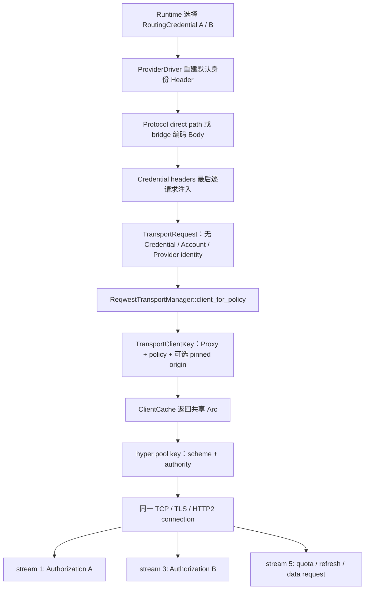

# 上游可观测特征 / Reverse Proxy Fingerprint 审计

- 审计对象：`xinvexo/any2api`
- 审计基线：`9073fc3 feat: improve endpoint lifecycle and protocol bridges`
- 审计日期：2026-08-10
- 审计范围：应用层、协议桥、Header、JSON、流式、重试、OAuth 控制面、Transport、TLS、HTTP/1.1、HTTP/2、DNS 与代理连接器
- 明确排除：出口 IP、ASN、地理位置、IP reputation、数据中心/住宅网络属性和代理 IP 本身
- 原始审计变更边界：只增加审计报告、最小化诊断测试和一条兼容性回归断言；未修改生产行为

本文讨论的是 correctness、account isolation、protocol fidelity、transport consistency、observability 和 architecture hygiene。本文不推断任何上游一定采用某种风控算法，也不提供绕过平台反滥用或检测的做法。

> 修复进度（2026-08-10）：本文记录的是上述基线的审计事实。后续 ADR-0123 已落实 Credential/认证代际/traffic class 的 TransportClient 与 TLS resumption 隔离，F-001、F-002 和 F-003 的跨账号共池部分已经修复；新的 loopback 测试同时证明“不同隔离域物理分离”和“同一隔离域继续复用”，详见 `crates/transport/src/client/fingerprint_tests.rs`。同一测试组又证明旧代际立即退出缓存、无后续请求的闲置 Credential Client 受 LRU 硬上限约束、物理 keep-alive 按 idle timeout 关闭，E-08 已按 ADR 声明的非强杀语义闭环。ADR-0128 又让同路径、Credential reselect 与 OAuth 修复后的数据面重试共同遵守指数 fallback/Retry-After，并把默认基础退避从 0 改为 1 秒，F-011 已完整修复；真实 Runtime 的 `429 + Retry-After` 实验同时捕获换号 Authorization、不同 TCP peer 和到达时间，E-09 已完成。ADR-0124 增加了独立 Kimi 服务身份、Moonshot 契约与前向 Schema，F-005 已修复；Responses 接入继续复用显式的通用 Responses → Chat Completions Bridge。ADR-0125 已把 Codex、Claude 和 Grok 的 installation/session/conversation/agent/request/trace 值声明为 Credential-owned，换号 Attempt 会删除它们，F-004 已修复。ADR-0126 进一步集中 data/quota/token 身份，消除了 Claude 内部版本漂移与 Grok 固定伪报 macOS/ARM 的问题，F-006 已修复；同一 ADR 将线路行为冻结为版本化 generic profile，F-007 的配置漂移得到控制，但该通用 Rust wire profile 仍是明确接受且可被上游观察的特征。ADR-0127 将 profile 升级为 `generic-rustls-hyper-v2`，固定协商并统一增量解码 `gzip, br, zstd`，普通/pinned、成功/错误响应不再出现 Header/Body 脱节，F-014 已修复。ADR-0129 又把 Direct/Translated fidelity、Bridge 字段/工具/限制变为可查询的单一 contract，F-008 已从隐式高风险行为收敛为显式受控边界；真实 Registry Header golden、Codex OAuth wire golden 与 Direct materialization golden 分别控制 F-009、F-010、F-015 的实现漂移。ADR-0130 进一步用真实 loopback raw capture 固定 HTTP/1、HTTP/2 与 TLS 稳定线路契约，并把最终 resolver/proxy/timeout/isolation 策略和四个流式时间点写入 RequestAttempt，F-012、F-013、F-016 已转为可回归、可观测的受控边界。官方客户端基线、E-07 全 surface raw matrix 与 H2 扩展场景仍待完成。

## 1. Executive Summary

### 1.1 基线总体评级

| 维度 | 评级 | 结论 |
|---|---:|---|
| 应用层特征 | **HIGH** | Provider 身份由固定 Header 重建；Kimi 没有一等 Provider 身份，只能继承 Codex/Grok 画像；多个客户端/设备/会话标识可以跨 Credential 继续透传。 |
| 协议层特征 | **HIGH** | Responses → Chat Completions 是确定性的语义转换、字段白名单和重新序列化；响应 ID、事件序列和 SSE wire 都由本地合成。直接同方言路径明显更好，通常能保留原始 JSON bytes。 |
| Transport 层特征 | **HIGH** | 所有 Provider 使用同一 reqwest/hyper/rustls 配置；连接池身份不包含 Credential/Account；TLS resumption store 还会跨不同缓存 Client 共享。 |
| 多账号关联风险 | **HIGH** | 已用本地 TLS+HTTP/2 服务端证明：两个不同 Authorization 会出现在同一条 TCP/TLS/H2 连接的不同 stream；还证明不同缓存 Client 之间会恢复同一个 TLS session。 |
| 跨层一致性 | **HIGH** | 上层声称 Codex CLI、Claude Code 或 Grok Shell，底层却统一呈现同一 Rust TLS/H2/TCP 行为；Grok Header 还固定声称 `macos; aarch64`。其现实识别价值需与官方客户端抓包对比，但技术可观测性已经成立。 |

这里的 HIGH 表示架构影响和隔离风险高，不表示“上游一定据此执行识别或处置”。

### 1.2 基线最重要的直接答案

**Account A 与 Account B 会在以下条件同时成立时共享同一个物理上游连接：**

1. 两个请求进入同一个进程内的 `ReqwestTransportManager`；
2. 它们解析到相同的 `TransportClientKey`：
   - 相同 `proxy_id`
   - 相同 `proxy_config_version`
   - 相同 `proxy_kind`
   - 相同 connect/TLS/HTTP/pool policy
   - 相同 strict-direct-DNS 选择
   - 严格代理模式下相同 `pinned_origin`
3. HTTP client 的内部 pool key 相同，即相同 scheme + authority（host + port）；路径、模型、Provider、Credential 和 Authorization 均不参与这个 key；
4. 旧连接仍健康、未被服务端关闭、未超过本地 idle timeout；
5. 如果协商为 HTTP/2，两个请求可同时或顺序成为同一连接上的不同 stream；如果协商为 HTTP/1.1，只能顺序复用同一 keep-alive 连接，并发时通常需要额外连接。

`CredentialId`、`OAuthAccountId`、API Key 指纹、Token version、Provider kind、认证上下文和 data/control-plane 用途均不在 `TransportClientKey` 或 `TransportRequest` 中。

审计提交 `2813f4f` 中的测试 `client::fingerprint_tests::distinct_authorization_contexts_share_one_http2_connection` 曾实际观测到：

- `Bearer credential-a` 与 `Bearer credential-b` 被同一个本地 H2 服务端接收；
- 两次请求取得的是同一 `Arc<TransportClient>`；
- 服务端 TCP accept 次数为 `1`；
- 因而不是“可能共用缓存对象”，而是**确实复用同一条物理 TCP/TLS/H2 连接**。

还有一个比连接池更宽的边界：`ClientConfig` 的 clone 会共享 rustls `Resumption` 内部的 `Arc<ClientSessionStore>`。审计提交中的测试 `tls_resumption_state_is_shared_across_distinct_cached_clients` 使用两个不同代理配置代际强制得到两个不同 `Arc<TransportClient>` 和两条 TCP 连接，第二条 TLS 握手仍被服务端观测为 `HandshakeKind::Resumed`。所以仅给 `TransportClientKey` 增加 Credential ID 仍不足以完成账号隔离。ADR-0123 实现后，这两条测试已经替换为隔离期望。

### 1.3 真实调用链



### 1.4 静态事实与实验事实

| 结论 | 证据级别 |
|---|---|
| Cache key 不含 Credential/Account/Provider | 静态确认 |
| 同 key 返回同一个缓存 `Arc` | 静态确认 + 单元测试 |
| 相同 origin 的 pool 可复用连接 | 依赖实现静态确认 |
| 两个 Authorization 真实共享一条 H2 连接 | **本地实验确认** |
| 不同 Client 共享 TLS resumption store | rustls 类型语义静态确认 + **本地实验确认** |
| any2api ClientHello cipher/extension 集合/group/ALPN 与 Rustls 随机扩展顺序策略 | **本地 raw capture 确认并冻结稳定字段** |
| any2api 首连 H2 preface/SETTINGS/WINDOW_UPDATE/首个 HEADERS | **本地解密后 raw frame capture 确认** |
| any2api HTTP/1.1 request line/Header casing/order/Host/Length | **本地 raw TCP capture 确认** |
| 精确 JA3/JA4、H2 HPACK 动态行为与官方客户端差异 | 必须建立官方客户端抓包基线后确认 |
| 与每个官方客户端的实际差异 | 必须建立同版本官方客户端基线后确认 |
| 上游是否把这些信号用于识别 | 本仓库无法确认，也不作推断 |

## 2. 端到端可见性边界

审计中必须区分信号由谁看到：

| 行为 | 上游可见 | 下游可见 | 说明 |
|---|---:|---:|---|
| TLS ClientHello、ALPN、H2 SETTINGS、连接复用 | 是 | 否 | 上游直接终止 TLS 时可观察。 |
| Authorization 在同一 H2 connection 上切换 | 是 | 否 | 本地实验已证明技术事实。 |
| Provider 默认 Header 与重建后的 JSON Body | 是 | 否 | 最直接的上游应用层信号。 |
| Runtime 的重试、换 Credential 与请求时序 | 是 | 间接 | 上游看到多个请求；下游通常只看到最终结果。 |
| 合成的 Responses `resp_...` / item ID | 通常否 | 是 | Bridge 不把本地 response ID 当作 Chat 上游字段发送。 |
| 合成的 Responses SSE 事件 wire/chunk | 否 | 是 | 上游只发送 Chat SSE；转换发生在返回方向。 |
| `x-any2api-request-id` | 否 | 是 | 由 server response middleware 在下游响应上加入。 |
| 本地错误 code/message | 否 | 是 | 除非错误触发另一次上游 attempt；错误正文自身不上行。 |

## 3. Confirmed Findings

### F-001 — 多账号真实共享 TCP/TLS/HTTP2 连接

| 属性 | 值 |
|---|---|
| Severity | **HIGH** |
| Confidence | **HIGH — 静态链路 + 本地物理连接实验** |
| Layer | Transport / Account isolation |
| Visibility | Upstream |

**Affected code**

- `crates/transport/src/api.rs` — `TransportRequest`, `TransportManager::execute`
- `crates/transport/src/client/reqwest.rs` — `TransportClientKey`, `TransportClientPolicyKey`, `ReqwestTransportManager::client_for_policy`, `ReqwestTransportManager::execute`
- `crates/transport/src/client/cache.rs` — `ClientCache::get`, `ClientCache::insert_if_absent`
- `crates/transport/src/client/construction.rs` — `build_transport_client`, `build_reqwest_client`
- `crates/transport/src/client/pinned.rs` — `PinnedClient::build`
- `docs/adr/0004-transport-client-pooling.md`
- `ARCHITECTURE.md` §10.5

**Observed behavior**

`TransportClientKey` 只包含 Proxy、网络选择和 transport policy。普通 reqwest Client 内部再按 scheme + authority 建池。Provider auth 只在 `execute` 时逐请求放入 Header，因此同一 H2 connection 可以承载多个账号的不同 Authorization、`chatgpt-account-id` 或 `x-userid`。

这不是无意遗漏：ADR-0004 和 `ARCHITECTURE.md` 明确写着“相同 TransportKey 的 Credential 共享连接池”。当前实现与既有架构一致，但该既有决策与新的强账号隔离目标冲突。

Credential rotate 不会改变 key；disable/delete 也没有 transport cache invalidation。缓存是最大 64 项的强引用 tick-LRU，连接 idle timeout 默认为 50 秒；如果同一个 Client 仍被其他 Credential 使用，Client、TLS state 和活跃 H2 connection 可以继续存活。旧认证值不会被 Client 保存或自动重放，但旧连接上下文会继续承载新认证请求。

**Expected/native behavior**

不存在一个适用于所有原生客户端的统一答案；但如果产品语义要求 ProviderCredential/OAuthAccount 彼此隔离，则物理连接、H2 namespace 和连接级状态也应属于同一个明确的 Credential isolation domain，而不应由偶然相同的 Proxy/Origin 决定。

**Why it matters**

- 同一 H2 connection 上的 Authorization/account header 变化是直接、稳定的连接内关联；
- H2 flow control、GOAWAY、PING、连接错误和 server connection state 被多个账号共同承担；
- 一个连接故障可同时影响多个账号的并发 stream；
- Credential 生命周期与连接生命周期不一致；
- Provider kind 也不在 key 中，所以两个被配置到同一自定义 authority 的不同 Provider driver 也可共享连接。

**How to reproduce locally**

```text
cargo test -p any2api-transport \
  distinct_credentials_use_distinct_http2_connections -- --nocapture
```

测试位置：`crates/transport/src/client/fingerprint_tests.rs`。当前修复后的期望为 Client 不同且 TCP accept 数为 2；原始漏洞证据保存在审计提交 `2813f4f`。

**Architecture recommendation**

先更新 `ARCHITECTURE.md` 和 ADR-0004，定义 opaque 的 `TransportIsolationKey`。默认至少按 `RoutingCredentialId + authentication/token generation` 隔离 data-plane pool；不要让 transport crate 依赖 Codex/Claude/Grok 分支。Cache key、client eviction 和连接生命周期必须共同采用该隔离域。

### F-002 — TLS session resumption 跨不同缓存 Client 共享

| 属性 | 值 |
|---|---|
| Severity | **HIGH** |
| Confidence | **HIGH — rustls clone 语义 + 本地 resumed-handshake 实验** |
| Layer | TLS / Account isolation |
| Visibility | Upstream |

**Affected code**

- `crates/transport/src/client/reqwest.rs` — `ReqwestTransportManager::tls_config`, `ReqwestTransportManager::client_for_policy`
- `crates/transport/src/client/construction.rs` — `build_reqwest_client`
- `crates/transport/src/client/pinned.rs` — `PinnedClient::build`
- `crates/transport/src/connection/tls.rs` — `build_tls_config`
- rustls 0.23.42 — `ClientConfig`, `Resumption`

**Observed behavior**

Manager 的 `OnceLock<ClientConfig>` 只构造一次。每个 reqwest/pinned Client 调用 `tls_config.clone()`。rustls 的 `Resumption` clone 共享内部 `Arc<dyn ClientSessionStore>`；默认 store 支持最多 256 个 server name、每个 server name 最多 8 个 TLS 1.3 ticket。

本地测试强制两个请求使用不同 proxy config version，使 `Arc<TransportClient>` 不相等且服务端 accept 两条 TCP 连接。第一条是 full handshake，第二条仍为 `HandshakeKind::Resumed`。

**Expected/native behavior**

如果连接池按账号隔离，TLS ticket/resumption cache 也必须采用相同或更严格的隔离域。只隔离 `Client` 而共享 session store，会留下更隐蔽的跨账号连接关联。

**Why it matters**

- 上游 TLS endpoint 可以知道第二条连接恢复了第一条会话；
- 分离 proxy config version 或重建 Client 不等于分离 TLS 身份状态；
- 代码结构允许同一 Manager 下、相同 SNI/验证策略的不同 proxy/client key 共享 ticket；
- Credential rotate/delete 后 resumption 状态仍由 Manager 持有到进程退出或 store 淘汰。

**How to reproduce locally**

```text
cargo test -p any2api-transport \
  distinct_traffic_classes_do_not_share_tls_resumption_state -- --nocapture
```

当前修复后的期望为两次 TLS 握手均为 `Full`；原始 `Full -> Resumed` 证据保存在审计提交 `2813f4f`。

**Architecture recommendation**

不要只修改 `TransportClientKey`。从只读共享的 trust roots/crypto policy 构造每个 isolation domain 独立的 `ClientConfig::resumption`，或在明确评估性能后禁用跨连接 resumption。Root store 可以共享，session ticket store 不应跨 isolation key 共享。

### F-003 — OAuth token、quota 与 data plane 复用同一个全局 Transport 身份

| 属性 | 值 |
|---|---|
| Severity | **HIGH** |
| Confidence | **HIGH** |
| Layer | Runtime / OAuth / Transport |
| Visibility | Upstream |

**Affected code**

- `app/any2api/src/bootstrap/public_request_components.rs` — `build_public_request_components_with_telemetry`
- `crates/runtime/src/oauth/login/token_request.rs` — `execute_response`
- `crates/runtime/src/oauth/refresh/account.rs` — `OAuthRefresher::attempt_refresh`
- `crates/runtime/src/oauth/refresh/worker.rs` — `OAuthRefresher::scan_due_accounts`
- `crates/runtime/src/oauth/quota/request.rs` — `start`, `execute`
- `crates/runtime/src/oauth/quota/activity.rs` — `OAuthQuotaActivity`, `run`
- `crates/runtime/src/public_request/upstream/prepared/attempt.rs` — `PreparedAttempt::send`

**Observed behavior**

Composition root 只创建一个 `Arc<dyn TransportManager>`，公开 data plane、OAuth login/refresh、quota、credential test 和 proxy test 都使用它。`TransportRequest` 没有 traffic class 或 account identity。

同 origin 时，控制面和数据面可进入同一个 pool：

| Provider | Token origin | Data origin | Quota origin | 可能同一物理 pool |
|---|---|---|---|---|
| Codex | `auth.openai.com` | `chatgpt.com` | `chatgpt.com` | data + quota |
| Claude | `api.anthropic.com` | `api.anthropic.com` | `api.anthropic.com` | **token + data + quota** |
| Grok | `auth.x.ai` | `cli-chat-proxy.grok.com` | `cli-chat-proxy.grok.com` | data + quota |

定时 OAuth refresh 默认每 30 秒扫描、提前 300 秒，最多并发 6 个账号；activity quota 在请求结束 5 秒后触发、每账号最短 30 秒，最多并发 6 个。多个账号同时到期或同时结束会形成批次，并在共享 H2 上并发。

**Expected/native behavior**

Token endpoint、quota endpoint 和 inference data plane 应有显式的 traffic-purpose identity；是否共享可以是经过文档化的 Provider 决策，但不能因 URI authority 恰好相同而隐式发生。

**Why it matters**

以 Claude 为例，同一 H2 connection 可能先后出现无 Claude Code UA 的 OAuth token request、`claude-code/...` data request 和旧版本 UA 的 quota request，并且 Authorization 属于不同账号。这是应用身份、控制面用途和账号身份的组合关联。

**How to reproduce locally**

将 Claude OAuth 的 token/data/quota plan URI 指向同一支持 H2 的本地 TLS probe；同时启动两个账号的 refresh 和一条 data request，按 connection id、stream id、path、Authorization/UA 记录观察值。当前 Transport 层两个新增实验已经证明底层共享前提。

**Architecture recommendation**

在 transport API 中加入与 Provider 业务解耦的 `TrafficClass::{DataPlane, OAuthToken, OAuthQuota, Diagnostic}` 和 `TransportIsolationKey`。默认按 `account + traffic class + auth generation` 隔离；如某 Provider 确实允许合并，应通过显式 profile 声明并由契约测试证明，而不是依赖相同 origin。

### F-004 — 多种客户端/设备/会话标识没有 Credential ownership，可随换号继续上行

| 属性 | 值 |
|---|---|
| Severity | **HIGH** |
| Confidence | **HIGH** |
| Layer | Header policy / Retry / Account correlation |
| Visibility | Upstream |

**Affected code**

- `crates/provider/src/codex/headers.rs` — `REQUEST_HEADERS`, `request`
- `crates/provider/src/claude/headers.rs` — `REQUEST_HEADERS`, `request`
- `crates/provider/src/grok/headers.rs` — `REQUEST_HEADERS`, `request`
- `crates/runtime/src/public_request/retry/attempt.rs` — `RetryExecution::select_attempt`
- `crates/runtime/src/public_request/upstream/prepared/attempt.rs` — `prepare_input`

**Observed behavior**

同方言请求允许透传以下稳定身份类 Header：

- Codex：`session-id`、`thread-id`、`x-codex-installation-id`、window/turn/parent-thread metadata、`x-client-request-id`、`traceparent`；
- Claude：`x-claude-code-session-id`、remote container/session id、agent/parent-agent id、`x-client-request-id`、`traceparent`；
- Grok：conversation/request/session/agent/turn id、`x-client-request-id`、`traceparent`。

Runtime 只对第一个 Credential 拥有者保护 `x-oai-attestation`，并且只在既有绑定仍使用同一 Credential 时允许 `x-codex-turn-state`。其他 installation/session/trace ID 并没有 Credential ownership。安全的预提交 failover 选择 Credential B 时，它们仍可从同一 decoded client request 透传给 B。

**Expected/native behavior**

每个 Header 应按语义分类为 request-scoped、session-scoped、device-scoped、credential-scoped 或 forbidden。任何能够稳定标识设备/会话/账号的值都应与 affinity/credential owner 一致；无法保持 owner 时应 fail closed 或按公开契约省略，而不是无条件跨 owner 重放。

**Why it matters**

即使连接池以后隔离，相同 installation/session/trace ID 与不同 Authorization 的组合仍能直接关联账号。该问题来自 fidelity 与 isolation 的所有权模型，不是单纯的 Header 数量问题。

**How to reproduce locally**

构造带 `x-codex-installation-id: install-1` 的同方言请求，让第一次 attempt 收到可安全重选的本地 429，再由第二个 Credential 成功；在两个 mock endpoint 记录 Header。预期两个 Authorization 不同，但 installation ID 相同。

**Architecture recommendation**

把 Header allowlist 升级为带 ownership 的声明表，例如 `Request`, `Session(binding)`, `Credential`, `Device`, `NeverReplayAfterSwitch`。该分类放在 Provider driver 内，Runtime 只传递当前 owner/binding 事实，避免中央 Provider `match`。

> 修复状态（2026-08-10）：**Fixed after baseline**。ADR-0125 引入 Provider-local `Replayable` / `CredentialOwned` / `BoundTurnState` 声明，复用 Runtime 已有的首 Credential owner 锁定。真实 401 双 Key failover 契约已证明第一 Attempt 保留 installation/request/trace 值，第二 Attempt 删除，同时可重放协议字段仍然保留。

### F-005 — Kimi 不是一等 Provider，必须借用错误的 Provider 身份与能力

| 属性 | 值 |
|---|---|
| Severity | **HIGH** |
| Confidence | **HIGH** |
| Layer | Domain / Provider model / Protocol fidelity |
| Visibility | Upstream |

**Affected code**

- `crates/domain/src/kind.rs` — `ProviderKind::{Codex, Claude, Grok}`
- `app/any2api/src/bootstrap/public_request_components.rs` — Provider registry construction
- `crates/provider/src/codex/driver.rs` — `CodexDriver`
- `crates/provider/src/grok/driver.rs` — `GrokDriver`
- `crates/provider/src/claude/driver.rs` — `ClaudeDriver`
- `crates/storage/src/provider/endpoint/rows.rs` — Provider persistence mapping

**Observed behavior**

仓库中没有 `ProviderKind::Kimi`，也没有 generic OpenAI-compatible service identity。Kimi Chat endpoint 只能被管理员声明为 Codex 或 Grok Endpoint。于是它会继承所借 Provider 的：

- 固定 UA/identity headers；
- endpoint path/capability set；
- auth scheme；
- error classifier；
- response Header policy；
- OAuth 能力声明；
- request body encoding policy。

直接 Chat → Chat 能成功只证明 wire dialect 兼容，不证明 Provider identity 和行为契约正确。Responses → Chat bridge 修复了 Kimi 3 的 representability 与多轮工具调用，但没有解决这一 Provider 建模问题。

**Expected/native behavior**

“上游服务是谁”和“它接受哪种 wire dialect”是两个维度。Kimi 如果进入支持范围，应有独立 Kimi driver，或有明确命名且能力受限的 generic OpenAI-compatible driver；不能伪装成 Codex/Grok。

**Why it matters**

- Kimi 上游会看到无关的 Codex/Grok Header；
- 错误和能力可能被错误分类；
- 后续针对 Kimi 的特殊分支容易污染中央 Runtime；
- 只增加 `if model starts_with("kimi")` 会扩大架构债务。

**How to reproduce locally**

把同一个本地 Chat echo server 分别配置为 Codex 与 Grok Endpoint，发送相同 Kimi 模型请求；比较 echo 到的 UA、originator/x-grok headers。Body 方言相同，但 Provider 画像不同且都不是 Kimi。

**Architecture recommendation**

如果确认支持 Kimi，先更新 `ARCHITECTURE.md` 的首版 Provider 边界并新增 ADR，再增加局部 Provider 模块和注册。更一般地，把 `UpstreamServiceKind`、`ProtocolDialect`、`ProviderIdentityProfile` 和 `TransportProfile` 分开建模；这项整改适用于全部 Provider，不是 Kimi 专用补丁。

### F-006 — 固定 Provider 身份和版本在不同操作面不一致

| 属性 | 值 |
|---|---|
| Severity | **MEDIUM** |
| Confidence | **HIGH（行为）/ MEDIUM（与官方当前版本的差异）** |
| Layer | Provider application identity |
| Visibility | Upstream |

**Affected code**

- `crates/provider/src/codex/headers.rs` — `request`
- `crates/provider/src/codex/quota/protocol.rs` — `quota_headers`
- `crates/provider/src/claude/headers.rs` — `request`
- `crates/provider/src/claude/quota/protocol.rs` — `USER_AGENT`, `query_plan`
- `crates/provider/src/grok/headers.rs` — `request`
- `crates/provider/src/grok/quota/protocol.rs` — `request_headers`
- `crates/provider/src/oauth/mod.rs` — `form_headers`, `json_headers`

> 修复状态（2026-08-10）：**Fixed after baseline**。ADR-0126 增加 Provider-local identity profile：Claude data/quota 共用 `claude-code/2.1.220`，Grok data/quota 共用实际构建目标的 OS/arch，Codex data 与 `wham` quota 的 persona 差异成为同一模块内的显式子 profile。OAuth token surface 在没有 Provider 必需证据时继续不借用 data-plane UA；这属于明确契约，不再是散落默认值。

**Observed behavior**

| Surface | 固定身份 |
|---|---|
| Codex data | `originator: codex_cli_rs`, `user-agent: codex_cli_rs/0.145.0` |
| Codex quota | `originator: Codex Desktop`、`openai-beta: codex-1`、`oai-language: zh-CN`、Sec-Fetch/Priority；没有相同 data UA |
| Claude data | `user-agent: claude-code/2.1.220`, `x-app: cli`, `anthropic-version: 2023-06-01` |
| Claude quota | `user-agent: claude-code/2.1.7` |
| Grok data/quota | `grok-shell/0.2.112 (macos; aarch64)`、client version `0.2.112`；OAuth 还固定 interactive/auth headers |
| OAuth token | 主要只有 Content-Type/Accept，不设置相应 Provider data-plane UA |

同方言请求可通过 allowlist 覆盖部分默认 Header；跨方言 bridge 不转发源协议身份，因此固定默认值更稳定。

外部“最新官方版本”不是本仓库可静态证明的事实，本报告不宣称这些数字一定过时。但 Claude data/quota 在本仓库内已经自相矛盾，Grok 的 OS/arch 声明也与任意实际部署平台无关。

**Expected/native behavior**

身份版本应来自单一 Provider identity registry，并按 data/quota/token operation 明确派生；要么准确代表实现，要么明确代表 any2api gateway，不应散落硬编码并互相矛盾。

**Why it matters**

固定、长寿命且跨账号相同的字符串很容易聚合；与 TLS/H2 profile、真实 OS 或同一产品其他 surface 不一致时，组合信号比单个 UA 更强。

**How to reproduce locally**

使用本地 echo server 分别执行 data、quota 和 token plan，按 Provider 对比 Header。无需连接真实上游。

**Architecture recommendation**

建立每 Provider 的版本化 `IdentityProfile`，集中定义 data/quota/token Header，并以官方客户端 contract capture 或公开 API contract 为升级依据。不要通过随机 UA 或伪造平台解决；目标是内部一致、版本可审计和语义正确。

### F-007 — 所有 Provider 被同一 Rust TLS/H2/TCP profile 同质化

| 属性 | 值 |
|---|---|
| Severity | **MEDIUM** |
| Confidence | **HIGH（技术可观测）/ MEDIUM（现实识别价值）** |
| Layer | TLS / HTTP2 / TCP / Cross-layer consistency |
| Visibility | Upstream |

**Affected code**

- root `Cargo.toml`, `Cargo.lock`
- `crates/transport/src/connection/tls.rs` — `build_tls_config`, `wrap_tls`
- `crates/transport/src/client/construction.rs` — `build_reqwest_client`
- `crates/transport/src/client/pinned.rs` — `PinnedClient::build`
- `crates/transport/src/proxy/tcp.rs` — `ProxyTcpConnector::call`

> 修复状态（2026-08-10）：**Controlled / accepted after baseline**。ADR-0126 将 ALPN、HTTP 能力、TCP/H2 keepalive、redirect、request retry 与内部 policy version 集中为 `generic-rustls-hyper-v1`，ADR-0127 因新增 response coding contract 将其提升为 `generic-rustls-hyper-v2`；profile version 已进入 `TransportClientKey`，snapshot 与现有 loopback 测试共同约束升级。所有 Provider 继续共享该 profile，因此其可观测性没有被虚假宣称为“消失”；在没有真实 Provider wire contract 前，这是有意接受的通用 gateway 特征。

**Observed behavior**

锁定依赖为 reqwest 0.12.28、hyper 1.10.1、hyper-util 0.1.20、h2 0.4.15、rustls 0.23.42。所有 Provider 共享：

- rustls ring provider、宿主 native roots、无 client certificate；
- TLS 1.3 + TLS 1.2 默认协议；
- ALPN 顺序 `h2`, `http/1.1`；
- 默认 ring cipher/group 顺序；
- TCP keepalive 30 秒，pinned connector 还显式 `TCP_NODELAY=true`；
- pool idle timeout 50 秒，每 host 最多 8 个 idle connection；
- H2 keepalive interval 30 秒、timeout 10 秒、while-idle 为默认 false；
- redirect disabled，reqwest retry policy disabled。

rustls key logging 保持默认关闭，SNI 来自请求 origin；证书验证使用宿主根，不存在 insecure verifier。

**Expected/native behavior**

不能在没有官方抓包基线时断言某个 Provider 的原生客户端一定不同。可以确认的是：当前 Codex、Claude、Grok、借壳 Kimi 以及 OAuth 控制面都呈现同一 transport implementation profile，Provider 差异只在 Header/Body。

**Why it matters**

应用层宣称多个不同客户端，transport 层却完全同质；这是一种稳定的跨层组合。单个 TLS 参数通常不是强证据，但与固定 UA、账号切换和桥接 payload 同时出现时价值上升。

**How to reproduce locally**

用本地 ClientHello/H2 recorder 分别触发四类 Provider 请求，比较 TLS、ALPN、SETTINGS、PING 周期和 TCP socket 行为。当前代码无需 Provider 分支即可预期完全相同。

**Architecture recommendation**

先把 transport profile 明文化并做版本化回归，不建议为了“看起来不同”而随机化。若某 Provider 有真实、公开且必要的 transport contract，再通过 `ProviderTransportProfile` 显式选择；否则诚实地维护一个稳定 generic gateway profile。

### F-008 — Responses → Chat bridge 形成确定性的 request reconstruction 和语义降级

| 属性 | 值 |
|---|---|
| Severity | **HIGH** |
| Confidence | **HIGH** |
| Layer | Protocol bridge / JSON / Streaming |
| Visibility | Request side upstream；response side downstream |

**Affected code**

- `crates/protocol/src/openai_responses_chat/bridge.rs` — `start_session`, `ResponsesToChatSession`
- `crates/protocol/src/openai_responses_chat/request/mod.rs` — `convert`, `validate_top_level_fields`
- `crates/protocol/src/openai_responses_chat/request/options.rs`
- `crates/protocol/src/openai_responses_chat/request/tools.rs`
- `crates/protocol/src/openai_responses_chat/request/history.rs`
- `crates/protocol/src/openai_responses_chat/response.rs`
- `crates/protocol/src/openai_responses_chat/stream/translator/state.rs`
- `crates/protocol/src/openai_responses_chat/stream/wire.rs`

> 修复状态（2026-08-10）：**Controlled / explicit after baseline**。ADR-0129 为每个可配置协议对导出 `Direct` / `Translated` fidelity；Translated option 携带版本化 Bridge contract、operation、顶层字段处理方式、工具类型与 limitation。`supports_operation`、未知顶层字段和工具类型校验读取同一静态表，管理 API/Web 不再只显示方言名称。canonical reconstruction 与合成响应身份仍客观存在，因此不标记为“特征消失”。

**Observed behavior**

Bridge 会完整 materialize JSON，并执行严格 top-level whitelist：

- `max_output_tokens` → `max_tokens`；
- `reasoning.effort` → `reasoning_effort`；
- `text.format` → `response_format`；
- `text.verbosity` → `verbosity`；
- Responses tools/tool choice → Chat function schema；
- `stream:true` 时固定加入 `stream_options:{"include_usage":true}`；
- `client_metadata` 只校验，不发往 Chat upstream；
- 不可表达的字段/工具类型会返回具体 bridge error。

`serde_json::Map` 当前没有 `preserve_order` feature，桥接 JSON 因而使用排序 Map 并紧凑编码。上游看到的是 any2api 的稳定字段选择、消息分组和序列化结果，而不是原 Responses body。

返回方向会生成 `resp_<uuid-v4-simple>`，并派生 `msg_<response-id>`、`rs_<response-id>`、`fc_<response-id>_<index>`；stream 使用本地 `SystemTime`、从 0 开始的 sequence number，并固定编码为 `event: ...\ndata: <compact-json>\n\n`。这些返回特征主要由下游看到，不应误报成上游 TLS/request fingerprint。

**Expected/native behavior**

跨协议不可能 byte-transparent。正确目标应是：公开声明“translated semantics”、明确 capability intersection、对不可表达项给出精确错误，并用契约测试证明语义，而不是假装等价于原生 Responses upstream。

**Why it matters**

- Kimi Chat upstream 能直接看到规范化 Chat body；
- 字段缺失、排序、message history 和 `stream_options` 组合稳定；
- 下游能从合成 ID/event shape 判断响应来自桥；
- 新 Responses 字段默认被拒绝，版本漂移会快速暴露。

**How to reproduce locally**

运行 `any2api-protocol` 的 `openai_responses_chat` 测试，或把同一 Responses fixture 发送到本地 Chat echo server，多次输出应 byte-identical（UUID/本地时间只影响返回方向）。

**Architecture recommendation**

把 endpoint/route 的 fidelity 标成 `Direct` 或 `Translated`，并从 bridge 的 capability table 生成可查询的支持矩阵。继续保留精确 unsupported field/type 错误；不要用静默丢字段换取表面兼容。

### F-009 — Codex OAuth Responses 会进行广泛且稳定的 Provider body normalization

| 属性 | 值 |
|---|---|
| Severity | **MEDIUM** |
| Confidence | **HIGH（行为）/ MEDIUM（是否不同于官方 Codex）** |
| Layer | Provider request body |
| Visibility | Upstream |

**Affected code**

- `crates/provider/src/codex/request.rs` — `prepare`, `normalize_responses`, `rewrite_input`
- `crates/provider/src/codex/request/tests.rs`

> 修复状态（2026-08-10）：**Controlled / verified after baseline**。该 Profile 继续作为 Codex OAuth 必需的最小 Provider contract；新增精确 wire golden 同时锁定字段删除、默认注入、system → developer、未知字段原字节保留和稳定序列化结果。已经合规的 Body 仍复用原 allocation。它没有被虚报为官方客户端等价；相对官方当前版本的比较继续保留为 S-005。

**Observed behavior**

仅对 Codex OAuth + Responses：

- 强制 `store:false`；
- 强制 `include:["reasoning.encrypted_content"]`；
- 缺失/无效时加入 `parallel_tool_calls:true`；
- 删除 context management、两个 max-token 字段、temperature、top_p、truncation、user；
- 非 `priority` 的 `service_tier` 被删除；
- string input 被包装为 canonical message/content array；
- input item 的 `system` role 被改为 `developer`；
- 一旦需要重写，顶层和被改 item 通过 `BTreeMap` 按 key 排序并去除原字段间 whitespace。

已经满足完全规范形态时会返回原 `Bytes`，因此它不是无条件重编码。

**Expected/native behavior**

这些变换可能是 Codex OAuth backend 的必要 contract；本仓库无法仅凭静态代码判断它们是否与当前官方客户端完全一致。风险来自 contract 被硬编码而没有版本化 capture baseline。

**Why it matters**

该组合在每个 Codex OAuth 账号上相同，并与固定 UA/transport profile 叠加。错误的 normalization 还会成为 correctness 问题，而不仅是可观测差异。

**How to reproduce locally**

运行 `cargo test -p any2api-provider codex::request`，并将 fixture 输出送入本地 JSON echo recorder，验证字段删除、插入与顺序。

**Architecture recommendation**

将 Codex OAuth request contract 作为版本化 Provider contract fixture 维护；每次身份版本升级同时更新 body/header capture 和差异说明。未知字段保持当前的最小改写策略，避免扩大 materialization 范围。

### F-010 — Header policy 明确是重建代理，不是透明转发

| 属性 | 值 |
|---|---|
| Severity | **MEDIUM** |
| Confidence | **HIGH** |
| Layer | Header policy / HTTP |
| Visibility | Upstream |

**Affected code**

- `crates/provider/src/header_policy.rs` — `project`, `ordered_prefix_names`, `forbidden`
- `crates/runtime/src/public_request/upstream/prepared/build.rs` — `build_request`
- 三个 Provider 的 `headers.rs`
- `crates/server/src/public/auth.rs` — `strip_client_credentials`

> 修复状态（2026-08-10）：**Controlled / accepted after baseline**。认证替换、hop-by-hop 删除和有界 allowlist 仍是安全不变量。ADR-0125 已集中 ownership；新增 Registry contract test 枚举 Codex、Claude、Grok、Kimi 的全部实际 operation，并对 Credential owner、Credential switch、cross-dialect 以及 OAuth 子 profile 的最终 Provider Header set 做 golden。Kimi 明确为空 persona，跨协议只保留 Provider default。Header 重建仍可观察，但不再靠散落测试猜测其契约。

**Observed behavior**

Ingress 先剥离 Gateway auth 和客户端 account/auth Header。Provider allowlist 再投影少量 Header，统一禁止 auth、cookies、Host、hop-by-hop、Content-Length/digest/etag、`accept-encoding`、baggage、Provider account headers、全部 `x-forwarded-*`。Prefix Header 以 prefix priority + lexical name 排序。

Outbound 合并顺序固定为：Provider default identity → protocol Content-Type/Accept → 可选 zstd Content-Encoding → selected Credential auth 最后覆盖。跨方言时不投影 client feature Header。

投影还有稳定边界：最多 64 个值、单值 8 KiB、总计 32 KiB。

**Expected/native behavior**

对安全代理而言，认证替换和 hop-by-hop 剥离是正确的；问题不是“没有透明转发”，而是需要把重建契约明确化并按 Provider/operation 测试。透明代理不是本项目应追求的安全目标。

**Why it matters**

上游看到的 Header set、缺失项、覆盖优先级和可能的 wire order 都由 any2api 决定。跨协议路径尤其稳定，因为源客户端身份全部丢失，只剩固定默认值。

**How to reproduce locally**

向每个 Provider 的本地 echo endpoint 发送包含允许项、禁止项、多值和 connection-nominated Header 的请求，比较 ingress 与 outbound。已有 `provider::header_policy` 测试覆盖安全过滤和排序边界。

**Architecture recommendation**

保留安全 denylist；为每个 Provider/operation 建立 outbound Header golden contract，并把 ownership、same-dialect-only 和 credential-bound 属性纳入同一声明，避免三套散落的数组和条件逐渐失配。

### F-011 — 安全重试可立即换 Credential，并继续使用同一 H2 connection

| 属性 | 值 |
|---|---|
| Severity | **HIGH** |
| Confidence | **HIGH（代码路径）/ HIGH（底层复用前提已实验）** |
| Layer | Runtime retry / Transport correlation |
| Visibility | Upstream |

**Affected code**

- `crates/domain/src/settings/definitions/reliability.rs`
- `crates/runtime/src/public_request/retry/budget.rs` — `RetryBudget`
- `crates/runtime/src/public_request/retry/decision.rs` — `retry_decision`
- `crates/runtime/src/public_request/retry/failure.rs` — `apply_retry_decision`
- `crates/runtime/src/public_request/retry/attempt.rs`
- `crates/transport/src/client/construction.rs`

> 修复状态（2026-08-10）：**Fixed after baseline**。ADR-0123 已消除换 Credential 后的连接/TLS resumption 共用；ADR-0128 让 `RetrySamePath`、`Reselect` 和 `OAuthRefresh` 都携带同一 request-local delay。等待取失败 Credential 的 jittered exponential fallback 与明确 Retry-After 的较大值，hint 不会被 jitter 或换号缩短；OAuth 刷新耗时会抵扣等待。默认 `retry.base_delay` 为 1 秒，所需 delay 放不进剩余 budget 时直接保留当前真实失败并终止。

**Observed behavior**

默认最多 3 attempts、2 次 Credential switch、同 Credential 额外 retry 1 次、总预提交预算 600 秒。`retry.base_delay` 默认是 0，所以 bound same-path retry 的指数退避始终为 0；unbound `Reselect` 更是无条件使用 `Duration::ZERO`，与 base delay 设置无关。

当上游在仍可安全重试的 precommit 阶段返回 429、明确 overload 或其他已分类拒绝时，连接通常仍健康。Runtime 可立刻选择 Credential B；B 命中同一 Transport key/origin 后会继续使用同一 H2 connection，于是上游可看到紧邻的 stream 和 Authorization/account identity 切换。

`reqwest::retry(never())` 只关闭 reqwest tower retry policy。普通 reqwest 路径底层 hyper-util 仍可能对“复用连接上尚未开始就被取消”的请求做内部安全重试；strict pinned path 显式 `retry_canceled_requests(false)`。真正的语义重试仍由 Runtime 记录为 Attempt。

**Expected/native behavior**

重试应遵循 RetrySafety、Retry-After 和明确预算；Credential switch 的 transport isolation 应与账号切换一致。这里不建议加入人为随机噪声，而是修正隔离和语义退避。

**Why it matters**

共享连接把原本只是“同一网关的两次请求”提升为“同一 H2 connection 内紧邻换认证”。这也是 F-001 与 Runtime 行为叠加后最现实的关联序列。

**How to reproduce locally**

运行 `cargo test -p any2api-contract-tests --test public_sse buffered_retry_after_switches_credentials_and_physical_connections`。本地 keep-alive server 对 Credential A 返回 `429 + Retry-After: 1`、对 Credential B 返回 200，并记录 TCP peer、Authorization 与单调到达时间；修复后的期望是 peer/auth 均不同且第二次到达不早于一秒。

**Architecture recommendation**

P0 先隔离 connection/TLS state。随后让 unbound reselect 也尊重明确的 Retry-After/退避 policy，并在内部遥测记录 `previous credential -> next credential -> connection isolation id`，用于验证不存在跨 owner 复用；不要把随机延迟当成隔离修复。

### F-012 — H2/H1 wire profile 固定且跨 Provider 相同

| 属性 | 值 |
|---|---|
| Severity | **MEDIUM** |
| Confidence | **HIGH（库配置）/ MEDIUM（精确 wire 顺序）** |
| Layer | HTTP/2 / HTTP/1.1 |
| Visibility | Upstream |

**Affected code**

- `crates/transport/src/client/construction.rs`
- `crates/transport/src/client/pinned.rs`
- locked hyper/h2 implementation in `Cargo.lock`

> 修复状态（2026-08-10）：**Controlled / verified after baseline**。ADR-0130 新增由真实 `ReqwestTransportManager` 发起的 loopback capture：HTTP/1.1 精确冻结 request line、Header casing/order、Host 与 Content-Length；HTTP/2 在 TLS 解密后精确冻结 preface、首个 SETTINGS、WINDOW_UPDATE 与首个 HEADERS 元数据。fixture 变化必须与 wire profile 版本一起审核；它们描述 any2api，不冒充官方客户端。

**Observed behavior**

当前 hyper 1.10.1 client 默认并由 any2api 继承：

- initial connection window 5 MiB；
- initial stream window 2 MiB；
- max frame size 16 KiB；
- max header list size 16 KiB；
- initial max send streams 100；
- adaptive window false；
- ENABLE_PUSH false；
- 未显式设置 header table size 和 max concurrent streams；
- any2api 额外设置 active H2 keepalive interval 30 秒、timeout 10 秒，while-idle false。

HTTP/1.1 fallback 使用 hyper 默认的 lowercase header encoding，不保留客户端原始 casing，也不启用 title-case。`SignaledBody` 提供 exact size hint，所以正常 JSON request 可生成 Content-Length；Host 由 client/strict pinned path重建。当前 raw fixture 已确认真实顺序为显式请求 Header、Transport `accept-encoding`、reqwest `accept`、`host`、`content-length`；依赖升级可能改变该顺序，因此由测试而不是文字假设约束。

**Expected/native behavior**

不同官方客户端可能共享或不共享这些默认值，必须按相同版本、相同网络条件抓包比较。可以确认的是 any2api 自身的 profile 稳定且所有 Provider 相同。

**Why it matters**

H2 SETTINGS/window/PING 和 H1 casing/order 比 UA 更接近 implementation identity；不过它们的单独识别价值通常低于账号同连接切换和错误 Provider Header。

**How to reproduce locally**

运行 `cargo test -p any2api-transport wire_conformance`。实现位于 `crates/transport/src/client/wire_conformance/`，fixture 位于 `crates/transport/testdata/generic-rustls-hyper-v2/`；capture 不通过 `http::HeaderMap` 重建，因此保留真实 wire order/casing。

**Architecture recommendation**

已由 ADR-0130 落实：transport dependency upgrade 是可观测 contract 变更，必须对 H1/H2/TLS fixture 做差分审核并提升 profile policy version。默认值可以继续使用，但不能无记录漂移。

### F-013 — 流式响应被按 SSE frame 解析、重编码和预提交缓冲

| 属性 | 值 |
|---|---|
| Severity | **MEDIUM** |
| Confidence | **HIGH** |
| Layer | Streaming / Timing |
| Visibility | 主要 Downstream；backpressure/cancel timing 可间接 Upstream |

**Affected code**

- `crates/protocol/src/sse/decoder.rs`
- `crates/runtime/src/public_request/stream/frame_pipeline.rs` — `GuardedBody::process_chunk`, `push_event`, `commit_precommit_frames`
- `crates/runtime/src/public_request/stream/precommit_budget.rs`
- `crates/runtime/src/public_request/stream/body.rs` — `GuardedBody`
- `crates/domain/src/settings/definitions/stream.rs`
- Responses→Chat stream translator files

> 修复状态（2026-08-10）：**Controlled / observable after baseline**。ADR-0130 在每个流式 RequestAttempt 中以 Attempt 起点为单调时钟，first-write-wins 记录首个完整上游 frame、预提交 commit、首次非空下游 Body yield 与已交接流取消。记录值持久化并显示在已认证管理详情中，不参与 flush、重试、等待或 backpressure，因此没有用随机时序掩盖既有行为。

**Observed behavior**

Transport 任意 chunk 被增量 SSE decoder 重新分帧。直接同方言事件通常保留 frame bytes（只改已知 model），但原网络 chunk boundary 和 flush cadence 不保留；下游按完整 frame 输出。

返回响应头前会 prime stream。默认预提交预算 256 KiB/300 秒；retry-transparent lifecycle event 可被暂存，直到 content、非透明事件或 terminal event 才 commit，因此多个已缓存 frame 可能在下游形成 burst。提交后 idle timeout 默认 300 秒。Responses/Chat/Messages 要求协议定义的 terminal event，缺失 terminal 的 EOF 会被视为错误。

Responses→Chat path 进一步完全合成事件种类、sequence、ID、created_at 和 wire formatting。

**Expected/native behavior**

正确的代理必须安全处理任意 chunk split；不应为了模拟网络 chunk 而破坏语义。应清楚区分 frame fidelity、chunk fidelity 和 retry safety，并测试可接受的 flush latency。

**Why it matters**

下游可以稳定观察 frame-oriented chunking 与 synthetic event lifecycle。上游通常看不到下游 chunk，但在大 frame、慢消费者和取消时可间接看到读取节奏/连接取消。

**How to reproduce locally**

让 mock upstream 把同一 SSE frame 按每字节、CRLF 边界和多 frame 单 chunk 三种方式发送，并查看 RequestAttempt 的四个相对毫秒值。仓库既有 SSE 测试覆盖任意字节切分；Runtime 测试另证明 prime 后已有 frame/commit、Body 首次 poll 后才出现 downstream yield，正常路径不写 cancel。

**Architecture recommendation**

已保留语义分帧和 precommit safety，并增加 frame arrival、commit、first downstream Body yield、cancel 四个匿名内部时间点。后续延迟调整必须由明确 latency budget 驱动，继续禁止伪随机 flush。

### F-014 — Compression ownership 不完整，形成固定缺失项并有压缩响应正确性风险

| 属性 | 值 |
|---|---|
| Severity | **MEDIUM** |
| Confidence | **HIGH** |
| Layer | HTTP / Compression / Protocol decoding |
| Visibility | Upstream + correctness |

**Affected code**

- root `Cargo.toml` — reqwest features
- `crates/provider/src/header_policy.rs` — `forbidden("accept-encoding")`
- `crates/runtime/src/public_request/upstream/prepared/build.rs` — `encode_zstd`
- `crates/runtime/src/public_request/response.rs` — `sanitize_response_headers_inner`
- `crates/protocol/src/json_codec.rs` — request Content-Encoding parsing

> 修复状态（2026-08-10）：**Fixed after baseline**。ADR-0127 让 Transport 覆盖发送版本化 `Accept-Encoding: gzip, br, zstd`，并在普通 Reqwest 与 pinned Hyper 的共同边界对所有状态按逆序增量解码；解码后同步删除表示 Header，未知/损坏/过深编码链以 `ReadBody + Endpoint + Ambiguous` 失败。非成功响应保留状态与解码后的原始内容字节，不做 JSON 重序列化，因此 Provider 分类和下游客户端都不会再读到只删 Header 的压缩字节。

**Observed behavior**

reqwest 没有启用 gzip/brotli/deflate/zstd response-decompression feature，Header policy 又禁止客户端 `Accept-Encoding`，因此上游请求通常不声明 response compression。若下游请求 Body 是 zstd，server 先解压；仅在 Provider 支持、且 ingress/upstream 同方言时，Runtime 用 zstd level 3 重新压缩，原压缩 bytes 不透传。跨协议移除 Content-Encoding。

成功响应的 `content-encoding` 会在下游 Header sanitize 时删除，但 transport 没有解压 Body。如果上游在未请求的情况下仍返回压缩 JSON/SSE，协议 decoder 会读到压缩 bytes 并失败。错误响应则可能保留 encoding 和原 body。

**Expected/native behavior**

组件必须明确拥有 compression：要么只请求 identity 并拒绝/正确处理意外编码，要么声明支持并在协议解码前解压。Header 与 Body 不能脱节。

**Why it matters**

跨 Provider 一致缺少 `Accept-Encoding` 是可观察特征；更重要的是意外 compressed success 会成为 correctness failure。

**How to reproduce locally**

mock upstream 无视 Accept-Encoding，返回 `Content-Encoding:gzip` 的成功 JSON/SSE；当前路径应在 JSON/SSE decode 失败。另用 zstd ingress 比较 inbound 与 outbound compressed bytes，证明发生 level-3 重压缩。

**Architecture recommendation**

定义统一 response-decompression boundary，先解压再交给 protocol，并同步移除/重算 Content-Length/Encoding。每个 Provider profile 声明 request/response compression contract，禁止 Header 与实际 codec 各自决定。

### F-015 — 直接同方言通常保留原 JSON，但 Responses replay identity 会条件性改写

| 属性 | 值 |
|---|---|
| Severity | **LOW / MEDIUM** |
| Confidence | **HIGH** |
| Layer | JSON / Direct protocol fidelity |
| Visibility | Upstream |

**Affected code**

- `crates/protocol/src/raw_json.rs` — `RawJsonPayload::parse`, `encode`, `replace_raw_field`
- `crates/protocol/src/openai_responses/adapter.rs` — `decode_ingress_request`
- `crates/protocol/src/openai_responses/replay_identity.rs` — `normalize_raw`, `write_item_without_id`

> 修复状态（2026-08-10）：**Controlled / verified after baseline**。raw fast path 保持不变；新增精确 byte golden 覆盖完全复用、模型替换、非流 operation 删除 stream、重复顶层 key last-wins 以及非法 replay item ID 删除。合法 ID 继续证明复用同一 `Bytes` allocation；只有真实 materialization trigger 才进入 canonical form。

**Observed behavior**

“所有请求都会被 serde_json 重编码”是错误判断。直接同方言路径在 model 已匹配、无需去除 stream、无重复顶层 key 且 Responses input item ID 无需规范化时，复用原 `Bytes`，保留 whitespace、字段顺序和未知字段。

但 Responses ingress 总会检查已知 item type 的 `id` prefix。发现非法 prefix 时会删除该 `id`，重建 input array，并由 `BTreeMap` 重建该 item 和顶层 object。模型改写、非流 operation 去 stream 或重复顶层 key 也会触发顶层 lexical ordering；重复 key 采用 last-wins。

首版公开模型名固定等于上游模型名，所以普通 direct request 通常不会因 model alias 触发重写。

**Expected/native behavior**

Direct path 应只做为满足上游 contract 必需的最小改写，并为每个改写提供明确语义依据。Replay ID normalization 属于 correctness policy，但应可被契约测试和审计发现。

**Why it matters**

同一客户端的 payload 可能因某个 item ID 是否合规而从原样 bytes 突然切换为 canonical form，形成条件性而稳定的差异。现实识别价值低于 cross-protocol bridge。

**How to reproduce locally**

分别发送 `msg_valid` 和 `item_wrong` 的 Responses input item，比较本地 echo upstream 收到的 raw body；后者会去 ID 并重排相关 object。

**Architecture recommendation**

继续保留 raw fast path；为每一个 materialization trigger 建表和 golden raw-byte 测试。不要为了统一代码路径把 direct request 全量 materialize。

### F-016 — 固定 timeout、DNS cache 和 TCP policy 形成低到中等强度的统一行为

| 属性 | 值 |
|---|---|
| Severity | **LOW / MEDIUM** |
| Confidence | **HIGH** |
| Layer | DNS / TCP / Timeout / Proxy |
| Visibility | Upstream 或中间代理可见 |

**Affected code**

- `crates/transport/src/api.rs` — `TransportManagerConfig::default`
- `crates/domain/src/settings/definitions/upstream.rs`
- `crates/domain/src/settings/definitions/stream.rs`
- `crates/transport/src/resolution/dns.rs` — `DnsCache`
- `crates/transport/src/proxy/url.rs` — `proxy_url`
- `crates/transport/src/proxy/tcp.rs` — `ProxyTcpConnector::call`

> 修复状态（2026-08-10）：**Controlled / observable after baseline**。ADR-0130 为正式 Transport 增加 secret-free 只读诊断，并在网络 I/O 前把 wire/timeout profile version、最终 resolver mode、proxy kind、connect/read/pool idle timeout、routing/authentication generation 与 traffic class 保存到 RequestAttempt。它不会把 Client cache 命中推断为物理 connection reuse，也不会猜测 TLS resumption。

**Observed behavior**

- connect timeout 10 秒；普通 upstream read timeout 300 秒；stream pre/post-commit 默认均 300 秒；
- strict local DNS 使用进程级 30 秒 TTL、1024 项 cache，结果排序去重；
- 非 strict reqwest path 使用其 resolver；普通 SOCKS 使用 `socks5h` 远端 DNS；strict SOCKS/HTTP proxy path 使用本地解析与固定目标；
- pinned proxy TCP 启用 nodelay 与 30 秒 keepalive；reqwest path设置 30 秒 TCP keepalive；
- 自动 redirect 全部关闭。

**Expected/native behavior**

这些大多是合理的安全和可用性策略，不需要按账号随机变化。问题只是所有 Provider/operation 共用一套边界，且 DNS cache/TLS store 都是进程级。

**Why it matters**

长时间故障、空闲连接和 DNS rotation 场景可出现稳定 cutoff；单独识别价值通常较低。Redirect none 和 SOCKS fail-closed 更应视为安全正项。

**How to reproduce locally**

使用停滞 TLS/response/SSE mock、轮换 DNS fixture 和本地 SOCKS/HTTP proxy，记录连接终止时间与 resolver 请求次数；管理请求日志可直接核对每次 Attempt 的最终 resolver/proxy/timeout policy。Transport 单测覆盖 system、strict local cache 与 proxy-remote 三种 resolver 结果。

**Architecture recommendation**

已保留集中式 setting registry，并实现最终 resolver mode、proxy kind 和 timeout policy version 诊断。只有存在真实 Provider contract 时才增加 per-profile timeout；DNS cache 可以共享解析结果，但不应被误认为账号隔离边界。

## 4. Suspected Findings / 需要实验确认

### S-001 — 精确 TLS ClientHello/JA3/JA4 与原生客户端不一致

- Confidence：MEDIUM。
- 已确认：rustls 0.23.42 + ring、cipher/group/signature algorithm 列表、TLS 1.2/1.3、ALPN、extension 集合与 key-share group；raw capture 还确认 Rustls 以 `order_seed` 随机排列无顺序要求的 extension，而不是固定一种 extension order。跨隔离域 shared resumption 已由 ADR-0123 修复。
- 未确认：最终 JA3/JA4，以及各官方客户端同版本基线；因此标题中的“与原生客户端不一致”仍只能是 Suspected，不能由 any2api 自身 fixture 推导。
- 本地实验：仓库已保存去除 random/key material 后的稳定 ClientHello fixture，并重复真实握手验证顺序策略；下一步是在同机运行明确版本的官方客户端，逐字段比较，不只比较 hash。
- 注意：技术可观测不等于上游现实中使用该信号。

### S-002 — 精确 H2 SETTINGS 顺序、WINDOW_UPDATE 顺序、HPACK 与 pseudo-header order

- Confidence：MEDIUM。
- 已确认：TLS ALPN=h2 后的真实 client preface、首次 SETTINGS 顺序/值、connection WINDOW_UPDATE 与首个 HEADERS 的 flags/stream/length 已由解密后 raw frame fixture 固定。
- 未确认：HPACK/pseudo-header 动态表演进，以及复用、并发、GOAWAY、长期 PING 场景和官方客户端基线。
- 后续实验：扩展 recorder 覆盖复用连接、并发 streams、GOAWAY 与 keepalive 周期；不要用高层 h2 对象重建结果。

### S-003 — HTTP/1.1 精确 Header order 与自动 Header 插入位置

- Confidence：MEDIUM。
- 已确认：通用 fixture 请求的 request line、lowercase casing、最终 Header 顺序、Host 与 Content-Length 已由纯 TCP raw capture 固定。
- 未确认：Provider defaults、same-dialect override、cross-dialect bridge、OAuth 各 surface 的完整 raw order 与官方客户端基线。
- 后续实验：在现有纯 TCP recorder 上增加 Provider/operation echo matrix，不经 `HeaderMap` 重建。

### S-004 — 固定 UA/version 相对当前官方客户端已经漂移

- Confidence：LOW / MEDIUM。
- 本仓库能确认内部版本不一致，不能确认 2026-08-10 每个官方发行渠道的最新版本或实际 Header contract。
- 实验/维护：只用官方发布物与官方文档建立带日期、平台、版本、hash 的 capture；不要依赖搜索摘要或第三方博客。

### S-005 — Codex OAuth normalization 与当前官方 Codex wire contract 有差异

- Confidence：MEDIUM。
- 代码行为确定，但官方当前版本是否执行完全相同的字段删除、插入与排序需要同 fixture 抓包。
- 应比较语义和 raw bytes，尤其 string input、system→developer、include、service_tier 与 parallel tools。

### S-006 — 上游采用 connection-scoped rate limit、bot state 或账号关联

- Confidence：LOW。
- any2api 提供了同连接多认证的技术前提，但上游如何使用 connection metadata 不在仓库中。
- 不应为了证明该猜测访问真实账号做高风险实验；本项目只需按强隔离原则修正自己的边界。

### S-007 — 真实负载下 precommit buffering/backpressure 的 timing signature

- Confidence：MEDIUM。
- 四个内部时间点现已由每个流式 RequestAttempt 持久化；受控测试确认 frame、commit 与首次下游 Body yield 的相对阶段，取消也有独立 first-write-wins 标记。
- 真实负载下的 scheduler、socket buffer、下游消费速度和并发仍决定具体时间曲线，现有诊断不等同于 socket 实际写出时间。
- 后续实验应控制 upstream event cadence、frame size、下游 read speed 和并发数，按这四个时间点量化分布。

### S-008 — TLS resumption 跨不同 ProxyProfile 类型/出口实际成功

- Confidence：MEDIUM / HIGH。
- 代码中所有 Client clone 同一 resumption store；本次只实验证明不同 config version 的两个 Client 可恢复。
- 不同 HTTP/SOCKS/DIRECT 出口是否能成功恢复还取决于同一 SNI、服务端 ticket 和网络路径。修复设计不应依赖“现实中可能失败”。

### S-009 — TCP/OS 栈特征与 Grok `macos; aarch64` 声明冲突的现实价值

- Confidence：LOW / MEDIUM。
- pinned path 的 socket options 已确认，其他 TCP/IP 指纹受宿主 OS、代理终止位置和网络设备影响。
- IP/ASN/reputation 不在本报告范围；不要把不可靠的 OS 推断写成确认事实。

## 5. False Positives / Non-Issues

1. **Client cache 共享不等于 Authorization 泄漏。** Authorization 不在 Client default headers/cookie jar 中，而是每请求最后注入。已确认的问题是连接级关联，不是 A 的 token 被自动用于 B。
2. **不同 origin 即使返回同一 `Arc<Client>`，通常也不是同一物理连接。** hyper-util pool key 是 scheme + authority；路径不同会共享，authority 不同会分池。TLS resumption 对相同 SNI 是另一个更宽的状态边界。
3. **Cookie cross-account 污染不存在。** reqwest 没启用 cookies feature/store；Ingress Cookie 也被剥离，response Set-Cookie 被下游 sanitize。
4. **Gateway Key 不会上游。** server 在 Provider driver 前剥离 Authorization/x-api-key/cookie/account headers，再注入 selected credential。
5. **`x-any2api-request-id` 不是上游指纹。** 它在下游 response middleware 中加入；client `x-request-id` 还会在 ingress auth 后被剥离。
6. **没有显式 `Via`、`Forwarded` 或 `X-Any2API` 上游 Header。** `x-forwarded-*` 被统一禁止。
7. **并非所有 JSON 都被 canonicalize。** direct same-dialect raw fast path通常 byte-preserving；桥接、模型/stream/duplicate 处理或 replay ID normalization 才触发重建。
8. **合成 `resp_`/`msg_`/`rs_`/`fc_` ID 主要是下游桥接特征。** 它们不会作为 Chat request ID 发给上游，不能直接算作 upstream TLS/request fingerprint。
9. **本地 bridge/error code 主要是下游可见。** 改进后的 `unsupported field text.verbosity` 一类错误提高开发可观测性，不会把错误正文发送到上游。
10. **禁重定向是安全正项。** 它可能让 3xx 后没有 follow-up，但识别价值低，且符合自定义 URL 禁自动 redirect 的架构不变量。
11. **`x-oai-attestation` 与 `x-codex-turn-state` 已做重要保护。** 前者不会在 Credential switch 后重放；后者只在现有 binding 仍使用原 Credential 时转发。
12. **Kimi multi-turn `reasoning_content` 当前路径是正确的。** Buffered response 保留原 assistant message 到 continuation；下一轮与 tool output 一起重放。本轮新增直接断言并通过测试。Stream translator 也把 reasoning 汇总回 assistant `reasoning_content`。
13. **RPM、health、in-flight 和 affinity 没有因连接池共享而合并。** 它们仍按 runtime credential/generation 管理；问题是这些逻辑隔离没有延伸到 transport/TLS。
14. **`in_flight` 不参与准入是既定架构。** 它会允许更多 H2 并发，但不是隐藏的共享并发限制。
15. **Public model alias 不是当前实际特征。** 架构规定首版 public model 等于 upstream model；代码仍有 model rewrite 能力，但通常不触发。
16. **IP/ASN/地理位置/reputation 全部排除。** 本报告没有用这些因素支撑任何评级。

## 6. Account Isolation Matrix（修复后）

以下比较 Account A 与 Account B，假设它们使用同一进程、同一 Provider/Origin/Proxy。该表反映 ADR-0123、ADR-0125 和 ADR-0130 后的当前边界；原始共享证据仍保留在审计提交 `2813f4f`。

| 维度 | Same / Isolated? | 当前边界与说明 |
|---|---|---|
| Domain Credential / OAuthAccount | **Isolated** | 独立 ID、配置、token/API key 与 runtime generation。 |
| Authorization / x-api-key | **Isolated per request** | selected credential 最后注入；不存入 Client defaults。 |
| Provider account header | **Isolated per request** | Codex `chatgpt-account-id`、Grok `x-userid` 来自当前 OAuth token。 |
| Health / cooldown | **Isolated** | credential/generation 或 credential+model 维度。 |
| RPM window | **Isolated** | 每个 runtime routing credential 独立。 |
| Affinity binding | **Isolated once committed** | 绑定后固定原 Credential/target/model/dialect；首次 precommit failover 仍可能换号。 |
| TransportClient | **Isolated across accounts** | key 包含 RoutingCredential owner、routing/authentication generation 与 traffic class；同隔离域仍复用。 |
| TCP connection | **Isolated across accounts** | loopback H2 实验确认不同 Credential accept=2；同隔离域、同 origin 可正常复用。 |
| TLS connection | **Isolated across accounts** | 与 Transport isolation key 同边界。 |
| TLS session tickets/resumption | **Isolated across accounts** | 每个 isolation domain 独立 Rustls resumption store；跨域实验为 Full→Full。 |
| HTTP/2 connection | **Isolated across accounts** | 不同 Credential 不进入同一 H2 connection；同 Credential/代际/class 可复用。 |
| HTTP/2 stream namespace | **Isolated across accounts** | flow control、GOAWAY/PING state 只在同一 isolation domain 内共享。 |
| HTTP/1.1 keep-alive | **Isolated across accounts** | keep-alive 只在同一 isolation domain/pool/origin 内复用。 |
| Proxy | **Configuration-dependent** | 专属代理可隔离；绑定 DIRECT 继承 global；OAuth 固定 DIRECT，因此多个 OAuth 账号通常同代理。 |
| DNS cache | **Shared in strict/local paths** | 进程级 30 秒 cache；这是解析复用，不是 auth 泄漏。 |
| Cookie jar | **None** | 不存在可共享 cookie store。 |
| Installation ID | **Credential-owned** | 同方言首 Attempt 可透传；Credential switch 后删除。 |
| Session / conversation ID | **Credential-owned** | Codex/Claude/Grok 的稳定会话/对话/agent 值不会跨 owner 重放。 |
| traceparent / client request ID | **Credential-owned** | 同一 Attempt 可投影；Credential switch 后删除。 |
| User-Agent identity | **Shared by Provider profile** | 默认值按 Provider 固定、跨账号相同；同方言可被 client Header 覆盖，跨方言使用固定默认。 |
| Provider driver | **Shared/stateless** | Driver 实例按 Provider 共享，业务上合理；Kimi 已有独立 driver。 |
| Control-plane traffic class | **Isolated** | data、OAuth token、quota、diagnostic 进入不同 transport isolation class。 |

## 7. Provider Matrix

| 维度 | Codex | Claude | Grok | Kimi |
|---|---|---|---|---|
| 一等 Provider kind | 是 | 是 | 是 | **是** |
| 默认 UA | `codex_cli_rs/0.145.0` | `claude-code/2.1.220` | `grok-shell/0.2.112` + 实际构建 OS/arch | 无借用 persona |
| 其他固定身份 | `originator: codex_cli_rs` | `x-app:cli`, anthropic-version | client version/identifier；OAuth interactive/auth headers | Kimi-local 最小 Header 契约 |
| Quota 身份一致性 | data/quota 子 persona 显式版本化 | data/quota 同一 identity profile | data/quota 同一 identity profile | 无独立 quota |
| TLS stack | rustls/ring/native roots | 同左 | 同左 | 同左 |
| HTTP/2 stack | hyper/h2 固定 profile | 同左 | 同左 | 同左 |
| Connection pool | 按 Credential/代际/class + proxy/policy + origin 隔离 | 同左 | 同左 | 同左 |
| TLS resumption | 按同一 isolation domain 隔离 | 同左 | 同左 | 同左 |
| Retry | Runtime 有界 attempts；reselect/same-path/OAuth 后重试统一遵守 Retry-After/退避 | 同左 | 同左 | 同左 |
| Redirect | none | none | none | none |
| Request compression | 同方言 Responses/Chat 可重压 zstd | 不声明支持 | 不声明支持 | 取决于借用 driver |
| Response compression | profile 声明 `gzip, br, zstd` 并统一增量解码 | 同左 | 同左 | 同左 |
| Streaming direct | Responses/Chat/Images SSE | Messages SSE | Responses/Chat SSE | 直接 Chat 或 Responses→Chat |
| Cross-protocol bridge | Responses→Chat、Images→Chat（按 route） | 无已注册跨协议 | Responses→Chat | 实际依赖 Responses→Chat |
| Identity Header ownership | Credential-owned + bound turn state | Credential-owned | Credential-owned | Kimi-local 最小策略 |
| Provider body mutation | OAuth Responses 广泛 normalize | 无同类 body mutation | OAuth model override Header | 继承错误 policy |
| Error classifier | OpenAI-style | Anthropic-specific | Grok/OpenAI-style | Kimi/OpenAI-style local classifier |
| 当前上游 fidelity 边界 | OAuth body normalization；generic wire 可见 | 固定 Provider identity；generic wire 可见 | 固定 Provider identity；generic wire 可见 | Direct Chat 或显式 Responses→Chat translation；generic wire 可见 |

## 8. Kimi 3 多轮工具调用专项结论

当前 Responses → Chat bridge 对 Kimi 风格 `reasoning_content` 的核心链路是正确的：

1. Chat buffered response 的 `message` 被完整 clone 为 `assistant_message`；
2. `reasoning_content` 同时被投影为下游 Responses reasoning item；
3. continuation 保存原 assistant message，而不是从下游合成 item 反推；
4. 下一轮 `previous_response_id` 命中 continuation 后，assistant message 的 `reasoning_content`、`tool_calls` 与新的 tool result 一起进入 Chat `messages`；
5. request-side Responses history 也会把 reasoning summary 放入 assistant `reasoning_content`；
6. stream translator 累积 reasoning delta，并在 continuation assistant message 中写回 `reasoning_content`。

本轮在 `json_bridge_converts_tools_usage_and_previous_response_history` 中增加了下一轮 assistant `reasoning_content == "Need the tool."` 的直接断言，测试通过。

Kimi 已由 ADR-0124 获得独立 Provider 身份，连接/TLS 跨账号共享已由 ADR-0123 修复。当前剩余边界是 Responses→Chat 必然重建 payload，以及所有 Provider 都使用明确可见的 generic Rust transport；单独继续给 Kimi bridge 加特例仍无法消除这些系统事实。

## 9. 本地实验计划

| 实验 | 目的 | 当前状态 | 关键观测 |
|---|---|---|---|
| E-01 两 Authorization + 同 H2 | 证明原始物理复用并回归修复 | **原证据保留；修复测试通过** | 原 TCP=1；当前不同 Credential TCP=2 |
| E-02 两 Client + TLS resumption | 证明原 ticket store 超出 pool key并回归修复 | **原证据保留；修复测试通过** | 原 Full→Resumed；当前 Full→Full |
| E-03 Kimi reasoning continuation | 证明多轮 reasoning/tool replay | **已补断言并通过** | 下一轮 assistant reasoning/tool call |
| E-04 Raw ClientHello | 获取 extension/cipher/group/ALPN wire | **稳定字段 fixture 已完成** | raw ClientHello；确认 Rustls 随机扩展顺序策略，官方对比仍待做 |
| E-05 Raw H2 recorder | 获取 SETTINGS/WINDOW/HPACK/PING | **首连控制帧已完成；扩展场景待做** | preface/SETTINGS/WINDOW_UPDATE/首 HEADERS 已冻结；复用、并发、GOAWAY 待补 |
| E-06 Raw H1 recorder | 获取 casing/order/Host/Length | **通用 fixture 已完成** | raw request head 已冻结；Provider/operation matrix 待 E-07 |
| E-07 Provider echo matrix | 比较 direct/bridge/data/quota/token | 待实现 | Header set/order、raw body、path、auth class |
| E-08 Rotate/disable/delete lifecycle | 测 pool/ticket 退役 | **按 ADR 生命周期语义完成** | 新代际移除旧缓存引用；闲置 Client 受 LRU 硬上限约束；物理 keep-alive 按 idle timeout 关闭；跨域 TLS 为 Full→Full |
| E-09 Retry switch sequence | 证明 429 换号后的退避与连接隔离 | **真实 Runtime 实验完成** | 两 Authorization、不同 TCP peer、第二次到达 ≥ Retry-After |
| E-10 SSE timing | 量化 precommit burst/backpressure | **四点埋点与受控顺序测试已完成** | RequestAttempt 持久化 frame、commit、Body yield、cancel；负载分布待测 |

所有实验都可以在 loopback、自签 TLS 和假 Credential 上完成，不需要访问真实 Provider 或账号。

## 10. 建议修改顺序

### P0 — 先修账号与连接身份边界

1. 更新 `ARCHITECTURE.md` 与 ADR-0004，撤销“相同 transport policy 的所有 Credential 默认共享连接池”这一隔离决策。
2. 在 `transport::api` 引入业务无关的 opaque `TransportIsolationKey`，由 Runtime 从 `RoutingCredentialId + auth/token generation + traffic class` 构造。
3. **已完成（ADR-0123）**：`TransportClientKey` 已纳入 isolation key；rotate/refresh 的更高代际会移除旧缓存引用。disable/delete 不强杀旧快照或在途流，当前快照停止新 Attempt，残留 Client 由硬上限 LRU 管理且物理连接按 idle timeout 关闭；对应生命周期均已有实验。
4. 每个 isolation key 使用独立 TLS resumption store。共享 root store 和 crypto policy，但不共享 session tickets。
5. data、OAuth token、quota、diagnostic 默认分开；确需合并时通过 Provider profile 显式声明。
6. 保留新建的两条 probe 测试，并反转期望：改造后不同 isolation key 必须 TCP accept=2、不得 resumed；同一账号同一 generation 仍可复用。

### P0 — 修正 Provider/方言建模

7. 将“服务身份”和“wire dialect”分离；如果产品确认支持 Kimi，新增 Kimi driver 或明确的 generic OpenAI-compatible driver。
8. Kimi 的 Header、auth、capability、error classifier、endpoint 和 body policy必须局部实现；禁止在中央 scheduler 按 model name 增加 Provider `match`。
9. 更新架构首版 Provider 范围和 ADR，再实现代码；这一步不能只改 UI 分类文字。

### P1 — 收紧身份 Header 与 operation profile

10. **已完成（ADR-0125）**：为 Header 声明 ownership，并把 installation/session/trace ID 与 Credential/affinity owner 对齐。
11. **已完成（ADR-0126/0127）**：建立版本化 Provider identity profile，统一 data/quota/token 的固定 Header；消除 Claude 2.1.220/2.1.7 漂移，并把 Codex data/quota persona 差异变为显式子 profile。同时将通用 Transport 行为冻结并升级为版本化 `generic-rustls-hyper-v2`；其上游可观测性作为已接受风险保留。
12. **已完成（ADR-0129）**：管理/API capability 明确 `Direct` 与 `Translated` fidelity；Bridge 单一 contract 同时驱动执行校验与 Web 字段/工具/限制展示。

### P1 — 修协议与压缩所有权

13. **已完成**：保留 direct raw JSON fast path；模型替换、stream 裁剪、重复 key 与 Responses replay identity 都有精确 raw-byte golden test，Codex OAuth Profile 另有 Provider wire golden。
14. **已完成（ADR-0127）**：Transport 在 protocol decode/Provider error classify 前统一增量解压所有状态，并保持 Header/Body 一致；buffered 与错误正文上限作用于解压后字节。
15. **已完成（ADR-0128）**：reselect、same-path 与 OAuth 修复后的数据面重试共同遵守 Retry-After/语义退避；既有 jitter 只作用于 fallback，不缩短 hint，也不作为账号/Transport 隔离替代品。

### P2 — 建立持续可观测 contract

16. **大部分完成（ADR-0123/0128/0130）**：E-04、E-06、E-08、E-09 和 E-10 已落地；E-05 已覆盖首连控制帧。继续完成 E-07 全 surface raw matrix 以及 H2 复用/并发/GOAWAY 场景，reqwest/hyper/rustls 升级时必须审核 fixture 差异。
17. **安全可观测部分完成（ADR-0130）**：RequestAttempt 已记录不含 owner ID 的 routing/authentication generation、traffic class、wire/timeout profile、resolver 与 proxy。当前没有可靠 hook 证明物理 connection reused 或 TLS resumed，因此明确保持未知，禁止从 Client cache 命中推断；attempt switch 继续由既有 Attempt/failure/retry 字段表达。不得记录 token、API key、proxy password 或原始 session id。
18. 官方客户端基线必须带 Provider、版本、平台、操作和采集日期；无法确认的只保留为 Suspected，不把“看起来像”升级为事实。

## 11. Top 10 Findings

按实际隔离与正确性影响排序：

1. **F-001：不同账号真实共享同一条 TCP/TLS/H2 连接。** 已实验，不是理论。
2. **F-002：不同缓存 Client 仍共享 TLS session resumption。** 只改 cache key 会留下漏洞。
3. **F-003：OAuth token/quota/data 共用全局 transport；Claude 三类请求甚至同 origin。**
4. **F-011：安全重试可零延迟换 Credential，并落回同一 H2 connection。** 已由 ADR-0123/0128 完整修复。
5. **F-004：installation/session/trace 等稳定 ID 缺少 Credential ownership，可随 failover 换号上行。**
6. **F-005：Kimi 没有一等 Provider 身份，只能继承 Codex/Grok 的错误画像和能力。**
7. **F-008：Responses→Chat 是确定性的语义桥和 canonical request reconstruction。** ADR-0129 已将其收敛为可查询、单一来源的 Translated contract；重建本身仍存在。
8. **F-006/F-007：固定客户端身份与统一 Rust TLS/H2 profile 形成跨层不一致。** F-006 已修复；F-007 已版本化并作为通用 gateway wire profile 明确接受，仍可被上游观察。
9. **F-010：Header set/覆盖/排序由 allowlist 重建，跨协议尤其稳定。** 安全重建保留；真实 Provider/operation/ownership golden 已锁定契约。
10. **F-014：Compression ownership 不完整，既有统一缺失特征，也有压缩响应解码风险。** 已由 ADR-0127 修复。

## 12. 最终判断与当前状态

基线问题从来不是某一个 Kimi Header 或某一个 UA，而是账号隔离、Provider 身份/方言建模和跨协议 fidelity 三层系统边界。当前修复状态是：

1. **账号身份已经延伸到 TransportClient、物理连接与 TLS resumption domain。** RoutingCredential owner、routing/authentication generation 和 traffic class 共同隔离；loopback 测试同时证明跨域分离与域内复用。
2. **Provider 服务身份与 wire dialect 已解耦到一等 Kimi driver、Provider-local identity/header contract 和静态 Registry。** Credential-owned 稳定 Header 不再随换号重放。
3. **Direct/Translated fidelity 已由 Bridge 单一 capability contract 公开。** 跨协议 canonical reconstruction 仍客观存在，但不再被产品能力隐藏。
4. **generic Rust transport 的可观测性没有“消失”。** ADR-0130 选择诚实地冻结 H1/H2/TLS 稳定行为、记录真实 Rustls 扩展顺序策略，并为 resolver/timeout 与 stream timing 提供本地诊断；没有随机 UA、TLS 参数或 flush 时序。

剩余工作主要是 E-07 全 surface raw matrix、H2 长连接扩展场景和带版本/平台/日期的官方客户端独立基线。在这些证据完成前，项目只能声称“隔离正确、行为受控且可回归”，不能声称“与官方客户端完全一致”或“不可被识别”。
